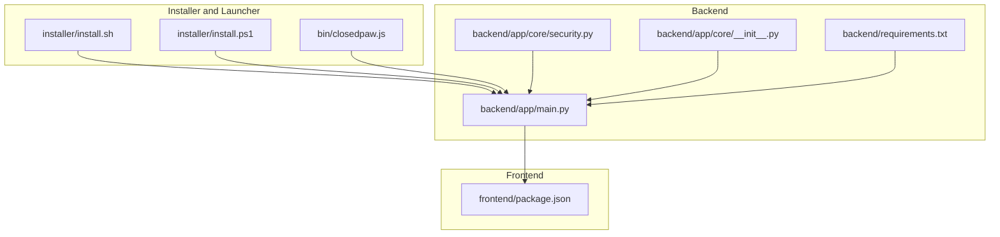
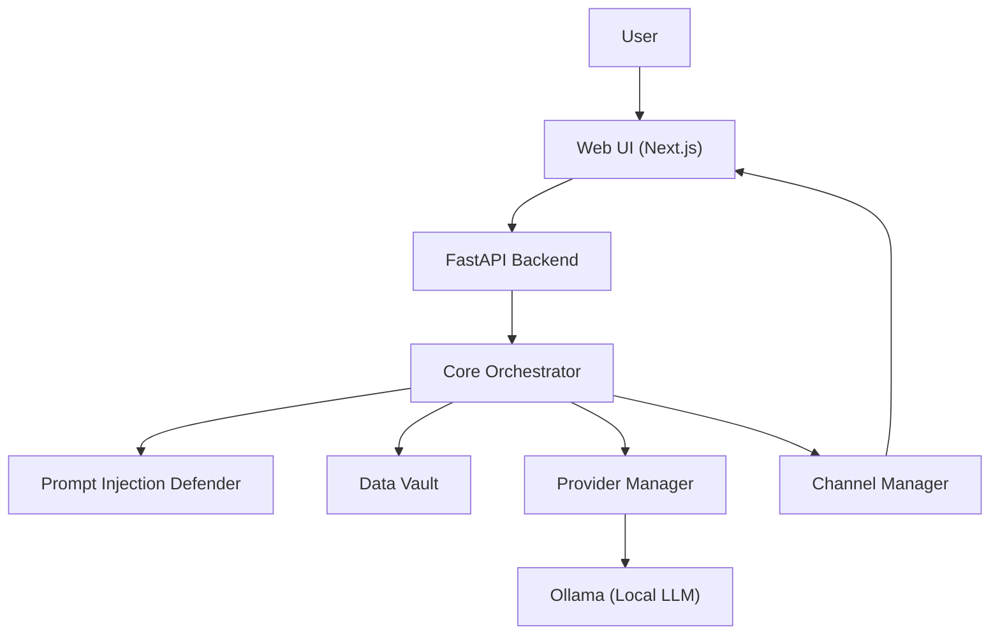
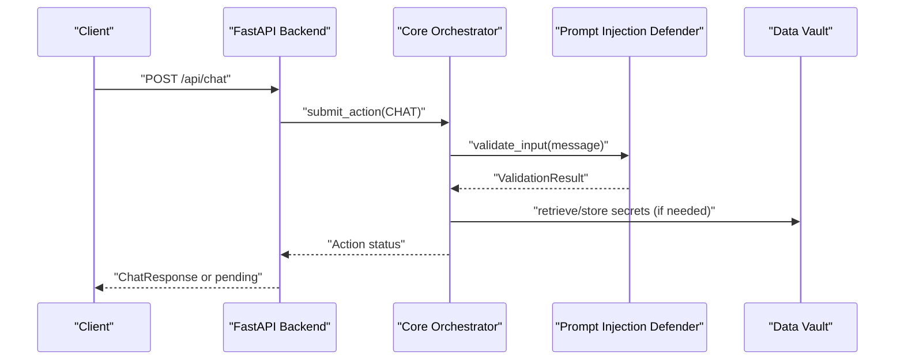
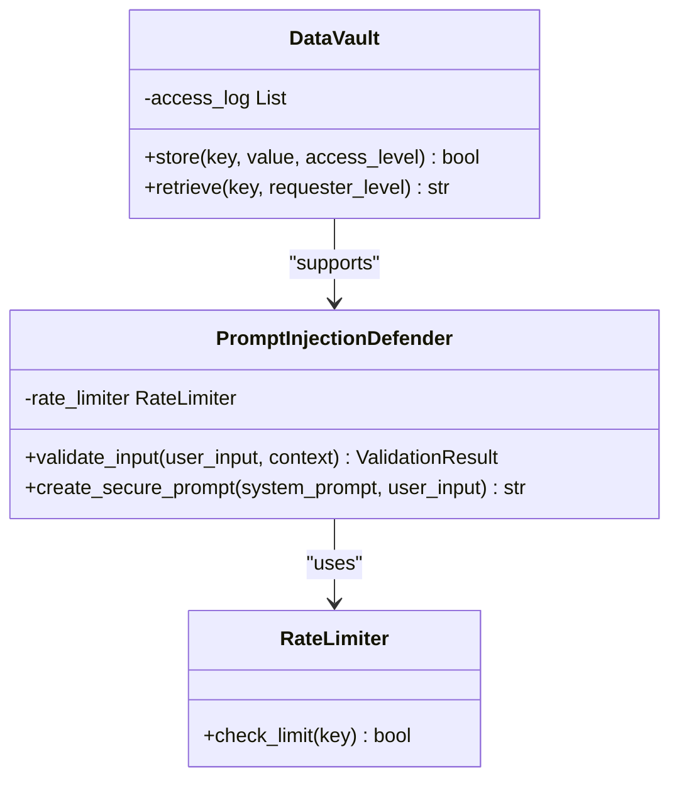
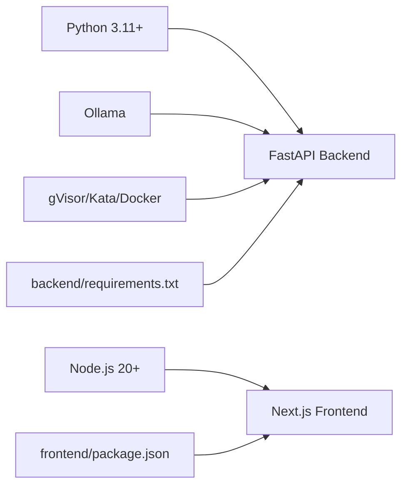
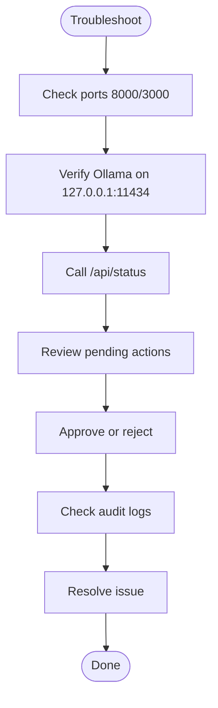

# Deployment and Operations

<cite>
**Referenced Files in This Document**
- [README.md](file://README.md)
- [package.json](file://package.json)
- [backend/requirements.txt](file://backend/requirements.txt)
- [frontend/package.json](file://frontend/package.json)
- [installer/install.sh](file://installer/install.sh)
- [installer/install.ps1](file://installer/install.ps1)
- [backend/app/main.py](file://backend/app/main.py)
- [backend/app/core/security.py](file://backend/app/core/security.py)
- [backend/app/core/__init__.py](file://backend/app/core/__init__.py)
</cite>

## Table of Contents
1. [Introduction](#introduction)
2. [Project Structure](#project-structure)
3. [Core Components](#core-components)
4. [Architecture Overview](#architecture-overview)
5. [Detailed Component Analysis](#detailed-component-analysis)
6. [Dependency Analysis](#dependency-analysis)
7. [Performance Considerations](#performance-considerations)
8. [Troubleshooting Guide](#troubleshooting-guide)
9. [Conclusion](#conclusion)
10. [Appendices](#appendices)

## Introduction
This document provides comprehensive deployment and operations guidance for ClosedPaw, focusing on production-grade deployment, monitoring, performance tuning, and troubleshooting. It covers environment-specific strategies (development, staging, production), system requirements, infrastructure considerations, scaling approaches, security hardening, and operational best practices. The content is grounded in the repository’s installation scripts, backend application, and security modules.

## Project Structure
ClosedPaw comprises:
- A Node.js-based installer and launcher that provisions the environment, secures Ollama, configures sandboxing, and starts the backend and frontend.
- A Python FastAPI backend exposing a secure API with human-in-the-loop controls, provider management, and audit logging.
- A Next.js frontend serving a local-only web UI.
- Security modules implementing prompt injection defense and encrypted data storage.

**Diagram sources**
- [installer/install.sh](file://installer/install.sh#L792-L823)
- [installer/install.ps1](file://installer/install.ps1#L507-L578)
- [backend/app/main.py](file://backend/app/main.py#L72-L78)
- [backend/app/core/security.py](file://backend/app/core/security.py#L1-L40)
- [backend/app/core/__init__.py](file://backend/app/core/__init__.py#L1-L18)
- [backend/requirements.txt](file://backend/requirements.txt#L1-L36)
- [frontend/package.json](file://frontend/package.json#L1-L38)

**Section sources**
- [README.md](file://README.md#L106-L112)
- [package.json](file://package.json#L1-L54)
- [backend/requirements.txt](file://backend/requirements.txt#L1-L36)
- [frontend/package.json](file://frontend/package.json#L1-L38)
- [installer/install.sh](file://installer/install.sh#L1-L120)
- [installer/install.ps1](file://installer/install.ps1#L1-L60)

## Core Components
- Installer and Launcher
  - One-command installers for Linux/macOS and Windows.
  - Automated sandboxing setup (gVisor/Kata where applicable), Ollama security configuration, and service orchestration.
  - Cross-platform launcher script that starts Ollama, backend, and frontend locally.
- Backend API (FastAPI)
  - Zero-trust endpoints with localhost-only exposure, human-in-the-loop approvals, audit logging, and provider/channel management.
  - Health checks for Ollama and model availability.
- Security Modules
  - Prompt injection defense with pattern detection, sanitization, and rate limiting.
  - Encrypted data vault for API keys and secrets.
- Frontend (Next.js)
  - Local-only web UI bound to localhost for security.

Key operational implications:
- All services bind to localhost by default, minimizing external attack surface.
- Sandbox enforcement is automated during installation to isolate agent actions.
- Audit logs and approvals provide operational visibility and compliance.

**Section sources**
- [installer/install.sh](file://installer/install.sh#L683-L752)
- [installer/install.ps1](file://installer/install.ps1#L507-L578)
- [backend/app/main.py](file://backend/app/main.py#L80-L87)
- [backend/app/main.py](file://backend/app/main.py#L101-L128)
- [backend/app/core/security.py](file://backend/app/core/security.py#L35-L180)
- [backend/app/core/security.py](file://backend/app/core/security.py#L325-L435)

## Architecture Overview
ClosedPaw runs a local-first, zero-trust stack:
- Installer configures sandboxing and Ollama security.
- Backend FastAPI server exposes secure endpoints and manages human-in-the-loop approvals.
- Provider manager supports local (Ollama) and cloud providers.
- Channel manager integrates Web UI and external messaging platforms.
- Security modules enforce input validation and protect secrets.

**Diagram sources**
- [backend/app/main.py](file://backend/app/main.py#L101-L128)
- [backend/app/core/security.py](file://backend/app/core/security.py#L35-L180)
- [backend/app/core/security.py](file://backend/app/core/security.py#L325-L435)
- [README.md](file://README.md#L75-L96)

## Detailed Component Analysis

### Installer and Launcher (Production Deployment)
- Linux/macOS
  - Installs gVisor, configures Docker runtime, secures Ollama to listen on 127.0.0.1, and builds the frontend.
  - Creates a launcher script that starts Ollama, backend, and frontend, and opens the browser.
- Windows
  - Detects sandbox capability (WSL2/Docker), optionally installs sandboxing, secures Ollama, and installs via npm or Git.
  - Provides a cmd wrapper and ensures the launcher is on PATH.

Operational notes:
- The installer enforces localhost-only access and hardened sandboxing by default.
- On Windows, full gVisor/Kata requires Linux; Docker provides basic container isolation.

**Section sources**
- [installer/install.sh](file://installer/install.sh#L191-L288)
- [installer/install.sh](file://installer/install.sh#L407-L453)
- [installer/install.sh](file://installer/install.sh#L683-L752)
- [installer/install.ps1](file://installer/install.ps1#L215-L279)
- [installer/install.ps1](file://installer/install.ps1#L321-L341)
- [installer/install.ps1](file://installer/install.ps1#L418-L473)

### Backend API (FastAPI)
- Security model
  - CORS restricted to localhost origins.
  - Root and status endpoints expose minimal metadata.
- Human-in-the-loop
  - Actions are tracked; some require approval before execution.
  - Approvals are audited and enforced by the orchestrator.
- Provider and channel management
  - Dynamic registration and health checks for providers.
  - Channel lifecycle management for Web UI and external platforms.
- Audit logging
  - Endpoint to retrieve audit logs for forensics.

**Diagram sources**
- [backend/app/main.py](file://backend/app/main.py#L131-L182)
- [backend/app/main.py](file://backend/app/main.py#L241-L262)
- [backend/app/core/security.py](file://backend/app/core/security.py#L116-L180)
- [backend/app/core/security.py](file://backend/app/core/security.py#L379-L413)

**Section sources**
- [backend/app/main.py](file://backend/app/main.py#L80-L87)
- [backend/app/main.py](file://backend/app/main.py#L101-L128)
- [backend/app/main.py](file://backend/app/main.py#L131-L182)
- [backend/app/main.py](file://backend/app/main.py#L241-L262)
- [backend/app/main.py](file://backend/app/main.py#L322-L339)

### Security Modules
- Prompt Injection Defender
  - Regex-based detection of instruction override, role manipulation, delimiter manipulation, encoding obfuscation, context manipulation, persistence attempts, and tool hijacking.
  - Input sanitization and rate limiting to mitigate abuse.
- Data Vault
  - Encrypted storage for API keys and secrets using symmetric encryption.
  - Access logging and controlled retrieval with access levels.

**Diagram sources**
- [backend/app/core/security.py](file://backend/app/core/security.py#L35-L180)
- [backend/app/core/security.py](file://backend/app/core/security.py#L290-L318)
- [backend/app/core/security.py](file://backend/app/core/security.py#L325-L435)

**Section sources**
- [backend/app/core/security.py](file://backend/app/core/security.py#L35-L180)
- [backend/app/core/security.py](file://backend/app/core/security.py#L290-L318)
- [backend/app/core/security.py](file://backend/app/core/security.py#L325-L435)

### Frontend (Next.js)
- Local-only binding to 127.0.0.1 and port 3000.
- Production build pipeline and linting support.

**Section sources**
- [frontend/package.json](file://frontend/package.json#L6-L11)

## Dependency Analysis
- Runtime dependencies
  - Python 3.11+, Node.js 20+ (Node.js 18+ for Windows installer).
  - Ollama for local LLM inference.
  - gVisor/Kata for sandboxing (Linux/macOS) or Docker isolation (Windows).
- Backend libraries
  - FastAPI, Uvicorn, Pydantic, SQLAlchemy, httpx, cryptography, PyNaCl, passlib, pytest, python-dotenv.
- Frontend libraries
  - Next.js 15, React 19, Radix UI, Tailwind CSS.

**Diagram sources**
- [README.md](file://README.md#L106-L112)
- [backend/requirements.txt](file://backend/requirements.txt#L1-L36)
- [frontend/package.json](file://frontend/package.json#L1-L38)

**Section sources**
- [README.md](file://README.md#L106-L112)
- [backend/requirements.txt](file://backend/requirements.txt#L1-L36)
- [frontend/package.json](file://frontend/package.json#L1-L38)

## Performance Considerations
- Resource allocation
  - Assign dedicated CPU cores and memory to Ollama and the backend process.
  - Prefer SSD storage for model files and logs.
- Scaling approaches
  - Horizontal scaling: run multiple backend instances behind a reverse proxy with sticky sessions if stateless; otherwise, prefer single-instance operation due to shared state and sandbox isolation.
  - Vertical scaling: increase CPU/memory for larger models or concurrent requests.
- Caching and model switching
  - Use model switching endpoints to optimize for workload characteristics.
- Network and I/O
  - Keep Ollama on localhost; avoid remote model registries for production.
- Observability
  - Enable structured logging and integrate with centralized logging systems for audit logs and security events.

[No sources needed since this section provides general guidance]

## Troubleshooting Guide
Common operational issues and resolutions:
- Ollama connectivity failures
  - Verify Ollama is running on 127.0.0.1:11434 and models are available.
  - Use the status endpoint to check connectivity and available models.
- Sandbox misconfiguration
  - On Linux/macOS, ensure gVisor is installed and Docker runtime is configured.
  - On Windows, use WSL2 or Docker Desktop for container isolation.
- Port conflicts
  - Backend runs on 127.0.0.1:8000; frontend on 127.0.0.1:3000. Change ports only for development.
- Approval bottlenecks
  - Review pending actions and approve/reject via the admin interface.
- Audit logs
  - Use the audit logs endpoint to investigate security events and action outcomes.

**Section sources**
- [backend/app/main.py](file://backend/app/main.py#L101-L128)
- [backend/app/main.py](file://backend/app/main.py#L265-L281)
- [backend/app/main.py](file://backend/app/main.py#L322-L339)
- [installer/install.sh](file://installer/install.sh#L348-L405)
- [installer/install.ps1](file://installer/install.ps1#L321-L341)

## Conclusion
ClosedPaw is designed for secure, local-first operation with strong isolation and human-in-the-loop controls. Production deployments should leverage the provided installers to enforce sandboxing and localhost-only exposure, monitor Ollama and backend health, and apply security hardening. The backend’s audit logs and approvals, combined with the security modules, provide robust operational visibility and protection.

[No sources needed since this section summarizes without analyzing specific files]

## Appendices

### Environment-Specific Deployment Strategies
- Development
  - Use the provided scripts to bootstrap quickly; keep services on localhost.
  - Enable hot reload for frontend and backend during development.
- Staging
  - Mirror production security posture: localhost-only binds, sandboxing, and encrypted secrets.
  - Validate provider configurations and channel integrations.
- Production
  - Run as a systemd service (Linux) or equivalent (macOS/Windows) with process supervision.
  - Harden the host OS firewall and restrict SSH/RDP access.
  - Back up the encryption key and configuration directory regularly.

**Section sources**
- [installer/install.sh](file://installer/install.sh#L670-L681)
- [installer/install.ps1](file://installer/install.ps1#L507-L578)

### Monitoring Setup
- System metrics
  - Collect CPU, memory, disk, and network metrics for Ollama, backend, and frontend processes.
- Performance indicators
  - Latency of chat requests, model load times, and approval queue length.
- Alerting
  - Alert on Ollama downtime, high approval backlog, critical security events, and rate-limiting incidents.

**Section sources**
- [backend/app/main.py](file://backend/app/main.py#L101-L128)
- [backend/app/core/security.py](file://backend/app/core/security.py#L116-L180)

### Maintenance Procedures
- Updates
  - Update via installer scripts; rebuild frontend in production deployments.
- Disaster recovery
  - Restore from backups of the configuration directory and encryption key.
  - Recreate sandbox configuration if runtime binaries are lost.

**Section sources**
- [installer/install.sh](file://installer/install.sh#L659-L668)
- [backend/app/core/security.py](file://backend/app/core/security.py#L341-L346)

### Security Hardening Guidelines
- Isolation
  - Enforce gVisor/Kata on Linux/macOS; use Docker on Windows where applicable.
- Network
  - Restrict inbound connections to localhost; close unnecessary ports.
- Secrets
  - Store API keys in the encrypted data vault; rotate keys periodically.
- Auditing
  - Monitor audit logs and security events; retain logs per policy.

**Section sources**
- [installer/install.sh](file://installer/install.sh#L191-L288)
- [installer/install.ps1](file://installer/install.ps1#L215-L279)
- [backend/app/core/security.py](file://backend/app/core/security.py#L325-L435)