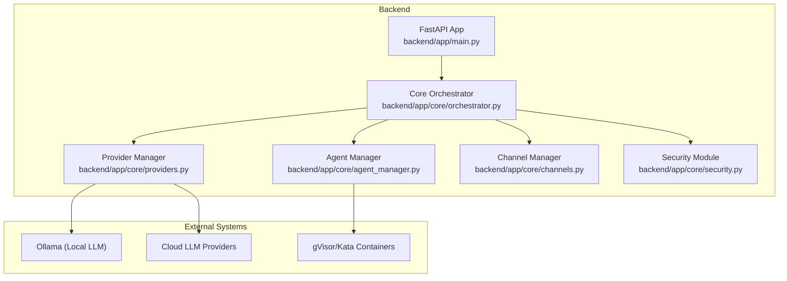
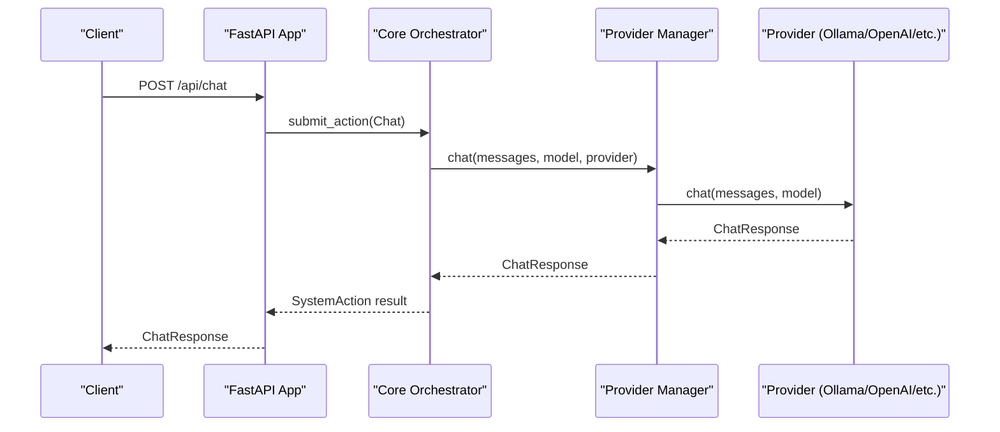
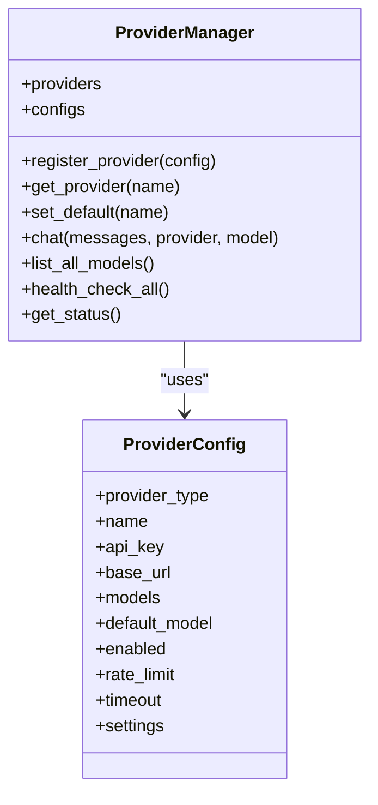
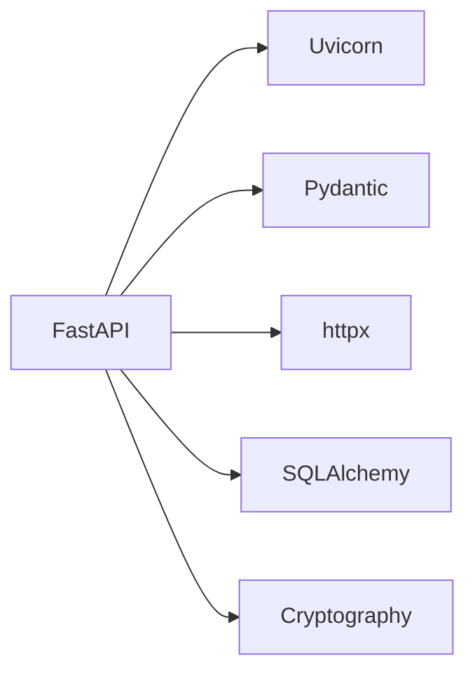

# Performance Tuning

<cite>
**Referenced Files in This Document**
- [backend/app/main.py](file://backend/app/main.py)
- [backend/app/core/providers.py](file://backend/app/core/providers.py)
- [backend/app/core/orchestrator.py](file://backend/app/core/orchestrator.py)
- [backend/app/core/agent_manager.py](file://backend/app/core/agent_manager.py)
- [backend/app/core/channels.py](file://backend/app/core/channels.py)
- [backend/app/core/security.py](file://backend/app/core/security.py)
- [backend/requirements.txt](file://backend/requirements.txt)
- [bin/closedpaw.js](file://bin/closedpaw.js)
- [README.md](file://README.md)
</cite>

## Table of Contents
1. [Introduction](#introduction)
2. [Project Structure](#project-structure)
3. [Core Components](#core-components)
4. [Architecture Overview](#architecture-overview)
5. [Detailed Component Analysis](#detailed-component-analysis)
6. [Dependency Analysis](#dependency-analysis)
7. [Performance Considerations](#performance-considerations)
8. [Troubleshooting Guide](#troubleshooting-guide)
9. [Conclusion](#conclusion)
10. [Appendices](#appendices)

## Introduction
This document provides performance optimization guidance for ClosedPaw with a focus on system performance, resource optimization, and scalability. It covers configuration parameters for model loading, cache management, and concurrent request handling; provider selection strategies, model switching optimization, and resource allocation tuning; bottleneck identification techniques, profiling methods, and performance measurement tools; hardware upgrade recommendations, container resource limits, and load balancing strategies; memory management, garbage collection tuning, and database optimization; and capacity planning, scaling considerations, and performance testing methodologies.

## Project Structure
ClosedPaw’s backend is a FastAPI application that exposes a REST API for chat, model management, provider configuration, channel management, and administrative operations. The system integrates:
- A core orchestrator coordinating actions and security
- A provider manager supporting multiple LLM backends (local and cloud)
- An agent manager enforcing sandboxed execution
- A channel manager supporting multiple communication channels
- A security module implementing prompt injection defense and encrypted storage

**Diagram sources**
- [backend/app/main.py](file://backend/app/main.py#L73-L78)
- [backend/app/core/orchestrator.py](file://backend/app/core/orchestrator.py#L87-L130)
- [backend/app/core/providers.py](file://backend/app/core/providers.py#L418-L428)
- [backend/app/core/agent_manager.py](file://backend/app/core/agent_manager.py#L65-L98)
- [backend/app/core/channels.py](file://backend/app/core/channels.py#L405-L415)
- [backend/app/core/security.py](file://backend/app/core/security.py#L325-L346)

**Section sources**
- [backend/app/main.py](file://backend/app/main.py#L73-L78)
- [backend/app/core/orchestrator.py](file://backend/app/core/orchestrator.py#L87-L130)
- [backend/app/core/providers.py](file://backend/app/core/providers.py#L418-L428)
- [backend/app/core/agent_manager.py](file://backend/app/core/agent_manager.py#L65-L98)
- [backend/app/core/channels.py](file://backend/app/core/channels.py#L405-L415)
- [backend/app/core/security.py](file://backend/app/core/security.py#L325-L346)

## Core Components
- FastAPI application with lifecycle hooks, CORS, and endpoints for chat, model management, provider management, channel management, and administrative operations.
- Core orchestrator managing actions, security levels, HITL approvals, and execution scheduling.
- Provider manager supporting local (Ollama) and cloud (OpenAI, Anthropic, Google, Mistral) providers with timeouts and health checks.
- Agent manager enforcing sandboxed execution with resource limits and OCI configuration.
- Channel manager supporting multiple channels with rate limiting and allowlists.
- Security module with prompt injection defense, rate limiting, and encrypted data vault.

Key performance-relevant elements:
- Chat endpoint with synchronous wait loops and timeouts
- Provider configuration with timeouts and rate limits
- Orchestrator security configuration and action timeouts
- Agent resource limits and sandbox runtime detection
- Channel rate limiting and polling intervals

**Section sources**
- [backend/app/main.py](file://backend/app/main.py#L131-L182)
- [backend/app/core/providers.py](file://backend/app/core/providers.py#L30-L45)
- [backend/app/core/orchestrator.py](file://backend/app/core/orchestrator.py#L102-L108)
- [backend/app/core/agent_manager.py](file://backend/app/core/agent_manager.py#L39-L47)
- [backend/app/core/channels.py](file://backend/app/core/channels.py#L42-L65)
- [backend/app/core/security.py](file://backend/app/core/security.py#L290-L318)

## Architecture Overview
The system follows a zero-trust design with layered security and asynchronous orchestration. The API server delegates work to the orchestrator, which coordinates providers, agents, and channels. Providers encapsulate LLM interactions with timeouts and health checks. Agents execute skills in sandboxed containers with strict resource limits.

**Diagram sources**
- [backend/app/main.py](file://backend/app/main.py#L131-L182)
- [backend/app/core/orchestrator.py](file://backend/app/core/orchestrator.py#L263-L270)
- [backend/app/core/providers.py](file://backend/app/core/providers.py#L470-L482)

## Detailed Component Analysis

### FastAPI Application and Chat Endpoint
- Chat endpoint accepts a message, model, and cloud toggle, submits a chat action, and waits with a configurable timeout.
- Health checks query Ollama for connectivity and available models.
- Provider endpoints expose registration, default selection, and health checks.

Optimization levers:
- Tune wait loop interval and maximum wait for long-running actions.
- Adjust timeouts for provider calls and model switching.
- Enable background tasks for non-blocking responses when appropriate.

**Section sources**
- [backend/app/main.py](file://backend/app/main.py#L131-L182)
- [backend/app/main.py](file://backend/app/main.py#L101-L128)
- [backend/app/main.py](file://backend/app/main.py#L381-L462)

### Provider Management and Model Switching
- Provider configuration supports timeouts, rate limits, and provider-specific settings.
- Provider manager registers providers, selects defaults, and routes chat requests.
- Model switching validates availability via Ollama tags and updates configuration.

Optimization levers:
- Increase provider timeouts for slower cloud providers.
- Implement provider health checks and failover strategies.
- Cache model lists and provider metadata to reduce repeated queries.

**Diagram sources**
- [backend/app/core/providers.py](file://backend/app/core/providers.py#L30-L45)
- [backend/app/core/providers.py](file://backend/app/core/providers.py#L418-L428)

**Section sources**
- [backend/app/core/providers.py](file://backend/app/core/providers.py#L30-L45)
- [backend/app/core/providers.py](file://backend/app/core/providers.py#L418-L428)
- [backend/app/main.py](file://backend/app/main.py#L213-L239)

### Orchestrator and Action Execution
- Orchestrator initializes local LLM gateway, loads skills, and manages actions with security levels.
- Actions are queued, optionally require HITL approval, and executed asynchronously.
- Security configuration includes max action timeout and rate limits.

Optimization levers:
- Adjust max action timeout and rate-limit thresholds.
- Implement batching for similar actions to reduce overhead.
- Add metrics and logging around action durations for bottleneck identification.

**Section sources**
- [backend/app/core/orchestrator.py](file://backend/app/core/orchestrator.py#L112-L130)
- [backend/app/core/orchestrator.py](file://backend/app/core/orchestrator.py#L169-L224)
- [backend/app/core/orchestrator.py](file://backend/app/core/orchestrator.py#L102-L108)

### Agent Manager and Sandboxing
- Agent manager detects sandbox runtime (gVisor/Kata), enforces resource limits, and creates sandboxed containers.
- Resource limits include CPU cores, memory, disk, and process counts.
- Execution timeouts and sandbox configuration are configurable.

Optimization levers:
- Right-size CPU/memory/disk per agent based on workload profiles.
- Use Kata for stronger isolation when CPU overhead is acceptable.
- Monitor sandbox creation and execution latencies.

**Section sources**
- [backend/app/core/agent_manager.py](file://backend/app/core/agent_manager.py#L81-L98)
- [backend/app/core/agent_manager.py](file://backend/app/core/agent_manager.py#L39-L47)
- [backend/app/core/agent_manager.py](file://backend/app/core/agent_manager.py#L194-L202)

### Channel Management and Rate Limiting
- Channel manager supports multiple channels with rate limiting and allowlists.
- Polling intervals and timeouts vary by channel type.

Optimization levers:
- Tune rate limits per channel and globally.
- Implement backpressure for high-volume channels.
- Use efficient polling or push mechanisms where supported.

**Section sources**
- [backend/app/core/channels.py](file://backend/app/core/channels.py#L42-L65)
- [backend/app/core/channels.py](file://backend/app/core/channels.py#L202-L224)

### Security and Data Vault
- Prompt injection defense with regex patterns, rate limiting, and input sanitization.
- Data vault stores encrypted secrets with access logging.

Optimization levers:
- Profile regex-heavy validation under load.
- Cache sanitized prompts where safe and beneficial.
- Encrypt only sensitive data and avoid unnecessary encryption overhead.

**Section sources**
- [backend/app/core/security.py](file://backend/app/core/security.py#L116-L181)
- [backend/app/core/security.py](file://backend/app/core/security.py#L325-L413)

## Dependency Analysis
The backend depends on FastAPI, Uvicorn, Pydantic, httpx, SQLAlchemy, cryptography, and related libraries. These influence performance characteristics such as async I/O throughput, serialization overhead, and cryptographic operations.

**Diagram sources**
- [backend/requirements.txt](file://backend/requirements.txt#L5-L15)

**Section sources**
- [backend/requirements.txt](file://backend/requirements.txt#L5-L15)

## Performance Considerations

### Configuration Parameters for Model Loading and Provider Selection
- ProviderConfig
  - timeout: Tune for provider latency and reliability
  - rate_limit: Control requests per minute to avoid throttling
  - default_model: Choose optimal model for workload
  - base_url/api_key: Ensure correct endpoint and credentials
- ProviderManager
  - Health checks and failover strategies
  - Model listing caching
- Model switching
  - Validate model availability before switching
  - Minimize downtime during transitions

**Section sources**
- [backend/app/core/providers.py](file://backend/app/core/providers.py#L30-L45)
- [backend/app/core/providers.py](file://backend/app/core/providers.py#L418-L428)
- [backend/app/main.py](file://backend/app/main.py#L213-L239)

### Cache Management
- Cache provider model lists and provider metadata
- Cache Ollama availability and model tags
- Use short TTLs for dynamic model changes

**Section sources**
- [backend/app/core/providers.py](file://backend/app/core/providers.py#L484-L493)
- [backend/app/main.py](file://backend/app/main.py#L184-L211)

### Concurrent Request Handling
- FastAPI/Uvicorn concurrency model
- Asynchronous provider calls with httpx
- Orchestrator action queuing and background execution
- Channel polling with timeouts

Recommendations:
- Use async endpoints and non-blocking I/O
- Apply rate limiting at API, provider, and channel levels
- Batch small requests when possible

**Section sources**
- [backend/app/main.py](file://backend/app/main.py#L131-L182)
- [backend/app/core/orchestrator.py](file://backend/app/core/orchestrator.py#L251-L270)
- [backend/app/core/channels.py](file://backend/app/core/channels.py#L202-L224)

### Provider Selection Strategies and Model Switching Optimization
- Select provider based on latency, cost, and capability
- Implement fallback to local Ollama when cloud providers fail
- Pre-warm models and cache frequently used models
- Use model switching endpoint with validation and timeouts

**Section sources**
- [backend/app/core/providers.py](file://backend/app/core/providers.py#L470-L482)
- [backend/app/main.py](file://backend/app/main.py#L213-L239)

### Resource Allocation Tuning
- Agent resource limits
  - CPU cores: Match workload intensity
  - Memory: Prevent OOM and swapping
  - Disk: Ensure adequate tmpfs sizes
  - Max processes: Control resource contention
- Sandbox runtime selection
  - Prefer Kata for stronger isolation if CPU overhead is acceptable
  - Use gVisor for broader compatibility

**Section sources**
- [backend/app/core/agent_manager.py](file://backend/app/core/agent_manager.py#L39-L47)
- [backend/app/core/agent_manager.py](file://backend/app/core/agent_manager.py#L194-L202)

### Bottleneck Identification Techniques
- Instrument endpoints with timing and error counters
- Monitor provider latency and error rates
- Track action queue lengths and execution times
- Observe sandbox creation and execution latencies
- Use channel-specific metrics for rate-limiting events

Tools:
- Built-in logging and audit logs
- Prometheus/Grafana for metrics
- APM tools for distributed tracing

**Section sources**
- [backend/app/core/orchestrator.py](file://backend/app/core/orchestrator.py#L429-L450)
- [backend/app/core/providers.py](file://backend/app/core/providers.py#L115-L143)

### Profiling Methods and Performance Measurement
- Endpoint-level profiling (request duration, error rates)
- Provider-level profiling (latency, tokens used)
- Agent execution profiling (creation, execution, termination)
- Channel profiling (polling intervals, delivery times)

Measurement signals:
- Latency histograms
- Throughput (RPS)
- Error budgets
- Resource utilization (CPU, memory, disk)

**Section sources**
- [backend/app/core/providers.py](file://backend/app/core/providers.py#L57-L66)
- [backend/app/core/agent_manager.py](file://backend/app/core/agent_manager.py#L475-L538)

### Hardware Upgrades and Container Resource Limits
- CPU: Increase cores for multi-agent and heavy workloads
- Memory: Scale up for larger models and concurrent agents
- Disk: SSD for faster model loading and sandbox IO
- GPU: For local inference acceleration (Ollama)
- Container limits: Align with workload profiles

**Section sources**
- [README.md](file://README.md#L19-L24)
- [backend/app/core/agent_manager.py](file://backend/app/core/agent_manager.py#L39-L47)

### Load Balancing Strategies
- Horizontal scaling: Run multiple backend instances behind a reverse proxy
- Sticky sessions: Not required for stateless chat; state is in actions/logs
- Health checks: Use /api/status and provider health endpoints
- Circuit breaker: Fail fast on provider failures

**Section sources**
- [backend/app/main.py](file://backend/app/main.py#L101-L128)
- [backend/app/core/providers.py](file://backend/app/core/providers.py#L495-L503)

### Memory Management and Garbage Collection
- Use async I/O to minimize blocking and improve throughput
- Avoid large intermediate objects in hot paths
- Reuse httpx clients per provider
- Monitor Python GC pauses and tune heap size appropriately

**Section sources**
- [backend/app/core/providers.py](file://backend/app/core/providers.py#L71-L76)
- [backend/requirements.txt](file://backend/requirements.txt#L14-L15)

### Database Optimization
- SQLAlchemy ORM usage is present; ensure proper indexing and connection pooling
- Use async drivers if migrating to async ORM
- Keep audit logs manageable with rotation and retention policies

**Section sources**
- [backend/requirements.txt](file://backend/requirements.txt#L18-L19)
- [backend/app/core/orchestrator.py](file://backend/app/core/orchestrator.py#L459-L461)

### Capacity Planning and Scaling Considerations
- Forecast RPS and concurrent agents
- Plan for peak bursts with auto-scaling
- Right-size models per workload (smaller for chat, larger for code)
- Monitor provider quotas and costs

**Section sources**
- [backend/app/core/agent_manager.py](file://backend/app/core/agent_manager.py#L86-L94)
- [backend/app/core/providers.py](file://backend/app/core/providers.py#L40-L41)

### Performance Testing Methodologies
- Synthetic load tests simulating chat, model switching, and provider calls
- Chaos engineering: inject provider latency and failures
- A/B test model and provider selections
- Regression testing with realistic datasets

**Section sources**
- [backend/app/main.py](file://backend/app/main.py#L131-L182)
- [backend/app/core/providers.py](file://backend/app/core/providers.py#L470-L482)

## Troubleshooting Guide
Common performance issues and remedies:
- Slow chat responses
  - Check provider latency and timeouts
  - Validate model availability and switching
  - Inspect action queue and execution times
- Provider errors
  - Verify API keys and endpoints
  - Implement health checks and circuit breaking
- Sandbox failures
  - Confirm gVisor/Kata availability
  - Review resource limits and OCI configuration
- Channel bottlenecks
  - Adjust rate limits and polling intervals
  - Monitor delivery times and error rates

**Section sources**
- [backend/app/main.py](file://backend/app/main.py#L131-L182)
- [backend/app/core/providers.py](file://backend/app/core/providers.py#L495-L503)
- [backend/app/core/agent_manager.py](file://backend/app/core/agent_manager.py#L141-L147)
- [backend/app/core/channels.py](file://backend/app/core/channels.py#L202-L224)

## Conclusion
ClosedPaw’s performance hinges on balanced provider selection, robust resource allocation, and careful monitoring. By tuning timeouts, implementing caching, right-sizing agents, and applying load balancing, you can achieve responsive, scalable performance while maintaining strong security guarantees.

## Appendices

### Configuration Reference Summary
- ProviderConfig: timeout, rate_limit, default_model, base_url, api_key
- ProviderManager: health checks, model listing, default provider
- CoreOrchestrator: max_action_timeout, rate_limit_per_minute
- AgentManager: CPU/memory/disk/process limits, sandbox runtime
- ChannelConfig: per-user/global rate limits, allowed commands/users

**Section sources**
- [backend/app/core/providers.py](file://backend/app/core/providers.py#L30-L45)
- [backend/app/core/orchestrator.py](file://backend/app/core/orchestrator.py#L102-L108)
- [backend/app/core/agent_manager.py](file://backend/app/core/agent_manager.py#L39-L47)
- [backend/app/core/channels.py](file://backend/app/core/channels.py#L42-L65)