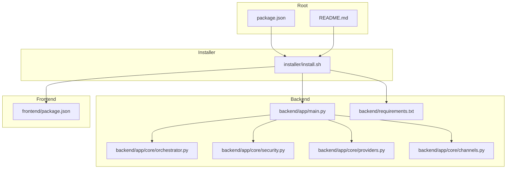
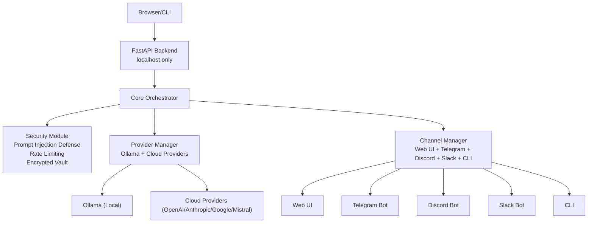
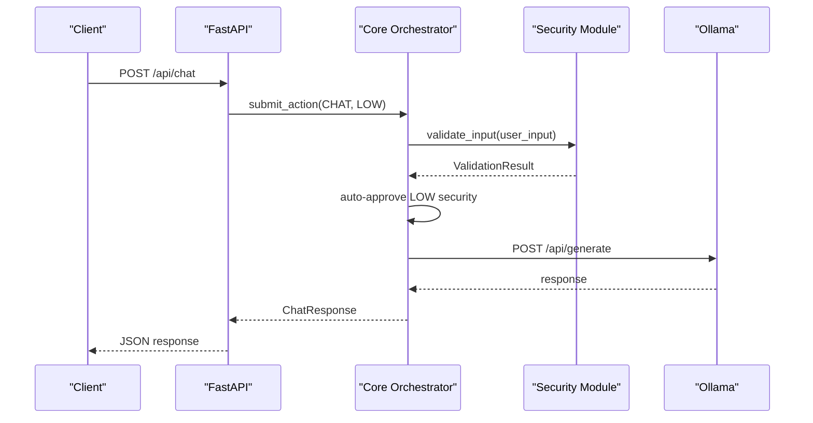
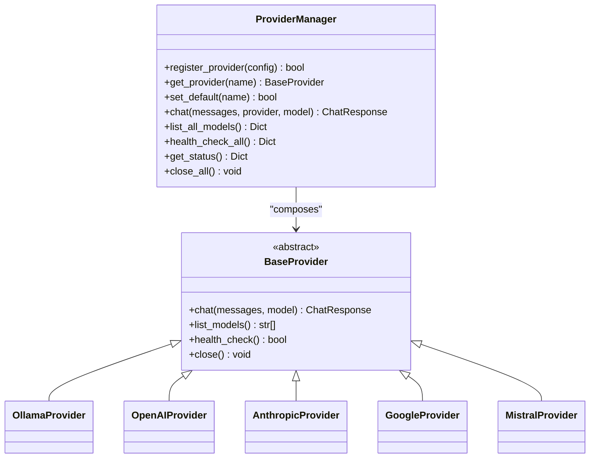
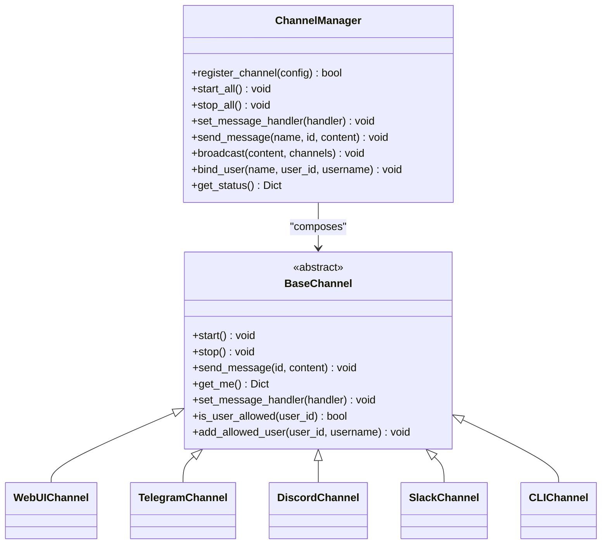
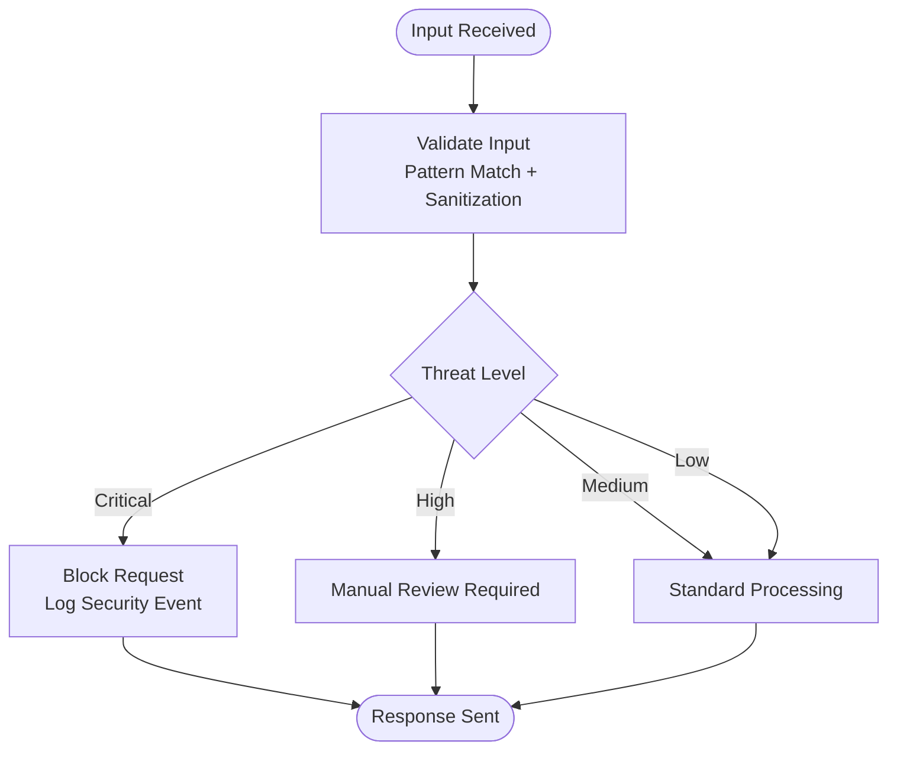
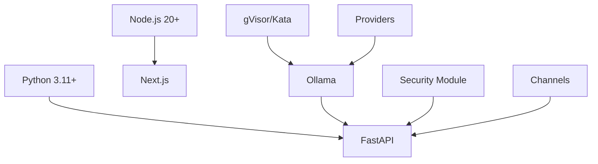

# Production Deployment

<cite>
**Referenced Files in This Document**
- [README.md](file://README.md)
- [backend/app/main.py](file://backend/app/main.py)
- [backend/app/core/orchestrator.py](file://backend/app/core/orchestrator.py)
- [backend/app/core/security.py](file://backend/app/core/security.py)
- [backend/app/core/providers.py](file://backend/app/core/providers.py)
- [backend/app/core/channels.py](file://backend/app/core/channels.py)
- [backend/requirements.txt](file://backend/requirements.txt)
- [frontend/package.json](file://frontend/package.json)
- [package.json](file://package.json)
- [installer/install.sh](file://installer/install.sh)
</cite>

## Table of Contents
1. [Introduction](#introduction)
2. [Project Structure](#project-structure)
3. [Core Components](#core-components)
4. [Architecture Overview](#architecture-overview)
5. [Detailed Component Analysis](#detailed-component-analysis)
6. [Dependency Analysis](#dependency-analysis)
7. [Performance Considerations](#performance-considerations)
8. [Troubleshooting Guide](#troubleshooting-guide)
9. [Conclusion](#conclusion)
10. [Appendices](#appendices)

## Introduction
This document provides production-grade deployment guidance for ClosedPaw with a focus on secure, hardened configurations suitable for enterprise and high-security environments. It covers system requirements, secure deployment strategies, containerization, orchestration, cloud platforms, security hardening, automation, environment management, backup and disaster recovery, high availability, monitoring, logging, and performance tuning.

## Project Structure
ClosedPaw is organized into a backend (FastAPI), a frontend (Next.js), shared installer tooling, and modular core components for orchestration, security, providers, and channels. The installer automates sandboxing, Ollama configuration, dependency installation, and service startup.

**Diagram sources**
- [installer/install.sh](file://installer/install.sh#L1-L823)
- [backend/app/main.py](file://backend/app/main.py#L1-L567)
- [backend/app/core/orchestrator.py](file://backend/app/core/orchestrator.py#L1-L486)
- [backend/app/core/security.py](file://backend/app/core/security.py#L1-L455)
- [backend/app/core/providers.py](file://backend/app/core/providers.py#L1-L545)
- [backend/app/core/channels.py](file://backend/app/core/channels.py#L1-L524)
- [backend/requirements.txt](file://backend/requirements.txt#L1-L36)
- [frontend/package.json](file://frontend/package.json#L1-L38)
- [package.json](file://package.json#L1-L54)

**Section sources**
- [README.md](file://README.md#L1-L192)
- [backend/app/main.py](file://backend/app/main.py#L1-L567)
- [backend/requirements.txt](file://backend/requirements.txt#L1-L36)
- [frontend/package.json](file://frontend/package.json#L1-L38)
- [package.json](file://package.json#L1-L54)
- [installer/install.sh](file://installer/install.sh#L1-L823)

## Core Components
- Backend API (FastAPI): Provides system status, chat, model management, action lifecycle, audit logs, provider management, and channel management. It binds to localhost for security and enforces CORS for the local UI.
- Orchestrator: Central component implementing Zero-Trust actions, HITL approvals, audit logging, and security levels.
- Security module: Prompt injection defense, rate limiting, and encrypted data vault.
- Providers: Multi-provider LLM gateway supporting local Ollama and cloud providers (OpenAI, Anthropic, Google, Mistral).
- Channels: Multi-channel gateway supporting Web UI, Telegram, Discord, Slack, Matrix, and CLI.
- Installer: Automates sandboxing (gVisor/Kata), Ollama security configuration, dependency installation, and service startup.

Key production implications:
- All internal services bind to localhost (127.0.0.1) to minimize exposure.
- Human-in-the-loop approvals are enforced for high-risk actions.
- Audit logging is enabled by default and written to a temporary directory.
- Encrypted storage secures API keys and secrets.

**Section sources**
- [backend/app/main.py](file://backend/app/main.py#L73-L87)
- [backend/app/main.py](file://backend/app/main.py#L101-L128)
- [backend/app/core/orchestrator.py](file://backend/app/core/orchestrator.py#L87-L130)
- [backend/app/core/orchestrator.py](file://backend/app/core/orchestrator.py#L169-L224)
- [backend/app/core/security.py](file://backend/app/core/security.py#L35-L181)
- [backend/app/core/providers.py](file://backend/app/core/providers.py#L418-L457)
- [backend/app/core/channels.py](file://backend/app/core/channels.py#L405-L455)
- [installer/install.sh](file://installer/install.sh#L407-L453)

## Architecture Overview
The system follows a Zero-Trust model with a local-first design. The backend exposes a secure API bound to localhost, integrates with Ollama for local inference, supports cloud providers, and routes commands through channels with strict allowlists and rate limits.

**Diagram sources**
- [backend/app/main.py](file://backend/app/main.py#L131-L320)
- [backend/app/core/orchestrator.py](file://backend/app/core/orchestrator.py#L112-L168)
- [backend/app/core/security.py](file://backend/app/core/security.py#L35-L107)
- [backend/app/core/providers.py](file://backend/app/core/providers.py#L418-L457)
- [backend/app/core/channels.py](file://backend/app/core/channels.py#L405-L455)

## Detailed Component Analysis

### Backend API and Security Boundaries
- Host binding: The API runs on 127.0.0.1 with a localhost-only CORS policy to prevent external exposure.
- Health and status: The status endpoint checks Ollama connectivity and aggregates system metrics.
- Action lifecycle: Actions are submitted with explicit security levels; low-risk actions execute immediately, while high-risk actions require HITL approval.
- Audit logging: All actions are audited with timestamps, outcomes, and details.

**Diagram sources**
- [backend/app/main.py](file://backend/app/main.py#L131-L182)
- [backend/app/core/orchestrator.py](file://backend/app/core/orchestrator.py#L169-L224)
- [backend/app/core/orchestrator.py](file://backend/app/core/orchestrator.py#L303-L332)
- [backend/app/core/security.py](file://backend/app/core/security.py#L116-L181)

**Section sources**
- [backend/app/main.py](file://backend/app/main.py#L73-L87)
- [backend/app/main.py](file://backend/app/main.py#L101-L128)
- [backend/app/main.py](file://backend/app/main.py#L131-L182)
- [backend/app/core/orchestrator.py](file://backend/app/core/orchestrator.py#L169-L224)
- [backend/app/core/orchestrator.py](file://backend/app/core/orchestrator.py#L303-L332)
- [backend/app/core/security.py](file://backend/app/core/security.py#L116-L181)

### Provider Management (Multi-Provider Gateway)
- Supports Ollama (local), OpenAI, Anthropic, Google, Mistral, and custom endpoints.
- Health checks and model listings are exposed via API.
- Rate limiting and timeouts configurable per provider.

**Diagram sources**
- [backend/app/core/providers.py](file://backend/app/core/providers.py#L418-L457)
- [backend/app/core/providers.py](file://backend/app/core/providers.py#L68-L100)
- [backend/app/core/providers.py](file://backend/app/core/providers.py#L102-L161)
- [backend/app/core/providers.py](file://backend/app/core/providers.py#L163-L222)
- [backend/app/core/providers.py](file://backend/app/core/providers.py#L224-L294)
- [backend/app/core/providers.py](file://backend/app/core/providers.py#L296-L354)
- [backend/app/core/providers.py](file://backend/app/core/providers.py#L356-L416)

**Section sources**
- [backend/app/core/providers.py](file://backend/app/core/providers.py#L418-L457)
- [backend/app/core/providers.py](file://backend/app/core/providers.py#L102-L161)
- [backend/app/core/providers.py](file://backend/app/core/providers.py#L163-L222)
- [backend/app/core/providers.py](file://backend/app/core/providers.py#L224-L294)
- [backend/app/core/providers.py](file://backend/app/core/providers.py#L296-L354)
- [backend/app/core/providers.py](file://backend/app/core/providers.py#L356-L416)

### Channel Management (Multi-Channel Gateway)
- Supports Web UI, Telegram, Discord, Slack, Matrix, and CLI.
- Per-channel allowlists, rate limits, and pairing requirements.
- Message routing and broadcasting with security enforcement.

**Diagram sources**
- [backend/app/core/channels.py](file://backend/app/core/channels.py#L405-L455)
- [backend/app/core/channels.py](file://backend/app/core/channels.py#L79-L117)
- [backend/app/core/channels.py](file://backend/app/core/channels.py#L137-L175)
- [backend/app/core/channels.py](file://backend/app/core/channels.py#L177-L286)
- [backend/app/core/channels.py](file://backend/app/core/channels.py#L288-L334)
- [backend/app/core/channels.py](file://backend/app/core/channels.py#L336-L382)
- [backend/app/core/channels.py](file://backend/app/core/channels.py#L384-L403)

**Section sources**
- [backend/app/core/channels.py](file://backend/app/core/channels.py#L405-L455)
- [backend/app/core/channels.py](file://backend/app/core/channels.py#L177-L286)
- [backend/app/core/channels.py](file://backend/app/core/channels.py#L288-L334)
- [backend/app/core/channels.py](file://backend/app/core/channels.py#L336-L382)
- [backend/app/core/channels.py](file://backend/app/core/channels.py#L384-L403)

### Security Hardening and Audit Logging
- Prompt injection defense: Pattern-based detection, sanitization, and rate limiting.
- Encrypted data vault: Fernet-based encryption for API keys and secrets.
- Audit logs: Structured entries with timestamps, outcomes, and details.

**Diagram sources**
- [backend/app/core/security.py](file://backend/app/core/security.py#L116-L181)
- [backend/app/core/security.py](file://backend/app/core/security.py#L207-L227)
- [backend/app/core/security.py](file://backend/app/core/security.py#L290-L318)

**Section sources**
- [backend/app/core/security.py](file://backend/app/core/security.py#L35-L181)
- [backend/app/core/security.py](file://backend/app/core/security.py#L290-L318)
- [backend/app/core/security.py](file://backend/app/core/security.py#L325-L435)

## Dependency Analysis
Runtime and operational dependencies include Python 3.11+, Node.js 20+, Ollama, and sandboxing runtimes (gVisor/Kata). The installer configures Ollama to listen on 127.0.0.1 and sets up sandboxing.

**Diagram sources**
- [backend/requirements.txt](file://backend/requirements.txt#L1-L36)
- [frontend/package.json](file://frontend/package.json#L1-L38)
- [README.md](file://README.md#L165-L170)
- [installer/install.sh](file://installer/install.sh#L407-L453)

**Section sources**
- [backend/requirements.txt](file://backend/requirements.txt#L1-L36)
- [frontend/package.json](file://frontend/package.json#L1-L38)
- [README.md](file://README.md#L165-L170)
- [installer/install.sh](file://installer/install.sh#L407-L453)

## Performance Considerations
- Local inference with Ollama reduces latency and improves privacy.
- Provider selection impacts latency and cost; configure appropriate models and rate limits.
- Enable streaming where supported to improve responsiveness.
- Monitor resource usage (CPU, memory, disk) and scale horizontally if needed.

[No sources needed since this section provides general guidance]

## Troubleshooting Guide
Common production issues and resolutions:
- Ollama not reachable: Verify Ollama is running and bound to 127.0.0.1:11434.
- Sandbox runtime missing: Ensure gVisor/Kata is installed and configured.
- CORS errors: Confirm the UI is served from localhost and CORS policy matches.
- Audit logs not appearing: Check temporary directory write permissions and log rotation.

**Section sources**
- [backend/app/main.py](file://backend/app/main.py#L101-L128)
- [backend/app/core/orchestrator.py](file://backend/app/core/orchestrator.py#L18-L28)
- [installer/install.sh](file://installer/install.sh#L407-L453)

## Conclusion
ClosedPaw’s Zero-Trust architecture, local-first design, and hardened sandboxing provide a strong foundation for secure production deployments. By enforcing localhost-only bindings, human-in-the-loop approvals, robust input validation, encrypted storage, and multi-provider LLM support, organizations can operate ClosedPaw with confidence in sensitive environments.

[No sources needed since this section summarizes without analyzing specific files]

## Appendices

### A. System Requirements
- Operating systems: Linux/macOS recommended for full sandboxing; Windows with Docker Desktop or WSL2.
- Software: Python 3.11+, Node.js 20+, Ollama, gVisor/Kata Containers.
- Hardware: Determined by model sizes; typical models range from 2–8 GB.

**Section sources**
- [README.md](file://README.md#L17-L24)
- [README.md](file://README.md#L165-L170)

### B. Containerized Deployment (Docker)
- Build images for backend and frontend using multi-stage builds.
- Mount persistent volumes for logs, configuration, and model caches.
- Run containers with restricted privileges and minimal capabilities.
- Use init containers to pre-warm models and verify sandbox availability.

[No sources needed since this section provides general guidance]

### C. Kubernetes Orchestration
- Deploy backend and frontend as separate Deployments with resource limits.
- Use Jobs or CronJobs for periodic tasks (model updates, backups).
- Configure PodSecurityContext and SecurityContext for least privilege.
- Expose only localhost services internally; use Ingress/NLB for external access if required.

[No sources needed since this section provides general guidance]

### D. Cloud Platform Deployment
- AWS: Use EC2 with EBS volumes, IAM roles, and VPC security groups.
- Azure: Use VMSS, Managed Disks, and NSGs; integrate with Key Vault.
- GCP: Use Compute Engine with Shielded VMs, Persistent Disks, and VPC.

[No sources needed since this section provides general guidance]

### E. Security Hardening Checklist
- Bind all services to 127.0.0.1; avoid exposing ports externally.
- Enforce HTTPS at the edge (reverse proxy) with strong TLS ciphers.
- Restrict firewall rules to trusted networks only.
- Rotate secrets regularly; store in secret managers.
- Enable audit logging and SIEM integration.

[No sources needed since this section provides general guidance]

### F. Environment Variables and Configuration Templates
- Backend: Use environment variables for provider credentials and model selection.
- Frontend: Use environment variables for backend URLs and feature flags.
- Installer: Generates encryption keys and sandbox configs; persist securely.

**Section sources**
- [backend/app/core/security.py](file://backend/app/core/security.py#L325-L435)
- [installer/install.sh](file://installer/install.sh#L597-L608)

### G. Backup and Disaster Recovery
- Back up configuration directories, logs, and encrypted vault data.
- Test restoration procedures regularly; automate snapshotting of model caches.
- Maintain offsite copies of encryption keys and rotate periodically.

[No sources needed since this section provides general guidance]

### H. High Availability and Scaling
- Scale frontend replicas behind a load balancer; keep backend stateless.
- Use managed databases for provider and channel configurations.
- Implement circuit breakers and retries for provider APIs.

[No sources needed since this section provides general guidance]

### I. Monitoring and Logging
- Export audit logs to SIEM and log aggregation platforms.
- Monitor API latency, error rates, and provider health.
- Track sandbox runtime metrics and resource utilization.

[No sources needed since this section provides general guidance]

### J. Production Startup Script (Conceptual)
- Start Ollama, backend, and frontend in order.
- Verify health endpoints before opening browser.
- Trap signals to gracefully shut down services.

[No sources needed since this section provides general guidance]