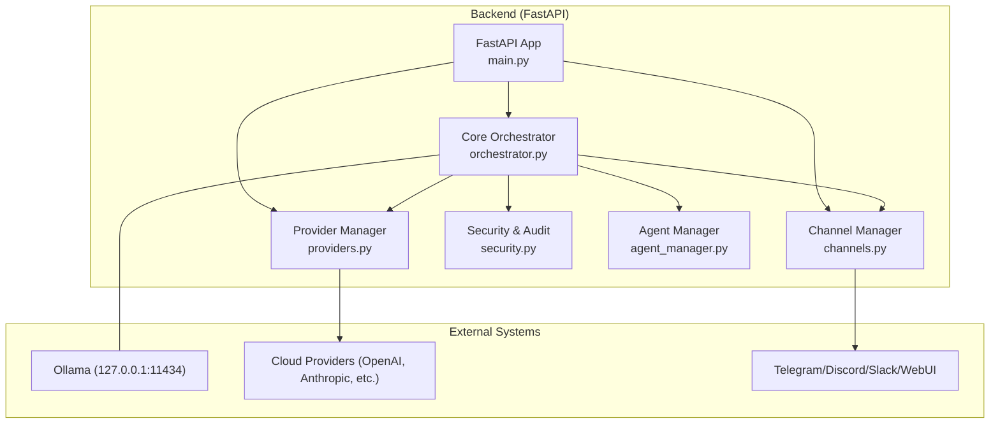
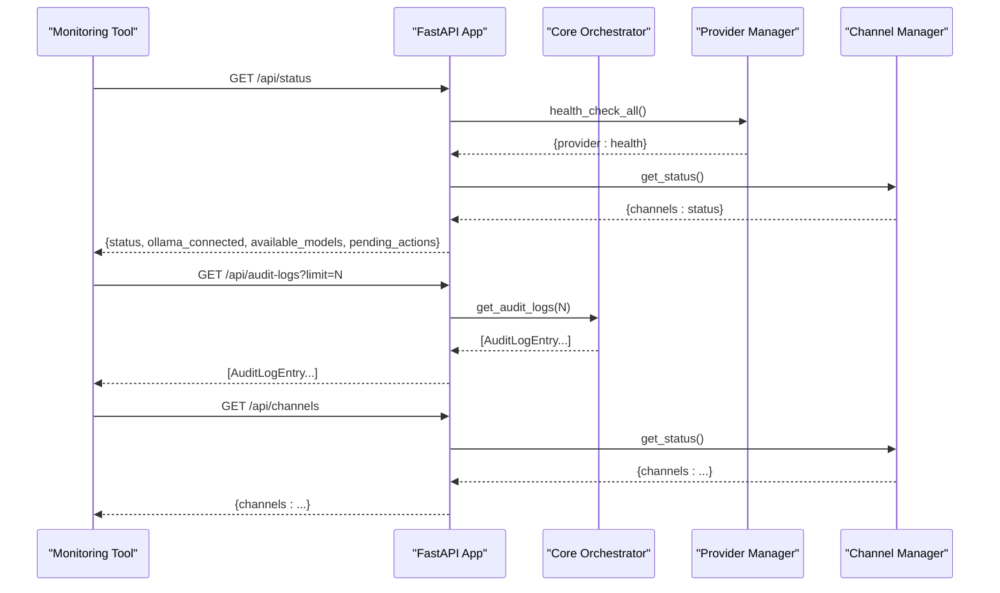
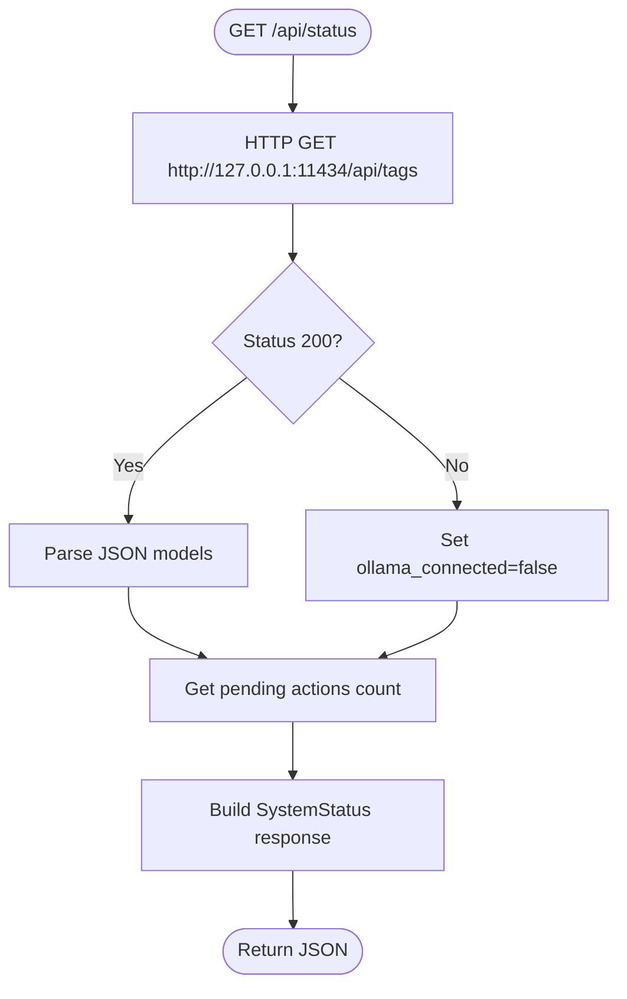
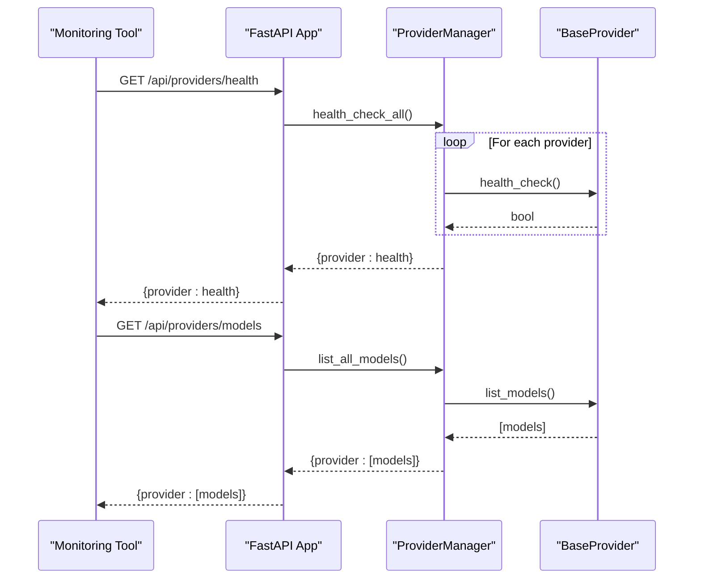
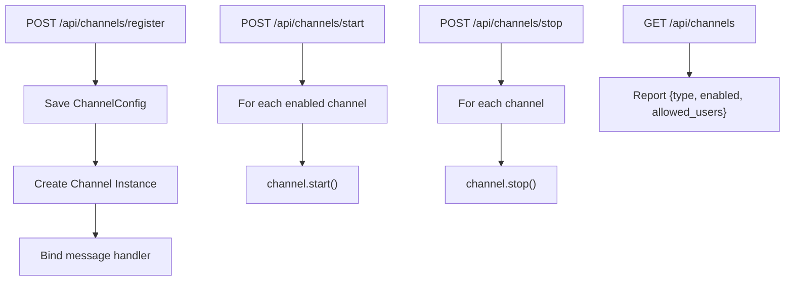
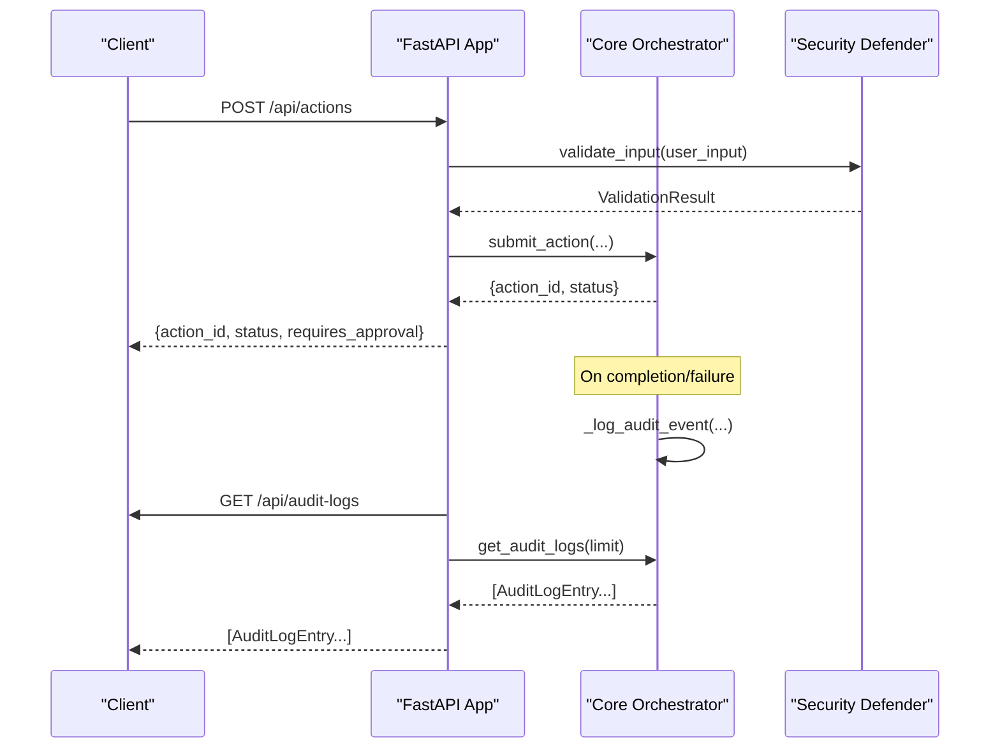
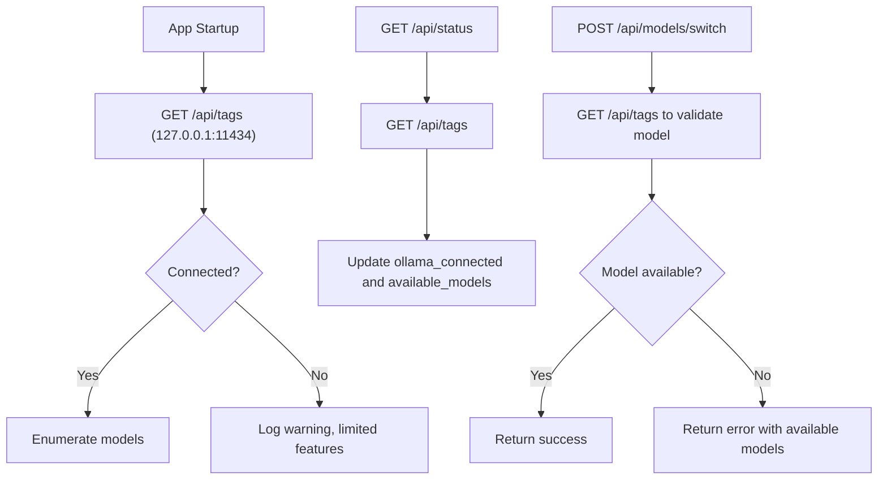
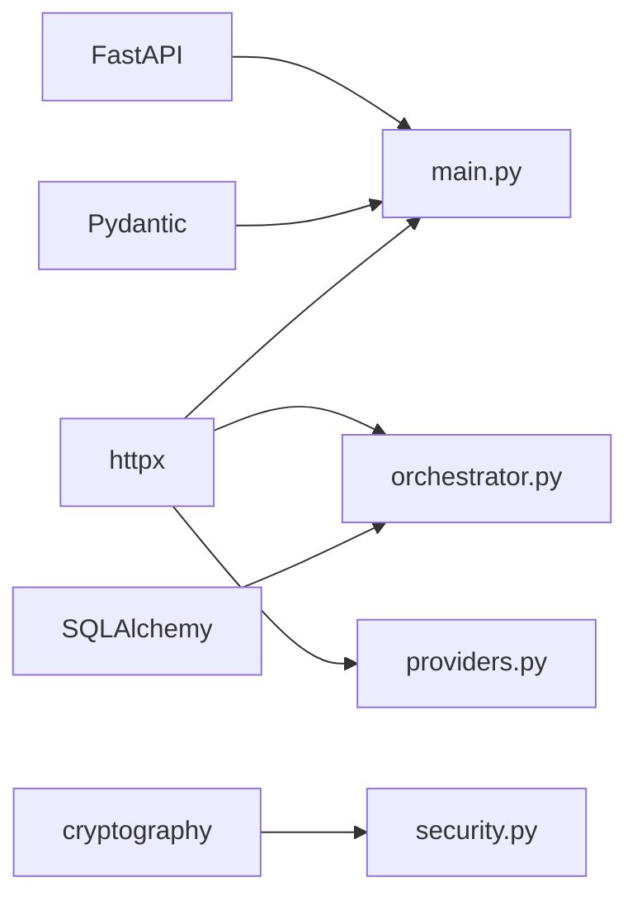

# System Monitoring

<cite>
**Referenced Files in This Document**
- [main.py](file://backend/app/main.py)
- [orchestrator.py](file://backend/app/core/orchestrator.py)
- [providers.py](file://backend/app/core/providers.py)
- [channels.py](file://backend/app/core/channels.py)
- [security.py](file://backend/app/core/security.py)
- [agent_manager.py](file://backend/app/core/agent_manager.py)
- [requirements.txt](file://backend/requirements.txt)
- [README.md](file://README.md)
</cite>

## Table of Contents
1. [Introduction](#introduction)
2. [Project Structure](#project-structure)
3. [Core Components](#core-components)
4. [Architecture Overview](#architecture-overview)
5. [Detailed Component Analysis](#detailed-component-analysis)
6. [Dependency Analysis](#dependency-analysis)
7. [Performance Considerations](#performance-considerations)
8. [Troubleshooting Guide](#troubleshooting-guide)
9. [Conclusion](#conclusion)
10. [Appendices](#appendices)

## Introduction
This document provides comprehensive system monitoring guidance for ClosedPaw with a focus on observability, metrics collection, and performance tracking. It documents built-in system status endpoints, health checks, audit logging, and monitoring setup for Ollama integration, provider health monitoring, and channel connectivity tracking. It also covers performance metrics (response times, action processing rates, resource utilization), alerting configuration for critical events, log analysis procedures, debugging techniques, and guidance for integrating external monitoring solutions and dashboards.

## Project Structure
ClosedPaw’s backend is a FastAPI application that exposes REST endpoints for system status, provider management, channel management, and action lifecycle control. The core orchestration, provider abstraction, channel abstraction, and security/logging are implemented in dedicated modules. The frontend runs on localhost and communicates with the backend API.

**Diagram sources**
- [main.py](file://backend/app/main.py#L73-L78)
- [orchestrator.py](file://backend/app/core/orchestrator.py#L87-L130)
- [providers.py](file://backend/app/core/providers.py#L418-L457)
- [channels.py](file://backend/app/core/channels.py#L405-L454)
- [security.py](file://backend/app/core/security.py#L35-L107)
- [agent_manager.py](file://backend/app/core/agent_manager.py#L65-L98)

**Section sources**
- [main.py](file://backend/app/main.py#L73-L78)
- [README.md](file://README.md#L134-L155)

## Core Components
- System Status Endpoint: Provides runtime status, Ollama connectivity, available models, and pending actions.
- Provider Health Monitoring: Health checks across registered providers and model listings.
- Channel Connectivity Tracking: Channel registration, status, and lifecycle control.
- Audit Logging: Structured audit logs for all actions with timestamps and outcomes.
- Security Controls: Input validation, rate limiting, and encrypted data vault for secrets.

Key endpoints and capabilities:
- GET /api/status: System status and Ollama health
- GET /api/providers/health: Health status of all providers
- GET /api/audit-logs: Security audit log entries
- GET /api/channels: Channel status
- POST /api/channels/start|stop: Control channel lifecycles
- GET /api/providers/models: Aggregate model listing across providers

**Section sources**
- [main.py](file://backend/app/main.py#L101-L128)
- [main.py](file://backend/app/main.py#L448-L461)
- [main.py](file://backend/app/main.py#L322-L339)
- [main.py](file://backend/app/main.py#L466-L528)
- [orchestrator.py](file://backend/app/core/orchestrator.py#L451-L461)
- [providers.py](file://backend/app/core/providers.py#L495-L503)
- [channels.py](file://backend/app/core/channels.py#L491-L502)

## Architecture Overview
The monitoring architecture centers on the FastAPI application exposing observability endpoints, backed by the orchestrator, provider manager, and channel manager. The orchestrator maintains audit logs and tracks action lifecycles. Provider and channel managers expose health and status APIs. Security modules provide input validation and rate limiting.

**Diagram sources**
- [main.py](file://backend/app/main.py#L101-L128)
- [main.py](file://backend/app/main.py#L322-L339)
- [main.py](file://backend/app/main.py#L466-L504)
- [providers.py](file://backend/app/core/providers.py#L495-L503)
- [channels.py](file://backend/app/core/channels.py#L491-L502)
- [orchestrator.py](file://backend/app/core/orchestrator.py#L459-L461)

## Detailed Component Analysis

### System Status Endpoint
The system status endpoint aggregates:
- Ollama connectivity by querying the local Ollama API
- Available models from Ollama
- Pending actions count from the orchestrator

**Diagram sources**
- [main.py](file://backend/app/main.py#L101-L128)

**Section sources**
- [main.py](file://backend/app/main.py#L101-L128)

### Provider Health Monitoring
Provider health monitoring:
- Health checks across all registered providers
- Aggregated model listing across providers
- Per-provider model discovery and default provider selection

**Diagram sources**
- [main.py](file://backend/app/main.py#L448-L461)
- [providers.py](file://backend/app/core/providers.py#L484-L503)

**Section sources**
- [main.py](file://backend/app/main.py#L448-L461)
- [providers.py](file://backend/app/core/providers.py#L418-L503)

### Channel Connectivity Tracking
Channel management:
- Registration of channel configurations
- Start/stop control for channels
- Status reporting for all channels
- User binding and allowlisting

**Diagram sources**
- [main.py](file://backend/app/main.py#L473-L528)
- [channels.py](file://backend/app/core/channels.py#L416-L454)

**Section sources**
- [main.py](file://backend/app/main.py#L466-L528)
- [channels.py](file://backend/app/core/channels.py#L405-L502)

### Audit Logging and Security Observability
Audit logging:
- All actions are recorded with timestamps, types, statuses, outcomes, and details
- Audit logs endpoint supports pagination and filtering
- Security module performs input validation, rate limiting, and generates security alerts

**Diagram sources**
- [main.py](file://backend/app/main.py#L241-L262)
- [security.py](file://backend/app/core/security.py#L116-L180)
- [orchestrator.py](file://backend/app/core/orchestrator.py#L429-L450)
- [main.py](file://backend/app/main.py#L322-L339)

**Section sources**
- [main.py](file://backend/app/main.py#L322-L339)
- [orchestrator.py](file://backend/app/core/orchestrator.py#L459-L461)
- [security.py](file://backend/app/core/security.py#L35-L107)

### Ollama Integration Monitoring
Ollama monitoring is integrated into:
- System status endpoint (local-only connectivity check)
- Orchestrator initialization (health check and model enumeration)
- Provider manager Ollama provider health check
- Model switching endpoint (validates model availability)

**Diagram sources**
- [main.py](file://backend/app/main.py#L101-L128)
- [orchestrator.py](file://backend/app/core/orchestrator.py#L131-L144)
- [providers.py](file://backend/app/core/providers.py#L155-L160)
- [main.py](file://backend/app/main.py#L213-L238)

**Section sources**
- [main.py](file://backend/app/main.py#L101-L128)
- [main.py](file://backend/app/main.py#L213-L238)
- [orchestrator.py](file://backend/app/core/orchestrator.py#L131-L144)
- [providers.py](file://backend/app/core/providers.py#L155-L160)

### Performance Metrics and Resource Utilization
Observed metrics and indicators:
- Response times: Provider implementations compute latency_ms for chat completions
- Token usage: Providers report tokens_used when available
- Action processing: Pending actions count and action lifecycle transitions
- Channel throughput: Polling intervals and send/receive operations per channel
- Resource limits: Agent manager enforces CPU/memory/disk limits and process caps

Recommendations for custom metrics:
- Instrument FastAPI routes with latency histograms and error counters
- Track provider-specific latencies and token consumption
- Export Prometheus metrics via a metrics endpoint or library
- Add resource usage metrics for the host process and sandboxed agents

**Section sources**
- [providers.py](file://backend/app/core/providers.py#L58-L66)
- [providers.py](file://backend/app/core/providers.py#L135-L143)
- [providers.py](file://backend/app/core/providers.py#L205-L215)
- [providers.py](file://backend/app/core/providers.py#L286-L287)
- [providers.py](file://backend/app/core/providers.py#L340-L347)
- [providers.py](file://backend/app/core/providers.py#L408-L409)
- [agent_manager.py](file://backend/app/core/agent_manager.py#L39-L47)
- [agent_manager.py](file://backend/app/core/agent_manager.py#L86-L94)

## Dependency Analysis
The backend depends on FastAPI, Pydantic, httpx, cryptography, and SQLAlchemy. Monitoring-related dependencies include httpx for health checks and logging for audit trails.

**Diagram sources**
- [requirements.txt](file://backend/requirements.txt#L5-L15)
- [main.py](file://backend/app/main.py#L10-L16)
- [orchestrator.py](file://backend/app/core/orchestrator.py#L15-L16)
- [providers.py](file://backend/app/core/providers.py#L15-L15)
- [security.py](file://backend/app/core/security.py#L21-L25)

**Section sources**
- [requirements.txt](file://backend/requirements.txt#L1-L36)
- [main.py](file://backend/app/main.py#L10-L16)
- [orchestrator.py](file://backend/app/core/orchestrator.py#L15-L16)
- [providers.py](file://backend/app/core/providers.py#L15-L15)
- [security.py](file://backend/app/core/security.py#L21-L25)

## Performance Considerations
- Latency measurement: Providers record latency_ms during chat completion; use this for SLO tracking.
- Throughput: Track request counts per second and error rates per route.
- Resource limits: Enforce CPU/memory/disk quotas for sandboxed agents; monitor agent creation and termination.
- Channel polling: Tune polling timeouts and error backoff for Telegram/Discord/Slack integrations.
- Model availability: Cache model lists and refresh periodically to reduce external API calls.

[No sources needed since this section provides general guidance]

## Troubleshooting Guide
Common issues and diagnostics:
- Ollama not reachable: Verify local service on 127.0.0.1:11434; check /api/status for ollama_connected flag.
- Provider health failures: Use /api/providers/health to identify failing providers; inspect provider logs.
- Audit log analysis: Use /api/audit-logs to correlate action outcomes with security events.
- Channel connectivity: Use /api/channels to confirm channel statuses; start/stop channels via respective endpoints.
- Security alerts: Review security module warnings for detected injection attempts and rate-limit triggers.

Debugging steps:
- Enable verbose logging for orchestrator and security modules.
- Inspect audit logs for timestamps and action outcomes.
- Validate provider credentials and model availability.
- Confirm sandbox runtime detection and availability for agent management.

**Section sources**
- [main.py](file://backend/app/main.py#L101-L128)
- [main.py](file://backend/app/main.py#L448-L461)
- [main.py](file://backend/app/main.py#L322-L339)
- [main.py](file://backend/app/main.py#L466-L528)
- [security.py](file://backend/app/core/security.py#L176-L180)
- [agent_manager.py](file://backend/app/core/agent_manager.py#L99-L113)

## Conclusion
ClosedPaw provides built-in observability through system status, provider health checks, channel status, and comprehensive audit logging. By leveraging these endpoints and augmenting with custom metrics and external monitoring tools, operators can achieve robust visibility into system health, performance, and security posture.

[No sources needed since this section summarizes without analyzing specific files]

## Appendices

### Monitoring Endpoints Reference
- GET /api/status: System status, Ollama connectivity, available models, pending actions
- GET /api/providers/health: Health status per provider
- GET /api/providers/models: Models across providers
- GET /api/audit-logs: Security audit log entries
- GET /api/channels: Channel status
- POST /api/channels/start|stop: Control channel lifecycles

**Section sources**
- [main.py](file://backend/app/main.py#L101-L128)
- [main.py](file://backend/app/main.py#L448-L461)
- [main.py](file://backend/app/main.py#L322-L339)
- [main.py](file://backend/app/main.py#L466-L528)

### Alerting Configuration Guidance
- Critical system events: Use audit logs to trigger alerts on failures or rejections.
- Provider outages: Alert on sustained health check failures.
- Security incidents: Alert on high or critical threat levels from input validation.
- Operational failures: Alert on repeated errors in action execution or channel operations.

[No sources needed since this section provides general guidance]

### External Monitoring Integration
- Metrics: Expose Prometheus metrics for request latency, error rates, provider latencies, and agent resource usage.
- Dashboards: Visualize system status, provider health, audit trends, and channel activity.
- Logs: Ship audit logs to centralized logging systems for long-term retention and analysis.

[No sources needed since this section provides general guidance]