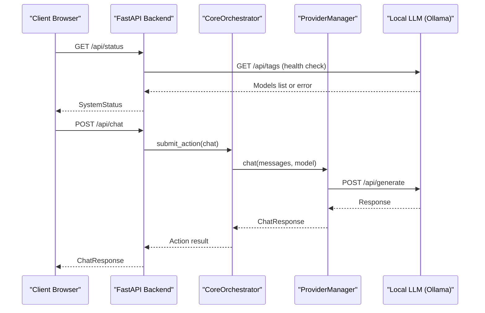
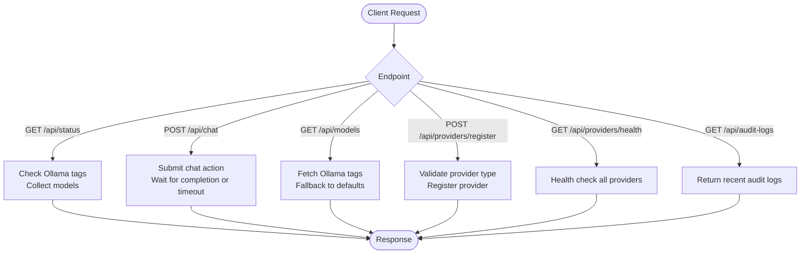
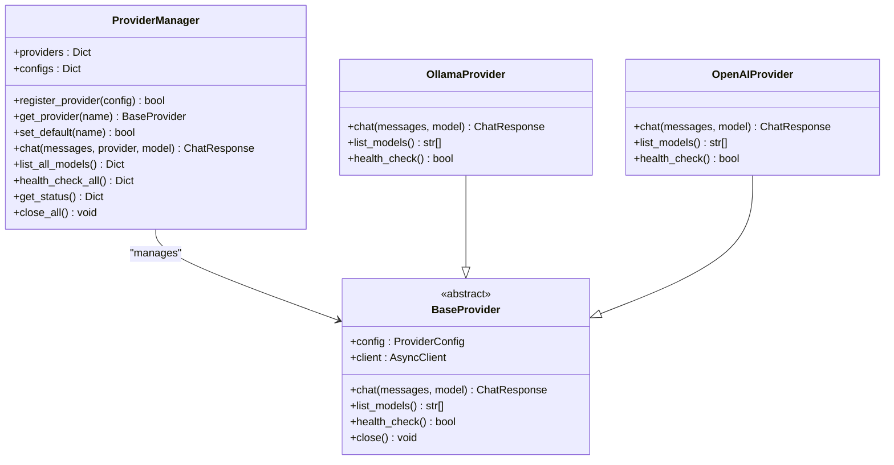
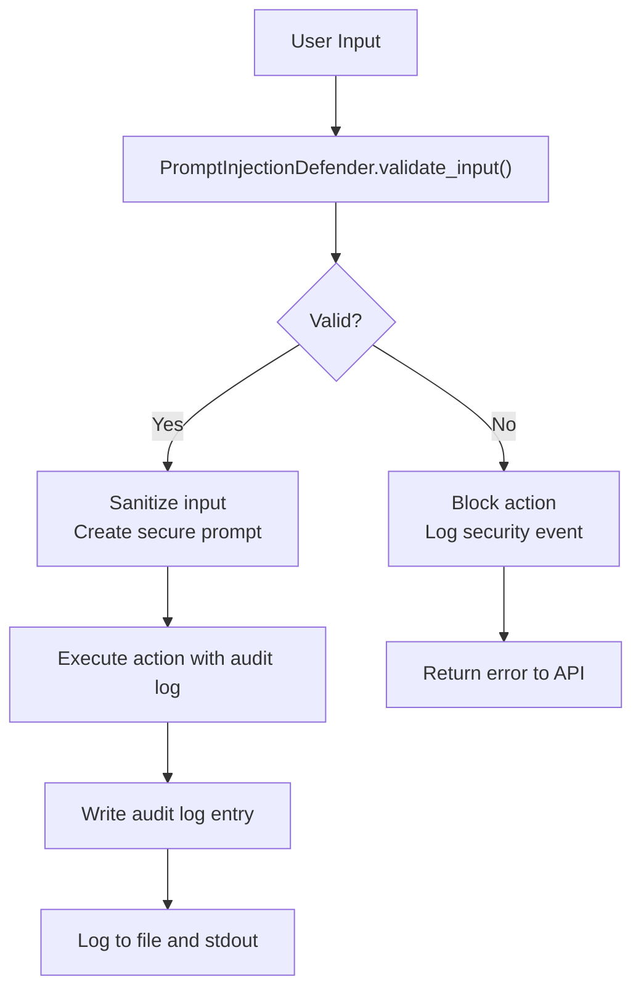
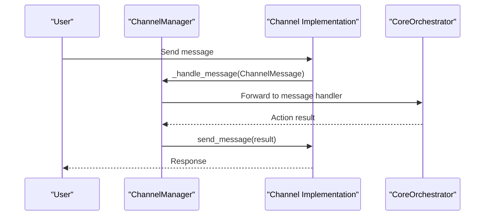
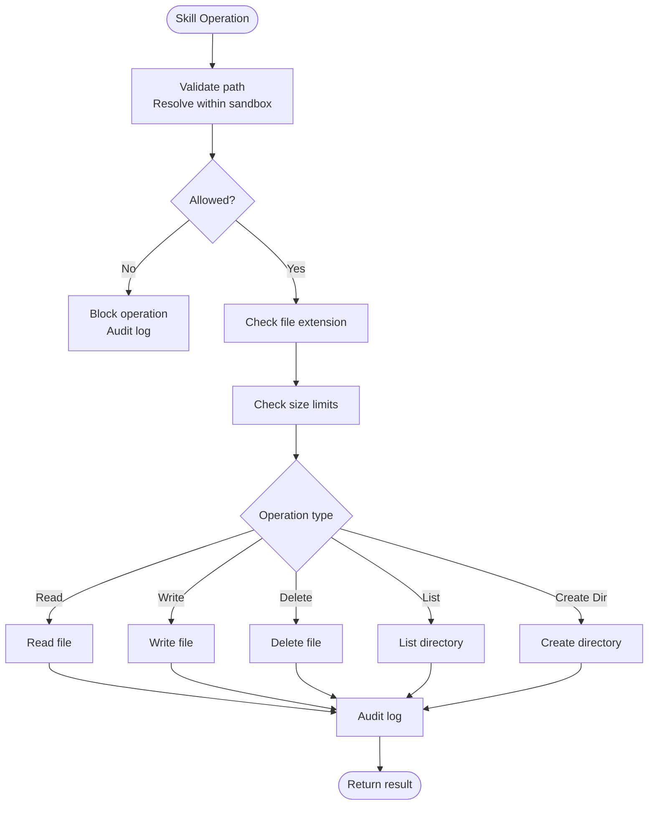
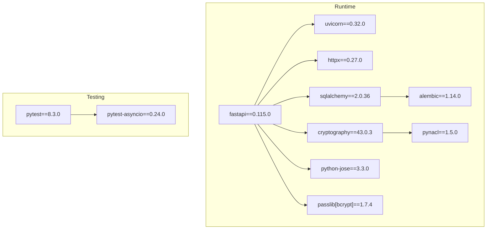

# Troubleshooting Guide

<cite>
**Referenced Files in This Document**
- [README.md](file://README.md)
- [backend/app/main.py](file://backend/app/main.py)
- [backend/app/core/orchestrator.py](file://backend/app/core/orchestrator.py)
- [backend/app/core/providers.py](file://backend/app/core/providers.py)
- [backend/app/core/security.py](file://backend/app/core/security.py)
- [backend/app/core/channels.py](file://backend/app/core/channels.py)
- [skills/filesystem/skill.py](file://skills/filesystem/skill.py)
- [bin/closedpaw.js](file://bin/closedpaw.js)
- [installer/install.sh](file://installer/install.sh)
- [installer/install.ps1](file://installer/install.ps1)
- [backend/requirements.txt](file://backend/requirements.txt)
- [package.json](file://package.json)
</cite>

## Table of Contents
1. [Introduction](#introduction)
2. [Project Structure](#project-structure)
3. [Core Components](#core-components)
4. [Architecture Overview](#architecture-overview)
5. [Detailed Component Analysis](#detailed-component-analysis)
6. [Dependency Analysis](#dependency-analysis)
7. [Performance Considerations](#performance-considerations)
8. [Troubleshooting Guide](#troubleshooting-guide)
9. [Conclusion](#conclusion)
10. [Appendices](#appendices)

## Introduction
This guide provides a comprehensive troubleshooting methodology for ClosedPaw, focusing on diagnosing and resolving common operational issues. It covers startup failures, dependency problems, configuration errors, API debugging, provider connectivity issues, sandbox execution problems, log analysis, error interpretation, and recovery strategies. It also includes network connectivity troubleshooting, firewall configuration, permission-related problems, escalation procedures, and preventive maintenance steps.

## Project Structure
ClosedPaw consists of:
- A Python FastAPI backend that exposes REST endpoints, manages orchestration, providers, channels, and security.
- A Node.js CLI that installs, starts, stops, and diagnoses the system.
- Platform-specific installers for Linux/macOS and Windows.
- Skills that operate within sandboxed environments.
- A frontend web UI (Next.js) that communicates with the backend.

```mermaid
graph TB
subgraph "CLI"
CLI["bin/closedpaw.js"]
end
subgraph "Installer"
SH["installer/install.sh"]
PS1["installer/install.ps1"]
end
subgraph "Backend"
MAIN["backend/app/main.py"]
ORCH["backend/app/core/orchestrator.py"]
PROV["backend/app/core/providers.py"]
SEC["backend/app/core/security.py"]
CH["backend/app/core/channels.py"]
REQ["backend/requirements.txt"]
end
subgraph "Skills"
FS["skills/filesystem/skill.py"]
end
subgraph "Frontend"
NEXT["frontend (Next.js)"]
end
CLI --> MAIN
SH --> CLI
PS1 --> CLI
MAIN --> ORCH
MAIN --> PROV
MAIN --> CH
ORCH --> PROV
ORCH --> CH
ORCH --> SEC
FS --> ORCH
NEXT --> MAIN
```

**Diagram sources**
- [backend/app/main.py](file://backend/app/main.py#L1-L567)
- [backend/app/core/orchestrator.py](file://backend/app/core/orchestrator.py#L1-L486)
- [backend/app/core/providers.py](file://backend/app/core/providers.py#L1-L545)
- [backend/app/core/security.py](file://backend/app/core/security.py#L1-L455)
- [backend/app/core/channels.py](file://backend/app/core/channels.py#L1-L524)
- [skills/filesystem/skill.py](file://skills/filesystem/skill.py#L1-L483)
- [bin/closedpaw.js](file://bin/closedpaw.js#L1-L911)
- [installer/install.sh](file://installer/install.sh#L1-L823)
- [installer/install.ps1](file://installer/install.ps1#L1-L578)
- [backend/requirements.txt](file://backend/requirements.txt#L1-L36)

**Section sources**
- [README.md](file://README.md#L1-L192)
- [package.json](file://package.json#L1-L54)

## Core Components
- Orchestrator: Central component managing actions, security levels, audit logging, and integration with providers and channels.
- Providers: Multi-provider gateway supporting local Ollama and cloud providers (OpenAI, Anthropic, Google, Mistral).
- Channels: Multi-channel messaging gateway (Web UI, Telegram, Discord, Slack).
- Security: Input validation, prompt injection defense, rate limiting, and encrypted data vault.
- CLI: Installation, startup, diagnostics, and configuration management.
- Installers: Automated setup for Linux/macOS and Windows with sandbox configuration.

**Section sources**
- [backend/app/core/orchestrator.py](file://backend/app/core/orchestrator.py#L87-L486)
- [backend/app/core/providers.py](file://backend/app/core/providers.py#L418-L545)
- [backend/app/core/channels.py](file://backend/app/core/channels.py#L405-L524)
- [backend/app/core/security.py](file://backend/app/core/security.py#L35-L455)
- [bin/closedpaw.js](file://bin/closedpaw.js#L357-L479)
- [installer/install.sh](file://installer/install.sh#L191-L288)
- [installer/install.ps1](file://installer/install.ps1#L215-L278)

## Architecture Overview
The system follows a zero-trust architecture with:
- Local-only binding (127.0.0.1) for API and LLM gateway.
- Human-in-the-loop (HITL) approvals for high-risk actions.
- Hardened sandboxing via gVisor/Kata for skills.
- Audit logging for all actions.
- Multi-provider LLM support with health checks and failover.



**Diagram sources**
- [backend/app/main.py](file://backend/app/main.py#L101-L128)
- [backend/app/main.py](file://backend/app/main.py#L131-L182)
- [backend/app/core/providers.py](file://backend/app/core/providers.py#L470-L483)
- [backend/app/core/orchestrator.py](file://backend/app/core/orchestrator.py#L303-L332)

## Detailed Component Analysis

### API Endpoints and Health Checks
Common endpoints and their roles:
- GET /api/status: Reports system status, Ollama connectivity, available models, and pending actions.
- POST /api/chat: Submits chat actions; returns immediate or pending status.
- GET /api/models: Lists local models; falls back to defaults if Ollama is unavailable.
- POST /api/providers/register: Registers providers with configuration.
- GET /api/providers/health: Health checks all providers.
- GET /api/audit-logs: Retrieves security audit logs.



**Diagram sources**
- [backend/app/main.py](file://backend/app/main.py#L101-L128)
- [backend/app/main.py](file://backend/app/main.py#L131-L182)
- [backend/app/main.py](file://backend/app/main.py#L184-L211)
- [backend/app/main.py](file://backend/app/main.py#L403-L434)
- [backend/app/main.py](file://backend/app/main.py#L448-L453)
- [backend/app/main.py](file://backend/app/main.py#L322-L339)

**Section sources**
- [backend/app/main.py](file://backend/app/main.py#L101-L128)
- [backend/app/main.py](file://backend/app/main.py#L131-L182)
- [backend/app/main.py](file://backend/app/main.py#L184-L211)
- [backend/app/main.py](file://backend/app/main.py#L403-L434)
- [backend/app/main.py](file://backend/app/main.py#L448-L453)
- [backend/app/main.py](file://backend/app/main.py#L322-L339)

### Provider Connectivity and Multi-Provider Management
ProviderManager supports local Ollama and cloud providers. Health checks and model listings are exposed via endpoints.



**Diagram sources**
- [backend/app/core/providers.py](file://backend/app/core/providers.py#L418-L545)
- [backend/app/core/providers.py](file://backend/app/core/providers.py#L68-L100)
- [backend/app/core/providers.py](file://backend/app/core/providers.py#L102-L161)
- [backend/app/core/providers.py](file://backend/app/core/providers.py#L163-L222)

**Section sources**
- [backend/app/core/providers.py](file://backend/app/core/providers.py#L418-L545)
- [backend/app/core/providers.py](file://backend/app/core/providers.py#L68-L100)
- [backend/app/core/providers.py](file://backend/app/core/providers.py#L102-L161)
- [backend/app/core/providers.py](file://backend/app/core/providers.py#L163-L222)

### Security and Audit Logging
Security module enforces input validation, prompt injection defense, rate limiting, and encrypted data vault. Audit logs are written to a temporary directory and streamed to stdout.



**Diagram sources**
- [backend/app/core/security.py](file://backend/app/core/security.py#L116-L181)
- [backend/app/core/security.py](file://backend/app/core/security.py#L253-L288)
- [backend/app/core/orchestrator.py](file://backend/app/core/orchestrator.py#L429-L450)

**Section sources**
- [backend/app/core/security.py](file://backend/app/core/security.py#L35-L455)
- [backend/app/core/orchestrator.py](file://backend/app/core/orchestrator.py#L18-L28)
- [backend/app/core/orchestrator.py](file://backend/app/core/orchestrator.py#L429-L450)

### Channel Management and Messaging
ChannelManager handles multiple channels (Web UI, Telegram, Discord, Slack). It validates users, routes messages, and broadcasts to channels.



**Diagram sources**
- [backend/app/core/channels.py](file://backend/app/core/channels.py#L112-L116)
- [backend/app/core/channels.py](file://backend/app/core/channels.py#L456-L461)
- [backend/app/core/channels.py](file://backend/app/core/channels.py#L462-L468)

**Section sources**
- [backend/app/core/channels.py](file://backend/app/core/channels.py#L405-L524)

### Sandbox Execution and File System Skill
The File System skill operates within a sandboxed directory, enforcing path traversal prevention, extension whitelists, and size limits.



**Diagram sources**
- [skills/filesystem/skill.py](file://skills/filesystem/skill.py#L77-L109)
- [skills/filesystem/skill.py](file://skills/filesystem/skill.py#L133-L209)
- [skills/filesystem/skill.py](file://skills/filesystem/skill.py#L274-L336)
- [skills/filesystem/skill.py](file://skills/filesystem/skill.py#L337-L393)
- [skills/filesystem/skill.py](file://skills/filesystem/skill.py#L404-L441)

**Section sources**
- [skills/filesystem/skill.py](file://skills/filesystem/skill.py#L35-L483)

## Dependency Analysis
Key runtime dependencies and their roles:
- FastAPI, Uvicorn: Web server and ASGI framework.
- httpx: HTTP client for provider and health checks.
- cryptography, pynacl: Encryption and secure data handling.
- SQLAlchemy, Alembic: ORM and database migrations.
- pytest, pytest-asyncio: Testing framework.



**Diagram sources**
- [backend/requirements.txt](file://backend/requirements.txt#L4-L36)

**Section sources**
- [backend/requirements.txt](file://backend/requirements.txt#L1-L36)

## Performance Considerations
- Use local Ollama for fastest response times; cloud providers add latency.
- Enable sandboxing (gVisor/Kata) for security; expect slight overhead.
- Monitor audit logs and action queues to identify bottlenecks.
- Optimize model selection and avoid overly large file operations.

## Troubleshooting Guide

### Systematic Diagnosis Workflow
1. Verify installation and environment:
   - Check Python 3.11+, Node.js 20+, and required packages.
   - Confirm Ollama installation and security configuration.
   - Validate sandbox availability (Linux/macOS) or WSL2/Docker (Windows).
2. Check service status:
   - Use CLI doctor to validate installation, dependencies, and ports.
   - Verify API responds on 127.0.0.1:8000 and Web UI on 127.0.0.1:3000.
3. Inspect logs:
   - Backend audit logs in the system temp directory.
   - Provider health and model lists via API endpoints.
4. Isolate issues:
   - Test Ollama connectivity independently.
   - Validate provider configurations and API keys.
   - Check channel configurations and user allowlists.
5. Remediate and verify:
   - Apply fixes (dependencies, configs, permissions).
   - Re-run diagnostics and monitor logs.

**Section sources**
- [bin/closedpaw.js](file://bin/closedpaw.js#L357-L479)
- [installer/install.sh](file://installer/install.sh#L128-L162)
- [installer/install.sh](file://installer/install.sh#L348-L405)
- [installer/install.ps1](file://installer/install.ps1#L62-L80)
- [installer/install.ps1](file://installer/install.ps1#L191-L213)
- [backend/app/core/orchestrator.py](file://backend/app/core/orchestrator.py#L18-L28)

### Startup Failures
Symptoms:
- CLI reports missing dependencies or failed installation.
- Services fail to start or crash immediately.
- Ports 8000/3000 not accessible.

Resolution steps:
- Linux/macOS:
  - Run installer to configure sandbox and dependencies.
  - Ensure Python 3.11+ and Node.js 20+ are installed.
  - Verify Ollama security configuration (127.0.0.1 only).
- Windows:
  - Use installer to set up sandboxing (WSL2 or Docker).
  - Confirm PowerShell version and required tools.
- CLI:
  - Use `closedpaw doctor` to diagnose issues.
  - Use `closedpaw status` to check running state.
  - Use `closedpaw start/stop` to manage services.

**Section sources**
- [installer/install.sh](file://installer/install.sh#L128-L162)
- [installer/install.sh](file://installer/install.sh#L348-L405)
- [installer/install.ps1](file://installer/install.ps1#L22-L56)
- [installer/install.ps1](file://installer/install.ps1#L508-L578)
- [bin/closedpaw.js](file://bin/closedpaw.js#L292-L355)
- [bin/closedpaw.js](file://bin/closedpaw.js#L357-L479)

### Dependency Issues
Symptoms:
- Import errors or missing modules.
- Package installation failures.

Resolution steps:
- Backend:
  - Create and activate a Python virtual environment.
  - Install dependencies from requirements.txt.
- Frontend:
  - Install Node.js dependencies in the frontend directory.
- CLI:
  - Ensure Node.js engines requirement is met.

**Section sources**
- [backend/requirements.txt](file://backend/requirements.txt#L1-L36)
- [package.json](file://package.json#L39-L44)

### Configuration Errors
Symptoms:
- Provider registration fails.
- Channels not responding.
- Actions stuck in pending.

Resolution steps:
- Providers:
  - Validate provider type and configuration.
  - Ensure API keys and base URLs are correct.
  - Use health check endpoint to verify connectivity.
- Channels:
  - Verify tokens and allowlists.
  - Bind users to channels when required.
- Actions:
  - Check HITL approvals for high-risk actions.
  - Review audit logs for errors.

**Section sources**
- [backend/app/main.py](file://backend/app/main.py#L403-L434)
- [backend/app/main.py](file://backend/app/main.py#L448-L453)
- [backend/app/main.py](file://backend/app/main.py#L531-L555)
- [backend/app/core/channels.py](file://backend/app/core/channels.py#L416-L444)
- [backend/app/core/channels.py](file://backend/app/core/channels.py#L484-L490)
- [backend/app/core/orchestrator.py](file://backend/app/core/orchestrator.py#L451-L458)
- [backend/app/core/orchestrator.py](file://backend/app/core/orchestrator.py#L459-L462)

### API Debugging Procedures
Common issues and resolutions:
- GET /api/status:
  - If Ollama is unreachable, verify local service and security bindings.
- POST /api/chat:
  - Check action status and timeouts; review error details.
- GET /api/models:
  - If empty, ensure Ollama is running and models are pulled.
- Provider endpoints:
  - Validate provider registration and health.

**Section sources**
- [backend/app/main.py](file://backend/app/main.py#L101-L128)
- [backend/app/main.py](file://backend/app/main.py#L131-L182)
- [backend/app/main.py](file://backend/app/main.py#L184-L211)
- [backend/app/main.py](file://backend/app/main.py#L403-L434)
- [backend/app/main.py](file://backend/app/main.py#L448-L453)

### Provider Connectivity Issues
Symptoms:
- Provider health checks fail.
- Chat via provider returns errors.

Resolution steps:
- Verify provider type and configuration.
- Check API keys and network access.
- Use health check endpoint to confirm connectivity.
- For cloud providers, ensure rate limits and quotas are sufficient.

**Section sources**
- [backend/app/core/providers.py](file://backend/app/core/providers.py#L495-L504)
- [backend/app/core/providers.py](file://backend/app/core/providers.py#L505-L519)
- [backend/app/main.py](file://backend/app/main.py#L448-L453)

### Sandbox Execution Problems
Symptoms:
- File operations fail or are blocked.
- Path traversal attempts flagged.

Resolution steps:
- Confirm sandbox directory exists and is writable.
- Review allowed extensions and size limits.
- Audit logs indicate blocked operations.
- Adjust sandbox configuration if needed.

**Section sources**
- [skills/filesystem/skill.py](file://skills/filesystem/skill.py#L47-L76)
- [skills/filesystem/skill.py](file://skills/filesystem/skill.py#L115-L132)
- [skills/filesystem/skill.py](file://skills/filesystem/skill.py#L133-L209)
- [skills/filesystem/skill.py](file://skills/filesystem/skill.py#L274-L336)
- [skills/filesystem/skill.py](file://skills/filesystem/skill.py#L337-L393)

### Log Analysis Procedures
- Backend audit logs:
  - Location: system temp directory.
  - Format: timestamped entries with action, status, outcome, and details.
  - Use GET /api/audit-logs to retrieve recent entries.
- Security events:
  - Prompt injection attempts are logged with threat levels.
  - Rate limit violations trigger warnings.

**Section sources**
- [backend/app/core/orchestrator.py](file://backend/app/core/orchestrator.py#L18-L28)
- [backend/app/core/orchestrator.py](file://backend/app/core/orchestrator.py#L429-L450)
- [backend/app/core/security.py](file://backend/app/core/security.py#L176-L180)
- [backend/app/main.py](file://backend/app/main.py#L322-L339)

### Error Code Interpretation
- HTTP 400 Bad Request:
  - Invalid action type or provider configuration.
- HTTP 403 Forbidden:
  - Action rejected by HITL or security policy.
- HTTP 500 Internal Server Error:
  - Action failed during execution; check error details and logs.
- Provider errors:
  - Returned as exceptions with provider-specific messages.

**Section sources**
- [backend/app/main.py](file://backend/app/main.py#L246-L249)
- [backend/app/main.py](file://backend/app/main.py#L170-L174)
- [backend/app/main.py](file://backend/app/main.py#L234-L238)
- [backend/app/main.py](file://backend/app/main.py#L553-L555)

### Recovery Strategies
- Restart services:
  - Use CLI stop/start commands.
- Reset configurations:
  - Re-register providers and channels.
- Reinstall dependencies:
  - Recreate virtual environment and reinstall packages.
- Rollback changes:
  - Revert provider/channel configurations to known-good state.

**Section sources**
- [bin/closedpaw.js](file://bin/closedpaw.js#L274-L290)
- [bin/closedpaw.js](file://bin/closedpaw.js#L696-L700)
- [backend/requirements.txt](file://backend/requirements.txt#L1-L36)

### Network Connectivity Troubleshooting
- Verify local binding:
  - API and Web UI bind to 127.0.0.1 only.
- Firewall configuration:
  - Allow localhost traffic for ports 3000 and 8000.
- Sandbox networking:
  - Ensure container runtime (gVisor/Kata) allows outbound connections if needed.

**Section sources**
- [backend/app/main.py](file://backend/app/main.py#L560-L567)
- [installer/install.sh](file://installer/install.sh#L670-L681)
- [installer/install.sh](file://installer/install.sh#L191-L270)
- [installer/install.ps1](file://installer/install.ps1#L215-L252)

### Permission-Related Problems
- File system skill:
  - Operations restricted to sandbox directory.
  - Path traversal attempts are blocked and audited.
- Encryption keys:
  - Generated and stored securely; ensure appropriate file permissions.

**Section sources**
- [skills/filesystem/skill.py](file://skills/filesystem/skill.py#L77-L109)
- [skills/filesystem/skill.py](file://skills/filesystem/skill.py#L442-L466)
- [backend/app/core/security.py](file://backend/app/core/security.py#L341-L346)

### Escalation Procedures and Support Resources
- Report bugs:
  - Use GitHub issues with collected logs and reproduction steps.
- Security issues:
  - Create a private security advisory on GitHub.
- Community:
  - Open GitHub Discussions for questions and collaboration.

**Section sources**
- [CONTRIBUTING.md](file://CONTRIBUTING.md#L33-L47)
- [CONTRIBUTING.md](file://CONTRIBUTING.md#L56-L61)

### Preventive Maintenance and System Health Verification
- Regular checks:
  - Run CLI doctor periodically.
  - Monitor audit logs for anomalies.
- Dependency updates:
  - Keep Python and Node.js versions current.
  - Update provider SDKs and dependencies.
- Backup configurations:
  - Maintain backups of provider and channel configurations.
- Capacity planning:
  - Monitor disk usage for sandbox and logs.

**Section sources**
- [bin/closedpaw.js](file://bin/closedpaw.js#L357-L479)
- [CONTRIBUTING.md](file://CONTRIBUTING.md#L87-L97)

## Conclusion
This guide provides a structured approach to diagnosing and resolving ClosedPaw operational issues. By following the systematic workflow, leveraging built-in diagnostics, and understanding component interactions, most problems can be quickly identified and resolved while maintaining the system’s zero-trust security posture.

## Appendices

### Quick Reference: Common Commands
- Install: `npm install -g closedpaw`
- Start: `closedpaw start`
- Stop: `closedpaw stop`
- Diagnostics: `closedpaw doctor`
- Status: `closedpaw status`
- Update: `closedpaw update`

**Section sources**
- [README.md](file://README.md#L26-L63)
- [bin/closedpaw.js](file://bin/closedpaw.js#L680-L700)