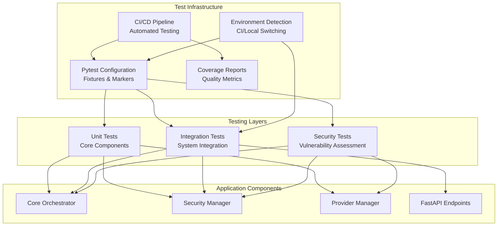
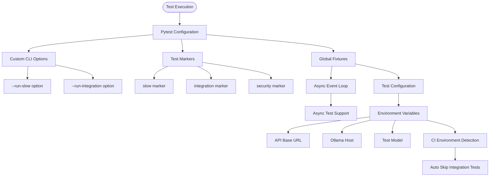
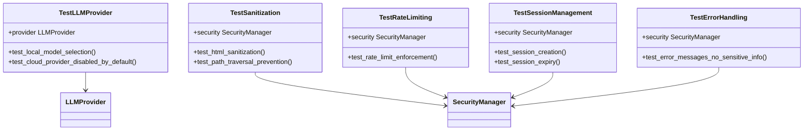
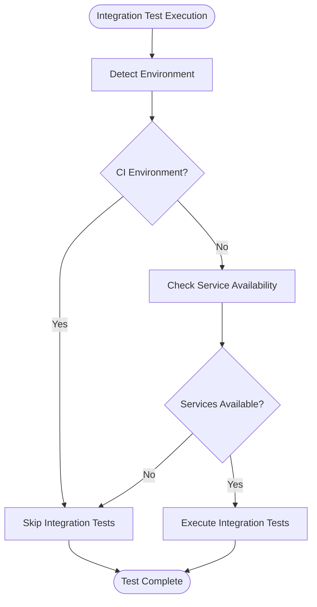
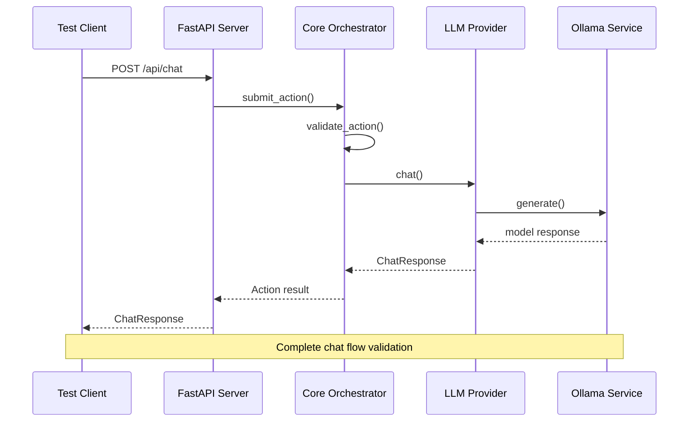
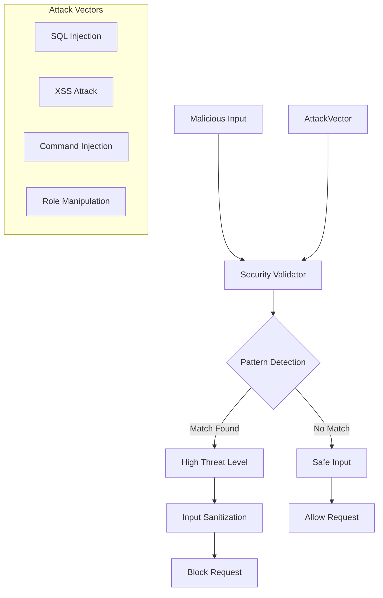
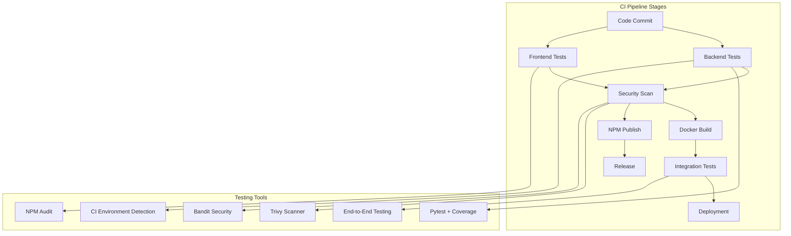
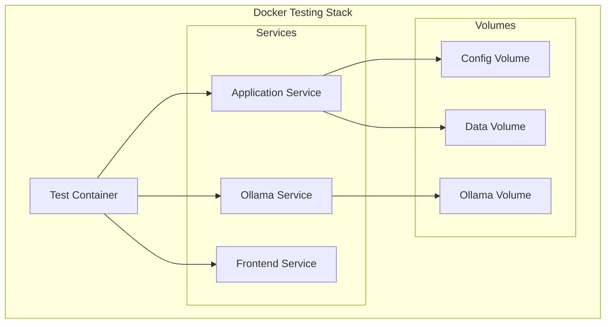
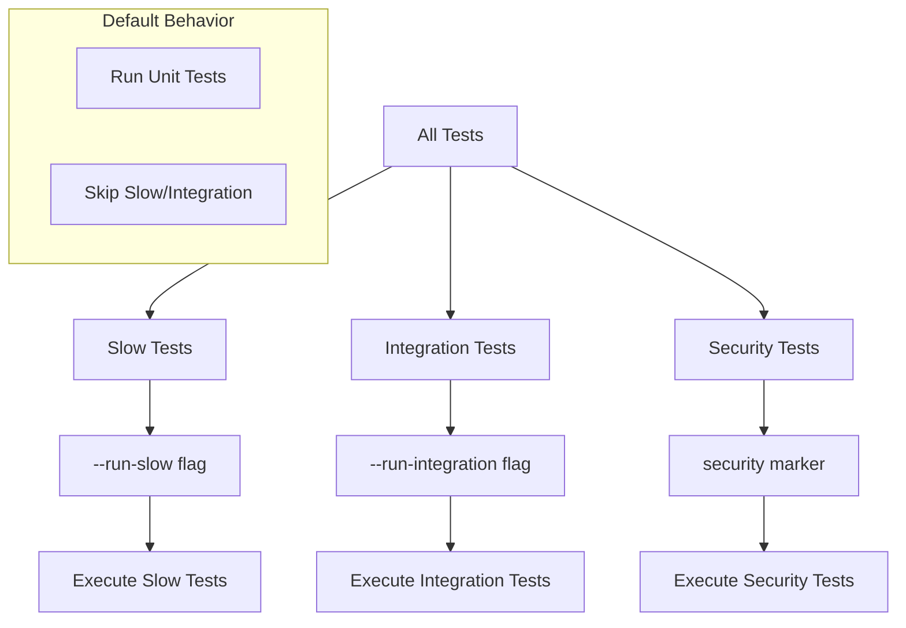
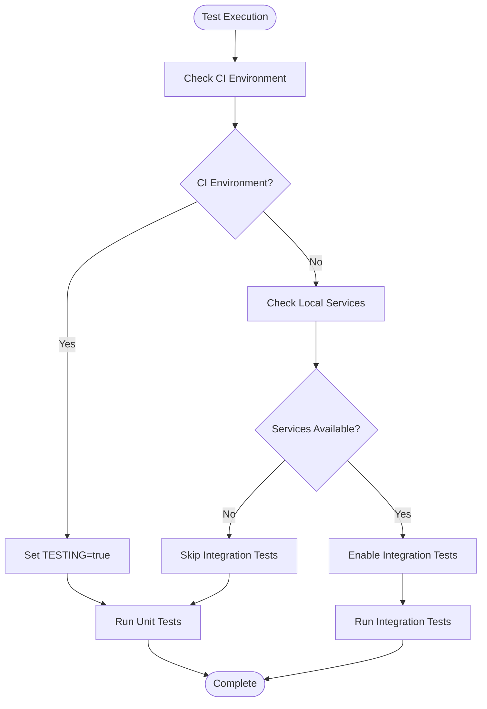

# Comprehensive Testing Framework

<cite>
**Referenced Files in This Document**
- [conftest.py](file://backend/tests/conftest.py)
- [test_unit.py](file://backend/tests/test_unit.py)
- [test_integration.py](file://backend/tests/test_integration.py)
- [test_security.py](file://backend/tests/test_security.py)
- [main.py](file://backend/app/main.py)
- [security.py](file://backend/app/core/security.py)
- [providers.py](file://backend/app/core/providers.py)
- [orchestrator.py](file://backend/app/core/orchestrator.py)
- [ci.yml](file://.github/workflows/ci.yml)
- [requirements.txt](file://backend/requirements.txt)
- [Dockerfile](file://Dockerfile)
- [docker-compose.yml](file://docker-compose.yml)
- [entrypoint.sh](file://docker/entrypoint.sh)
</cite>

## Update Summary
**Changes Made**
- Enhanced CI-friendly testing with automatic CI environment detection
- Added skip conditions for integration tests in CI environments
- Updated test execution strategies to support both local and CI environments
- Improved environment-based test skipping logic

## Table of Contents
1. [Introduction](#introduction)
2. [Testing Architecture Overview](#testing-architecture-overview)
3. [Test Configuration and Setup](#test-configuration-and-setup)
4. [Unit Testing Framework](#unit-testing-framework)
5. [Integration Testing Framework](#integration-testing-framework)
6. [Security Testing Framework](#security-testing-framework)
7. [Continuous Integration Pipeline](#continuous-integration-pipeline)
8. [Testing Infrastructure](#testing-infrastructure)
9. [Test Execution Strategies](#test-execution-strategies)
10. [Best Practices and Recommendations](#best-practices-and-recommendations)

## Introduction

The ClosedPaw testing framework is a comprehensive, multi-layered testing architecture designed to ensure the reliability, security, and performance of the Zero-Trust AI Assistant platform. Built with Python's pytest framework, this testing suite encompasses unit tests, integration tests, and security-focused tests that validate the system's core components including the orchestrator, security manager, provider management, and API endpoints.

The testing framework follows modern DevOps practices with continuous integration support, Docker containerization, and comprehensive coverage reporting. It emphasizes security-first testing approaches, particularly for prompt injection prevention, access control validation, and data protection mechanisms.

**Updated** Enhanced with CI-friendly improvements including automatic CI environment detection and conditional skip logic for integration tests.

## Testing Architecture Overview

The testing framework is structured around three primary testing layers, each serving distinct purposes in ensuring system reliability and security:

**Diagram sources**
- [conftest.py](file://backend/tests/conftest.py#L14-L65)
- [test_unit.py](file://backend/tests/test_unit.py#L16-L167)
- [test_integration.py](file://backend/tests/test_integration.py#L16-L230)
- [test_security.py](file://backend/tests/test_security.py#L17-L275)

The architecture ensures comprehensive coverage through layered testing approaches, with each layer building upon the previous to validate both individual components and their integrated behavior. The framework now includes intelligent environment detection that adapts test execution based on whether tests are running in CI or local development environments.

## Test Configuration and Setup

The testing framework utilizes pytest as its core testing engine, configured through comprehensive setup files that establish fixtures, markers, and environment configurations.

### Pytest Configuration

The test configuration establishes essential testing infrastructure including custom command-line options, fixture scopes, and environment variable management:

**Diagram sources**
- [conftest.py](file://backend/tests/conftest.py#L14-L65)

The configuration supports selective test execution through custom markers and environment-based skipping, enabling efficient testing workflows for different scenarios. Integration tests now automatically detect CI environments and skip execution when running in automated environments.

**Section sources**
- [conftest.py](file://backend/tests/conftest.py#L1-L65)

### Environment Configuration

The testing environment is carefully configured to support various testing scenarios:

- **Testing Mode**: Activated via `TESTING=true` environment variable
- **CI Environment Detection**: Automatic detection using `CI` environment variable
- **Service Integration**: Configurable API base URLs and Ollama host settings
- **Model Selection**: Flexible model configuration for testing different AI providers
- **Async Support**: Proper event loop management for asynchronous test execution

**Updated** Enhanced environment configuration now includes automatic CI environment detection that allows integration tests to run seamlessly in both local development and CI environments.

## Unit Testing Framework

The unit testing framework focuses on validating individual components in isolation, ensuring core functionality correctness before integration testing begins.

### Core Component Testing

The unit tests validate critical system components including the LLM provider management, security validation systems, and rate limiting mechanisms:

**Diagram sources**
- [test_unit.py](file://backend/tests/test_unit.py#L16-L167)

### Security Validation Testing

Security-focused unit tests validate input sanitization, path traversal prevention, and error handling mechanisms:

**Section sources**
- [test_unit.py](file://backend/tests/test_unit.py#L16-L167)

### Provider Management Testing

The LLM provider testing validates model selection, cloud provider configuration, and provider health checking:

**Section sources**
- [test_unit.py](file://backend/tests/test_unit.py#L16-L42)

## Integration Testing Framework

The integration testing framework validates end-to-end system behavior, focusing on API endpoint functionality, system integration with external services, and real-world usage scenarios.

### CI-Friendly Integration Testing

Integration tests now include intelligent environment detection that automatically adapts behavior based on the execution environment:

**Diagram sources**
- [test_integration.py](file://backend/tests/test_integration.py#L16-L27)

The integration tests automatically detect CI environments using the condition `os.getenv("CI", "").lower() == "true"` and skip execution when running in automated environments. This ensures that CI pipelines don't fail due to missing service dependencies while still allowing manual testing in local environments.

### API Endpoint Testing

Integration tests validate the complete API surface, including chat functionality, model management, and action processing:

**Diagram sources**
- [test_integration.py](file://backend/tests/test_integration.py#L51-L91)
- [main.py](file://backend/app/main.py#L131-L182)

### System Integration Testing

The integration tests validate system-wide functionality including health checks, model management, and security enforcement:

**Section sources**
- [test_integration.py](file://backend/tests/test_integration.py#L27-L226)

### Performance Testing

Performance-focused integration tests validate response times, concurrent request handling, and system scalability:

**Section sources**
- [test_integration.py](file://backend/tests/test_integration.py#L199-L226)

## Security Testing Framework

The security testing framework implements comprehensive vulnerability assessment and security validation, focusing on prompt injection prevention, access control validation, and data protection mechanisms.

### Prompt Injection Defense Testing

Security tests validate the effectiveness of prompt injection detection and prevention mechanisms:

**Diagram sources**
- [test_security.py](file://backend/tests/test_security.py#L24-L78)
- [security.py](file://backend/app/core/security.py#L120-L185)

### Access Control Testing

Security tests validate file access control, code execution sandboxing, and network security enforcement:

**Section sources**
- [test_security.py](file://backend/tests/test_security.py#L80-L116)

### Data Protection Testing

Data protection tests validate API key encryption, sensitive data handling, and audit logging functionality:

**Section sources**
- [test_security.py](file://backend/tests/test_security.py#L118-L154)

## Continuous Integration Pipeline

The CI/CD pipeline automates testing, security scanning, and deployment processes, ensuring code quality and security standards are maintained throughout the development lifecycle.

### Pipeline Architecture

**Diagram sources**
- [ci.yml](file://.github/workflows/ci.yml#L15-L227)

### Automated Testing Workflow

The CI pipeline executes comprehensive testing across multiple stages:

1. **Backend Testing**: Unit and integration tests with coverage reporting (with CI environment detection)
2. **Frontend Testing**: Build validation and test execution
3. **Security Scanning**: Vulnerability assessment and security linting
4. **Containerization**: Docker image building and publishing
5. **Deployment**: Automated deployment to appropriate environments

**Updated** Enhanced CI pipeline now includes automatic CI environment detection that allows integration tests to run with proper service dependencies in CI environments while skipping them in automated runs.

### Integration Testing Environment

The CI pipeline includes dedicated integration testing with Ollama service provisioning:

**Section sources**
- [ci.yml](file://.github/workflows/ci.yml#L200-L227)

## Testing Infrastructure

The testing infrastructure provides comprehensive support for different testing scenarios, from isolated unit tests to complex integration environments.

### Docker-Based Testing Environment

**Diagram sources**
- [docker-compose.yml](file://docker-compose.yml#L7-L77)
- [Dockerfile](file://Dockerfile#L38-L95)

### Environment Configuration

The testing environment supports flexible configuration through Docker Compose and environment variables:

**Section sources**
- [docker-compose.yml](file://docker-compose.yml#L1-L77)
- [Dockerfile](file://Dockerfile#L71-L87)

### Test Dependencies

The testing framework relies on comprehensive dependencies for robust testing capabilities:

**Section sources**
- [requirements.txt](file://backend/requirements.txt#L29-L32)

## Test Execution Strategies

The testing framework employs strategic execution approaches to optimize testing efficiency and coverage across different scenarios.

### Selective Test Execution

The framework supports targeted test execution through custom markers and command-line options:

### CI-Friendly Environment Detection

**Updated** The framework now includes intelligent environment detection that adapts test execution based on the runtime environment:

### Asynchronous Testing Support

The testing framework provides comprehensive async support for modern Python applications:

**Section sources**
- [conftest.py](file://backend/tests/conftest.py#L49-L54)

### Environment-Based Skipping

Tests automatically adapt to different environments through environment-based skipping logic:

**Updated** Integration tests now automatically detect CI environments and skip execution when running in automated environments:

**Section sources**
- [test_integration.py](file://backend/tests/test_integration.py#L16-L27)

## Best Practices and Recommendations

The testing framework incorporates industry best practices for comprehensive test coverage and maintainable testing infrastructure.

### Security-First Testing Approach

The framework prioritizes security validation through comprehensive security testing:

1. **Prompt Injection Testing**: Validates defense mechanisms against various attack vectors
2. **Access Control Validation**: Ensures proper file and resource access restrictions
3. **Data Protection Testing**: Validates encryption and sensitive data handling
4. **Audit Logging**: Verifies comprehensive security event tracking

### CI-Optimized Testing Integration

**Updated** The framework now promotes CI-optimized testing through automated environment detection:

1. **Automated Environment Detection**: Tests automatically detect CI vs local environments
2. **Intelligent Skipping Logic**: Integration tests skip in CI environments to prevent failures
3. **Service-Aware Testing**: Tests adapt to available services and dependencies
4. **Multi-Stage Compatibility**: Supports both unit-only and full integration testing workflows

### Maintainable Test Architecture

The testing framework emphasizes maintainability and scalability:

1. **Modular Test Structure**: Organized by functional areas and testing types
2. **Reusable Fixtures**: Shared test infrastructure across different test suites
3. **Environment Flexibility**: Adaptable testing configurations for different scenarios
4. **Comprehensive Documentation**: Clear test organization and execution guidelines

The comprehensive testing framework ensures the ClosedPaw platform maintains high reliability, security, and performance standards throughout its development lifecycle, with enhanced CI-friendly capabilities that improve developer experience and CI pipeline stability.