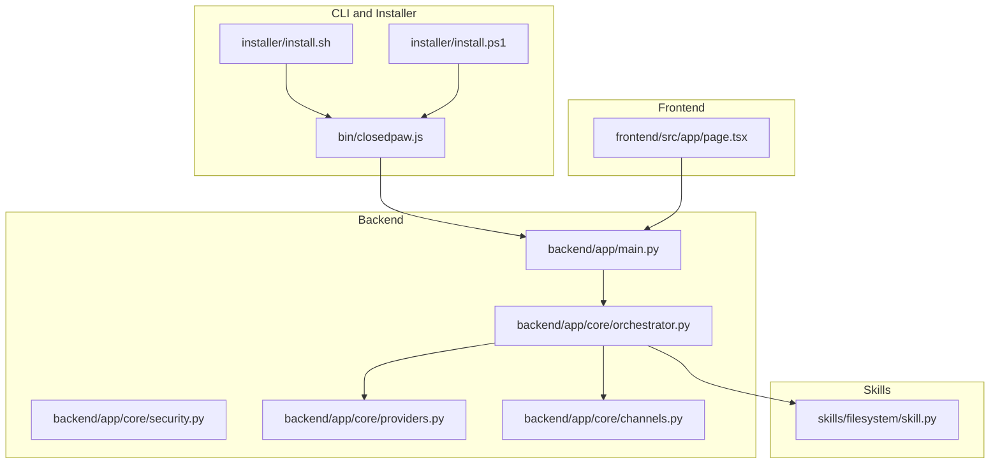
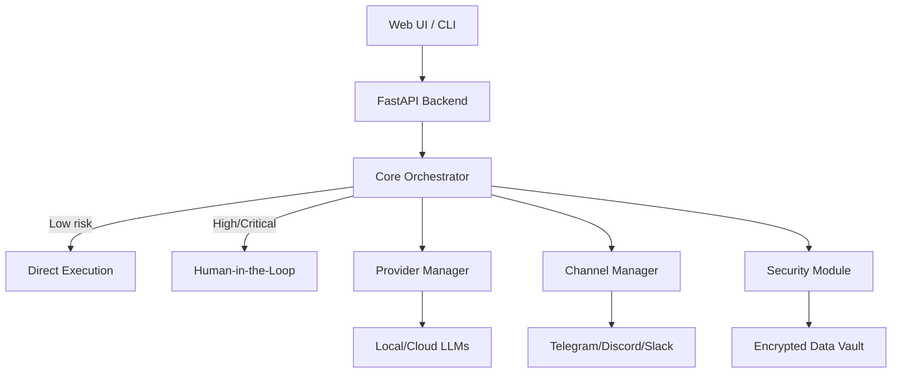
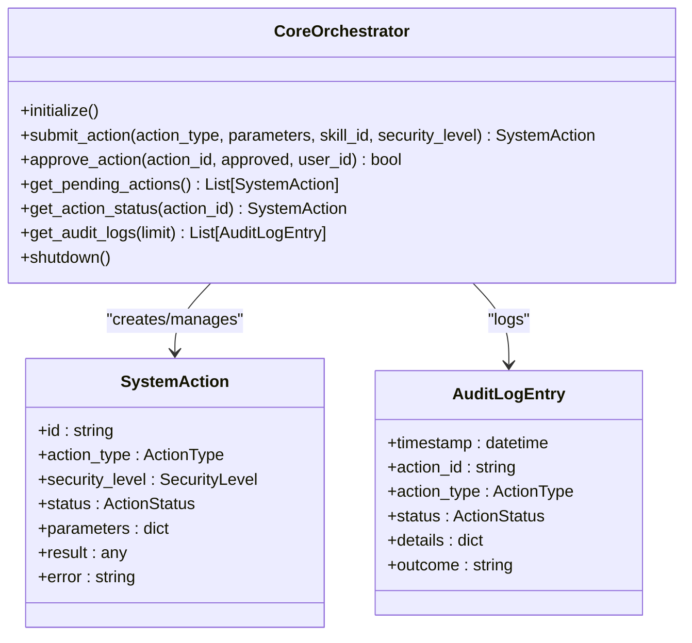
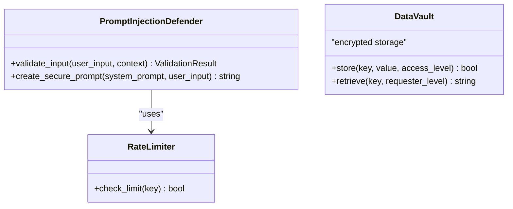
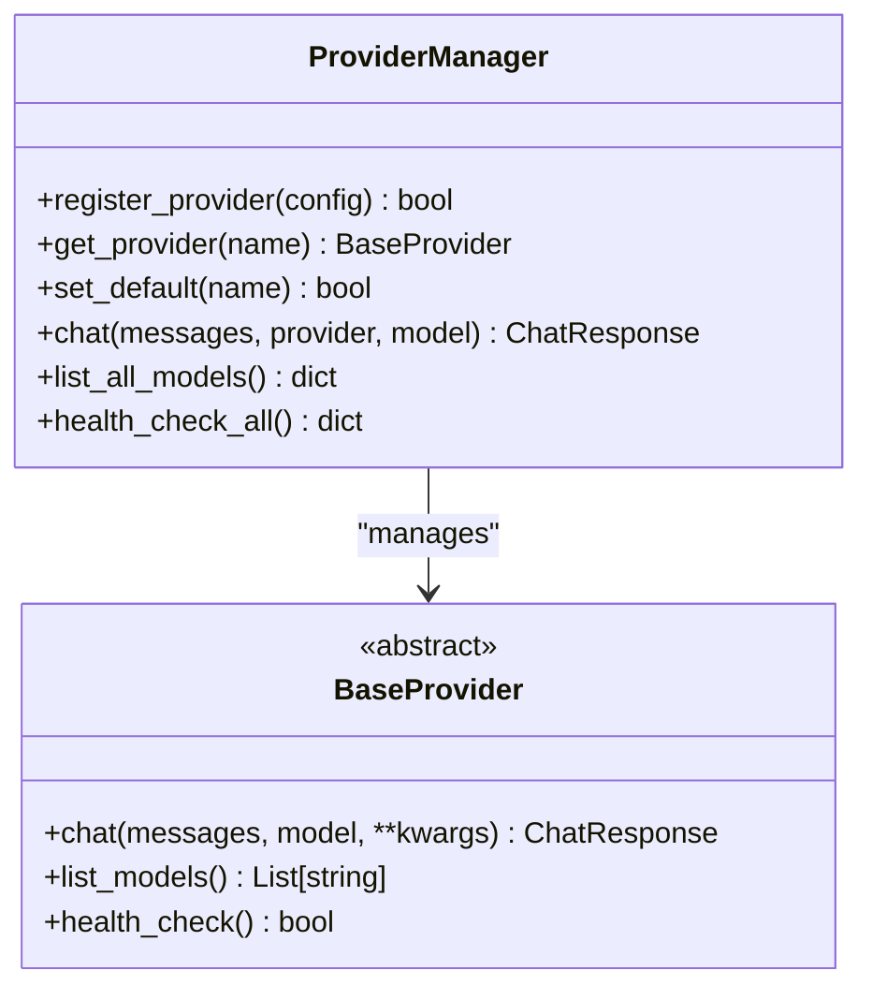
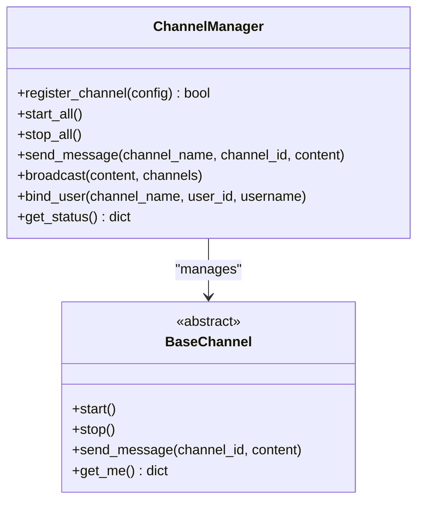
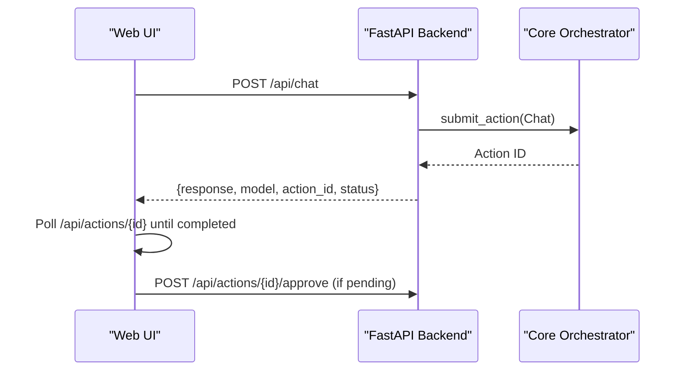
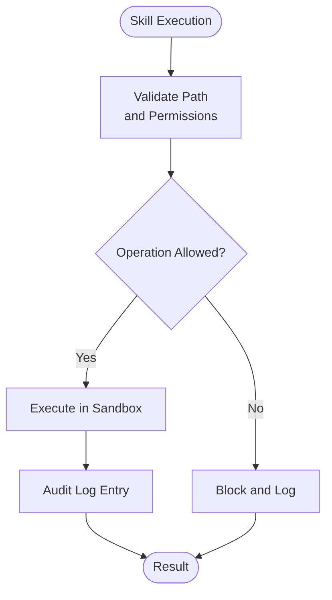
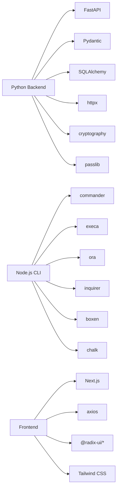

# Development Guide

<cite>
**Referenced Files in This Document**
- [CONTRIBUTING.md](file://CONTRIBUTING.md)
- [README.md](file://README.md)
- [package.json](file://package.json)
- [backend/requirements.txt](file://backend/requirements.txt)
- [frontend/package.json](file://frontend/package.json)
- [backend/app/main.py](file://backend/app/main.py)
- [backend/app/core/orchestrator.py](file://backend/app/core/orchestrator.py)
- [backend/app/core/security.py](file://backend/app/core/security.py)
- [backend/app/core/providers.py](file://backend/app/core/providers.py)
- [backend/app/core/channels.py](file://backend/app/core/channels.py)
- [frontend/src/app/page.tsx](file://frontend/src/app/page.tsx)
- [skills/filesystem/skill.py](file://skills/filesystem/skill.py)
- [installer/install.sh](file://installer/install.sh)
- [installer/install.ps1](file://installer/install.ps1)
- [bin/closedpaw.js](file://bin/closedpaw.js)
</cite>

## Table of Contents
1. [Introduction](#introduction)
2. [Project Structure](#project-structure)
3. [Core Components](#core-components)
4. [Architecture Overview](#architecture-overview)
5. [Detailed Component Analysis](#detailed-component-analysis)
6. [Dependency Analysis](#dependency-analysis)
7. [Development Environment Setup](#development-environment-setup)
8. [Contribution Guidelines](#contribution-guidelines)
9. [Security Review Process](#security-review-process)
10. [Testing Strategy](#testing-strategy)
11. [Build Process and CI](#build-process-and-ci)
12. [Extending the System](#extending-the-system)
13. [Debugging and Development Tools](#debugging-and-development-tools)
14. [Troubleshooting Guide](#troubleshooting-guide)
15. [Conclusion](#conclusion)

## Introduction
This development guide provides comprehensive instructions for setting up a development environment, contributing to ClosedPaw, performing security reviews, and implementing robust testing strategies. It explains the project structure, coding standards, architectural patterns, and practical guidance for extending the system with new skills, providers, and features.

## Project Structure
ClosedPaw is organized into distinct layers:
- CLI and installer: Node.js-based CLI and platform-specific installers
- Backend: Python FastAPI application with core orchestration, security, providers, and channels
- Frontend: Next.js React application for the Web UI
- Skills: Modular skill implementations (e.g., filesystem)
- Documentation and guides: Security-focused documentation and API guides

**Diagram sources**
- [bin/closedpaw.js](file://bin/closedpaw.js#L1-L911)
- [installer/install.sh](file://installer/install.sh#L1-L823)
- [installer/install.ps1](file://installer/install.ps1#L1-L578)
- [backend/app/main.py](file://backend/app/main.py#L1-L567)
- [backend/app/core/orchestrator.py](file://backend/app/core/orchestrator.py#L1-L486)
- [backend/app/core/security.py](file://backend/app/core/security.py#L1-L455)
- [backend/app/core/providers.py](file://backend/app/core/providers.py#L1-L545)
- [backend/app/core/channels.py](file://backend/app/core/channels.py#L1-L524)
- [frontend/src/app/page.tsx](file://frontend/src/app/page.tsx#L1-L603)
- [skills/filesystem/skill.py](file://skills/filesystem/skill.py#L1-L483)

**Section sources**
- [README.md](file://README.md#L1-L133)
- [package.json](file://package.json#L1-L54)
- [backend/requirements.txt](file://backend/requirements.txt#L1-L36)
- [frontend/package.json](file://frontend/package.json#L1-L38)

## Core Components
- Orchestrator: Central component managing actions, security levels, audit logging, and delegation to skills and providers
- Security module: Input validation, prompt injection defense, rate limiting, and encrypted data vault
- Provider manager: Multi-provider LLM gateway supporting local and cloud providers
- Channel manager: Multi-channel gateway for Web UI, Telegram, Discord, Slack, and CLI
- Web UI: Next.js chat interface with model selection, pending action approvals, and settings
- Skills: Sandbox-aware executors (e.g., filesystem) with strict path validation and audit logging

**Section sources**
- [backend/app/core/orchestrator.py](file://backend/app/core/orchestrator.py#L87-L486)
- [backend/app/core/security.py](file://backend/app/core/security.py#L35-L455)
- [backend/app/core/providers.py](file://backend/app/core/providers.py#L418-L545)
- [backend/app/core/channels.py](file://backend/app/core/channels.py#L405-L524)
- [frontend/src/app/page.tsx](file://frontend/src/app/page.tsx#L55-L603)
- [skills/filesystem/skill.py](file://skills/filesystem/skill.py#L35-L483)

## Architecture Overview
ClosedPaw follows a zero-trust architecture with:
- Local-first execution and optional cloud providers
- Hardened sandboxing (gVisor/Kata) enforced during installation
- Human-in-the-loop approvals for high-risk actions
- Strict input validation and audit logging
- Multi-provider and multi-channel support

**Diagram sources**
- [backend/app/main.py](file://backend/app/main.py#L72-L567)
- [backend/app/core/orchestrator.py](file://backend/app/core/orchestrator.py#L87-L486)
- [backend/app/core/security.py](file://backend/app/core/security.py#L325-L455)
- [backend/app/core/providers.py](file://backend/app/core/providers.py#L418-L545)
- [backend/app/core/channels.py](file://backend/app/core/channels.py#L405-L524)
- [frontend/src/app/page.tsx](file://frontend/src/app/page.tsx#L55-L603)

## Detailed Component Analysis

### Orchestrator
The orchestrator coordinates all system operations with a zero-trust security model:
- Action lifecycle: submission, approval, execution, auditing
- Security levels: low, medium, high, critical
- Audit logging with structured entries
- Delegation to skills and providers

**Diagram sources**
- [backend/app/core/orchestrator.py](file://backend/app/core/orchestrator.py#L87-L486)

**Section sources**
- [backend/app/core/orchestrator.py](file://backend/app/core/orchestrator.py#L87-L486)

### Security Module
Security focuses on prompt injection defense, rate limiting, and encrypted storage:
- Pattern-based input validation with threat scoring
- Separation of system and user prompts
- Encrypted data vault with access control
- Rate limiting to mitigate abuse

**Diagram sources**
- [backend/app/core/security.py](file://backend/app/core/security.py#L35-L455)

**Section sources**
- [backend/app/core/security.py](file://backend/app/core/security.py#L35-L455)

### Provider Manager
Multi-provider LLM gateway supports local and cloud providers:
- Local Ollama gateway
- Cloud providers: OpenAI, Anthropic, Google, Mistral
- Health checks, model listing, and unified chat interface

**Diagram sources**
- [backend/app/core/providers.py](file://backend/app/core/providers.py#L418-L545)

**Section sources**
- [backend/app/core/providers.py](file://backend/app/core/providers.py#L1-L545)

### Channel Manager
Multi-channel gateway supports Web UI, Telegram, Discord, Slack, and CLI:
- User allowlisting and pairing
- Message routing and broadcasting
- Rate limiting and security controls

**Diagram sources**
- [backend/app/core/channels.py](file://backend/app/core/channels.py#L405-L524)

**Section sources**
- [backend/app/core/channels.py](file://backend/app/core/channels.py#L1-L524)

### Web UI
The Next.js frontend provides:
- Real-time chat with model selection
- Pending action approvals
- System status monitoring
- Settings for providers, network, and storage

**Diagram sources**
- [frontend/src/app/page.tsx](file://frontend/src/app/page.tsx#L128-L188)
- [backend/app/main.py](file://backend/app/main.py#L131-L182)
- [backend/app/core/orchestrator.py](file://backend/app/core/orchestrator.py#L169-L224)

**Section sources**
- [frontend/src/app/page.tsx](file://frontend/src/app/page.tsx#L55-L603)
- [backend/app/main.py](file://backend/app/main.py#L131-L182)

### Skills
Skills operate in sandboxed environments with strict validation:
- Filesystem skill with path traversal prevention and audit logging
- Extensible design for additional skills

**Diagram sources**
- [skills/filesystem/skill.py](file://skills/filesystem/skill.py#L77-L132)

**Section sources**
- [skills/filesystem/skill.py](file://skills/filesystem/skill.py#L35-L483)

## Dependency Analysis
- Backend dependencies include FastAPI, Pydantic, SQLAlchemy, httpx, cryptography, passlib, pytest, and python-dotenv
- Frontend dependencies include Next.js, React, Radix UI, Tailwind CSS, and axios
- CLI depends on Node.js packages for CLI operations, progress indicators, and user prompts

**Diagram sources**
- [backend/requirements.txt](file://backend/requirements.txt#L1-L36)
- [package.json](file://package.json#L45-L52)
- [frontend/package.json](file://frontend/package.json#L12-L37)

**Section sources**
- [backend/requirements.txt](file://backend/requirements.txt#L1-L36)
- [package.json](file://package.json#L1-L54)
- [frontend/package.json](file://frontend/package.json#L1-L38)

## Development Environment Setup
Prerequisites:
- Python 3.11+
- Node.js 20+
- Ollama
- gVisor or Kata Containers (for sandboxing)

Backend setup:
- Create and activate a virtual environment
- Install Python dependencies from requirements.txt

Frontend setup:
- Install Node.js dependencies
- Run development server bound to localhost

Testing:
- Backend: pytest
- Frontend: npm test

Security hardening:
- Local-only binding (127.0.0.1)
- Encrypted storage for secrets
- Human-in-the-loop for high-risk actions

**Section sources**
- [CONTRIBUTING.md](file://CONTRIBUTING.md#L64-L97)
- [README.md](file://README.md#L106-L111)
- [backend/requirements.txt](file://backend/requirements.txt#L1-L36)
- [frontend/package.json](file://frontend/package.json#L6-L11)
- [backend/app/main.py](file://backend/app/main.py#L557-L567)

## Contribution Guidelines
Workflow:
- Fork, branch, develop, test, and submit pull requests
- Follow conventional commits
- Include security impact assessment and testing evidence

Standards:
- Python: PEP 8, type hints, black formatting, pylint/ruff linting
- TypeScript/JavaScript: functional components, TypeScript, ESLint
- Security-specific rules: input validation, secure defaults, audit logging

Review checklist:
- No hardcoded secrets
- Input validation and sanitization
- Security headers and error handling
- Rate limiting and audit logging

**Section sources**
- [CONTRIBUTING.md](file://CONTRIBUTING.md#L31-L189)

## Security Review Process
Mandatory security practices:
- Never disable security features
- Validate all inputs
- Separate system and user prompts
- Use hardened sandboxes (gVisor/Kata)
- Encrypt sensitive data at rest
- Log security events
- Bind services to localhost only

Review requirements:
- Security impact assessment with each PR
- Input validation coverage
- Audit logging for security-relevant operations
- Rate limiting for critical actions

**Section sources**
- [CONTRIBUTING.md](file://CONTRIBUTING.md#L100-L122)

## Testing Strategy
Unit tests:
- Backend: pytest with async fixtures and HTTP mocks
- Frontend: React Testing Library for components and hooks

Integration tests:
- API endpoints with FastAPI TestClient
- Provider manager with mock providers
- Channel manager with mocked external APIs

Security testing:
- Prompt injection defense validation
- Rate limiting enforcement
- Encrypted data vault access control

Continuous integration:
- Automated test runs on pull requests
- Security scanning and linting checks

**Section sources**
- [CONTRIBUTING.md](file://CONTRIBUTING.md#L87-L97)
- [backend/requirements.txt](file://backend/requirements.txt#L30-L33)

## Build Process and CI
Build pipeline:
- CLI packaging and distribution
- Frontend build with Next.js
- Backend dependency installation

CI/CD:
- Automated testing on pull requests
- Security scanning and linting
- Release automation for npm and platform installers

Installer automation:
- One-command installers for Linux/macOS and Windows
- Automatic sandbox configuration (gVisor/Kata)
- Ollama security hardening (localhost-only)

**Section sources**
- [installer/install.sh](file://installer/install.sh#L610-L681)
- [installer/install.ps1](file://installer/install.ps1#L508-L578)
- [bin/closedpaw.js](file://bin/closedpaw.js#L680-L796)

## Extending the System
New skill development:
- Implement a skill executor with sandbox restrictions
- Define operations, security level, and audit logging
- Register skill metadata for discovery

Provider integration:
- Implement BaseProvider subclass
- Add provider configuration and health checks
- Integrate with ProviderManager

Feature enhancement:
- Extend FastAPI routes with proper validation
- Add human-in-the-loop approvals for risky actions
- Implement audit logging for new features

**Section sources**
- [skills/filesystem/skill.py](file://skills/filesystem/skill.py#L468-L483)
- [backend/app/core/providers.py](file://backend/app/core/providers.py#L68-L100)
- [backend/app/main.py](file://backend/app/main.py#L381-L556)

## Debugging and Development Tools
Recommended tools:
- Python: IDE with type checking, pytest debugging, coverage
- JavaScript/TypeScript: VS Code with ESLint, Prettier, debugger
- Network: curl and HTTP clients for API testing
- Security: input fuzzing and prompt injection test suites

Development tips:
- Use localhost-only bindings for all services
- Enable verbose logging for security events
- Test with real sandbox configurations
- Validate rate limiting and input sanitization

**Section sources**
- [CONTRIBUTING.md](file://CONTRIBUTING.md#L190-L207)
- [backend/app/main.py](file://backend/app/main.py#L80-L87)

## Troubleshooting Guide
Common issues:
- Sandbox not available on Windows: install WSL2 or Docker Desktop
- Ollama not connecting: verify localhost binding and firewall
- Frontend not starting: check Node.js version and dependencies
- API not responding: confirm virtual environment activation and port binding

Diagnostic commands:
- CLI doctor for environment checks
- API status endpoint for system health
- Provider health checks for cloud integrations

**Section sources**
- [installer/install.ps1](file://installer/install.ps1#L215-L278)
- [installer/install.sh](file://installer/install.sh#L407-L453)
- [bin/closedpaw.js](file://bin/closedpaw.js#L357-L479)
- [backend/app/main.py](file://backend/app/main.py#L101-L128)

## Conclusion
This guide outlines the development workflow, security posture, testing practices, and extension mechanisms for ClosedPaw. By following the outlined processes and leveraging the provided tools and patterns, contributors can develop secure, maintainable features that align with the zero-trust architecture and privacy-first design principles.