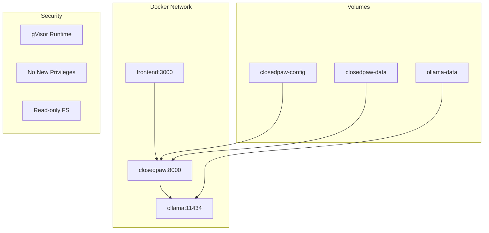
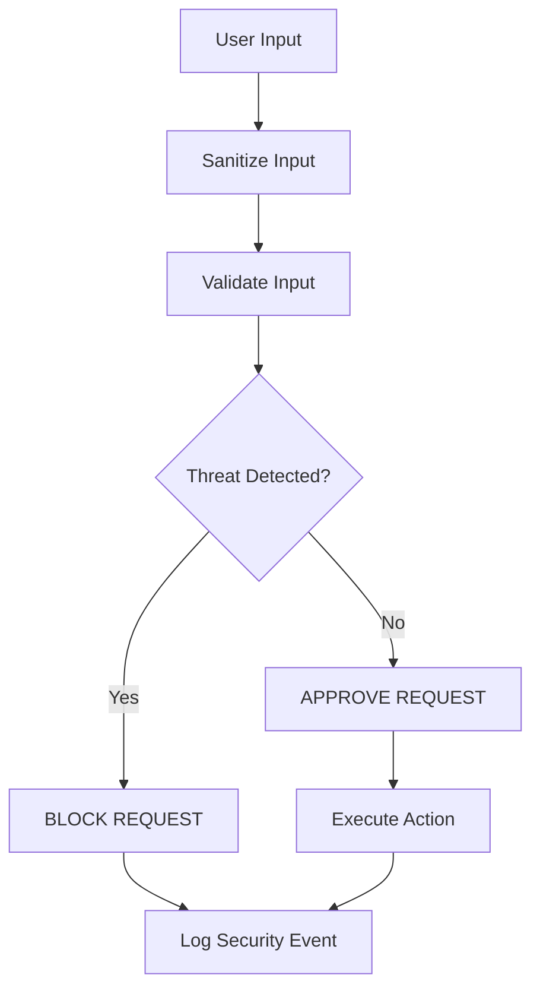

# Development Environment Setup

<cite>
**Referenced Files in This Document**
- [README.md](file://README.md)
- [CONTRIBUTING.md](file://CONTRIBUTING.md)
- [package.json](file://package.json)
- [backend/requirements.txt](file://backend/requirements.txt)
- [frontend/package.json](file://frontend/package.json)
- [Dockerfile](file://Dockerfile)
- [docker-compose.yml](file://docker-compose.yml)
- [installer/install.sh](file://installer/install.sh)
- [installer/install.ps1](file://installer/install.ps1)
- [bin/postinstall.js](file://bin/postinstall.js)
- [docker/entrypoint.sh](file://docker/entrypoint.sh)
- [backend/app/main.py](file://backend/app/main.py)
- [frontend/next.config.js](file://frontend/next.config.js)
- [backend/app/core/orchestrator.py](file://backend/app/core/orchestrator.py)
- [backend/app/core/security.py](file://backend/app/core/security.py)
- [backend/app/core/providers.py](file://backend/app/core/providers.py)
- [backend/app/core/channels.py](file://backend/app/core/channels.py)
</cite>

## Table of Contents
1. [Introduction](#introduction)
2. [Prerequisites and Requirements](#prerequisites-and-requirements)
3. [Development Environment Options](#development-environment-options)
4. [Manual Installation Process](#manual-installation-process)
5. [Automated Installation Scripts](#automated-installation-scripts)
6. [Docker-Based Development](#docker-based-development)
7. [Environment Configuration](#environment-configuration)
8. [Security Considerations](#security-considerations)
9. [Testing and Verification](#testing-and-verification)
10. [Troubleshooting Common Issues](#troubleshooting-common-issues)
11. [Best Practices](#best-practices)

## Introduction

ClosedPaw is a zero-trust AI assistant designed for privacy-focused, locally-run AI applications with hardened sandboxing. This document provides comprehensive guidance for setting up a development environment across different platforms, ensuring proper security configurations and optimal development experience.

The project follows a security-first architecture with gVisor/Kata Containers for true isolation, implementing defense-in-depth security measures including prompt injection protection, encrypted storage, and human-in-the-loop approval systems.

## Prerequisites and Requirements

### Core System Requirements

The development environment requires specific software versions and security configurations:

**Minimum Software Versions:**
- Python 3.11+ for backend development
- Node.js 20+ for frontend development  
- Git for version control
- Docker for containerized development (optional but recommended)

**Security Infrastructure:**
- gVisor or Kata Containers for sandboxing
- Ollama for local LLM execution
- Hardened security configurations enforced

**Platform Recommendations:**
- Linux or macOS for optimal security experience
- Windows with WSL2 or Docker Desktop for sandboxing support
- Full gVisor/Kata sandboxing not available on Windows Home

**Section sources**
- [README.md](file://README.md#L165-L171)
- [CONTRIBUTING.md](file://CONTRIBUTING.md#L64-L70)

## Development Environment Options

### Option 1: Cross-Platform npm Installation

The simplest approach uses npm to install and manage the complete development environment:

```bash
# Global installation
npm install -g closedpaw

# One-command installation scripts
curl -sSL https://raw.githubusercontent.com/logansin/closedpaw/main/installer/install.sh | bash
iwr -useb https://raw.githubusercontent.com/logansin/closedpaw/main/installer/install.ps1 | iex
```

**Advantages:**
- Automatic dependency management
- Cross-platform compatibility
- Integrated security configuration
- One-command setup process

### Option 2: Manual Installation

For development and customization, manual installation provides granular control:

```bash
# Clone repository
git clone https://github.com/logansin/closedpaw.git
cd closedpaw

# Backend setup
cd backend
python -m venv venv
source venv/bin/activate  # Windows: venv\Scripts\activate
pip install -r requirements.txt

# Frontend setup  
cd ../frontend
npm install

# Start development server
npm run dev
```

**Section sources**
- [README.md](file://README.md#L26-L63)
- [CONTRIBUTING.md](file://CONTRIBUTING.md#L71-L86)

### Option 3: Docker-Based Development

Containerized development ensures consistent environments across platforms:

```bash
# Build and run with Docker Compose
docker-compose up --build

# Individual service management
docker-compose up backend
docker-compose up frontend
```

**Section sources**
- [Dockerfile](file://Dockerfile#L1-L95)
- [docker-compose.yml](file://docker-compose.yml#L1-L77)

## Manual Installation Process

### Backend Environment Setup

1. **Create Virtual Environment:**
   ```bash
   cd backend
   python -m venv venv
   source venv/bin/activate  # Windows: venv\Scripts\activate
   ```

2. **Install Dependencies:**
   ```bash
   pip install -r requirements.txt
   ```

3. **Configure Environment Variables:**
   - OLLAMA_HOST=127.0.0.1:11434 (local-only binding)
   - PYTHONUNBUFFERED=1 (unbuffered output)
   - FRONTEND_PORT=3000 (web UI port)
   - BACKEND_PORT=8000 (API port)

**Section sources**
- [backend/requirements.txt](file://backend/requirements.txt#L1-L34)
- [Dockerfile](file://Dockerfile#L71-L77)

### Frontend Environment Setup

1. **Install Dependencies:**
   ```bash
   cd frontend
   npm install
   ```

2. **Configure Development Settings:**
   - Next.js development server on localhost only
   - Security headers for Content Security Policy
   - TypeScript compilation support

**Section sources**
- [frontend/package.json](file://frontend/package.json#L1-L38)
- [frontend/next.config.js](file://frontend/next.config.js#L1-L42)

## Automated Installation Scripts

### Linux/macOS Installation Script

The automated installer provides comprehensive setup with security configurations:

```bash
# One-command installation
curl -sSL https://raw.githubusercontent.com/logansin/closedpaw/main/installer/install.sh | bash

# Interactive setup with model selection
./installer/install.sh
```

**Key Features:**
- Automatic Python 3.11+ detection and installation
- gVisor sandboxing configuration
- Ollama security hardening (127.0.0.1 binding)
- Model recommendation and download
- Firewall configuration (UFW)
- Encryption key generation

**Section sources**
- [installer/install.sh](file://installer/install.sh#L1-L823)

### Windows Installation Script

PowerShell-based installer with platform-specific optimizations:

```powershell
# One-command installation
iwr -useb https://raw.githubusercontent.com/logansin/closedpaw/main/installer/install.ps1 | iex

# Advanced options
.\installer\install.ps1 -InstallMethod "git" -NoOnboard
```

**Windows-Specific Features:**
- WSL2 detection and configuration
- Docker Desktop integration
- Windows Defender firewall integration
- PowerShell module detection
- Automatic PATH configuration

**Section sources**
- [installer/install.ps1](file://installer/install.ps1#L1-L578)

### Post-Installation Hook

npm automatically triggers post-installation setup:

```javascript
// Automatically runs after npm install -g closedpaw
const installer = spawn(process.execPath, [path.join(__dirname, 'closedpaw.js'), 'install'], {
  stdio: 'inherit',
  env: { ...process.env, CLOSEDPAW_AUTO_INSTALL: '1' }
});
```

**Section sources**
- [bin/postinstall.js](file://bin/postinstall.js#L1-L19)

## Docker-Based Development

### Container Architecture

The Docker setup provides production-like development environment:



**Diagram sources**
- [docker-compose.yml](file://docker-compose.yml#L7-L26)
- [Dockerfile](file://Dockerfile#L38-L86)

### Docker Configuration Details

**Production-Ready Features:**
- Non-root user execution (closedpaw:closedpaw)
- Security hardening (no-new-privileges, read-only filesystem)
- Health checks for service monitoring
- Volume mounting for persistent data
- GPU passthrough support for Ollama

**Environment Variables:**
- OLLAMA_HOST=host.docker.internal:11434
- FRONTEND_PORT=3000
- BACKEND_PORT=8000
- PYTHONUNBUFFERED=1

**Section sources**
- [Dockerfile](file://Dockerfile#L40-L86)
- [docker-compose.yml](file://docker-compose.yml#L16-L26)

## Environment Configuration

### Security Configuration

The development environment enforces strict security policies:

**Backend Security:**
- Local-only binding (127.0.0.1 only)
- CORS restrictions to localhost only
- Input validation and sanitization
- Audit logging for all actions
- Encrypted storage for API keys

**Frontend Security:**
- Content Security Policy (CSP) directives
- X-Frame-Options: DENY
- X-Content-Type-Options: nosniff
- Referrer-Policy: strict-origin-when-cross-origin
- Connect-src restricted to localhost API

**Section sources**
- [backend/app/main.py](file://backend/app/main.py#L80-L87)
- [frontend/next.config.js](file://frontend/next.config.js#L22-L24)

### Development Configuration

**Port Configuration:**
- Backend API: localhost:8000
- Frontend Web UI: localhost:3000
- Ollama: localhost:11434

**Logging Configuration:**
- Audit logs to /tmp/closedpaw-audit.log
- Structured logging with timestamps
- Security event monitoring

**Section sources**
- [backend/app/main.py](file://backend/app/main.py#L558-L567)
- [backend/app/core/orchestrator.py](file://backend/app/core/orchestrator.py#L18-L27)

## Security Considerations

### Zero-Trust Architecture Implementation

The development environment maintains security-first principles:

**Input Validation Pipeline:**


**Diagram sources**
- [backend/app/core/security.py](file://backend/app/core/security.py#L120-L184)

**Security Features:**
- Prompt injection detection using regex patterns
- Rate limiting for abuse prevention
- Path traversal protection
- Dangerous pattern detection
- Encrypted data storage
- Audit trail for all actions

**Section sources**
- [backend/app/core/security.py](file://backend/app/core/security.py#L36-L256)

### Sandbox Configuration

**gVisor/Kata Integration:**
- Automatic detection and configuration
- Platform-specific runtime selection
- Docker integration for Linux/macOS
- WSL2 support for Windows

**Section sources**
- [installer/install.sh](file://installer/install.sh#L191-L288)
- [installer/install.ps1](file://installer/install.ps1#L280-L319)

## Testing and Verification

### Test Suite Setup

**Backend Testing:**
```bash
cd backend
pytest
```

**Frontend Testing:**
```bash
cd frontend
npm test
```

**Integration Testing:**
- System status endpoint verification
- Model availability checking
- Action approval workflow testing
- Security feature validation

**Section sources**
- [CONTRIBUTING.md](file://CONTRIBUTING.md#L87-L97)

### Development Workflow

**Continuous Integration:**
- Automated testing on pull requests
- Security vulnerability scanning
- Code quality checks
- Performance benchmarking

**Local Development:**
- Hot reloading for rapid iteration
- Debugging tools integration
- API documentation serving
- Mock service support

## Troubleshooting Common Issues

### Installation Problems

**Python Version Issues:**
- Ensure Python 3.11+ is installed
- Check virtual environment activation
- Verify pip version compatibility

**Dependency Conflicts:**
- Clear pip cache: `pip cache purge`
- Reinstall requirements: `pip install -r requirements.txt`
- Check for conflicting packages

**Section sources**
- [installer/install.sh](file://installer/install.sh#L128-L162)
- [installer/install.ps1](file://installer/install.ps1#L62-L120)

### Development Environment Issues

**Port Conflicts:**
- Change default ports in configuration
- Check for existing service usage
- Use different port ranges for development

**Sandbox Configuration:**
- Verify gVisor installation
- Check Docker runtime configuration
- Test sandbox functionality

**Section sources**
- [docker-compose.yml](file://docker-compose.yml#L13-L15)
- [backend/app/core/orchestrator.py](file://backend/app/core/orchestrator.py#L139-L153)

### Security-Related Issues

**CORS Errors:**
- Verify frontend origin in CORS configuration
- Check localhost binding settings
- Validate proxy configurations

**Audit Log Issues:**
- Check file permissions for /tmp directory
- Verify log rotation configuration
- Monitor log file size limits

**Section sources**
- [backend/app/main.py](file://backend/app/main.py#L80-L87)
- [backend/app/core/orchestrator.py](file://backend/app/core/orchestrator.py#L18-L27)

## Best Practices

### Development Guidelines

**Code Quality:**
- Follow PEP 8 style guidelines
- Use type hints for Python code
- Implement comprehensive error handling
- Write unit tests for new functionality

**Security Practices:**
- Never disable security features
- Validate all user inputs
- Use encrypted storage for sensitive data
- Implement proper audit logging
- Follow principle of least privilege

**Performance Optimization:**
- Monitor memory usage during development
- Optimize database queries
- Implement caching strategies
- Profile slow operations

**Section sources**
- [CONTRIBUTING.md](file://CONTRIBUTING.md#L190-L237)

### Environment Management

**Version Control:**
- Keep requirements.txt updated
- Document environment changes
- Use .env files for secrets (locally only)
- Maintain backup configurations

**Deployment Preparation:**
- Test production builds locally
- Verify security configurations
- Check resource requirements
- Validate container health checks

**Section sources**
- [backend/requirements.txt](file://backend/requirements.txt#L1-L34)
- [Dockerfile](file://Dockerfile#L78-L80)