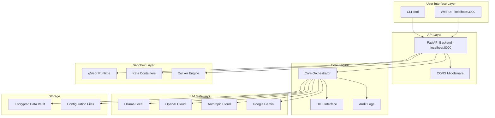

# Getting Started

<cite>
**Referenced Files in This Document**
- [README.md](file://README.md)
- [package.json](file://package.json)
- [installer/install.sh](file://installer/install.sh)
- [installer/install.ps1](file://installer/install.ps1)
- [bin/closedpaw.js](file://bin/closedpaw.js)
- [backend/requirements.txt](file://backend/requirements.txt)
- [frontend/package.json](file://frontend/package.json)
- [backend/app/main.py](file://backend/app/main.py)
- [backend/app/core/orchestrator.py](file://backend/app/core/orchestrator.py)
- [backend/app/core/providers.py](file://backend/app/core/providers.py)
- [CONTRIBUTING.md](file://CONTRIBUTING.md)
</cite>

## Table of Contents
1. [Introduction](#introduction)
2. [Prerequisites](#prerequisites)
3. [Installation Methods](#installation-methods)
4. [Manual Installation](#manual-installation)
5. [Initial Configuration](#initial-configuration)
6. [First Run Tutorial](#first-run-tutorial)
7. [CLI Tool Reference](#cli-tool-reference)
8. [Basic Usage Examples](#basic-usage-examples)
9. [Verification and Testing](#verification-and-testing)
10. [Troubleshooting Guide](#troubleshooting-guide)
11. [Architecture Overview](#architecture-overview)
12. [Conclusion](#conclusion)

## Introduction
ClosedPaw is a zero-trust AI assistant that runs entirely on your local machine with hardened sandboxing. It provides a secure, privacy-focused alternative to cloud-based AI assistants by keeping all data on-device and using gVisor/Kata Containers for true isolation.

Key benefits:
- Zero-trust architecture with implicit trust verification
- Hardened sandboxing (gVisor/Kata Containers)
- Local-only operation with Ollama on 127.0.0.1
- Human-in-the-loop (HITL) approval for critical actions
- Encrypted storage for API keys
- Audit logging for forensic analysis

## Prerequisites
Before installing ClosedPaw, ensure your system meets these requirements:

### Core Requirements
- **Python 3.11+** - Required for backend services
- **Node.js 20+** - Required for frontend and CLI tool
- **Ollama** - Local LLM runtime (recommended for local models)
- **gVisor or Kata Containers** - For sandboxing (Linux/macOS recommended)

### Platform-Specific Notes
- **Linux/macOS**: Full gVisor/Kata sandboxing available with native container security
- **Windows**: Limited to Docker Desktop or WSL2; full sandboxing unavailable on Windows Home
- **Hardware**: Modern CPU with sufficient RAM for model inference

**Section sources**
- [README.md](file://README.md#L106-L112)
- [CONTRIBUTING.md](file://CONTRIBUTING.md#L64-L70)

## Installation Methods

### Recommended: npm Installation (Cross-platform)
The simplest way to install ClosedPaw is via npm:

```bash
npm install -g closedpaw
```

This installs the CLI tool globally and sets up the system for immediate use.

### One-Command Installation Scripts
For quick setup, use the platform-specific installation scripts:

**Linux/macOS (Recommended):**
```bash
curl -sSL https://raw.githubusercontent.com/logansin/closedpaw/main/installer/install.sh | bash
```

**Windows (PowerShell):**
```powershell
iwr -useb https://raw.githubusercontent.com/logansin/closedpaw/main/installer/install.ps1 | iex
```

These scripts handle dependency detection, sandbox configuration, and automatic setup.

### Manual Installation
For advanced users or environments with restricted networks:

```bash
# Clone repository
git clone https://github.com/logansin/closedpaw.git
cd closedpaw

# Install backend
cd backend
python -m venv venv
source venv/bin/activate  # Windows: venv\Scripts\activate
pip install -r requirements.txt

# Install frontend
cd ../frontend
npm install

# Start services
npm run dev  # Starts both backend and frontend
```

**Section sources**
- [README.md](file://README.md#L26-L64)
- [installer/install.sh](file://installer/install.sh#L1-L817)
- [installer/install.ps1](file://installer/install.ps1#L1-L571)

## Manual Installation

### Step 1: Prepare Environment
1. Ensure Python 3.11+ is installed
2. Ensure Node.js 20+ is installed
3. Install Git for repository cloning

### Step 2: Backend Setup
```bash
cd backend
python -m venv venv
source venv/bin/activate  # On Windows use: venv\Scripts\activate
pip install -r requirements.txt
```

### Step 3: Frontend Setup
```bash
cd ../frontend
npm install
```

### Step 4: Start Services
```bash
npm run dev  # Starts both backend (localhost:8000) and frontend (localhost:3000)
```

**Section sources**
- [README.md](file://README.md#L44-L64)
- [backend/requirements.txt](file://backend/requirements.txt#L1-L36)
- [frontend/package.json](file://frontend/package.json#L1-L38)

## Initial Configuration

### Configure LLM Providers
ClosedPaw supports multiple LLM providers. Configure them using the CLI:

```bash
# Configure providers
closedpaw configure providers

# Configure channels (Telegram, Discord, etc.)
closedpaw configure channels
```

### Sandbox Configuration
The installer automatically configures sandboxing:
- **Linux**: gVisor runtime (`runsc`) installation
- **macOS**: Docker with gVisor runtime
- **Windows**: WSL2 or Docker Desktop integration

### Encryption Setup
ClosedPaw generates an encryption key for API keys:
- Key stored in `~/.config/closedpaw/.encryption_key`
- Permissions set to 600 (readable/writable by owner only)

**Section sources**
- [bin/closedpaw.js](file://bin/closedpaw.js#L537-L677)
- [installer/install.sh](file://installer/install.sh#L191-L270)

## First Run Tutorial

### Step 1: Install ClosedPaw
```bash
npm install -g closedpaw
```

### Step 2: Install Local Models (Optional)
```bash
# Download recommended model
ollama pull llama3.2:3b

# Or use CLI to download
closedpaw install
```

### Step 3: Start the System
```bash
# Start ClosedPaw
closedpaw start

# Or use traditional method
cd ~/.closedpaw && npm run dev
```

### Step 4: Access the Web Interface
Open your browser to [http://localhost:3000](http://localhost:3000)

### Step 5: Basic Interaction
1. Open the web interface
2. Type a message in the chat box
3. Select model preference (local Ollama or cloud provider)
4. Review any HITL approvals for critical actions

**Section sources**
- [bin/closedpaw.js](file://bin/closedpaw.js#L224-L272)
- [backend/app/main.py](file://backend/app/main.py#L90-L128)

## CLI Tool Reference

### Available Commands
```bash
# Install ClosedPaw
closedpaw install

# Start the system
closedpaw start

# Stop the system
closedpaw stop

# Check system status
closedpaw status

# Run diagnostics
closedpaw doctor

# Update to latest version
closedpaw update

# Configure providers
closedpaw configure providers

# Configure channels
closedpaw configure channels

# Migrate from other systems
closedpaw migrate openclaw
```

### Installation Options
```bash
# Skip model download during install
closedpaw install --skip-model
```

### Provider Configuration
The CLI provides interactive configuration for:
- Ollama (local LLM)
- OpenAI
- Anthropic (Claude)
- Google (Gemini)
- Mistral
- Custom providers

### Channel Configuration
Configure communication channels:
- Web UI (built-in)
- Telegram
- Discord
- Slack

**Section sources**
- [bin/closedpaw.js](file://bin/closedpaw.js#L679-L796)

## Basic Usage Examples

### Chat with Local Models
```bash
# Start ClosedPaw
closedpaw start

# Chat in terminal
curl -X POST http://localhost:8000/api/chat \
  -H "Content-Type: application/json" \
  -d '{"message": "Hello!", "model": "llama3.2:3b"}'
```

### Switch Models
```bash
# Switch to a different model
curl -X POST http://localhost:8000/api/models/switch \
  -H "Content-Type: application/json" \
  -d '{"model": "mistral:7b"}'
```

### Check System Status
```bash
# View system status
curl http://localhost:8000/api/status
```

### List Available Models
```bash
# Get available models
curl http://localhost:8000/api/models
```

### Manage Actions
```bash
# Submit an action
curl -X POST http://localhost:8000/api/actions \
  -H "Content-Type: application/json" \
  -d '{"action_type": "chat", "parameters": {"message": "Test"}}'

# Get pending actions
curl http://localhost:8000/api/actions/pending
```

**Section sources**
- [backend/app/main.py](file://backend/app/main.py#L131-L320)

## Verification and Testing

### Health Checks
```bash
# Check API status
curl http://localhost:8000/

# Check system status
curl http://localhost:8000/api/status

# List models
curl http://localhost:8000/api/models
```

### Diagnostic Commands
```bash
# Run system diagnostics
closedpaw doctor

# Check installation status
closedpaw status
```

### Expected Responses
- Root endpoint: `{"status": "running", "security_model": "zero_trust"}`
- Status endpoint: Includes `ollama_connected`, `available_models`, and `pending_actions`
- Models endpoint: Lists available Ollama models or defaults

### Security Verification
- API binds to 127.0.0.1 only
- Web UI accessible only from localhost
- Ollama configured to listen on 127.0.0.1:11434
- Encryption key generated for API keys

**Section sources**
- [backend/app/main.py](file://backend/app/main.py#L90-L128)
- [bin/closedpaw.js](file://bin/closedpaw.js#L357-L479)

## Troubleshooting Guide

### Common Installation Issues

#### Python Version Problems
**Issue**: Python 3.11+ not found
**Solution**: 
```bash
# Check Python version
python --version

# Install Python 3.11+ from python.org
# Then reinstall ClosedPaw
npm install -g closedpaw
```

#### Node.js Version Problems
**Issue**: Node.js 18+ not found
**Solution**:
```bash
# Check Node.js version
node --version

# Install Node.js 20+ from nodejs.org
# Then reinstall ClosedPaw
npm install -g closedpaw
```

#### Ollama Not Found
**Issue**: Ollama not installed or not accessible
**Solution**:
```bash
# Install Ollama
curl -fsSL https://ollama.com/install.sh | sh

# Verify installation
ollama --version

# Configure security (127.0.0.1 only)
export OLLAMA_HOST=127.0.0.1:11434
```

#### Sandbox Configuration Issues
**Linux**: gVisor runtime not found
```bash
# Install gVisor
sudo apt-get install runsc  # Debian/Ubuntu
# or
sudo yum install runsc      # RHEL/CentOS/Fedora
```

**macOS**: Docker with gVisor runtime
```bash
# Install Docker Desktop
# Configure Docker to use gVisor runtime
```

**Windows**: Limited sandboxing
```bash
# Install WSL2 for Linux container support
wsl --install

# Or install Docker Desktop for basic container isolation
```

#### Port Conflicts
**Issue**: Ports 3000 or 8000 already in use
**Solution**:
```bash
# Find processes using ports
lsof -i :3000
lsof -i :8000

# Kill conflicting processes
kill -9 <PID>

# Or change ports in configuration
```

#### Permission Issues
**Issue**: Cannot write to installation directory
**Solution**:
```bash
# Check permissions
ls -la ~/.closedpaw

# Fix permissions
chmod -R 755 ~/.closedpaw
chown -R $USER:$USER ~/.closedpaw
```

### Advanced Troubleshooting

#### Firewall Configuration
```bash
# Allow only localhost access (Linux)
sudo ufw allow from 127.0.0.1 to any port 3000
sudo ufw allow from 127.0.0.1 to any port 8000
```

#### Memory Issues
```bash
# Check available memory
free -h

# Monitor memory usage
htop

# Consider smaller models for limited RAM
ollama pull llama3.2:3b  # ~2GB
```

#### Network Issues
```bash
# Test connectivity to Ollama
curl http://127.0.0.1:11434/api/tags

# Test network configuration
ping localhost
```

**Section sources**
- [installer/install.sh](file://installer/install.sh#L128-L162)
- [installer/install.ps1](file://installer/install.ps1#L62-L120)
- [bin/closedpaw.js](file://bin/closedpaw.js#L357-L479)

## Architecture Overview

ClosedPaw follows a zero-trust architecture with multiple layers of security:



**Diagram sources**
- [README.md](file://README.md#L75-L96)
- [backend/app/main.py](file://backend/app/main.py#L72-L87)
- [backend/app/core/orchestrator.py](file://backend/app/core/orchestrator.py#L87-L130)

### Core Components

#### Core Orchestrator
The central component managing all system operations with zero-trust security:
- Action submission and execution
- Human-in-the-loop approval workflows
- Security audit logging
- Skill management system

#### LLM Gateway
Multi-provider support for various LLM services:
- Ollama for local models
- OpenAI, Anthropic, Google, Mistral for cloud providers
- Custom provider support
- Model switching capabilities

#### Security Features
- Zero-trust architecture with implicit trust verification
- Hardened sandboxing with gVisor/Kata
- Local-only binding (127.0.0.1 only)
- Encrypted API key storage
- Audit logging for all actions
- Prompt injection defense mechanisms

**Section sources**
- [backend/app/core/orchestrator.py](file://backend/app/core/orchestrator.py#L87-L200)
- [backend/app/core/providers.py](file://backend/app/core/providers.py#L20-L100)
- [README.md](file://README.md#L65-L74)

## Conclusion

ClosedPaw provides a comprehensive, security-first AI assistant solution that keeps all data on your local machine. The installation process is designed for simplicity while maintaining strong security guarantees through hardened sandboxing and zero-trust architecture.

### Key Takeaways
- **Security First**: All components run locally with strict isolation
- **Flexible Deployment**: Multiple installation methods for different environments
- **Multi-Provider Support**: Works with local Ollama models or cloud providers
- **Human Oversight**: Critical actions require human approval
- **Comprehensive Monitoring**: Full audit logging and diagnostics

### Next Steps
1. Complete the installation using your preferred method
2. Configure LLM providers based on your needs
3. Test the system with basic commands
4. Explore advanced features like skill management and channel integration
5. Monitor system health using diagnostic tools

For enterprise deployments, consider additional hardening measures and integration with your existing security infrastructure.