# Architecture Overview

<cite>
**Referenced Files in This Document**
- [README.md](file://README.md)
- [backend/app/main.py](file://backend/app/main.py)
- [backend/app/core/orchestrator.py](file://backend/app/core/orchestrator.py)
- [backend/app/core/agent_manager.py](file://backend/app/core/agent_manager.py)
- [backend/app/core/security.py](file://backend/app/core/security.py)
- [backend/app/core/providers.py](file://backend/app/core/providers.py)
- [backend/app/core/channels.py](file://backend/app/core/channels.py)
- [frontend/src/app/page.tsx](file://frontend/src/app/page.tsx)
- [backend/requirements.txt](file://backend/requirements.txt)
</cite>

## Table of Contents
1. [Introduction](#introduction)
2. [Project Structure](#project-structure)
3. [Core Components](#core-components)
4. [Architecture Overview](#architecture-overview)
5. [Detailed Component Analysis](#detailed-component-analysis)
6. [Dependency Analysis](#dependency-analysis)
7. [Performance Considerations](#performance-considerations)
8. [Troubleshooting Guide](#troubleshooting-guide)
9. [Conclusion](#conclusion)

## Introduction
ClosedPaw is a zero-trust AI assistant designed for local-first operation with hardened sandboxing. It enforces strict security boundaries between user input, LLM processing, skill execution, and data storage. The system separates concerns across four primary layers:
- Core Orchestrator (FastAPI): Central control plane for actions, approvals, and orchestration
- Agent Manager (gVisor/Kata): Isolated execution environment for skills
- Human-in-the-Loop (HITL) interface: Interactive approval workflow for high-risk actions
- Data Vault (encrypted storage): Secure storage for secrets and sensitive data

All LLM processing occurs locally via Ollama, with optional cloud provider proxies for enhanced capabilities. Real-time communication is handled through a RESTful API with polling for the Web UI and explicit approval workflows.

## Project Structure
The repository follows a clear layered architecture:
- backend/app: FastAPI application with core orchestration, security, providers, and channels
- frontend: Next.js web interface for chat and administration
- skills: Skill implementations executed in sandboxed containers
- docs: Security and API documentation

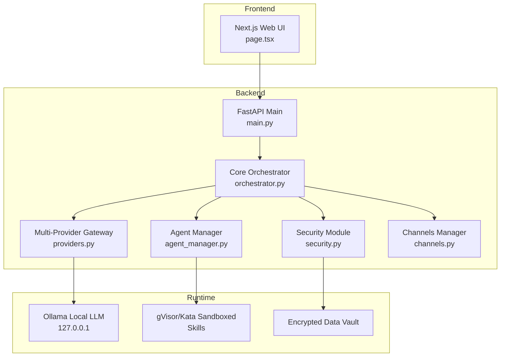

**Diagram sources**
- [backend/app/main.py](file://backend/app/main.py#L72-L87)
- [backend/app/core/orchestrator.py](file://backend/app/core/orchestrator.py#L87-L130)
- [backend/app/core/agent_manager.py](file://backend/app/core/agent_manager.py#L65-L98)
- [backend/app/core/security.py](file://backend/app/core/security.py#L325-L455)
- [backend/app/core/providers.py](file://backend/app/core/providers.py#L418-L457)
- [backend/app/core/channels.py](file://backend/app/core/channels.py#L405-L455)

**Section sources**
- [README.md](file://README.md#L134-L155)
- [backend/app/main.py](file://backend/app/main.py#L72-L87)

## Core Components
The system is built around four core components that enforce security and isolation:

### Core Orchestrator (FastAPI)
The FastAPI application serves as the central control plane, managing:
- Action lifecycle: submission, approval, execution, and auditing
- Security levels: low/medium/high/critical with corresponding approval requirements
- Provider management: local Ollama and optional cloud providers
- Channel integration: Web UI, Telegram, Discord, Slack, CLI
- Audit logging: comprehensive event tracking for forensics

Key responsibilities:
- Validates and routes user actions through security gates
- Coordinates with Agent Manager for skill execution
- Maintains system status and health checks
- Enforces human-in-the-loop for high-risk operations

### Agent Manager (gVisor/Kata)
Manages sandboxed execution environments:
- Runtime detection: gVisor preferred, Kata Containers fallback
- Resource limits: CPU, memory, disk, process counts
- Network isolation: none by default for maximum safety
- Container lifecycle: creation, execution, and cleanup
- Process isolation: seccomp filters and namespace separation

Security features:
- Kernel-level isolation via gVisor/Kata
- Minimal rootfs with essential binaries
- Strict capability dropping and seccomp syscall filtering
- Read-only filesystems and tmpfs for ephemeral data

### Human-in-the-Loop Interface
Provides interactive approval for high-risk actions:
- Pending action queue with security level indicators
- Approve/reject workflow with user identification
- Real-time status updates through Web UI polling
- Audit trail linking approvals to specific users

### Data Vault (Encrypted Storage)
Secure secret management:
- Fernet encryption for API keys and credentials
- Access control levels (public/standard/elevated/admin)
- Audit logging for all vault operations
- Local-only storage with strong cryptographic primitives

**Section sources**
- [backend/app/core/orchestrator.py](file://backend/app/core/orchestrator.py#L87-L130)
- [backend/app/core/agent_manager.py](file://backend/app/core/agent_manager.py#L65-L98)
- [backend/app/core/security.py](file://backend/app/core/security.py#L325-L455)
- [backend/app/core/channels.py](file://backend/app/core/channels.py#L405-L455)

## Architecture Overview
ClosedPaw implements a layered zero-trust architecture with explicit separation of concerns:

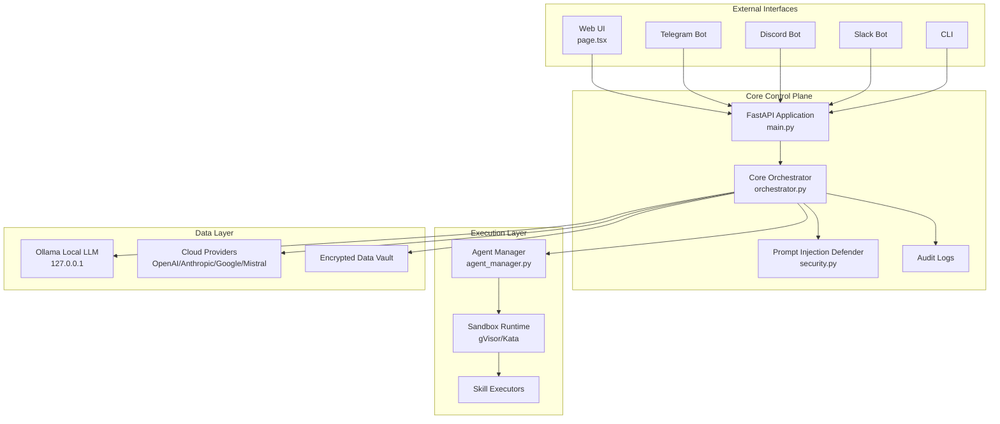

**Diagram sources**
- [frontend/src/app/page.tsx](file://frontend/src/app/page.tsx#L31-L32)
- [backend/app/main.py](file://backend/app/main.py#L131-L182)
- [backend/app/core/orchestrator.py](file://backend/app/core/orchestrator.py#L169-L224)
- [backend/app/core/agent_manager.py](file://backend/app/core/agent_manager.py#L149-L192)
- [backend/app/core/security.py](file://backend/app/core/security.py#L35-L107)
- [backend/app/core/providers.py](file://backend/app/core/providers.py#L418-L457)

### Multi-Tier Security Architecture
The system employs defense-in-depth with six security layers:

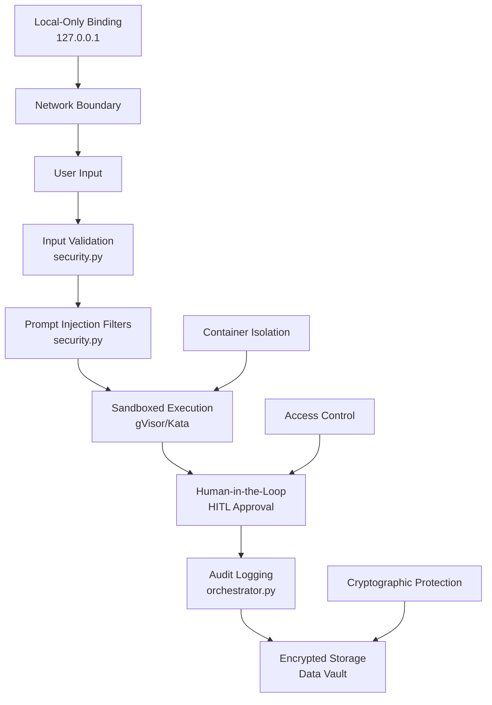

**Diagram sources**
- [backend/app/core/security.py](file://backend/app/core/security.py#L35-L107)
- [backend/app/core/orchestrator.py](file://backend/app/core/orchestrator.py#L225-L250)
- [backend/app/core/agent_manager.py](file://backend/app/core/agent_manager.py#L194-L202)

### Real-Time Communication Flow
The system supports both synchronous and asynchronous communication patterns:

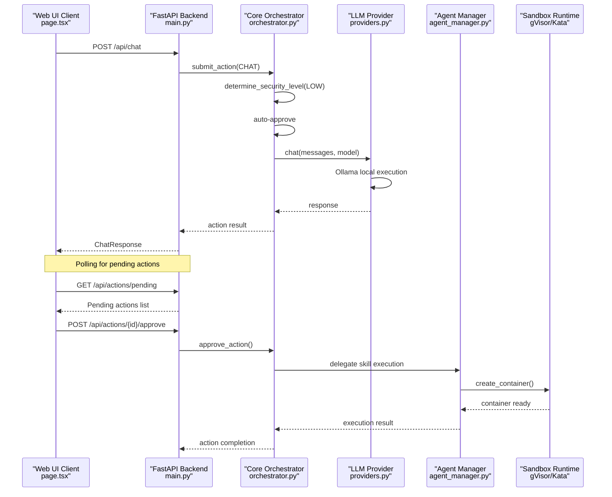

**Diagram sources**
- [frontend/src/app/page.tsx](file://frontend/src/app/page.tsx#L133-L193)
- [backend/app/main.py](file://backend/app/main.py#L131-L182)
- [backend/app/core/orchestrator.py](file://backend/app/core/orchestrator.py#L169-L224)
- [backend/app/core/providers.py](file://backend/app/core/providers.py#L470-L483)
- [backend/app/core/agent_manager.py](file://backend/app/core/agent_manager.py#L149-L192)

### Distributed System Communication
The system maintains security across network boundaries:

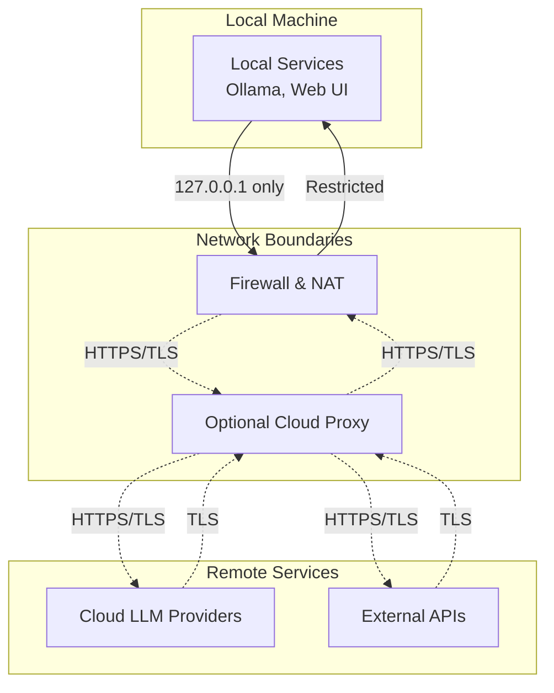

**Diagram sources**
- [README.md](file://README.md#L70-L73)
- [backend/app/core/providers.py](file://backend/app/core/providers.py#L102-L143)
- [backend/app/core/security.py](file://backend/app/core/security.py#L325-L455)

## Detailed Component Analysis

### Core Orchestrator Analysis
The Core Orchestrator serves as the central nervous system, managing action lifecycles and security enforcement:

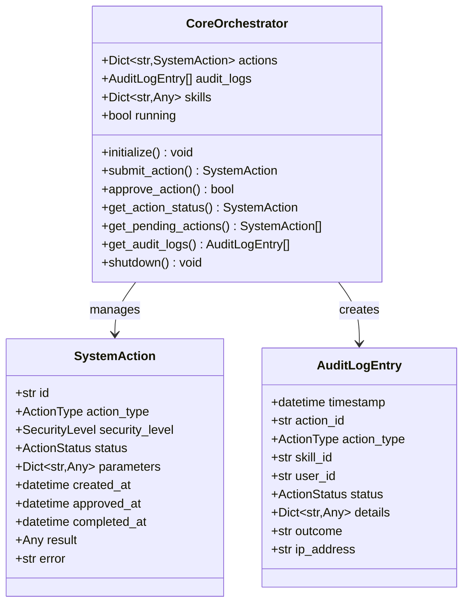

**Diagram sources**
- [backend/app/core/orchestrator.py](file://backend/app/core/orchestrator.py#L87-L130)
- [backend/app/core/orchestrator.py](file://backend/app/core/orchestrator.py#L72-L85)
- [backend/app/core/orchestrator.py](file://backend/app/core/orchestrator.py#L59-L70)

Key security features:
- Automatic security level determination based on action type and parameters
- Human-in-the-loop approval for high-risk operations
- Comprehensive audit logging with timestamped events
- Graceful shutdown with pending action completion

**Section sources**
- [backend/app/core/orchestrator.py](file://backend/app/core/orchestrator.py#L225-L250)
- [backend/app/core/orchestrator.py](file://backend/app/core/orchestrator.py#L376-L428)

### Agent Manager Analysis
The Agent Manager provides kernel-level isolation through containerized execution:

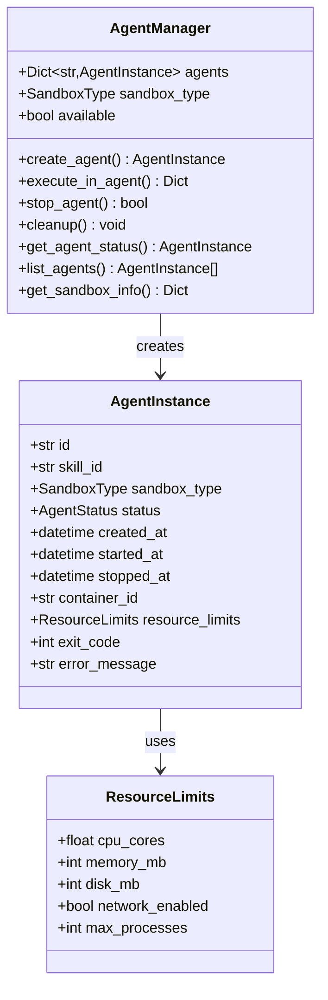

**Diagram sources**
- [backend/app/core/agent_manager.py](file://backend/app/core/agent_manager.py#L65-L98)
- [backend/app/core/agent_manager.py](file://backend/app/core/agent_manager.py#L50-L63)
- [backend/app/core/agent_manager.py](file://backend/app/core/agent_manager.py#L40-L47)

Sandboxing implementation:
- gVisor runtime with seccomp filters and namespace isolation
- Kata Containers as alternative with stronger isolation guarantees
- Minimal rootfs with essential system binaries only
- Strict capability dropping and syscall filtering

**Section sources**
- [backend/app/core/agent_manager.py](file://backend/app/core/agent_manager.py#L194-L202)
- [backend/app/core/agent_manager.py](file://backend/app/core/agent_manager.py#L309-L352)

### Security Module Analysis
The security module implements comprehensive input validation and threat detection:

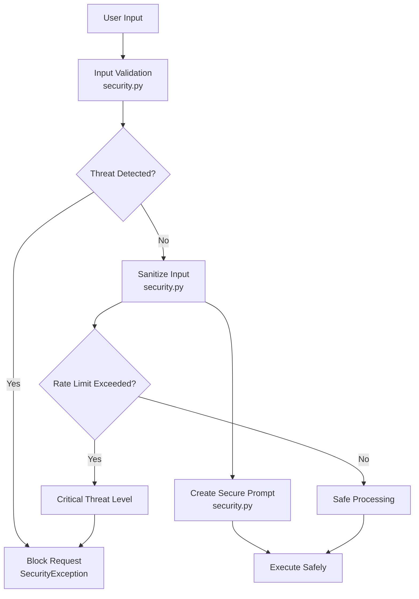

**Diagram sources**
- [backend/app/core/security.py](file://backend/app/core/security.py#L116-L181)
- [backend/app/core/security.py](file://backend/app/core/security.py#L253-L288)

Defense mechanisms:
- Multi-pattern detection for prompt injection attempts
- Suspicious character and pattern analysis
- Rate limiting to prevent abuse
- Input sanitization and normalization
- Bi-directional text character removal

**Section sources**
- [backend/app/core/security.py](file://backend/app/core/security.py#L42-L93)
- [backend/app/core/security.py](file://backend/app/core/security.py#L182-L206)

### Multi-Provider LLM Gateway
The provider system enables flexible LLM selection with local-first defaults:

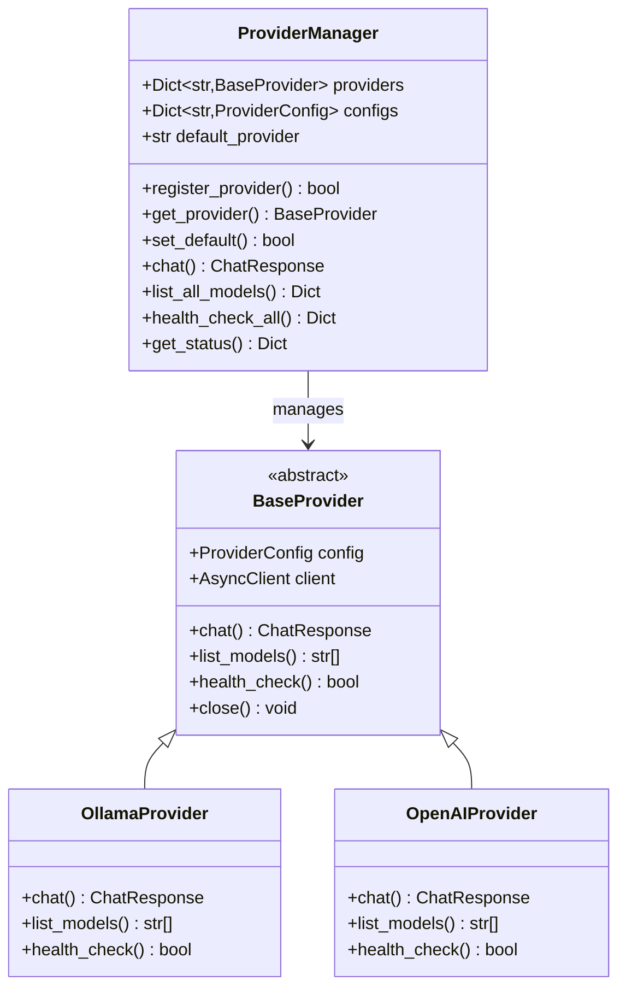

**Diagram sources**
- [backend/app/core/providers.py](file://backend/app/core/providers.py#L418-L457)
- [backend/app/core/providers.py](file://backend/app/core/providers.py#L68-L100)
- [backend/app/core/providers.py](file://backend/app/core/providers.py#L102-L161)

**Section sources**
- [backend/app/core/providers.py](file://backend/app/core/providers.py#L470-L483)
- [backend/app/core/providers.py](file://backend/app/core/providers.py#L536-L544)

### Channel Management
The channel system provides multiple interaction interfaces:

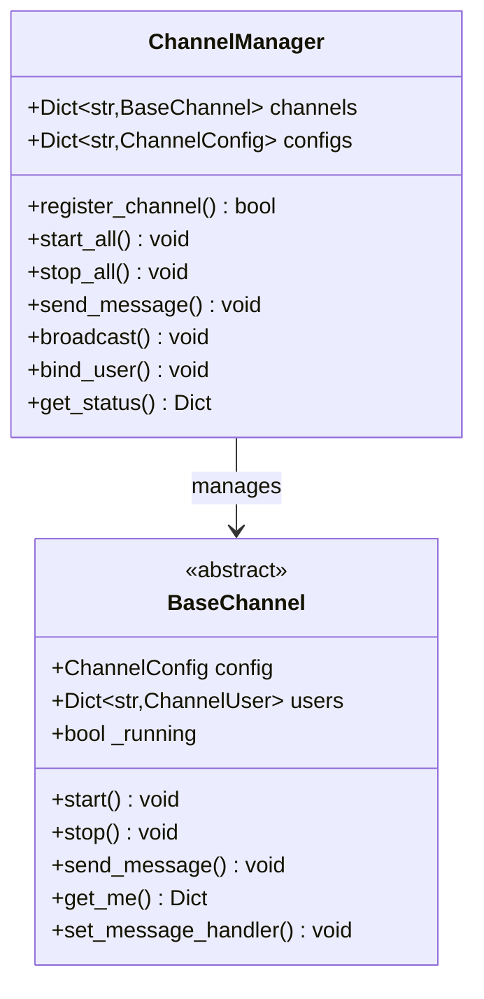

**Diagram sources**
- [backend/app/core/channels.py](file://backend/app/core/channels.py#L405-L455)
- [backend/app/core/channels.py](file://backend/app/core/channels.py#L79-L111)

**Section sources**
- [backend/app/core/channels.py](file://backend/app/core/channels.py#L416-L444)
- [backend/app/core/channels.py](file://backend/app/core/channels.py#L509-L523)

## Dependency Analysis
The system maintains clear separation of concerns with minimal coupling between components:

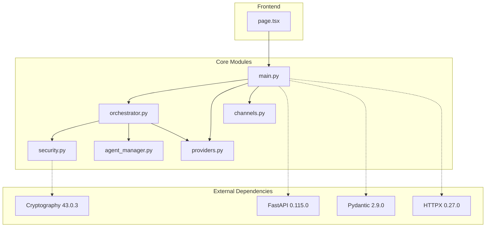

**Diagram sources**
- [backend/requirements.txt](file://backend/requirements.txt#L4-L36)
- [backend/app/main.py](file://backend/app/main.py#L10-L16)
- [backend/app/core/security.py](file://backend/app/core/security.py#L325-L345)

Key dependency relationships:
- FastAPI provides the web framework and request/response handling
- Pydantic validates and serializes data structures
- HTTPX handles asynchronous HTTP requests to external services
- Cryptography provides secure storage and encryption
- SQLAlchemy and Alembic manage database migrations (future use)

**Section sources**
- [backend/requirements.txt](file://backend/requirements.txt#L1-L36)

## Performance Considerations
The architecture balances security with performance through several optimizations:

- Asynchronous processing: All I/O operations use async/await patterns
- Resource isolation: Containerized execution prevents resource contention
- Local-first design: Reduces network latency and bandwidth usage
- Lazy loading: Components initialize only when needed
- Efficient serialization: Pydantic models minimize data transformation overhead

Security vs. performance trade-offs:
- gVisor/Kata adds minimal overhead compared to full VM virtualization
- Input validation occurs before heavy computation
- Audit logging is asynchronous to avoid blocking user operations
- Rate limiting prevents resource exhaustion during attacks

## Troubleshooting Guide
Common issues and their resolution:

### LLM Connectivity Issues
- **Symptom**: Ollama connection failures
- **Cause**: Ollama service not running or network restrictions
- **Resolution**: Verify Ollama is running locally on 127.0.0.1:11434

### Sandbox Runtime Problems
- **Symptom**: Agent creation failures
- **Cause**: Missing gVisor or Kata runtime
- **Resolution**: Install gVisor or Kata Containers as documented

### Human-in-the-Loop Delays
- **Symptom**: Pending actions not processed
- **Cause**: Missing HITL approvals for high-risk operations
- **Resolution**: Approve/reject pending actions in Web UI

### Security Violations
- **Symptom**: Input blocked or rate limit exceeded
- **Cause**: Suspicious patterns detected
- **Resolution**: Review security logs and adjust input patterns

**Section sources**
- [backend/app/main.py](file://backend/app/main.py#L101-L128)
- [backend/app/core/orchestrator.py](file://backend/app/core/orchestrator.py#L451-L462)
- [backend/app/core/security.py](file://backend/app/core/security.py#L164-L181)

## Conclusion
ClosedPaw represents a comprehensive approach to secure AI assistant design, implementing zero-trust principles across all system layers. The architecture successfully balances security, performance, and usability through:

- Clear separation of concerns with explicit security boundaries
- Hardened sandboxing via gVisor/Kata for skill execution
- Comprehensive input validation and threat detection
- Human-in-the-loop approval for high-risk operations
- Encrypted storage for sensitive data
- Local-first operation with optional cloud provider integration

The system's layered architecture ensures that security failures in one layer are mitigated by protections in subsequent layers, providing robust defense-in-depth. The modular design allows for easy extension and maintenance while preserving security guarantees.