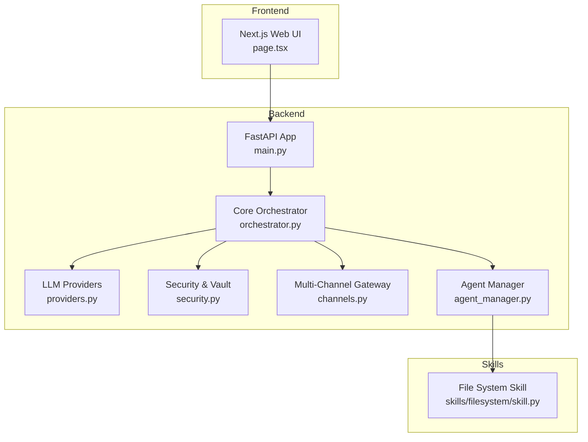
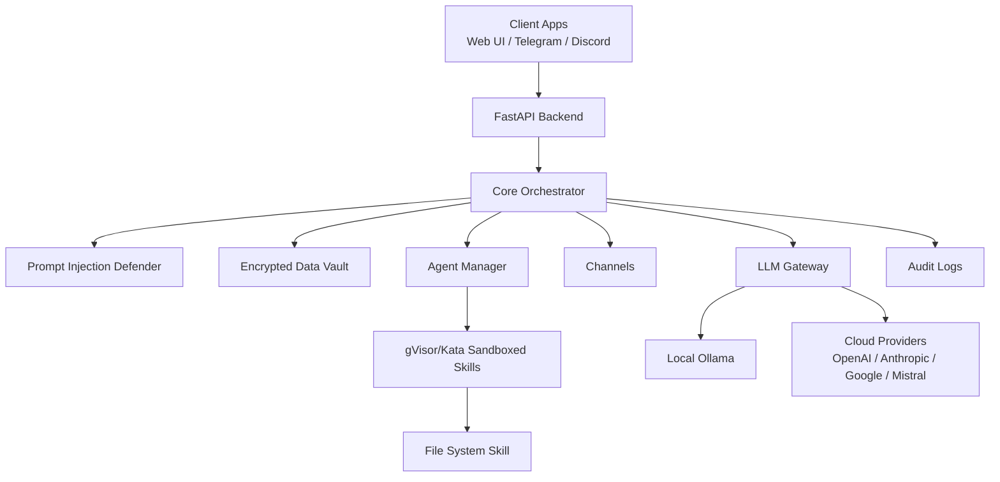
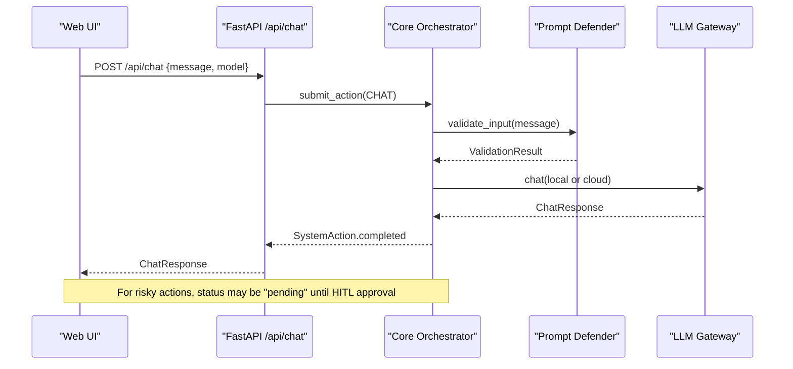
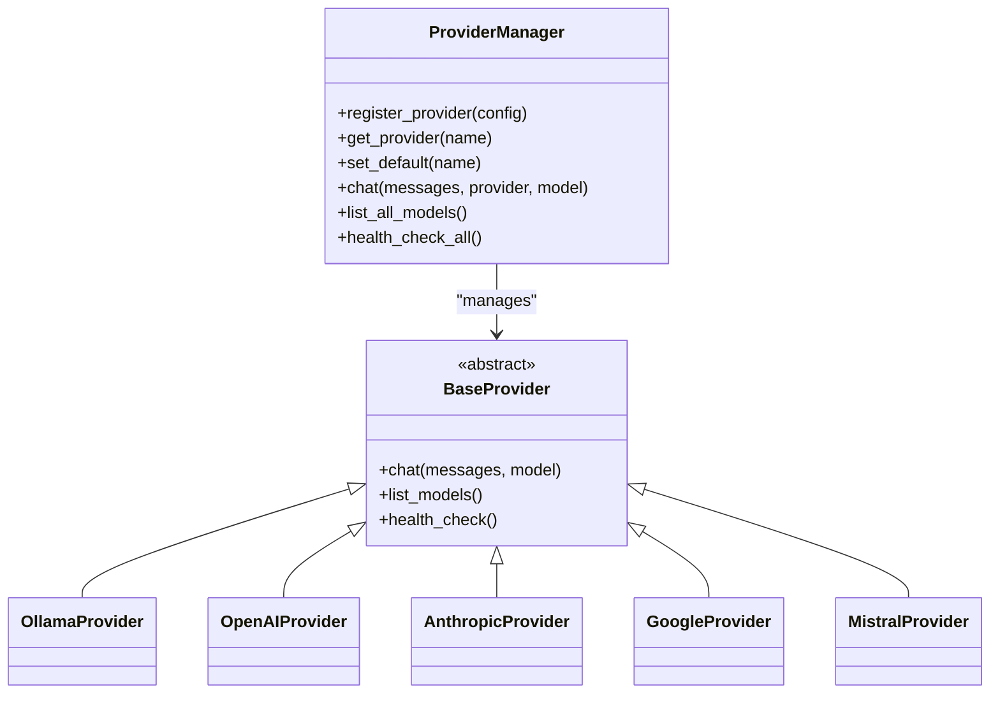
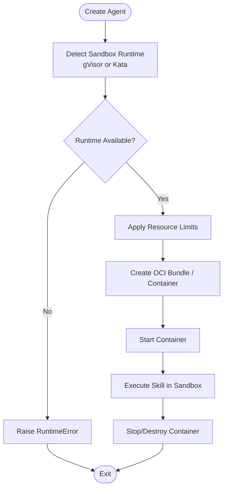
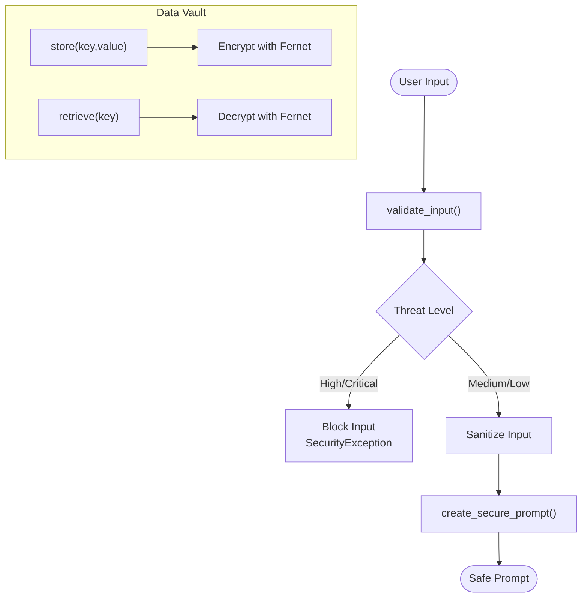
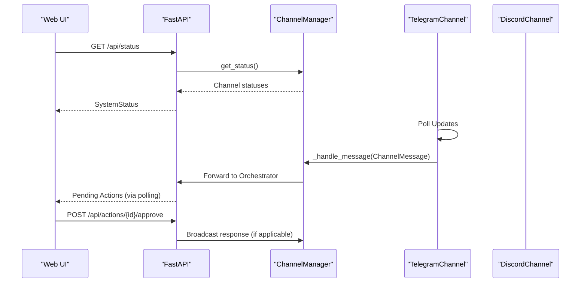
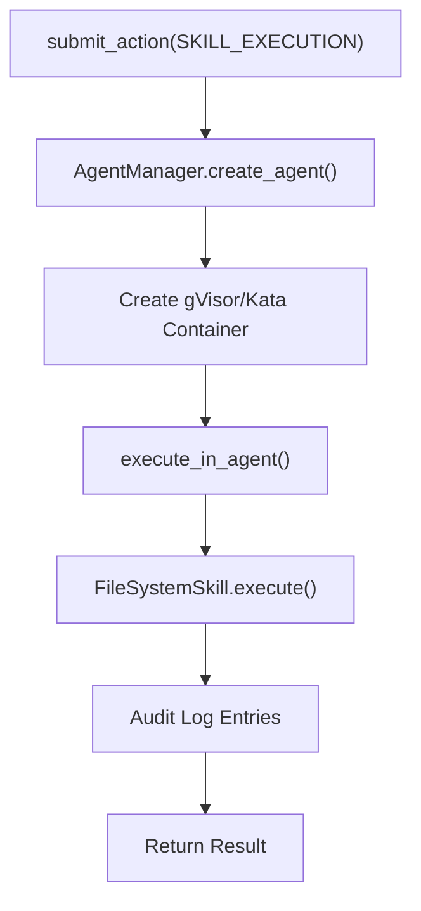
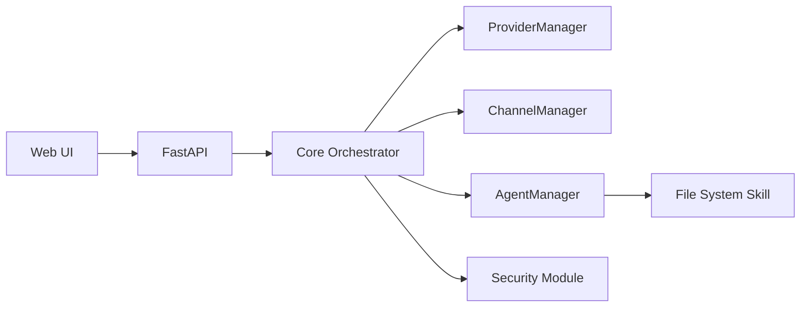

# Core Features

<cite>
**Referenced Files in This Document**
- [README.md](file://README.md)
- [backend/app/main.py](file://backend/app/main.py)
- [backend/app/core/orchestrator.py](file://backend/app/core/orchestrator.py)
- [backend/app/core/providers.py](file://backend/app/core/providers.py)
- [backend/app/core/security.py](file://backend/app/core/security.py)
- [backend/app/core/channels.py](file://backend/app/core/channels.py)
- [backend/app/core/agent_manager.py](file://backend/app/core/agent_manager.py)
- [skills/filesystem/skill.py](file://skills/filesystem/skill.py)
- [frontend/src/app/page.tsx](file://frontend/src/app/page.tsx)
</cite>

## Table of Contents
1. [Introduction](#introduction)
2. [Project Structure](#project-structure)
3. [Core Components](#core-components)
4. [Architecture Overview](#architecture-overview)
5. [Detailed Component Analysis](#detailed-component-analysis)
6. [Dependency Analysis](#dependency-analysis)
7. [Performance Considerations](#performance-considerations)
8. [Troubleshooting Guide](#troubleshooting-guide)
9. [Conclusion](#conclusion)

## Introduction
This document presents the core features of ClosedPaw, a zero-trust AI assistant platform designed for secure, local-first operation. It covers:
- Multi-provider LLM support (local Ollama plus cloud providers)
- Real-time chat interface with human-in-the-loop approval
- Hardened sandboxing using gVisor/Kata Containers for kernel-level isolation
- Security features: encrypted data storage, comprehensive audit logging, and prompt injection defense
- Multi-channel communication support (web UI, Telegram, Discord)
- Practical examples of how these features work together and when each security feature activates

## Project Structure
ClosedPaw is organized into:
- Backend: FastAPI application exposing REST APIs, orchestration, provider management, security, channels, and agent management
- Frontend: Next.js web UI for chat, model selection, and HITL approvals
- Skills: Sandbox-executed capabilities (e.g., filesystem operations)

**Diagram sources**
- [backend/app/main.py](file://backend/app/main.py#L72-L380)
- [backend/app/core/orchestrator.py](file://backend/app/core/orchestrator.py#L87-L130)
- [backend/app/core/providers.py](file://backend/app/core/providers.py#L418-L524)
- [backend/app/core/security.py](file://backend/app/core/security.py#L437-L455)
- [backend/app/core/channels.py](file://backend/app/core/channels.py#L405-L503)
- [backend/app/core/agent_manager.py](file://backend/app/core/agent_manager.py#L65-L98)
- [skills/filesystem/skill.py](file://skills/filesystem/skill.py#L35-L75)

**Section sources**
- [README.md](file://README.md#L134-L155)
- [backend/app/main.py](file://backend/app/main.py#L72-L380)

## Core Components
- Zero-trust orchestrator: central action lifecycle, HITL approvals, audit logging, and security-level determination
- Multi-provider LLM gateway: supports local Ollama and cloud providers (OpenAI, Anthropic, Google, Mistral)
- Hardened sandboxing: gVisor/Kata Containers for kernel-level isolation
- Security module: prompt injection defense, rate limiting, and encrypted data vault
- Multi-channel gateway: web UI, Telegram, Discord, Slack, and CLI
- Skills framework: sandboxed executors for safe operations (e.g., filesystem)

**Section sources**
- [backend/app/core/orchestrator.py](file://backend/app/core/orchestrator.py#L87-L130)
- [backend/app/core/providers.py](file://backend/app/core/providers.py#L418-L524)
- [backend/app/core/agent_manager.py](file://backend/app/core/agent_manager.py#L65-L98)
- [backend/app/core/security.py](file://backend/app/core/security.py#L35-L107)
- [backend/app/core/channels.py](file://backend/app/core/channels.py#L405-L503)
- [skills/filesystem/skill.py](file://skills/filesystem/skill.py#L35-L75)

## Architecture Overview
ClosedPaw implements a zero-trust architecture:
- All actions are tracked and audited
- High-risk actions require human-in-the-loop approval
- Cloud LLMs are optional and gated behind explicit configuration
- Local-only operation with strict binding to localhost
- Kernel-level sandboxing for skills and operations

**Diagram sources**
- [backend/app/main.py](file://backend/app/main.py#L131-L182)
- [backend/app/core/orchestrator.py](file://backend/app/core/orchestrator.py#L225-L250)
- [backend/app/core/security.py](file://backend/app/core/security.py#L35-L107)
- [backend/app/core/providers.py](file://backend/app/core/providers.py#L418-L524)
- [backend/app/core/channels.py](file://backend/app/core/channels.py#L405-L503)
- [backend/app/core/agent_manager.py](file://backend/app/core/agent_manager.py#L65-L98)
- [skills/filesystem/skill.py](file://skills/filesystem/skill.py#L35-L75)

## Detailed Component Analysis

### Zero-Trust Orchestrator and Human-in-the-Loop (HITL)
The orchestrator manages all system actions with explicit security levels and audit trails. Low-risk actions (e.g., chat) auto-execute; high-risk actions (e.g., file operations, model switches) require HITL approval. The web UI surfaces pending actions for admin approval.

**Diagram sources**
- [backend/app/main.py](file://backend/app/main.py#L131-L182)
- [backend/app/core/orchestrator.py](file://backend/app/core/orchestrator.py#L169-L224)
- [backend/app/core/security.py](file://backend/app/core/security.py#L116-L180)
- [backend/app/core/providers.py](file://backend/app/core/providers.py#L470-L483)

**Section sources**
- [backend/app/core/orchestrator.py](file://backend/app/core/orchestrator.py#L225-L250)
- [backend/app/main.py](file://backend/app/main.py#L265-L299)
- [frontend/src/app/page.tsx](file://frontend/src/app/page.tsx#L112-L131)

### Multi-Provider LLM Support (Local Ollama + Cloud)
The provider manager registers and routes to multiple LLM providers. Local-only operation binds to 127.0.0.1; cloud providers are optional and configurable.

**Diagram sources**
- [backend/app/core/providers.py](file://backend/app/core/providers.py#L418-L524)
- [backend/app/core/providers.py](file://backend/app/core/providers.py#L68-L100)
- [backend/app/core/providers.py](file://backend/app/core/providers.py#L102-L161)
- [backend/app/core/providers.py](file://backend/app/core/providers.py#L163-L222)
- [backend/app/core/providers.py](file://backend/app/core/providers.py#L224-L294)
- [backend/app/core/providers.py](file://backend/app/core/providers.py#L296-L354)
- [backend/app/core/providers.py](file://backend/app/core/providers.py#L356-L416)

**Section sources**
- [backend/app/core/providers.py](file://backend/app/core/providers.py#L418-L524)
- [backend/app/main.py](file://backend/app/main.py#L383-L462)

### Hardened Sandboxing with gVisor/Kata Containers
Skills execute in sandboxed containers with strict resource limits, seccomp filters, and namespace isolation. The Agent Manager detects available runtimes and creates containers accordingly.

**Diagram sources**
- [backend/app/core/agent_manager.py](file://backend/app/core/agent_manager.py#L99-L148)
- [backend/app/core/agent_manager.py](file://backend/app/core/agent_manager.py#L194-L294)
- [backend/app/core/agent_manager.py](file://backend/app/core/agent_manager.py#L309-L473)

**Section sources**
- [backend/app/core/agent_manager.py](file://backend/app/core/agent_manager.py#L65-L98)
- [backend/app/core/agent_manager.py](file://backend/app/core/agent_manager.py#L149-L193)
- [backend/app/core/agent_manager.py](file://backend/app/core/agent_manager.py#L475-L538)

### Security: Prompt Injection Defense and Encrypted Data Vault
The prompt injection defender validates user input, detects suspicious patterns, and sanitizes content. The data vault stores secrets encrypted at rest with access logging.

**Diagram sources**
- [backend/app/core/security.py](file://backend/app/core/security.py#L116-L180)
- [backend/app/core/security.py](file://backend/app/core/security.py#L253-L287)
- [backend/app/core/security.py](file://backend/app/core/security.py#L347-L413)

**Section sources**
- [backend/app/core/security.py](file://backend/app/core/security.py#L35-L107)
- [backend/app/core/security.py](file://backend/app/core/security.py#L325-L413)

### Multi-Channel Communication (Web UI, Telegram, Discord)
The channel manager supports multiple communication channels with per-channel configuration, rate limiting, and allowlists. The web UI polls for pending messages and displays HITL prompts.

**Diagram sources**
- [backend/app/core/channels.py](file://backend/app/core/channels.py#L405-L503)
- [backend/app/core/channels.py](file://backend/app/core/channels.py#L177-L286)
- [backend/app/core/channels.py](file://backend/app/core/channels.py#L288-L334)
- [backend/app/main.py](file://backend/app/main.py#L466-L530)
- [frontend/src/app/page.tsx](file://frontend/src/app/page.tsx#L94-L119)

**Section sources**
- [backend/app/core/channels.py](file://backend/app/core/channels.py#L405-L503)
- [backend/app/main.py](file://backend/app/main.py#L466-L530)
- [frontend/src/app/page.tsx](file://frontend/src/app/page.tsx#L94-L119)

### Skills Framework and Sandbox Execution
Skills execute in isolated sandboxes with restricted filesystems, size limits, and audit logging. The filesystem skill demonstrates read/write/list/delete operations with path validation and size checks.

**Diagram sources**
- [backend/app/core/orchestrator.py](file://backend/app/core/orchestrator.py#L333-L351)
- [backend/app/core/agent_manager.py](file://backend/app/core/agent_manager.py#L149-L193)
- [backend/app/core/agent_manager.py](file://backend/app/core/agent_manager.py#L475-L538)
- [skills/filesystem/skill.py](file://skills/filesystem/skill.py#L133-L208)

**Section sources**
- [backend/app/core/orchestrator.py](file://backend/app/core/orchestrator.py#L333-L351)
- [skills/filesystem/skill.py](file://skills/filesystem/skill.py#L35-L75)
- [skills/filesystem/skill.py](file://skills/filesystem/skill.py#L133-L208)

## Dependency Analysis
The backend components are loosely coupled around the orchestrator, which acts as the central coordinator. Providers, channels, and agent manager are registered and invoked by the orchestrator. The frontend communicates exclusively with the backend over localhost.

**Diagram sources**
- [backend/app/main.py](file://backend/app/main.py#L72-L380)
- [backend/app/core/orchestrator.py](file://backend/app/core/orchestrator.py#L87-L130)
- [backend/app/core/providers.py](file://backend/app/core/providers.py#L418-L524)
- [backend/app/core/channels.py](file://backend/app/core/channels.py#L405-L503)
- [backend/app/core/agent_manager.py](file://backend/app/core/agent_manager.py#L65-L98)
- [skills/filesystem/skill.py](file://skills/filesystem/skill.py#L35-L75)

**Section sources**
- [backend/app/main.py](file://backend/app/main.py#L72-L380)

## Performance Considerations
- Local-first operation ensures low-latency responses from Ollama and reduces network overhead
- Provider selection and model switching are lightweight operations managed by the orchestrator
- Sandboxing adds minimal overhead for most chat operations; heavy tasks benefit from dedicated agent containers
- Audit logging is asynchronous and file-backed to avoid blocking request handling

## Troubleshooting Guide
- Local LLM connectivity: The backend checks Ollama on localhost; if offline, the UI indicates “Ollama OFFLINE” and defaults are used
- Provider registration: Use the provider endpoints to register cloud providers and set defaults
- Channel configuration: Ensure tokens and allowlists are configured; channels can be started/stopped via API
- Audit logs: Retrieve recent audit events for forensic analysis
- Sandbox runtime: If gVisor/Kata are unavailable, agent creation will fail; install the runtime for full sandboxing

**Section sources**
- [backend/app/main.py](file://backend/app/main.py#L101-L129)
- [backend/app/main.py](file://backend/app/main.py#L383-L462)
- [backend/app/main.py](file://backend/app/main.py#L466-L530)
- [backend/app/main.py](file://backend/app/main.py#L322-L339)
- [backend/app/core/agent_manager.py](file://backend/app/core/agent_manager.py#L99-L148)

## Conclusion
ClosedPaw delivers a secure, local-first AI assistant with:
- Multi-provider LLM support (local Ollama and optional cloud providers)
- Real-time chat with human-in-the-loop approvals for risky actions
- Kernel-level sandboxing via gVisor/Kata Containers
- Strong security: encrypted storage, comprehensive audit logging, and prompt injection defense
- Multi-channel communication through web UI, Telegram, and Discord

These features combine to provide defense-in-depth, ensuring that user data remains private and system integrity is preserved even under adversarial inputs or misuse attempts.