# Project Overview

<cite>
**Referenced Files in This Document**
- [README.md](file://README.md)
- [main.py](file://backend/app/main.py)
- [orchestrator.py](file://backend/app/core/orchestrator.py)
- [agent_manager.py](file://backend/app/core/agent_manager.py)
- [security.py](file://backend/app/core/security.py)
- [providers.py](file://backend/app/core/providers.py)
- [channels.py](file://backend/app/core/channels.py)
- [page.tsx](file://frontend/src/app/page.tsx)
- [requirements.txt](file://backend/requirements.txt)
- [package.json](file://frontend/package.json)
- [skill.py](file://skills/filesystem/skill.py)
</cite>

## Table of Contents
1. [Introduction](#introduction)
2. [Project Structure](#project-structure)
3. [Core Components](#core-components)
4. [Architecture Overview](#architecture-overview)
5. [Detailed Component Analysis](#detailed-component-analysis)
6. [Dependency Analysis](#dependency-analysis)
7. [Performance Considerations](#performance-considerations)
8. [Troubleshooting Guide](#troubleshooting-guide)
9. [Conclusion](#conclusion)

## Introduction
ClosedPaw is a zero-trust AI assistant platform designed to run entirely on local machines with hardened sandboxing. It prioritizes privacy and security by keeping all data on-device, enforcing implicit distrust of all inputs and actions, and requiring human-in-the-loop (HITL) approval for high-risk operations. The platform integrates a multi-provider LLM gateway (local Ollama plus cloud providers) with robust prompt injection defense, encrypted data storage, and comprehensive audit logging.

Key security principles:
- Implicit distrust: No action is trusted by default; all inputs and operations are validated and audited.
- Hardened sandboxing: gVisor/Kata Containers provide kernel-level isolation for skills and agents.
- Human-in-the-loop: High-risk actions require explicit approval via the web UI.
- Encrypted data storage: Secrets and sensitive configuration are stored securely.
- Audit logging: Every action is recorded for forensic analysis.

## Project Structure
The project follows a clear separation of concerns across backend, frontend, and skill modules:
- Backend (Python 3.11+): FastAPI server exposing REST APIs for chat, actions, providers, channels, and audit logs.
- Frontend (Next.js 15): React-based web UI with real-time status, model selection, and HITL approval controls.
- Core modules: Orchestrator manages actions and security levels, Agent Manager handles sandboxed skills, Security module defends against prompt injection, Providers manage multi-LLM support, Channels integrate messaging platforms, and Skills implement capability executors.

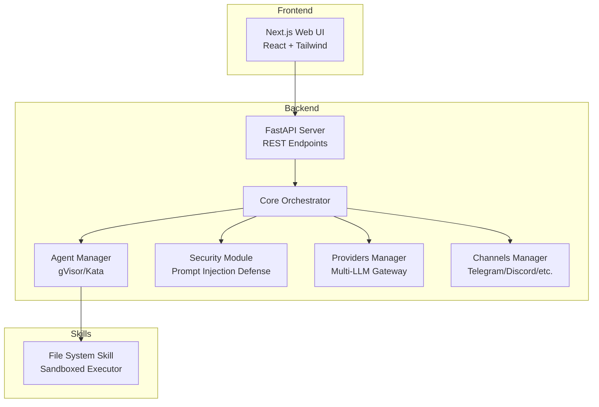

**Diagram sources**
- [main.py](file://backend/app/main.py#L72-L87)
- [orchestrator.py](file://backend/app/core/orchestrator.py#L87-L130)
- [agent_manager.py](file://backend/app/core/agent_manager.py#L65-L98)
- [security.py](file://backend/app/core/security.py#L35-L107)
- [providers.py](file://backend/app/core/providers.py#L418-L457)
- [channels.py](file://backend/app/core/channels.py#L405-L444)
- [skill.py](file://skills/filesystem/skill.py#L35-L76)

**Section sources**
- [README.md](file://README.md#L1-L133)
- [main.py](file://backend/app/main.py#L72-L87)
- [page.tsx](file://frontend/src/app/page.tsx#L27-L37)

## Core Components
- Zero-trust orchestrator: Central controller that assigns security levels to actions, enforces implicit distrust, and coordinates execution with HITL approval for risky operations.
- Hardened sandboxing: Agent Manager provisions gVisor or Kata containers with strict resource limits, seccomp profiles, masked paths, and network isolation.
- Multi-provider LLM gateway: Providers module supports local Ollama and cloud providers (OpenAI, Anthropic, Google, Mistral) with unified interfaces and health checks.
- Human-in-the-loop: Frontend exposes pending actions requiring approval; backend enforces approval before executing high-risk actions.
- Prompt injection defense: Security module validates inputs, detects suspicious patterns, sanitizes input, and creates secure prompts with clear separation of duties.
- Encrypted data vault: Security module stores API keys and secrets encrypted at rest with access logging.
- Audit logging: Orchestrator logs all actions with timestamps, outcomes, and details for compliance and forensics.

**Section sources**
- [orchestrator.py](file://backend/app/core/orchestrator.py#L87-L130)
- [agent_manager.py](file://backend/app/core/agent_manager.py#L65-L98)
- [providers.py](file://backend/app/core/providers.py#L418-L457)
- [security.py](file://backend/app/core/security.py#L35-L107)
- [channels.py](file://backend/app/core/channels.py#L405-L444)

## Architecture Overview
ClosedPaw’s architecture enforces zero-trust by design:
- All inbound requests are validated and assigned a security level.
- Low-risk actions execute automatically; high-risk actions require HITL approval.
- Skills and agents run inside hardened containers with minimal privileges.
- LLM interactions are routed through a local-only gateway (Ollama) or optional cloud providers.
- All operations are logged for auditability.

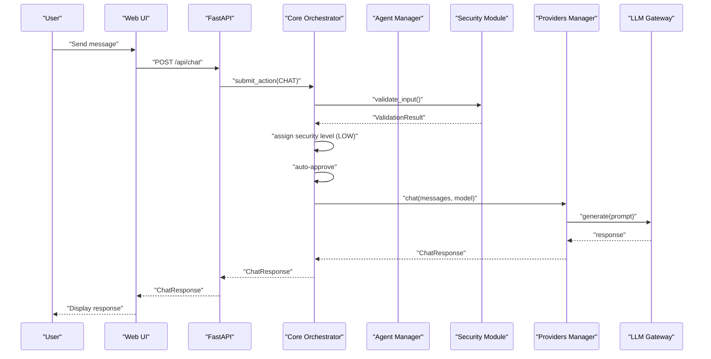

**Diagram sources**
- [main.py](file://backend/app/main.py#L131-L182)
- [orchestrator.py](file://backend/app/core/orchestrator.py#L169-L224)
- [providers.py](file://backend/app/core/providers.py#L470-L483)
- [security.py](file://backend/app/core/security.py#L116-L181)

## Detailed Component Analysis

### Zero-Trust Orchestrator
The orchestrator centralizes action lifecycle management with implicit distrust and security levels:
- Action types: chat, skill execution, model switch, API call, file operation, config change.
- Security levels: low (auto-exec), medium (log), high (HITL), critical (HITL + additional verification).
- Audit logging: comprehensive records for compliance and incident response.
- HITL integration: pending actions surfaced in the UI for admin approval.

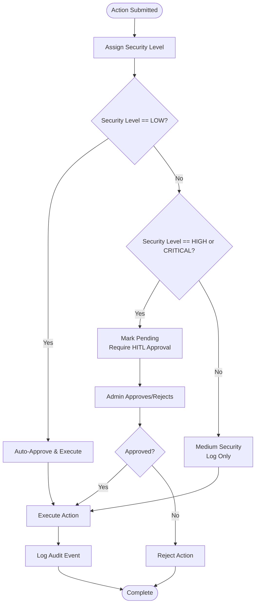

**Diagram sources**
- [orchestrator.py](file://backend/app/core/orchestrator.py#L225-L249)
- [orchestrator.py](file://backend/app/core/orchestrator.py#L376-L428)

**Section sources**
- [orchestrator.py](file://backend/app/core/orchestrator.py#L31-L85)
- [orchestrator.py](file://backend/app/core/orchestrator.py#L169-L224)
- [orchestrator.py](file://backend/app/core/orchestrator.py#L429-L462)

### Hardened Sandboxing with gVisor/Kata
The Agent Manager provisions sandboxed environments with strong isolation:
- Runtime detection: gVisor preferred; Kata Containers supported.
- Resource limits: CPU, memory, disk, process counts.
- Security hardening: seccomp, masked paths, readonly rootfs, network isolation.
- Lifecycle: create, start, execute commands, stop, cleanup.

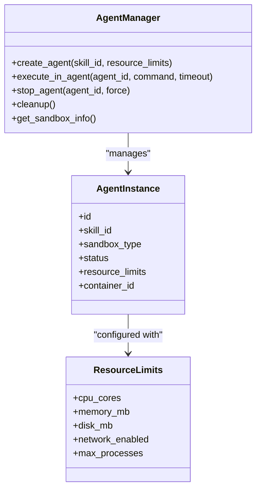

**Diagram sources**
- [agent_manager.py](file://backend/app/core/agent_manager.py#L65-L98)
- [agent_manager.py](file://backend/app/core/agent_manager.py#L149-L193)
- [agent_manager.py](file://backend/app/core/agent_manager.py#L39-L63)

**Section sources**
- [agent_manager.py](file://backend/app/core/agent_manager.py#L21-L37)
- [agent_manager.py](file://backend/app/core/agent_manager.py#L194-L294)
- [agent_manager.py](file://backend/app/core/agent_manager.py#L309-L474)

### Multi-Provider LLM Gateway
The Providers module unifies multiple LLM backends:
- Supported providers: Ollama (local), OpenAI, Anthropic, Google, Mistral.
- Unified interfaces: chat completion, model listing, health checks.
- Default local-only operation: Ollama bound to localhost.

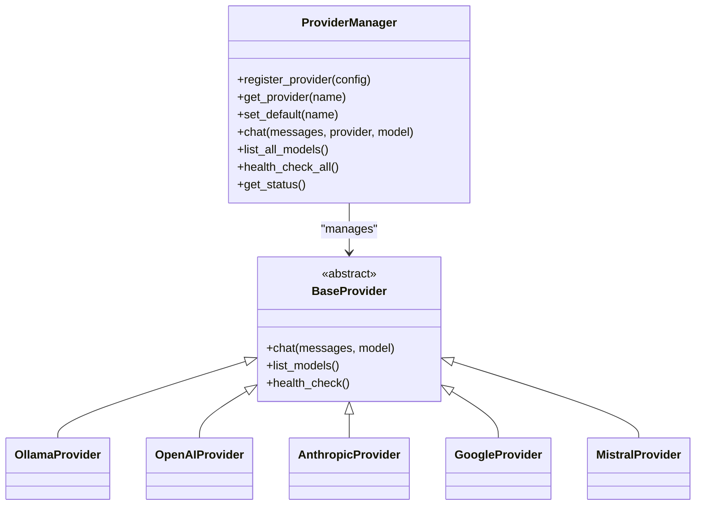

**Diagram sources**
- [providers.py](file://backend/app/core/providers.py#L418-L457)
- [providers.py](file://backend/app/core/providers.py#L68-L100)
- [providers.py](file://backend/app/core/providers.py#L102-L161)
- [providers.py](file://backend/app/core/providers.py#L163-L222)
- [providers.py](file://backend/app/core/providers.py#L224-L294)
- [providers.py](file://backend/app/core/providers.py#L296-L354)
- [providers.py](file://backend/app/core/providers.py#L356-L416)

**Section sources**
- [providers.py](file://backend/app/core/providers.py#L20-L45)
- [providers.py](file://backend/app/core/providers.py#L430-L545)
- [main.py](file://backend/app/main.py#L383-L462)

### Human-in-the-Loop (HITL) Workflow
The HITL workflow ensures explicit approval for risky actions:
- Pending actions are listed in the UI.
- Admin approves or rejects via the API.
- Orchestrator executes approved actions and logs outcomes.

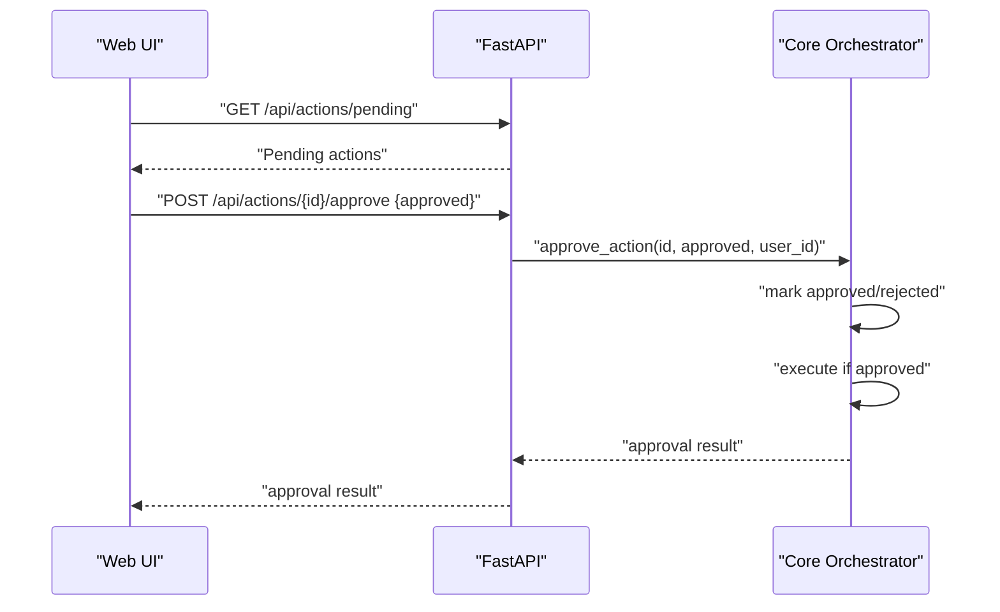

**Diagram sources**
- [main.py](file://backend/app/main.py#L265-L299)
- [page.tsx](file://frontend/src/app/page.tsx#L107-L127)
- [orchestrator.py](file://backend/app/core/orchestrator.py#L376-L428)

**Section sources**
- [main.py](file://backend/app/main.py#L265-L299)
- [page.tsx](file://frontend/src/app/page.tsx#L116-L127)
- [orchestrator.py](file://backend/app/core/orchestrator.py#L451-L458)

### Prompt Injection Defense
The Security module defends against prompt injection attacks:
- Pattern detection: instruction override, role manipulation, delimiter manipulation, encoding obfuscation, context manipulation, persistence attempts, tool hijacking.
- Suspicious pattern detection: control characters, bidirectional text, repetitive characters, excessive special characters, base64-like strings.
- Input sanitization and secure prompt construction with clear separation of system instructions and user input.
- Rate limiting and threat scoring.

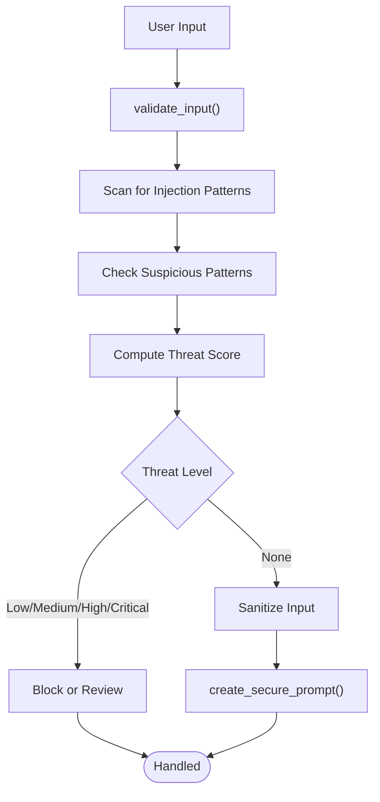

**Diagram sources**
- [security.py](file://backend/app/core/security.py#L116-L181)
- [security.py](file://backend/app/core/security.py#L253-L288)

**Section sources**
- [security.py](file://backend/app/core/security.py#L35-L107)
- [security.py](file://backend/app/core/security.py#L182-L252)
- [security.py](file://backend/app/core/security.py#L253-L288)

### Encrypted Data Vault
The Data Vault stores sensitive information securely:
- Encryption: AES-256 with Fernet.
- Access control: hierarchical access levels.
- Audit logging: tracks who accessed what and when.

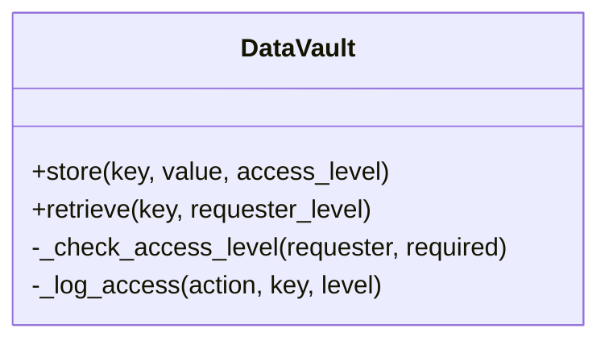

**Diagram sources**
- [security.py](file://backend/app/core/security.py#L325-L435)

**Section sources**
- [security.py](file://backend/app/core/security.py#L325-L435)

### Audit Logging
Comprehensive audit logging captures all actions for compliance and forensics:
- Structured entries with timestamps, action types, statuses, outcomes, and details.
- File-based logging with console output.

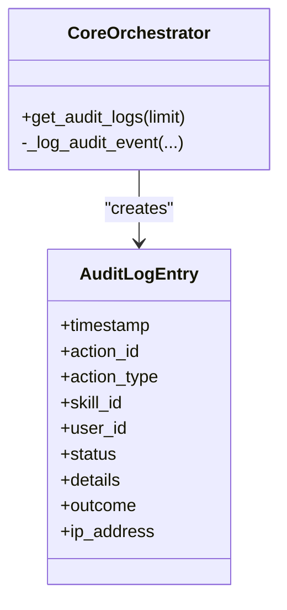

**Diagram sources**
- [orchestrator.py](file://backend/app/core/orchestrator.py#L59-L85)
- [orchestrator.py](file://backend/app/core/orchestrator.py#L429-L462)

**Section sources**
- [orchestrator.py](file://backend/app/core/orchestrator.py#L59-L85)
- [orchestrator.py](file://backend/app/core/orchestrator.py#L429-L462)

### Skill System Example: File System
The File System skill demonstrates sandboxed operations with strict security:
- Sandbox directory restriction and path traversal prevention.
- Whitelisted file extensions and size limits.
- Comprehensive audit logging for all operations.

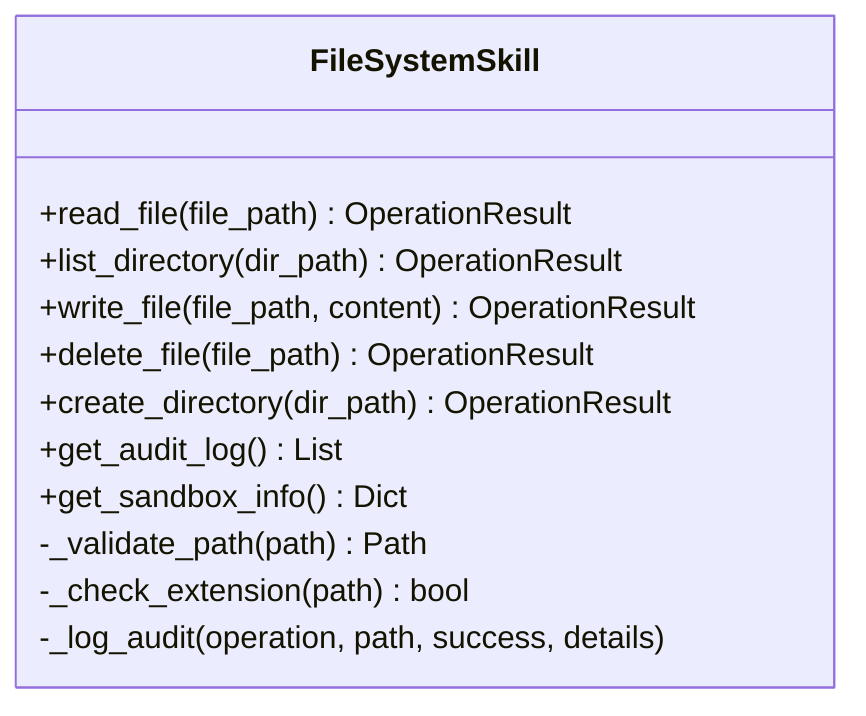

**Diagram sources**
- [skill.py](file://skills/filesystem/skill.py#L35-L76)
- [skill.py](file://skills/filesystem/skill.py#L133-L209)
- [skill.py](file://skills/filesystem/skill.py#L210-L273)
- [skill.py](file://skills/filesystem/skill.py#L274-L336)
- [skill.py](file://skills/filesystem/skill.py#L337-L393)
- [skill.py](file://skills/filesystem/skill.py#L394-L441)

**Section sources**
- [skill.py](file://skills/filesystem/skill.py#L35-L76)
- [skill.py](file://skills/filesystem/skill.py#L133-L209)
- [skill.py](file://skills/filesystem/skill.py#L210-L273)
- [skill.py](file://skills/filesystem/skill.py#L274-L336)
- [skill.py](file://skills/filesystem/skill.py#L337-L393)
- [skill.py](file://skills/filesystem/skill.py#L394-L441)

## Dependency Analysis
Technology stack and key dependencies:
- Backend: Python 3.11+, FastAPI, Pydantic, httpx, cryptography, SQLAlchemy, Alembic, pytest.
- Frontend: Next.js 15, React 19, Tailwind CSS, axios, radix-ui, lucide-react.
- Security: cryptography (Fernet), PyNaCl, seccomp configuration in sandbox.
- Sandbox: gVisor (runsc) or Kata Containers.

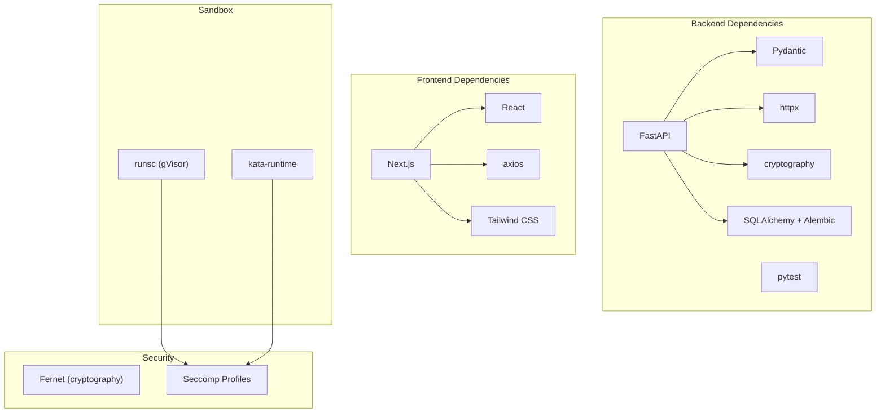

**Diagram sources**
- [requirements.txt](file://backend/requirements.txt#L4-L36)
- [package.json](file://frontend/package.json#L12-L29)

**Section sources**
- [requirements.txt](file://backend/requirements.txt#L1-L36)
- [package.json](file://frontend/package.json#L1-L38)

## Performance Considerations
- Local-first design: Ollama runs on localhost to minimize latency and avoid network-bound inference costs.
- Containerized skills: gVisor/Kata adds minimal overhead while providing strong isolation.
- Asynchronous I/O: FastAPI and httpx enable efficient concurrent operations.
- Resource limits: Agent Manager caps CPU, memory, and disk usage to prevent resource exhaustion.
- Rate limiting: Security module mitigates abuse and protects system resources.

## Troubleshooting Guide
Common issues and resolutions:
- Sandbox runtime not detected: Ensure gVisor or Kata Containers is installed and available in PATH. The Agent Manager will detect and use whichever is present.
- Ollama not reachable: Confirm Ollama is running on localhost and accessible at the expected port. The backend performs a health check during initialization.
- Provider authentication failures: Verify API keys are registered and valid via the provider management endpoints.
- HITL approvals not appearing: Check the pending actions endpoint and ensure the admin user is correctly identified.
- Audit logs missing: Confirm audit logging is enabled and the log file path is writable.

**Section sources**
- [agent_manager.py](file://backend/app/core/agent_manager.py#L99-L148)
- [orchestrator.py](file://backend/app/core/orchestrator.py#L112-L145)
- [providers.py](file://backend/app/core/providers.py#L495-L504)
- [main.py](file://backend/app/main.py#L265-L299)

## Conclusion
ClosedPaw embodies a zero-trust philosophy with hardened sandboxing, multi-provider LLM support, and a robust HITL workflow. Its security-first design—implicit distrust, encrypted storage, and comprehensive audit logging—ensures privacy and safety while maintaining flexibility and usability. The modular architecture enables extensibility through skills and channels, making it suitable for diverse use cases ranging from personal privacy to enterprise compliance scenarios.