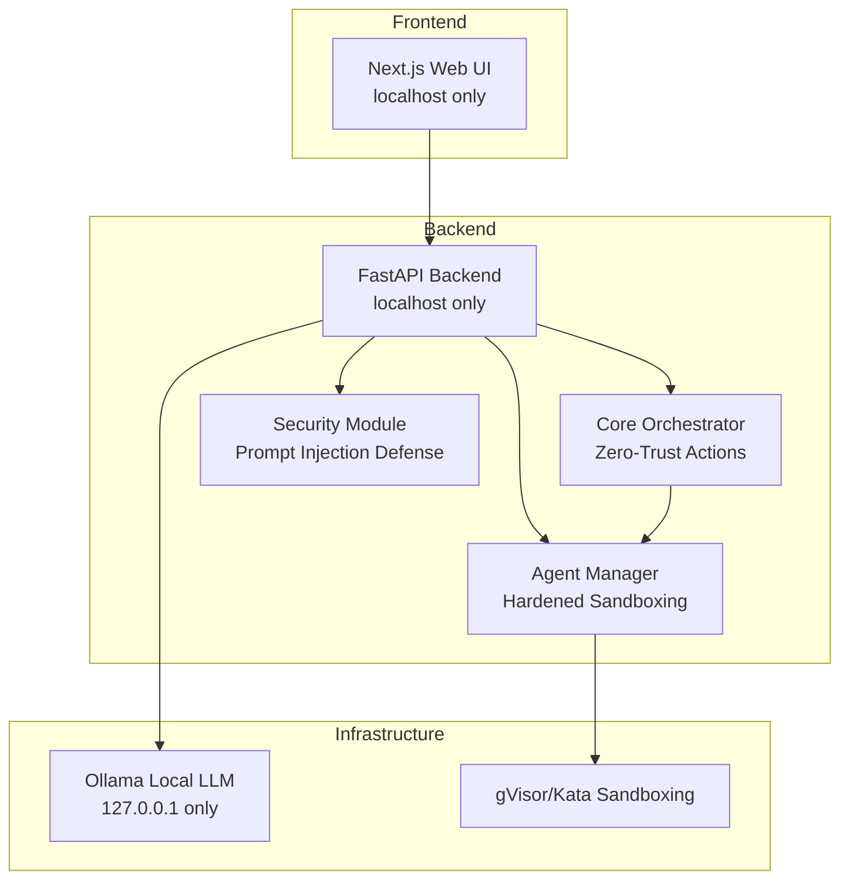
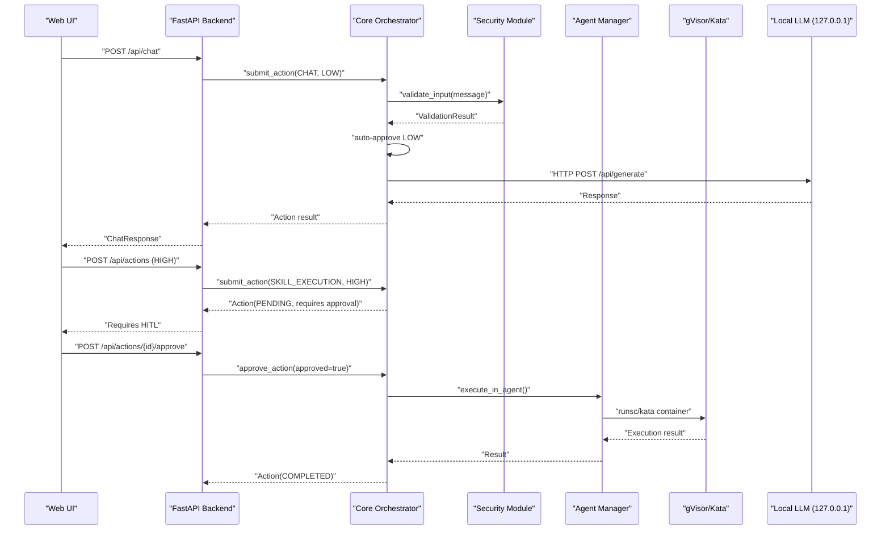
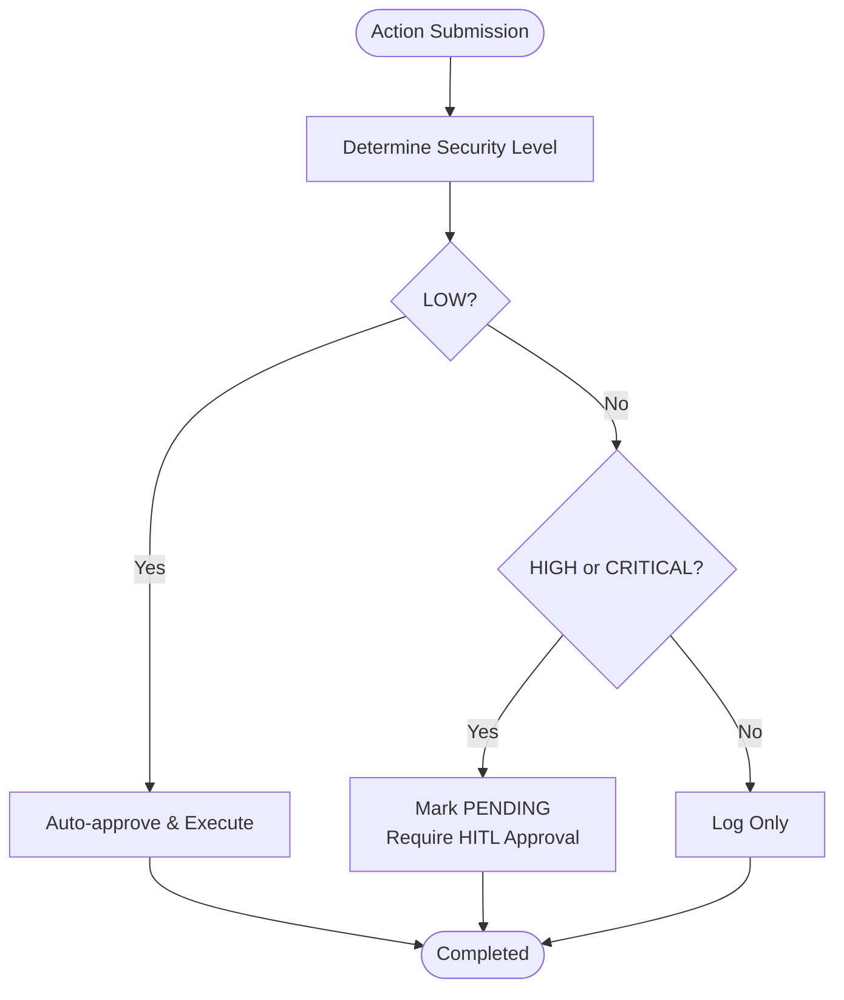
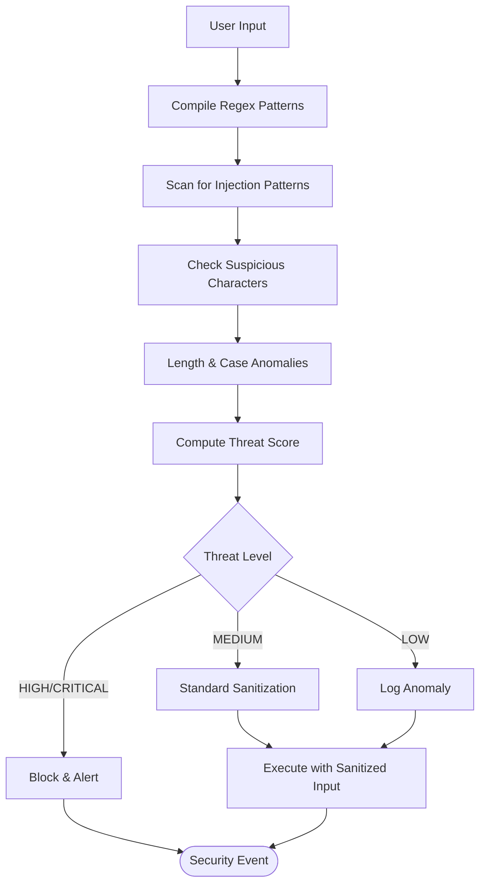
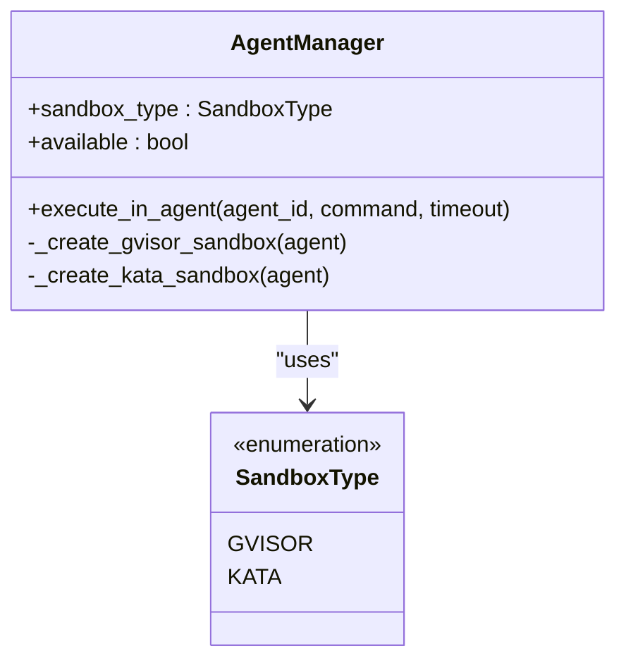
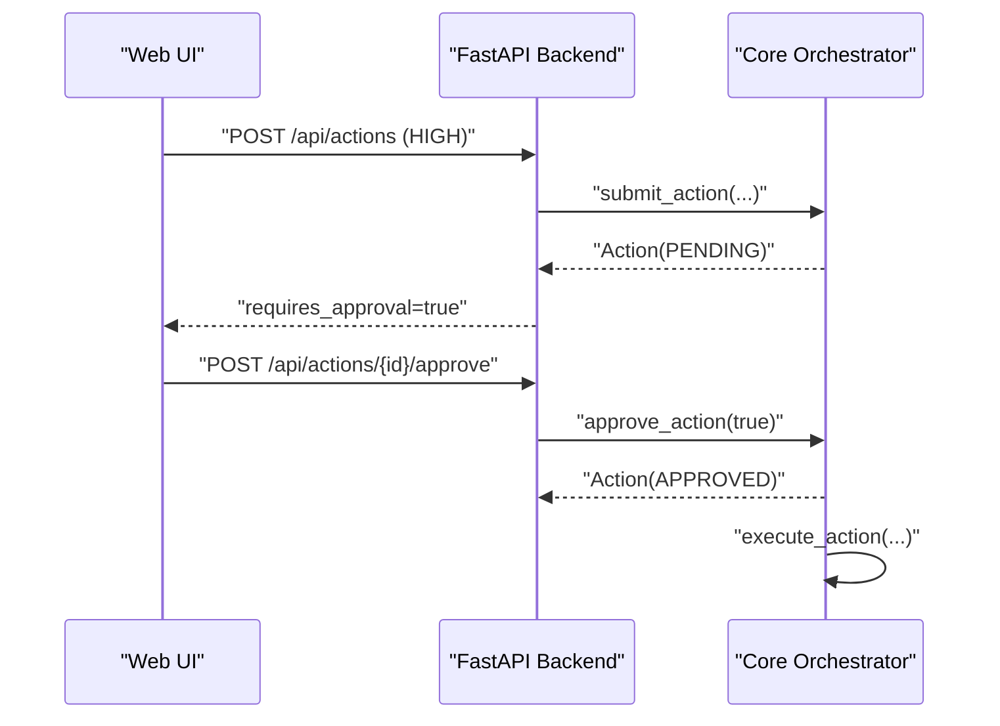
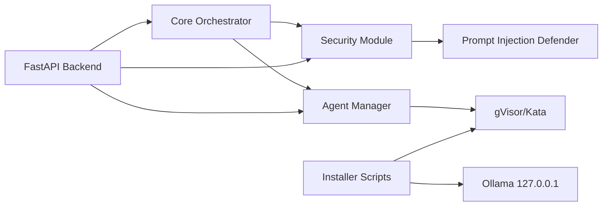

# Security Philosophy

<cite>
**Referenced Files in This Document**
- [README.md](file://README.md)
- [backend/app/core/security.py](file://backend/app/core/security.py)
- [backend/app/core/orchestrator.py](file://backend/app/core/orchestrator.py)
- [backend/app/core/agent_manager.py](file://backend/app/core/agent_manager.py)
- [backend/app/main.py](file://backend/app/main.py)
- [installer/install.sh](file://installer/install.sh)
- [installer/install.ps1](file://installer/install.ps1)
- [CONTRIBUTING.md](file://CONTRIBUTING.md)
</cite>

## Table of Contents
1. [Introduction](#introduction)
2. [Project Structure](#project-structure)
3. [Core Components](#core-components)
4. [Architecture Overview](#architecture-overview)
5. [Detailed Component Analysis](#detailed-component-analysis)
6. [Dependency Analysis](#dependency-analysis)
7. [Performance Considerations](#performance-considerations)
8. [Troubleshooting Guide](#troubleshooting-guide)
9. [Conclusion](#conclusion)

## Introduction
This document presents the ClosedPaw security philosophy centered on zero-trust principles and an implicit distrust model. The system rejects implicit trust in any component, requiring explicit verification for all actions. It prioritizes protection over convenience, enforcing hardened sandboxing with gVisor/Kata Containers, local-only operation, prompt injection defense, human-in-the-loop approvals, and comprehensive audit logging. The philosophy is designed to prevent supply chain attacks and unauthorized system access by applying layered defenses and strict operational constraints.

## Project Structure
ClosedPaw’s security architecture spans the backend orchestration layer, security enforcement modules, sandboxed agent execution, and installation-time hardening. The frontend binds to localhost only, and the backend enforces CORS and local-only listening. Installation scripts configure sandboxing and secure defaults.

**Diagram sources**
- [backend/app/main.py](file://backend/app/main.py#L80-L87)
- [backend/app/core/orchestrator.py](file://backend/app/core/orchestrator.py#L112-L129)
- [backend/app/core/security.py](file://backend/app/core/security.py#L35-L107)
- [backend/app/core/agent_manager.py](file://backend/app/core/agent_manager.py#L65-L98)
- [installer/install.sh](file://installer/install.sh#L407-L453)

**Section sources**
- [README.md](file://README.md#L65-L74)
- [backend/app/main.py](file://backend/app/main.py#L80-L87)
- [installer/install.sh](file://installer/install.sh#L407-L453)

## Core Components
- Zero-trust architecture: Rejects implicit trust; all actions are evaluated and verified before execution.
- Implicit distrust model: Treats all inputs, requests, and components as untrusted until proven safe.
- Hardened sandboxing: gVisor/Kata Containers provide kernel-level isolation; Docker alone is insufficient.
- Prompt injection defense: Detects and blocks CVE-2026-25253-type attacks using pattern matching and sanitization.
- Local-only operation: Services bind to 127.0.0.1; Web UI and API are restricted to localhost.
- Human-in-the-loop (HITL) approvals: High and critical actions require explicit user approval.
- Audit logging: Comprehensive logs for forensic analysis and compliance.
- Encrypted storage: Secrets and API keys are encrypted at rest.

**Section sources**
- [README.md](file://README.md#L65-L74)
- [backend/app/core/security.py](file://backend/app/core/security.py#L35-L107)
- [backend/app/core/orchestrator.py](file://backend/app/core/orchestrator.py#L51-L56)
- [backend/app/core/orchestrator.py](file://backend/app/core/orchestrator.py#L131-L144)
- [backend/app/core/agent_manager.py](file://backend/app/core/agent_manager.py#L21-L26)
- [backend/app/main.py](file://backend/app/main.py#L80-L87)

## Architecture Overview
The system enforces zero-trust at every layer:
- Frontend: Runs on localhost only.
- Backend: CORS allows only localhost origins; binds to 127.0.0.1; validates all inputs.
- Orchestrator: Assigns security levels to actions; auto-executes low-risk actions; requires HITL for high/critical.
- Security module: Validates user input, detects prompt injection attempts, sanitizes input, and enforces rate limits.
- Agent manager: Creates sandboxed containers using gVisor/Kata for skill execution.
- Installation: Secures Ollama to 127.0.0.1, installs sandboxing, and configures secure defaults.

**Diagram sources**
- [backend/app/main.py](file://backend/app/main.py#L131-L181)
- [backend/app/core/orchestrator.py](file://backend/app/core/orchestrator.py#L169-L223)
- [backend/app/core/security.py](file://backend/app/core/security.py#L116-L180)
- [backend/app/core/agent_manager.py](file://backend/app/core/agent_manager.py#L475-L537)

**Section sources**
- [backend/app/main.py](file://backend/app/main.py#L80-L87)
- [backend/app/core/orchestrator.py](file://backend/app/core/orchestrator.py#L225-L249)
- [backend/app/core/security.py](file://backend/app/core/security.py#L253-L287)
- [backend/app/core/agent_manager.py](file://backend/app/core/agent_manager.py#L194-L201)

## Detailed Component Analysis

### Zero-Trust Architecture and Implicit Distrust
- Implicit distrust treats all inputs, requests, and components as untrusted until explicitly validated.
- Every action is assigned a security level; only low-risk actions auto-execute; others require HITL.
- Local-only binding ensures services are not exposed beyond the host.

**Diagram sources**
- [backend/app/core/orchestrator.py](file://backend/app/core/orchestrator.py#L225-L249)
- [backend/app/core/orchestrator.py](file://backend/app/core/orchestrator.py#L169-L223)

**Section sources**
- [backend/app/core/orchestrator.py](file://backend/app/core/orchestrator.py#L51-L56)
- [backend/app/core/orchestrator.py](file://backend/app/core/orchestrator.py#L225-L249)
- [backend/app/main.py](file://backend/app/main.py#L80-L87)

### Prompt Injection Defense (CVE-2026-25253 Type)
- Pattern-based detection covers instruction override, role manipulation, delimiter manipulation, encoding obfuscation, context manipulation, persistence attempts, and tool hijacking.
- Input sanitization removes control characters, bi-directional characters, excessive special characters, and escapes markdown markers.
- Rate limiting prevents brute-force attempts.

**Diagram sources**
- [backend/app/core/security.py](file://backend/app/core/security.py#L109-L180)
- [backend/app/core/security.py](file://backend/app/core/security.py#L182-L205)
- [backend/app/core/security.py](file://backend/app/core/security.py#L207-L226)

**Section sources**
- [backend/app/core/security.py](file://backend/app/core/security.py#L41-L93)
- [backend/app/core/security.py](file://backend/app/core/security.py#L109-L180)
- [backend/app/core/security.py](file://backend/app/core/security.py#L207-L226)

### Hardened Sandboxing with gVisor/Kata Containers
- Agent Manager selects sandbox runtime (gVisor preferred, Kata as fallback) and creates isolated containers with resource limits and network isolation.
- Docker alone is intentionally excluded due to insufficient isolation; gVisor/Kata provide kernel-level sandboxing.
- Installation scripts configure gVisor on Linux/macOS and secure Ollama to 127.0.0.1.

**Diagram sources**
- [backend/app/core/agent_manager.py](file://backend/app/core/agent_manager.py#L21-L26)
- [backend/app/core/agent_manager.py](file://backend/app/core/agent_manager.py#L65-L98)
- [backend/app/core/agent_manager.py](file://backend/app/core/agent_manager.py#L194-L201)

**Section sources**
- [backend/app/core/agent_manager.py](file://backend/app/core/agent_manager.py#L65-L98)
- [backend/app/core/agent_manager.py](file://backend/app/core/agent_manager.py#L194-L201)
- [installer/install.sh](file://installer/install.sh#L191-L270)

### Human-in-the-Loop (HITL) Approvals
- High and critical actions are marked PENDING and require explicit approval via the API.
- The HITL interface integrates with the Web UI; approvals are audited and enforced by the orchestrator.

**Diagram sources**
- [backend/app/main.py](file://backend/app/main.py#L241-L262)
- [backend/app/main.py](file://backend/app/main.py#L284-L298)
- [backend/app/core/orchestrator.py](file://backend/app/core/orchestrator.py#L376-L427)

**Section sources**
- [backend/app/core/orchestrator.py](file://backend/app/core/orchestrator.py#L51-L56)
- [backend/app/core/orchestrator.py](file://backend/app/core/orchestrator.py#L210-L214)
- [backend/app/main.py](file://backend/app/main.py#L265-L298)

### Local-Only Operation and Network Constraints
- Frontend runs on localhost only.
- Backend enforces CORS allowing only localhost origins.
- Backend binds to 127.0.0.1; API and Web UI are restricted to localhost.
- Installation scripts configure Ollama to listen on 127.0.0.1 only.

**Section sources**
- [frontend/package.json](file://frontend/package.json#L7-L9)
- [backend/app/main.py](file://backend/app/main.py#L80-L87)
- [backend/app/main.py](file://backend/app/main.py#L557-L567)
- [installer/install.sh](file://installer/install.sh#L407-L453)

### Audit Logging and Forensic Analysis
- All actions are logged with timestamps, action types, statuses, outcomes, and details.
- Audit logs are retrievable via API for monitoring and incident response.

**Section sources**
- [backend/app/core/orchestrator.py](file://backend/app/core/orchestrator.py#L59-L69)
- [backend/app/core/orchestrator.py](file://backend/app/core/orchestrator.py#L429-L449)
- [backend/app/main.py](file://backend/app/main.py#L322-L339)

### Encrypted Storage for Secrets
- DataVault stores sensitive data encrypted at rest using a generated key.
- Access control levels enforce least privilege for secret retrieval.

**Section sources**
- [backend/app/core/security.py](file://backend/app/core/security.py#L325-L434)

## Dependency Analysis
The security model depends on tight coupling between the orchestrator, security module, agent manager, and installation scripts. The orchestrator determines security levels and delegates execution to the agent manager, which enforces sandboxing. The security module provides input validation and rate limiting. Installation scripts ensure secure defaults and sandboxing.

**Diagram sources**
- [backend/app/core/orchestrator.py](file://backend/app/core/orchestrator.py#L87-L110)
- [backend/app/core/security.py](file://backend/app/core/security.py#L35-L107)
- [backend/app/core/agent_manager.py](file://backend/app/core/agent_manager.py#L65-L98)
- [installer/install.sh](file://installer/install.sh#L191-L270)
- [installer/install.sh](file://installer/install.sh#L407-L453)

**Section sources**
- [backend/app/core/__init__.py](file://backend/app/core/__init__.py#L5-L7)
- [backend/app/main.py](file://backend/app/main.py#L14-L16)

## Performance Considerations
- Input validation and sanitization add minimal overhead compared to the benefits of preventing prompt injection.
- Sandboxing introduces containerization overhead; gVisor/Kata provide strong isolation with acceptable performance for local AI tasks.
- Rate limiting prevents abuse without impacting legitimate users.
- Local-only operation reduces exposure and simplifies security posture.

[No sources needed since this section provides general guidance]

## Troubleshooting Guide
Common security issues and resolutions:
- Prompt injection attempts blocked: Review validation results and recommendations; adjust input or improve sanitization.
- Sandbox not available: Ensure gVisor/Kata is installed and configured; installation scripts can help automate setup.
- Local-only binding errors: Verify services are bound to 127.0.0.1; check CORS configuration.
- HITL approvals stuck: Check pending actions via API and approve/reject as needed.
- Audit logs missing: Confirm logging configuration and file permissions.

**Section sources**
- [backend/app/core/security.py](file://backend/app/core/security.py#L228-L251)
- [installer/install.sh](file://installer/install.sh#L272-L288)
- [backend/app/main.py](file://backend/app/main.py#L80-L87)
- [backend/app/main.py](file://backend/app/main.py#L265-L298)
- [backend/app/core/orchestrator.py](file://backend/app/core/orchestrator.py#L429-L449)

## Conclusion
ClosedPaw’s security philosophy is built on zero-trust and implicit distrust, ensuring that no component or action is trusted implicitly. The combination of hardened sandboxing, prompt injection defense, local-only operation, human-in-the-loop approvals, comprehensive audit logging, and encrypted storage delivers robust protection against supply chain attacks and unauthorized access. Users must install gVisor/Kata Containers for proper isolation and avoid disabling security features for convenience. Maintaining a strong security posture requires adherence to these principles and careful operational discipline.