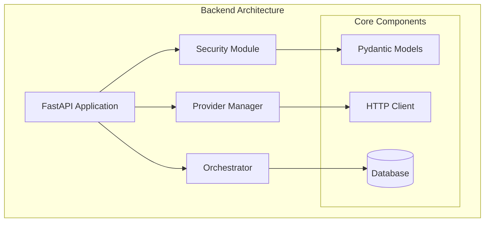
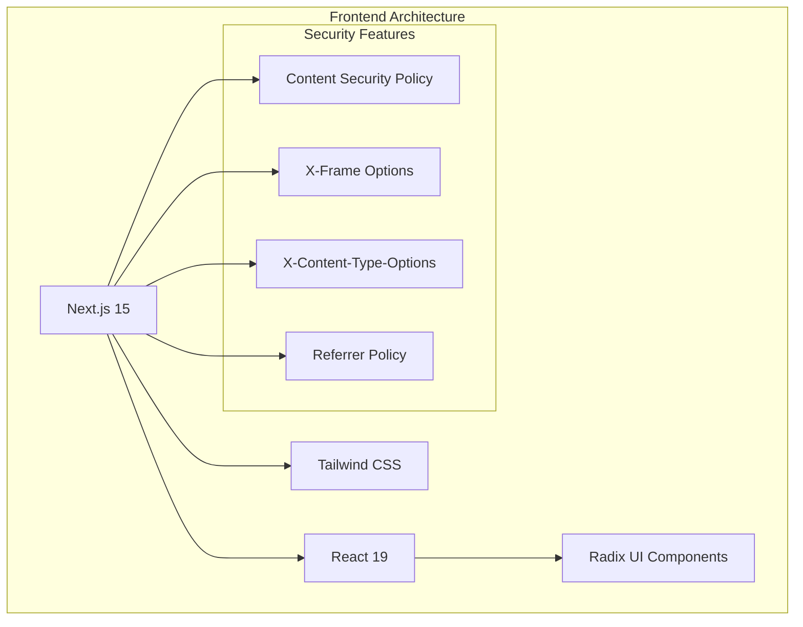
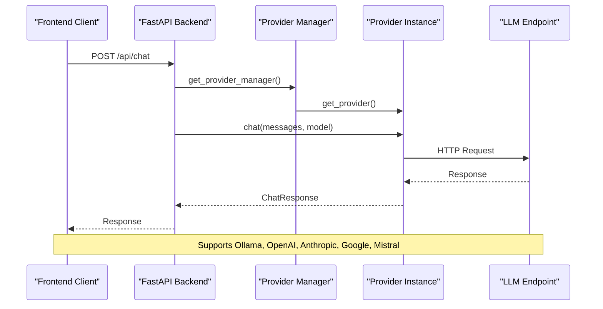
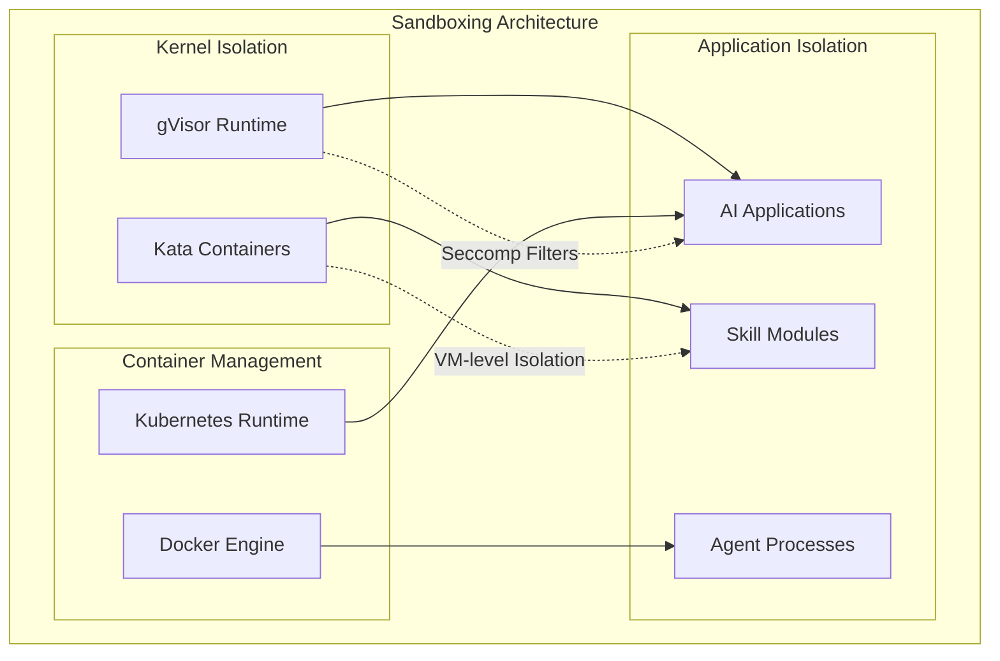
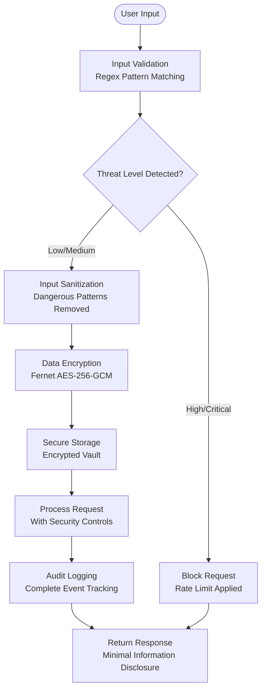

# Technology Stack

<cite>
**Referenced Files in This Document**
- [requirements.txt](file://backend/requirements.txt)
- [main.py](file://backend/app/main.py)
- [security.py](file://backend/app/core/security.py)
- [providers.py](file://backend/app/core/providers.py)
- [package.json](file://package.json)
- [package.json](file://frontend/package.json)
- [next.config.js](file://frontend/next.config.js)
- [tailwind.config.js](file://frontend/tailwind.config.js)
- [page.tsx](file://frontend/src/app/page.tsx)
- [layout.tsx](file://frontend/src/app/layout.tsx)
- [README.md](file://README.md)
</cite>

## Table of Contents
1. [Introduction](#introduction)
2. [Backend Stack](#backend-stack)
3. [Frontend Stack](#frontend-stack)
4. [LLM Integration Architecture](#llm-integration-architecture)
5. [Sandboxing Technology Stack](#sandboxing-technology-stack)
6. [Security Framework Components](#security-framework-components)
7. [Version Requirements and Compatibility](#version-requirements-and-compatibility)
8. [Upgrade Considerations](#upgrade-considerations)
9. [Security Objective Alignment](#security-objective-alignment)
10. [Conclusion](#conclusion)

## Introduction

ClosedPaw implements a comprehensive security-oriented technology stack designed around zero-trust principles and kernel-level isolation. The system combines modern web frameworks with robust security controls, multi-provider LLM support, and advanced sandboxing technologies to deliver a privacy-first AI assistant that operates entirely on-device.

The technology choices reflect deliberate security trade-offs prioritizing defense in depth, local-first operation, and comprehensive isolation over convenience and performance alone.

## Backend Stack

The backend leverages Python 3.11+ with FastAPI for secure API development, implementing comprehensive input validation and security controls at every layer.

**Diagram sources**
- [main.py](file://backend/app/main.py#L1-L567)
- [security.py](file://backend/app/core/security.py#L1-L455)
- [providers.py](file://backend/app/core/providers.py#L1-L545)

### Core Technologies

The backend stack centers on several key technologies that work together to provide security and reliability:

**FastAPI 0.115.0**: Provides automatic OpenAPI documentation, dependency injection, and built-in security features. The application uses localhost-only binding and comprehensive CORS configuration for security.

**Pydantic 2.9.0**: Implements strict data validation and serialization with automatic schema generation and runtime type checking.

**Pydantic-AI 0.0.15**: Extends validation capabilities for AI-specific data structures and prompts.

**Security Libraries**: Comprehensive cryptography stack including cryptography 43.0.3, PyNaCl 1.5.0, python-jose 3.3.0, and passlib 1.7.4 for encryption, authentication, and secure token handling.

**Database Layer**: SQLAlchemy 2.0.36 with Alembic 1.14.0 for ORM and database migrations.

**Section sources**
- [requirements.txt](file://backend/requirements.txt#L1-L36)
- [main.py](file://backend/app/main.py#L72-L87)

### Security Implementation

The backend implements multiple layers of security controls:

- **Input Validation**: Comprehensive prompt injection detection using regex patterns and behavioral analysis
- **Rate Limiting**: Request throttling to prevent abuse
- **Data Encryption**: Fernet encryption for sensitive data storage
- **Audit Logging**: Complete action tracking for forensic analysis
- **CORS Restriction**: Strict origin-based access control

**Section sources**
- [security.py](file://backend/app/core/security.py#L35-L287)
- [main.py](file://backend/app/main.py#L80-L87)

## Frontend Stack

The frontend utilizes Next.js 15 with React 19 and Tailwind CSS to create a secure, responsive user interface optimized for zero-trust operation.

**Diagram sources**
- [package.json](file://frontend/package.json#L12-L29)
- [next.config.js](file://frontend/next.config.js#L1-L42)

### Technology Components

**Next.js 15.1.0**: Modern React framework with static generation, server-side rendering, and comprehensive security headers.

**React 19**: Latest React version with improved performance and security features.

**Tailwind CSS 3.4.15**: Utility-first CSS framework with custom security-focused color palette and responsive design.

**UI Components**: Radix UI primitives (Dialog, Dropdown Menu, Select, Tabs, Toast) for accessible, secure component architecture.

**Security Headers**: Comprehensive HTTP security headers including CSP, X-Frame-Options, X-Content-Type-Options, and Referrer-Policy.

**Section sources**
- [package.json](file://frontend/package.json#L12-L38)
- [next.config.js](file://frontend/next.config.js#L3-L40)

### Security Configuration

The frontend implements strict security policies:

- **Content Security Policy**: Restricts script, style, and image sources to trusted origins only
- **Localhost Binding**: Connects exclusively to backend on 127.0.0.1:8000
- **Image Optimization**: Disabled external image domains to prevent data leakage
- **Powered-by Header**: Removed to reduce information disclosure

**Section sources**
- [next.config.js](file://frontend/next.config.js#L22-L33)
- [page.tsx](file://frontend/src/app/page.tsx#L27)

## LLM Integration Architecture

ClosedPaw implements a sophisticated multi-provider LLM gateway supporting both local Ollama deployment and optional cloud providers with unified interfaces and security controls.

**Diagram sources**
- [providers.py](file://backend/app/core/providers.py#L418-L483)
- [main.py](file://backend/app/main.py#L131-L182)

### Provider Architecture

The system supports multiple LLM providers through a unified interface:

**Ollama Provider**: Local-only deployment with 127.0.0.1 binding, supporting llama3.2:3b, mistral:7b, and qwen2.5-coder:7b models.

**Cloud Providers**: OpenAI, Anthropic, Google Gemini, and Mistral with configurable API keys and rate limiting.

**Custom Providers**: Extensible architecture for additional LLM providers.

**Section sources**
- [providers.py](file://backend/app/core/providers.py#L102-L161)
- [providers.py](file://backend/app/core/providers.py#L163-L294)
- [main.py](file://backend/app/main.py#L383-L462)

### Multi-Provider Support

The architecture enables seamless switching between providers with consistent interfaces:

- **Unified API**: Same request/response format across all providers
- **Health Monitoring**: Automatic provider availability checks
- **Failover Support**: Graceful degradation when providers are unavailable
- **Rate Limiting**: Provider-specific request limits and throttling

**Section sources**
- [providers.py](file://backend/app/core/providers.py#L418-L524)

## Sandboxing Technology Stack

ClosedPaw implements advanced sandboxing using gVisor and Kata Containers for kernel-level isolation, going beyond traditional Docker containerization to provide true security boundaries.

**Diagram sources**
- [README.md](file://README.md#L19-L24)

### Isolation Technologies

**gVisor**: Container kernel replacement providing strong isolation between containers and host system. Provides syscall filtering and reduced attack surface.

**Kata Containers**: VM-based containers offering complete OS-level isolation with hardware acceleration support.

**Seccomp**: System call filtering to restrict container capabilities and prevent privilege escalation.

**Section sources**
- [README.md](file://README.md#L68-L69)

### Security Benefits

The sandboxing stack provides multiple security advantages:

- **Kernel-level Isolation**: Prevents container breakout attacks
- **Reduced Attack Surface**: Limits available system calls and capabilities
- **Hardware Acceleration**: Maintains performance while enhancing security
- **Platform Flexibility**: Works across Linux, macOS, and Windows environments

**Section sources**
- [README.md](file://README.md#L21-L23)

## Security Framework Components

The security framework implements defense-in-depth with multiple overlapping security layers designed to protect against sophisticated attacks and maintain zero-trust operation.

**Diagram sources**
- [security.py](file://backend/app/core/security.py#L116-L181)
- [security.py](file://backend/app/core/security.py#L325-L435)

### Core Security Components

**Prompt Injection Defender**: Comprehensive protection against prompt injection attacks using multiple detection mechanisms:

- **Pattern Recognition**: Regex-based detection of injection attempts
- **Behavioral Analysis**: Heuristic detection of suspicious input patterns
- **Threat Scoring**: Weighted scoring system for threat assessment
- **Automatic Sanitization**: Safe removal of dangerous patterns

**Data Vault**: Encrypted storage for sensitive information:

- **Fernet Encryption**: Symmetric encryption with automatic key management
- **Access Control**: Role-based access to sensitive data
- **Audit Trail**: Complete logging of all data access attempts
- **Secure Defaults**: Production-ready encryption key generation

**Rate Limiting**: Protection against abuse and DoS attacks:

- **Sliding Window**: Accurate request counting over time windows
- **Multiple Contexts**: Different limits for different types of requests
- **IP-based Tracking**: Distributed denial-of-service prevention

**Section sources**
- [security.py](file://backend/app/core/security.py#L35-L287)
- [security.py](file://backend/app/core/security.py#L290-L318)
- [security.py](file://backend/app/core/security.py#L325-L435)

### Security Controls

The system implements comprehensive security controls:

- **Input Validation**: Multi-layered validation preventing injection attacks
- **Output Encoding**: Safe rendering of AI responses to prevent XSS
- **Access Control**: Role-based permissions for system operations
- **Audit Logging**: Complete traceability of all system actions
- **Encryption**: End-to-end encryption for sensitive data

**Section sources**
- [security.py](file://backend/app/core/security.py#L1-L455)

## Version Requirements and Compatibility

ClosedPaw maintains strict version requirements to ensure security and compatibility across all components.

### Backend Requirements

**Python 3.11+**: Minimum requirement for security features and modern language constructs.

**FastAPI 0.115.0**: Latest version providing enhanced security features and performance improvements.

**Pydantic 2.9.0**: Modern validation library with comprehensive type checking.

**Security Libraries**: All cryptography libraries maintained at latest secure versions.

### Frontend Requirements

**Node.js 18+**: Ensures compatibility with modern JavaScript features and security updates.

**Next.js 15.1.0**: Latest React framework with enhanced security features.

**React 19**: Latest React version with improved performance and security.

### Platform Compatibility

**Linux/macOS**: Full gVisor/Kata sandboxing support with native container security.

**Windows**: Limited to Docker Desktop or WSL2; full sandboxing unavailable on Windows Home.

**Section sources**
- [requirements.txt](file://backend/requirements.txt#L2)
- [package.json](file://package.json#L39-L41)
- [package.json](file://frontend/package.json#L13-L15)
- [README.md](file://README.md#L19-L24)

## Upgrade Considerations

Upgrading ClosedPaw requires careful consideration of security implications and compatibility requirements.

### Security-Critical Upgrades

**Python 3.11+**: Required for security features; ensure backward compatibility with existing deployments.

**FastAPI 0.115.0**: Major version upgrade may require API changes; test thoroughly before deployment.

**Cryptography Libraries**: Regular updates essential for security; automated dependency scanning recommended.

### Frontend Upgrade Strategy

**Next.js 15.1.0**: Breaking changes possible; test all UI components and security headers.

**React 19**: New React features may require code modifications; gradual migration recommended.

**Tailwind CSS 3.4.15**: Utility class changes may affect styling; comprehensive testing required.

### Platform-Specific Considerations

**gVisor/Kata Updates**: Kernel-level changes may affect sandboxing behavior; test thoroughly.

**Ollama Compatibility**: Local LLM updates may change API behavior; monitor for breaking changes.

**Section sources**
- [requirements.txt](file://backend/requirements.txt#L1-L36)
- [package.json](file://frontend/package.json#L1-L38)

## Security Objective Alignment

Each technology choice in ClosedPaw directly supports the security objectives and zero-trust architecture through deliberate design decisions.

### Zero-Trust Implementation

**Implicit Deny**: All systems operate on deny-by-default principles with explicit permission grants.

**Continuous Verification**: Multi-layered validation and monitoring ensure ongoing security compliance.

**Least Privilege**: Minimal permissions granted to all system components and users.

**Never Trust, Always Verify**: Every request undergoes comprehensive validation and security checks.

### Kernel-Level Isolation

**gVisor Integration**: Container kernel replacement reduces attack surface and prevents container breakout.

**Kata Containers**: VM-level isolation provides complete OS separation for high-risk operations.

**Seccomp Filtering**: System call restrictions prevent privilege escalation and unauthorized operations.

### Privacy-First Design

**Local-Only Operation**: All processing occurs on-device with no data transmission to external servers.

**Encrypted Storage**: Sensitive data protected at rest using industry-standard encryption.

**Minimal Data Collection**: Comprehensive data minimization with no telemetry or analytics.

### Defense in Depth

**Layered Security**: Multiple overlapping security controls provide comprehensive protection.

**Fail-Safe Defaults**: Security measures activated by default with no opt-out possibilities.

**Comprehensive Monitoring**: Complete audit trails and real-time security event detection.

**Section sources**
- [README.md](file://README.md#L65-L105)
- [security.py](file://backend/app/core/security.py#L35-L287)

## Conclusion

ClosedPaw's technology stack represents a comprehensive approach to secure AI assistant development, combining modern web frameworks with advanced security controls and kernel-level isolation. The deliberate choice of technologies reflects a commitment to zero-trust principles, privacy-first operation, and defense-in-depth security.

The stack successfully balances security requirements with usability, providing a robust foundation for privacy-conscious AI applications while maintaining the flexibility to adapt to evolving security threats and technological advances.