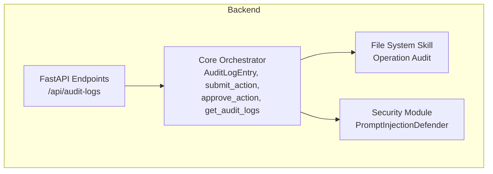
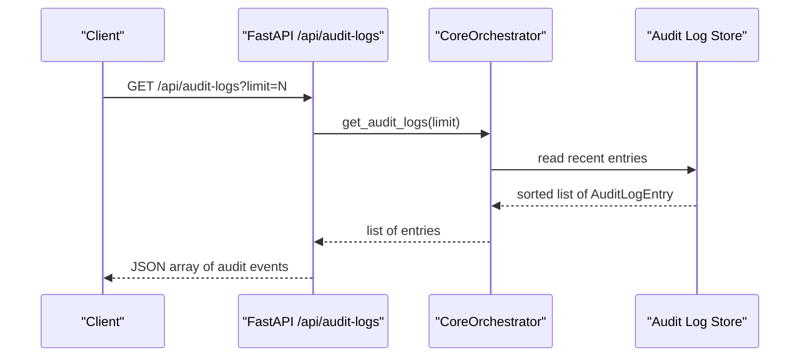
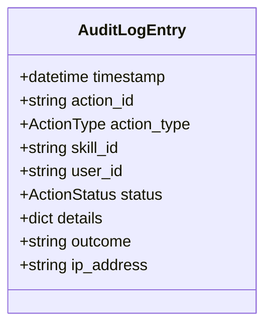
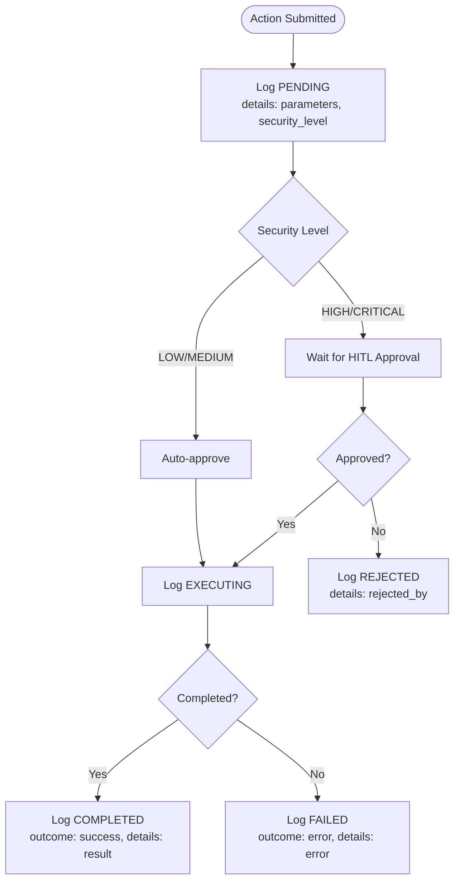
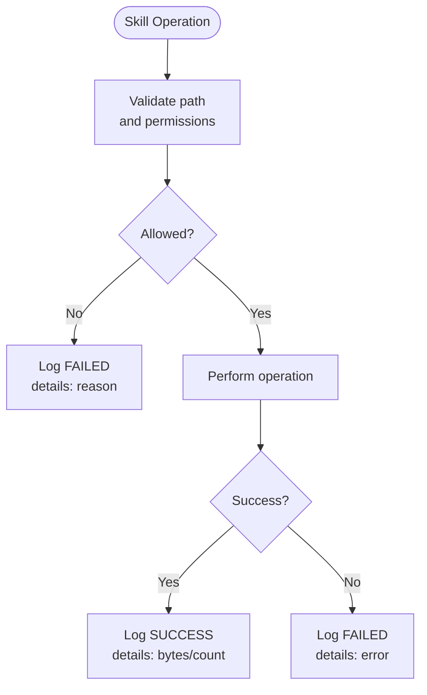
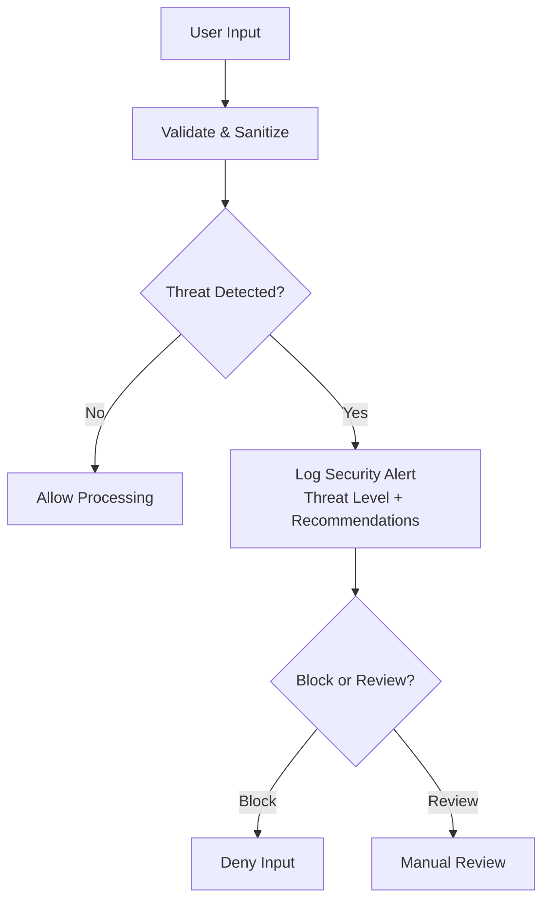
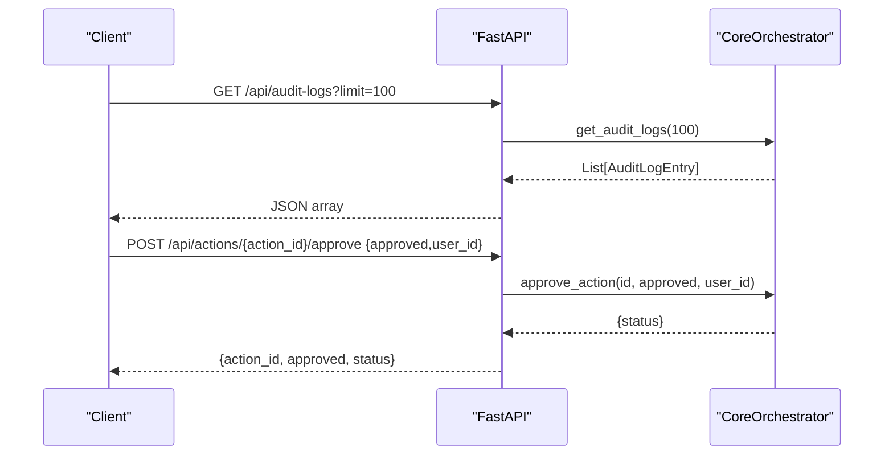
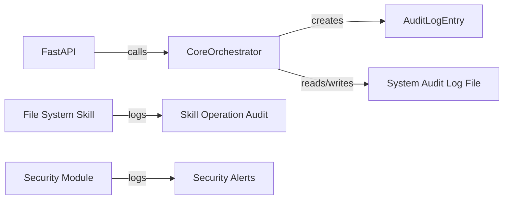

# Audit and Compliance Logging

<cite>
**Referenced Files in This Document**
- [backend/app/main.py](file://backend/app/main.py)
- [backend/app/core/orchestrator.py](file://backend/app/core/orchestrator.py)
- [backend/app/core/security.py](file://backend/app/core/security.py)
- [skills/filesystem/skill.py](file://skills/filesystem/skill.py)
- [README.md](file://README.md)
- [CONTRIBUTING.md](file://CONTRIBUTING.md)
</cite>

## Table of Contents
1. [Introduction](#introduction)
2. [Project Structure](#project-structure)
3. [Core Components](#core-components)
4. [Architecture Overview](#architecture-overview)
5. [Detailed Component Analysis](#detailed-component-analysis)
6. [Dependency Analysis](#dependency-analysis)
7. [Performance Considerations](#performance-considerations)
8. [Troubleshooting Guide](#troubleshooting-guide)
9. [Conclusion](#conclusion)
10. [Appendices](#appendices)

## Introduction
This document describes ClosedPaw’s audit and compliance logging system. It explains the AuditLogEntry data model, how comprehensive audit trails are generated for all system actions, and how forensic analysis is supported. It also documents the audit event structure, security level impact on logging, IP address tracking, compliance reporting features, storage mechanisms, retention policies, search and filtering capabilities, and integration points with external compliance systems. Practical examples, compliance reporting templates, security incident investigation procedures, and the audit log API endpoints are included, along with guidance on audit log integrity, tamper detection, and best practices for maintaining audit trails.

## Project Structure
The audit and compliance logging spans several modules:
- Core orchestrator manages system actions, security levels, and audit logging for central operations.
- The FastAPI backend exposes audit log retrieval endpoints.
- The filesystem skill maintains its own operation audit trail.
- Security module provides prompt injection defense and related logging.
- Documentation emphasizes audit logging as a core security requirement.

**Diagram sources**
- [backend/app/main.py](file://backend/app/main.py#L322-L339)
- [backend/app/core/orchestrator.py](file://backend/app/core/orchestrator.py#L59-L70)
- [backend/app/core/security.py](file://backend/app/core/security.py#L16-L23)
- [skills/filesystem/skill.py](file://skills/filesystem/skill.py#L115-L131)

**Section sources**
- [README.md](file://README.md#L65-L74)
- [CONTRIBUTING.md](file://CONTRIBUTING.md#L109-L111)

## Core Components
- AuditLogEntry: The primary audit event model capturing timestamps, action identifiers, type, skill association, user identity, status, outcome, and details. IP address is supported for tracking.
- CoreOrchestrator: Central component that generates audit logs for all submitted actions, approvals, rejections, completions, and failures. It maintains an in-memory audit log list and writes to a system audit log file.
- File System Skill: Maintains a separate operation audit log for file operations (read, write, delete, list, create_dir), recording timestamps, operations, paths, success/failure, and details.
- Security Module: Provides prompt injection defense and logs security events when threats are detected.
- API Endpoints: Expose audit log retrieval via GET /api/audit-logs with configurable limit.

Key implementation references:
- AuditLogEntry definition and logging method
- Audit event generation during action lifecycle
- File system operation audit logging
- Security threat detection and logging
- Audit log API endpoint

**Section sources**
- [backend/app/core/orchestrator.py](file://backend/app/core/orchestrator.py#L59-L70)
- [backend/app/core/orchestrator.py](file://backend/app/core/orchestrator.py#L429-L450)
- [skills/filesystem/skill.py](file://skills/filesystem/skill.py#L115-L131)
- [backend/app/core/security.py](file://backend/app/core/security.py#L167-L180)
- [backend/app/main.py](file://backend/app/main.py#L322-L339)

## Architecture Overview
The audit and compliance architecture integrates centralized logging in the orchestrator with skill-specific logs and security monitoring. The API provides a single interface to retrieve consolidated audit records.

**Diagram sources**
- [backend/app/main.py](file://backend/app/main.py#L322-L339)
- [backend/app/core/orchestrator.py](file://backend/app/core/orchestrator.py#L459-L461)

## Detailed Component Analysis

### AuditLogEntry Data Model
- Fields: timestamp, action_id, action_type, skill_id, user_id, status, details, outcome, ip_address.
- Purpose: Capture a complete audit event for forensic analysis and compliance reporting.
- Usage: Constructed and appended to the orchestrator’s audit log list and written to the system audit log file.

**Diagram sources**
- [backend/app/core/orchestrator.py](file://backend/app/core/orchestrator.py#L59-L70)

**Section sources**
- [backend/app/core/orchestrator.py](file://backend/app/core/orchestrator.py#L59-L70)

### Audit Event Generation Across Lifecycle
- Submission: Logs PENDING with parameters and security level.
- Approval/Rejection: Logs APPROVED or REJECTED with approver identity.
- Execution: Logs EXECUTING, then COMPLETED or FAILED with outcome and details.
- File System Skill: Logs individual file operations with success/failure and details.

**Diagram sources**
- [backend/app/core/orchestrator.py](file://backend/app/core/orchestrator.py#L199-L206)
- [backend/app/core/orchestrator.py](file://backend/app/core/orchestrator.py#L400-L407)
- [backend/app/core/orchestrator.py](file://backend/app/core/orchestrator.py#L417-L423)
- [backend/app/core/orchestrator.py](file://backend/app/core/orchestrator.py#L276-L283)
- [backend/app/core/orchestrator.py](file://backend/app/core/orchestrator.py#L292-L299)

**Section sources**
- [backend/app/core/orchestrator.py](file://backend/app/core/orchestrator.py#L199-L206)
- [backend/app/core/orchestrator.py](file://backend/app/core/orchestrator.py#L400-L407)
- [backend/app/core/orchestrator.py](file://backend/app/core/orchestrator.py#L417-L423)
- [backend/app/core/orchestrator.py](file://backend/app/core/orchestrator.py#L276-L283)
- [backend/app/core/orchestrator.py](file://backend/app/core/orchestrator.py#L292-L299)

### File System Skill Audit Trail
- Tracks read, write, delete, list, create_dir operations.
- Records timestamp, operation, path, success/failure, and details.
- Maintains its own in-memory audit log list.

**Diagram sources**
- [skills/filesystem/skill.py](file://skills/filesystem/skill.py#L115-L131)
- [skills/filesystem/skill.py](file://skills/filesystem/skill.py#L143-L208)
- [skills/filesystem/skill.py](file://skills/filesystem/skill.py#L337-L392)

**Section sources**
- [skills/filesystem/skill.py](file://skills/filesystem/skill.py#L115-L131)
- [skills/filesystem/skill.py](file://skills/filesystem/skill.py#L143-L208)
- [skills/filesystem/skill.py](file://skills/filesystem/skill.py#L337-L392)

### Security Threat Detection and Logging
- Detects prompt injection attempts and logs security alerts with threat levels.
- Provides recommendations and rate-limiting integration.

**Diagram sources**
- [backend/app/core/security.py](file://backend/app/core/security.py#L167-L180)
- [backend/app/core/security.py](file://backend/app/core/security.py#L232-L251)

**Section sources**
- [backend/app/core/security.py](file://backend/app/core/security.py#L167-L180)
- [backend/app/core/security.py](file://backend/app/core/security.py#L232-L251)

### Audit Log API Endpoints
- GET /api/audit-logs?limit=N: Returns recent audit events in descending timestamp order.
- GET /api/actions/{action_id}: Retrieves action status and timing for correlation.
- POST /api/actions/{action_id}/approve: Approves or rejects pending actions, generating audit events.

**Diagram sources**
- [backend/app/main.py](file://backend/app/main.py#L322-L339)
- [backend/app/main.py](file://backend/app/main.py#L284-L298)

**Section sources**
- [backend/app/main.py](file://backend/app/main.py#L322-L339)
- [backend/app/main.py](file://backend/app/main.py#L284-L298)
- [backend/app/main.py](file://backend/app/main.py#L301-L319)

## Dependency Analysis
- CoreOrchestrator depends on Pydantic models for typed audit events and maintains an in-memory list of AuditLogEntry.
- File System Skill maintains its own operation audit log dictionary list.
- Security module logs to the system logger and influences policy decisions.
- API layer delegates to CoreOrchestrator for audit log retrieval.

**Diagram sources**
- [backend/app/core/orchestrator.py](file://backend/app/core/orchestrator.py#L446-L449)
- [skills/filesystem/skill.py](file://skills/filesystem/skill.py#L127-L131)
- [backend/app/core/security.py](file://backend/app/core/security.py#L177-L178)
- [backend/app/main.py](file://backend/app/main.py#L322-L339)

**Section sources**
- [backend/app/core/orchestrator.py](file://backend/app/core/orchestrator.py#L446-L449)
- [skills/filesystem/skill.py](file://skills/filesystem/skill.py#L127-L131)
- [backend/app/core/security.py](file://backend/app/core/security.py#L177-L178)
- [backend/app/main.py](file://backend/app/main.py#L322-L339)

## Performance Considerations
- In-memory audit log lists: Sorting and slicing are O(n log n) and O(k) respectively; ensure appropriate limit values for large workloads.
- File logging overhead: Writing to disk for each audit event adds latency; consider batching or asynchronous logging in high-throughput scenarios.
- Filtering and retrieval: Prefer server-side filtering (limit) and avoid retrieving entire histories unless necessary.

[No sources needed since this section provides general guidance]

## Troubleshooting Guide
Common issues and resolutions:
- Audit logs not appearing:
  - Verify the audit configuration flag enabling all actions logging.
  - Confirm the system audit log file path and permissions.
- Missing IP address in logs:
  - The AuditLogEntry supports an IP address field; ensure upstream proxy or gateway sets X-Forwarded-For or similar headers and the API layer extracts and passes it to the orchestrator.
- High memory usage:
  - Reduce limit on audit log retrieval or implement offloading to persistent storage.
- File system skill audit gaps:
  - Confirm the skill’s sandbox directory and permissions; ensure the audit log list is being appended and retrieved.

**Section sources**
- [backend/app/core/orchestrator.py](file://backend/app/core/orchestrator.py#L433-L434)
- [backend/app/core/orchestrator.py](file://backend/app/core/orchestrator.py#L18-L28)
- [skills/filesystem/skill.py](file://skills/filesystem/skill.py#L115-L131)

## Conclusion
ClosedPaw’s audit and compliance logging system provides comprehensive coverage of system actions, skill operations, and security events. The AuditLogEntry model captures essential attributes for forensic analysis, while the API enables compliance reporting and integration with external systems. By combining centralized orchestration logs, skill-specific operation logs, and security event logging, organizations can maintain robust audit trails aligned with zero-trust principles.

[No sources needed since this section summarizes without analyzing specific files]

## Appendices

### Audit Event Structure
- Core Orchestrator events:
  - Timestamp, action_id, action_type, skill_id, user_id, status, outcome, details, ip_address.
- File System Skill events:
  - Timestamp, operation, path, success, details.

**Section sources**
- [backend/app/core/orchestrator.py](file://backend/app/core/orchestrator.py#L59-L70)
- [skills/filesystem/skill.py](file://skills/filesystem/skill.py#L115-L131)

### Security Level Impact on Logging
- LOW: Auto-executed; logs PENDING and final outcome.
- MEDIUM: Logged at submission and completion.
- HIGH/CRITICAL: Requires HITL; logs PENDING, APPROVED/REJECTED, and final outcome.

**Section sources**
- [backend/app/core/orchestrator.py](file://backend/app/core/orchestrator.py#L210-L214)
- [backend/app/core/orchestrator.py](file://backend/app/core/orchestrator.py#L400-L407)
- [backend/app/core/orchestrator.py](file://backend/app/core/orchestrator.py#L417-L423)

### IP Address Tracking
- The AuditLogEntry supports an ip_address field; populate it from upstream headers (e.g., X-Forwarded-For) in the API layer before invoking the orchestrator.

**Section sources**
- [backend/app/core/orchestrator.py](file://backend/app/core/orchestrator.py#L69)
- [backend/app/main.py](file://backend/app/main.py#L284-L298)

### Compliance Reporting Features
- Endpoint: GET /api/audit-logs?limit=N returns structured audit events suitable for CSV/JSON export.
- Correlation: Use action_id to join with action status endpoints for richer context.

**Section sources**
- [backend/app/main.py](file://backend/app/main.py#L322-L339)
- [backend/app/main.py](file://backend/app/main.py#L301-L319)

### Audit Log Storage Mechanisms
- In-memory lists for Core Orchestrator and File System Skill.
- System audit log file configured at process start for audit events.

**Section sources**
- [backend/app/core/orchestrator.py](file://backend/app/core/orchestrator.py#L95)
- [backend/app/core/orchestrator.py](file://backend/app/core/orchestrator.py#L18-L28)
- [skills/filesystem/skill.py](file://skills/filesystem/skill.py#L73)

### Retention Policies
- Current implementation does not enforce retention; manage retention externally (e.g., log rotation, archival, or database migration).

**Section sources**
- [backend/app/core/orchestrator.py](file://backend/app/core/orchestrator.py#L459-L461)
- [skills/filesystem/skill.py](file://skills/filesystem/skill.py#L442-L444)

### Search and Filtering Capabilities
- Limit parameter controls number of returned events.
- Future enhancements could include filtering by action_type, status, date range, and user_id.

**Section sources**
- [backend/app/main.py](file://backend/app/main.py#L322-L339)

### Integration with External Compliance Systems
- Export audit logs via GET /api/audit-logs and ingest into SIEM/EDR platforms.
- Use action_id to correlate with action status and provider/channel logs.

**Section sources**
- [backend/app/main.py](file://backend/app/main.py#L322-L339)
- [backend/app/main.py](file://backend/app/main.py#L301-L319)

### Practical Examples of Audit Log Analysis
- Investigating a failed file deletion:
  - Retrieve the action status by action_id to confirm failure details.
  - Filter audit logs by action_id and operation type to reconstruct the sequence.
- Monitoring elevated-risk operations:
  - Filter by security level HIGH/CRITICAL and status REJECTED/APPROVED to track oversight trends.

**Section sources**
- [backend/app/main.py](file://backend/app/main.py#L301-L319)
- [backend/app/main.py](file://backend/app/main.py#L322-L339)

### Compliance Reporting Templates
- Template fields: timestamp, action_id, action_type, skill_id, user_id, status, outcome, details, ip_address.
- Export format: JSON or CSV for downstream analysis.

**Section sources**
- [backend/app/main.py](file://backend/app/main.py#L322-L339)
- [backend/app/core/orchestrator.py](file://backend/app/core/orchestrator.py#L59-L70)

### Security Incident Investigation Procedures
- Identify affected action_id from initial alerts.
- Retrieve action status and audit logs for that action_id.
- Correlate with security module logs for threat detection events.
- Document timeline, actors, and remediation steps.

**Section sources**
- [backend/app/main.py](file://backend/app/main.py#L301-L319)
- [backend/app/core/security.py](file://backend/app/core/security.py#L177-L178)

### Audit Log Integrity and Tamper Detection
- Best practices:
  - Store audit logs on protected filesystems with immutable permissions.
  - Enable log signing or hashing for integrity verification.
  - Use append-only storage and periodic cryptographic verification.
  - Restrict access to audit log files and orchestrator processes.
- Current implementation relies on in-memory storage and file logging; extend with cryptographic signatures and external archival for production-grade integrity.

**Section sources**
- [backend/app/core/orchestrator.py](file://backend/app/core/orchestrator.py#L18-L28)
- [CONTRIBUTING.md](file://CONTRIBUTING.md#L109-L111)

### Best Practices for Maintaining Audit Trails
- Enforce mandatory audit logging for all security-relevant operations.
- Use standardized event fields and consistent timestamps.
- Implement rate limiting and input validation to reduce noise.
- Regularly review audit logs and configure alerts for anomalous patterns.

**Section sources**
- [CONTRIBUTING.md](file://CONTRIBUTING.md#L208-L237)
- [README.md](file://README.md#L65-L74)