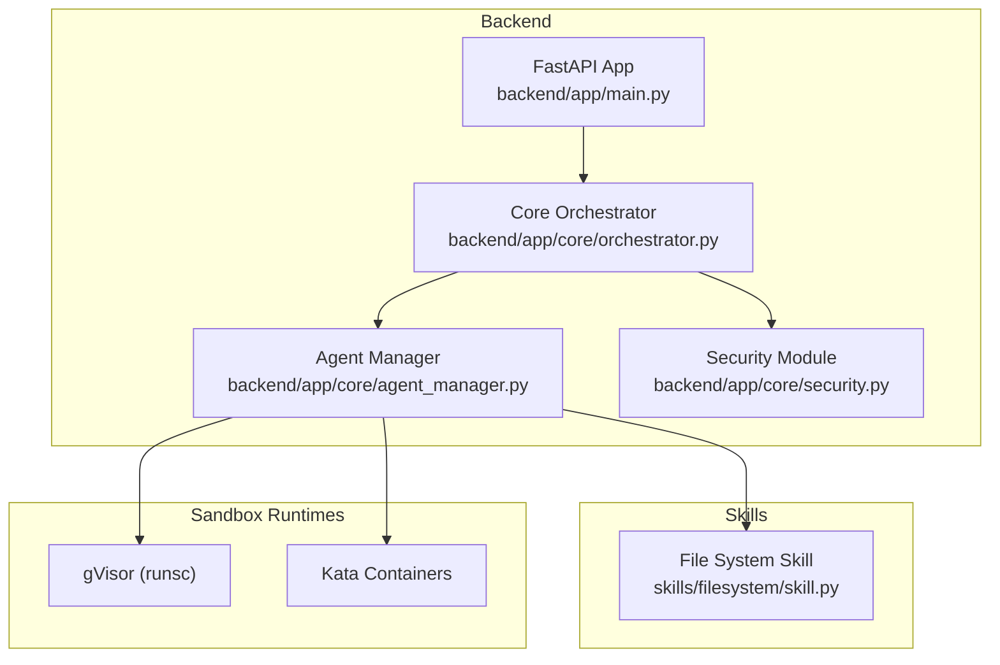
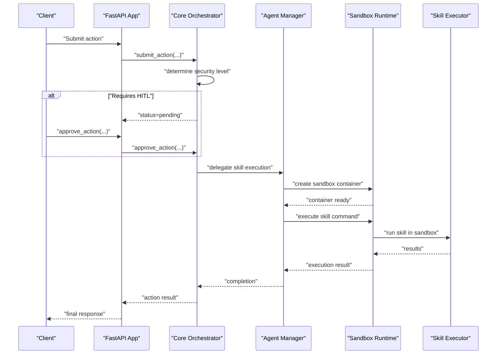
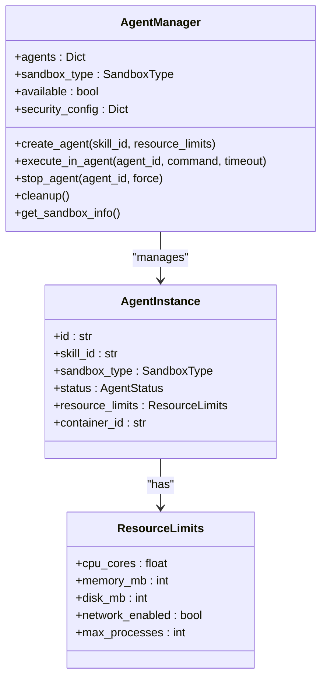
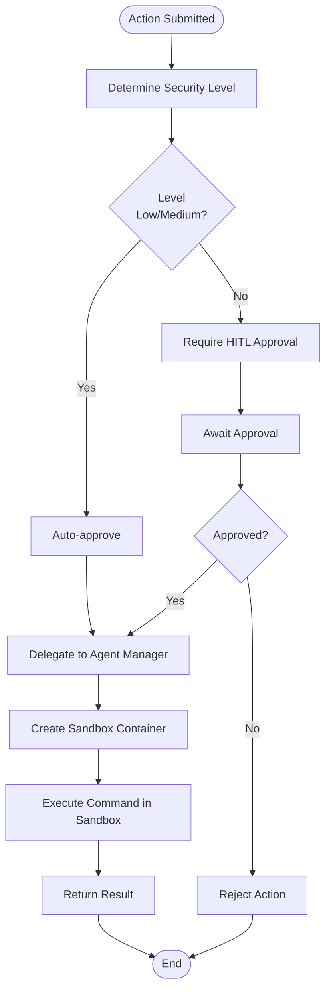
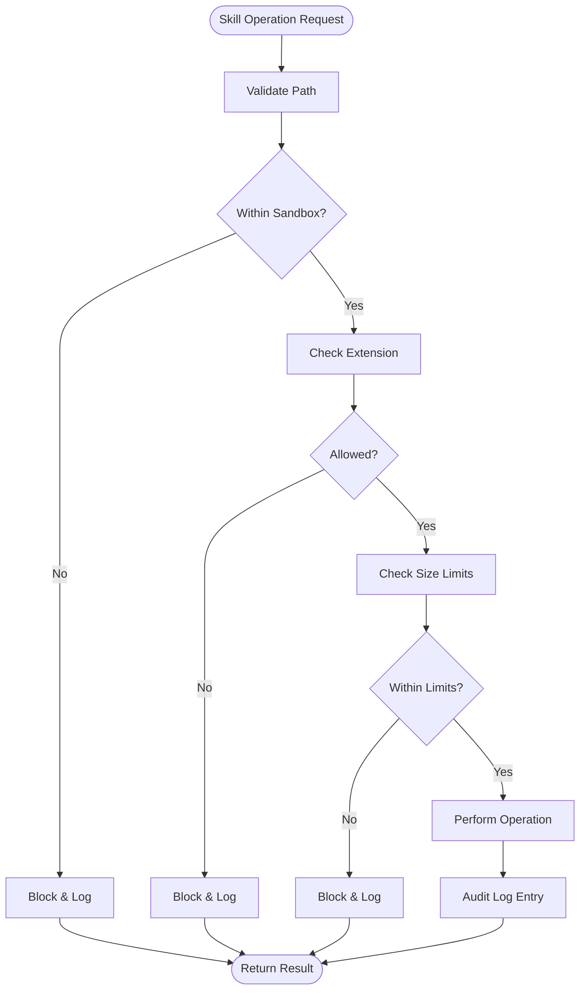
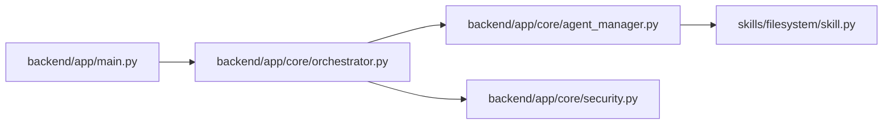

# Hardened Sandboxing

<cite>
**Referenced Files in This Document**
- [README.md](file://README.md)
- [README.zh.md](file://README.zh.md)
- [backend/app/main.py](file://backend/app/main.py)
- [backend/app/core/orchestrator.py](file://backend/app/core/orchestrator.py)
- [backend/app/core/agent_manager.py](file://backend/app/core/agent_manager.py)
- [backend/app/core/security.py](file://backend/app/core/security.py)
- [skills/filesystem/skill.py](file://skills/filesystem/skill.py)
- [installer/install.sh](file://installer/install.sh)
- [installer/install.ps1](file://installer/install.ps1)
</cite>

## Table of Contents
1. [Introduction](#introduction)
2. [Project Structure](#project-structure)
3. [Core Components](#core-components)
4. [Architecture Overview](#architecture-overview)
5. [Detailed Component Analysis](#detailed-component-analysis)
6. [Dependency Analysis](#dependency-analysis)
7. [Performance Considerations](#performance-considerations)
8. [Troubleshooting Guide](#troubleshooting-guide)
9. [Conclusion](#conclusion)

## Introduction
This document explains ClosedPaw’s hardened sandboxing implementation using gVisor and Kata Containers. It details how the system achieves true isolation through containerized execution environments, enforces resource limits and security boundaries, integrates the Agent Manager with the sandbox runtime, and manages container orchestration. It also covers security policy enforcement, network isolation mechanisms, privilege escalation prevention, and practical guidance for troubleshooting sandbox-related issues.

## Project Structure
ClosedPaw’s backend is a FastAPI application that coordinates AI actions and delegates risky tasks to sandboxed agents. The Agent Manager creates and controls sandboxed containers, while the Orchestrator governs action lifecycles and human-in-the-loop approvals. Security is layered through input validation, prompt injection defense, encrypted storage, and audit logging.

**Diagram sources**
- [backend/app/main.py](file://backend/app/main.py#L131-L182)
- [backend/app/core/orchestrator.py](file://backend/app/core/orchestrator.py#L169-L224)
- [backend/app/core/agent_manager.py](file://backend/app/core/agent_manager.py#L65-L98)
- [skills/filesystem/skill.py](file://skills/filesystem/skill.py#L35-L76)

**Section sources**
- [README.md](file://README.md#L13-L25)
- [backend/app/main.py](file://backend/app/main.py#L72-L87)

## Core Components
- Core Orchestrator: Central coordinator for actions, security levels, HITL approvals, and audit logging. It delegates risky operations (e.g., skill execution) to the Agent Manager.
- Agent Manager: Creates sandboxed agents using gVisor or Kata Containers, applies resource limits, enforces seccomp filters, and manages lifecycle (create, exec, stop, cleanup).
- Security Module: Validates inputs, detects prompt injection attempts, sanitizes input, and maintains an encrypted data vault.
- File System Skill: Demonstrates sandboxed operations with path validation, extension whitelisting, size limits, and audit logging.

**Section sources**
- [backend/app/core/orchestrator.py](file://backend/app/core/orchestrator.py#L87-L130)
- [backend/app/core/agent_manager.py](file://backend/app/core/agent_manager.py#L65-L98)
- [backend/app/core/security.py](file://backend/app/core/security.py#L35-L180)
- [skills/filesystem/skill.py](file://skills/filesystem/skill.py#L35-L76)

## Architecture Overview
The system follows a zero-trust model:
- All actions are evaluated for risk and may require human-in-the-loop approval.
- High-risk actions are executed inside sandboxed containers with strict resource and syscall restrictions.
- Network access is disabled by default; skills operate with minimal privileges and isolated filesystems.

**Diagram sources**
- [backend/app/main.py](file://backend/app/main.py#L241-L262)
- [backend/app/core/orchestrator.py](file://backend/app/core/orchestrator.py#L169-L224)
- [backend/app/core/agent_manager.py](file://backend/app/core/agent_manager.py#L194-L201)

## Detailed Component Analysis

### Agent Manager and Sandbox Runtime Integration
The Agent Manager selects and validates sandbox runtimes, provisions containers, and executes commands with strict isolation.

Key capabilities:
- Runtime detection: Prefers gVisor; falls back to Kata Containers if available.
- Container creation: Builds OCI bundles for gVisor or invokes Docker with Kata runtime.
- Resource limits: CPU shares/quota, memory limits, process limits, and tmpfs mounts.
- Security: Namespaces isolation, masked/readonly paths, seccomp filters, no-new-privileges.
- Lifecycle: Create, exec, stop (graceful and forced), cleanup.

**Diagram sources**
- [backend/app/core/agent_manager.py](file://backend/app/core/agent_manager.py#L65-L98)
- [backend/app/core/agent_manager.py](file://backend/app/core/agent_manager.py#L149-L192)
- [backend/app/core/agent_manager.py](file://backend/app/core/agent_manager.py#L39-L63)

**Section sources**
- [backend/app/core/agent_manager.py](file://backend/app/core/agent_manager.py#L99-L147)
- [backend/app/core/agent_manager.py](file://backend/app/core/agent_manager.py#L203-L293)
- [backend/app/core/agent_manager.py](file://backend/app/core/agent_manager.py#L309-L473)
- [backend/app/core/agent_manager.py](file://backend/app/core/agent_manager.py#L475-L584)

### Container Orchestration and Security Policy Enforcement
- Security levels: Low/Medium/High/Critical actions are auto-approved or require HITL.
- Audit logging: Every action is recorded with timestamps, outcomes, and details.
- Skill delegation: The Orchestrator delegates risky operations to the Agent Manager, which runs them in sandboxes.
- gVisor vs Kata Containers:
  - gVisor: Uses runsc with OCI bundles, seccomp filters, masked paths, and namespace isolation.
  - Kata Containers: Uses Docker/Podman with read-only rootfs, no network, and explicit resource flags.

**Diagram sources**
- [backend/app/core/orchestrator.py](file://backend/app/core/orchestrator.py#L225-L250)
- [backend/app/core/orchestrator.py](file://backend/app/core/orchestrator.py#L376-L427)
- [backend/app/core/orchestrator.py](file://backend/app/core/orchestrator.py#L333-L350)
- [backend/app/core/agent_manager.py](file://backend/app/core/agent_manager.py#L194-L201)

**Section sources**
- [backend/app/core/orchestrator.py](file://backend/app/core/orchestrator.py#L51-L98)
- [backend/app/core/orchestrator.py](file://backend/app/core/orchestrator.py#L225-L250)
- [backend/app/core/orchestrator.py](file://backend/app/core/orchestrator.py#L376-L427)

### Network Isolation Mechanisms
- gVisor: Creates containers with network namespace isolation and seccomp filtering to restrict syscalls.
- Kata Containers: Launches containers with network disabled and read-only rootfs.
- File System Skill: Operates within a restricted sandbox directory with path traversal prevention and extension whitelisting.

**Section sources**
- [backend/app/core/agent_manager.py](file://backend/app/core/agent_manager.py#L368-L375)
- [backend/app/core/agent_manager.py](file://backend/app/core/agent_manager.py#L392-L471)
- [backend/app/core/agent_manager.py](file://backend/app/core/agent_manager.py#L262-L293)
- [skills/filesystem/skill.py](file://skills/filesystem/skill.py#L77-L108)

### Privilege Escalation Prevention
- No-new-privileges: Enforced in gVisor OCI config.
- Seccomp filters: Allow only safe syscalls; deny privileged ones.
- Namespace isolation: PID, network, IPC, UTS, mount, and user namespaces separate the sandbox.
- Masked/readonly paths: Prevent access to sensitive kernel interfaces.
- Minimal rootfs and tmpfs: Reduce attack surface and enforce ephemeral state.

**Section sources**
- [backend/app/core/agent_manager.py](file://backend/app/core/agent_manager.py#L329-L333)
- [backend/app/core/agent_manager.py](file://backend/app/core/agent_manager.py#L376-L391)
- [backend/app/core/agent_manager.py](file://backend/app/core/agent_manager.py#L368-L375)

### Skill Execution Within Sandboxed Environments
The File System Skill demonstrates sandboxed operations:
- Path validation prevents traversal outside the sandbox directory.
- Whitelisted extensions and size limits reduce risk.
- Audit logging records all operations for forensics.

**Diagram sources**
- [skills/filesystem/skill.py](file://skills/filesystem/skill.py#L77-L108)
- [skills/filesystem/skill.py](file://skills/filesystem/skill.py#L115-L131)

**Section sources**
- [skills/filesystem/skill.py](file://skills/filesystem/skill.py#L35-L76)
- [skills/filesystem/skill.py](file://skills/filesystem/skill.py#L133-L208)
- [skills/filesystem/skill.py](file://skills/filesystem/skill.py#L274-L335)
- [skills/filesystem/skill.py](file://skills/filesystem/skill.py#L337-L392)
- [skills/filesystem/skill.py](file://skills/filesystem/skill.py#L394-L440)

### Security Configuration Options
- Agent Manager:
  - Default CPU/memory/disk limits and process caps.
  - Max concurrent agents and per-agent timeouts.
  - Kill-on-escape behavior configurable.
- gVisor OCI config:
  - Namespaces, masked/readonly paths, seccomp filter, resource quotas, and no-new-privileges.
- Kata Containers:
  - Read-only rootfs, no network, explicit CPU/memory flags, and tmpfs mounts.

**Section sources**
- [backend/app/core/agent_manager.py](file://backend/app/core/agent_manager.py#L86-L94)
- [backend/app/core/agent_manager.py](file://backend/app/core/agent_manager.py#L354-L367)
- [backend/app/core/agent_manager.py](file://backend/app/core/agent_manager.py#L368-L391)
- [backend/app/core/agent_manager.py](file://backend/app/core/agent_manager.py#L262-L293)

### Installation and Platform Support
- Linux/macOS: Full sandboxing with gVisor preferred; installer configures Docker runtime if available.
- Windows: Limited sandboxing; WSL2 or Docker Desktop recommended for isolation; otherwise basic container isolation.

**Section sources**
- [installer/install.sh](file://installer/install.sh#L191-L288)
- [installer/install.ps1](file://installer/install.ps1#L218-L251)
- [installer/install.ps1](file://installer/install.ps1#L281-L318)
- [README.md](file://README.md#L19-L24)

## Dependency Analysis
The system exhibits strong cohesion within core modules and clear separation of concerns:
- FastAPI app depends on the Orchestrator for action lifecycle.
- Orchestrator depends on Agent Manager for sandbox execution and Security module for input validation.
- Agent Manager depends on sandbox runtimes and skill executors.

**Diagram sources**
- [backend/app/main.py](file://backend/app/main.py#L14-L16)
- [backend/app/core/orchestrator.py](file://backend/app/core/orchestrator.py#L93-L100)
- [backend/app/core/agent_manager.py](file://backend/app/core/agent_manager.py#L81-L84)

**Section sources**
- [backend/app/main.py](file://backend/app/main.py#L131-L182)
- [backend/app/core/orchestrator.py](file://backend/app/core/orchestrator.py#L169-L224)

## Performance Considerations
- gVisor vs Kata Containers:
  - gVisor adds a shim layer between the application and the kernel, which can introduce overhead compared to native containers.
  - Kata Containers leverage VM-like isolation with potential higher overhead but stronger isolation guarantees.
- Resource limits help prevent noisy-neighbor effects and ensure predictable performance.
- Network isolation reduces latency from unexpected egress traffic.

[No sources needed since this section provides general guidance]

## Troubleshooting Guide
Common sandbox-related issues and resolutions:
- Sandbox runtime not detected:
  - Ensure gVisor (runsc) or Kata runtime is installed and available on PATH.
  - On Linux/macOS, the installer configures Docker to use gVisor when available.
- Agent creation failures:
  - Check resource limits and agent concurrency thresholds.
  - Verify OCI bundle creation and seccomp configuration.
- Execution timeouts:
  - Increase per-agent timeout or adjust resource allocations.
- Windows sandbox limitations:
  - Use WSL2 or Docker Desktop for better isolation; avoid relying solely on Docker on Windows Home.

**Section sources**
- [backend/app/core/agent_manager.py](file://backend/app/core/agent_manager.py#L99-L113)
- [installer/install.sh](file://installer/install.sh#L191-L288)
- [installer/install.ps1](file://installer/install.ps1#L218-L251)

## Conclusion
ClosedPaw’s hardened sandboxing combines a zero-trust orchestrator, a robust Agent Manager with strict resource and syscall controls, and skill executors operating under strong isolation. By leveraging gVisor and Kata Containers, enforcing seccomp filters, isolating networks, and maintaining comprehensive audit logs, the system significantly reduces the risk of privilege escalation and untrusted code execution. Proper installation and configuration—especially on Linux/macOS—are essential to achieve full sandboxing benefits.