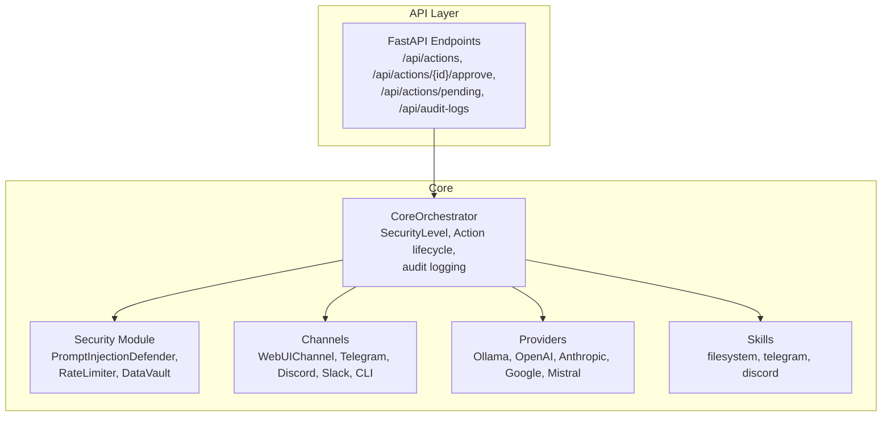
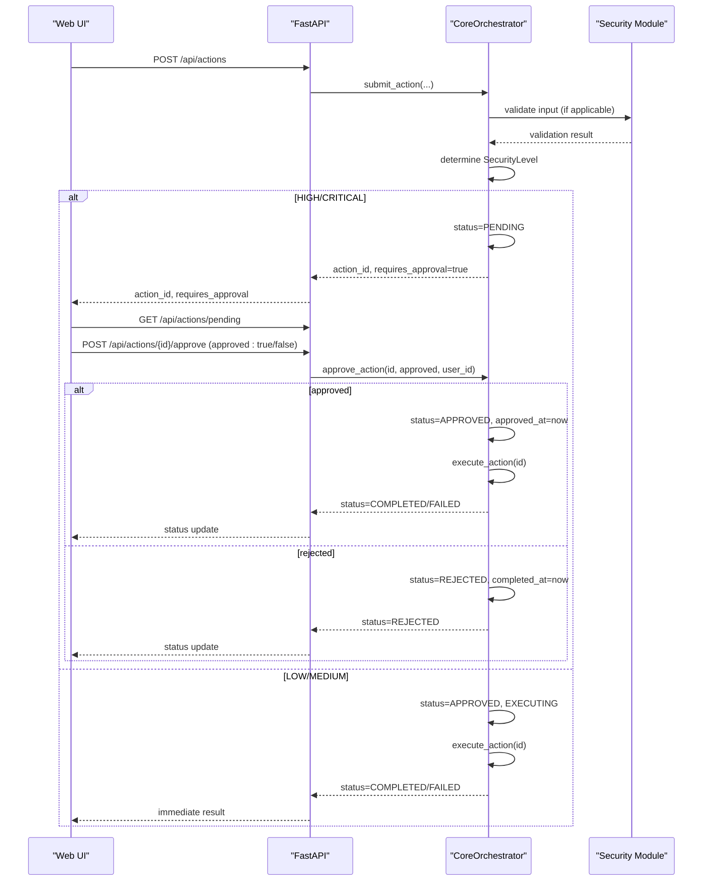
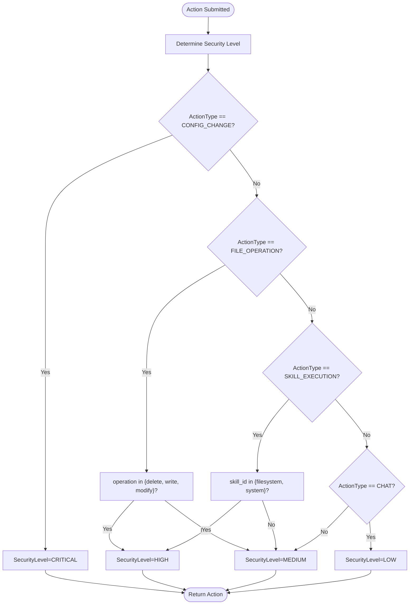
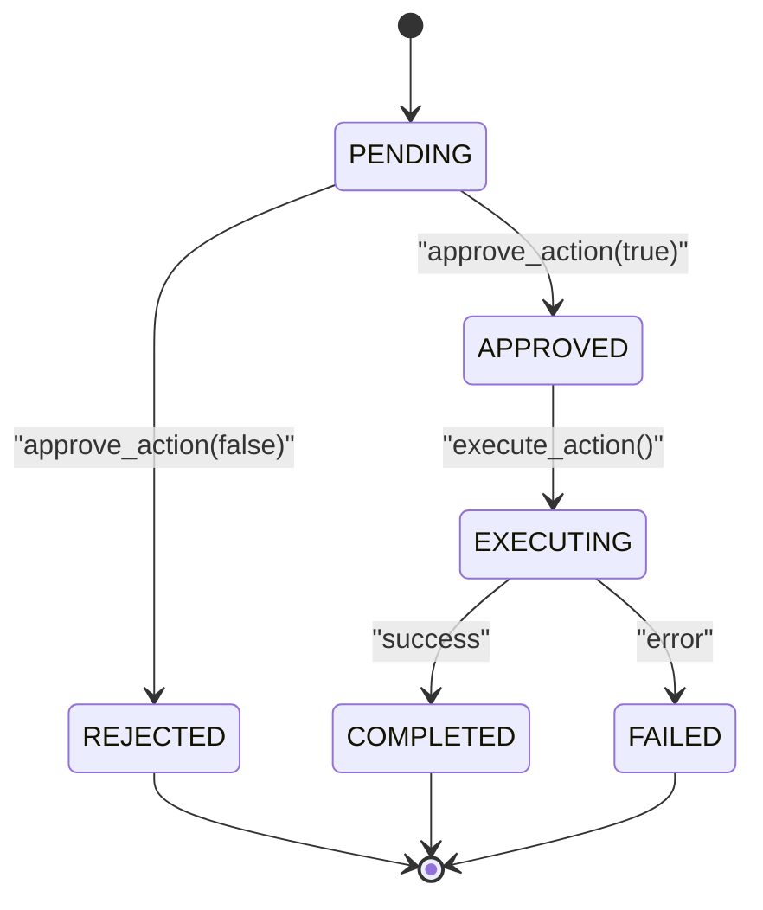
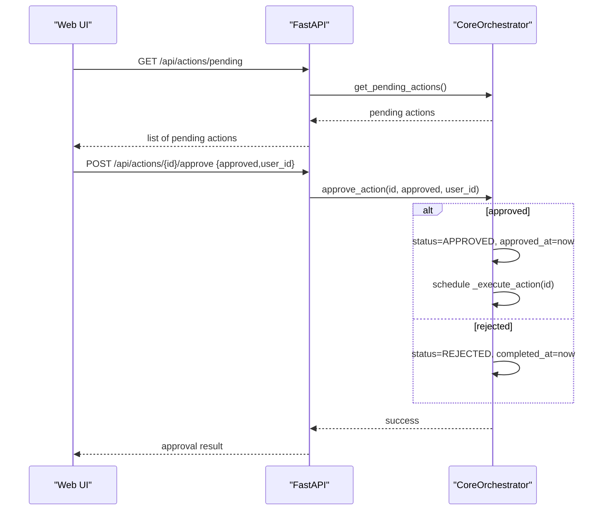
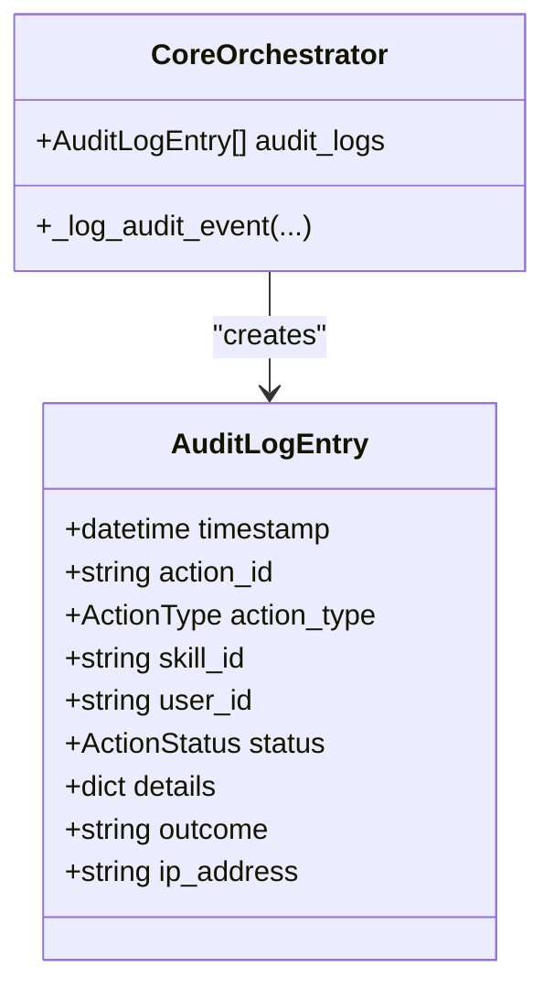
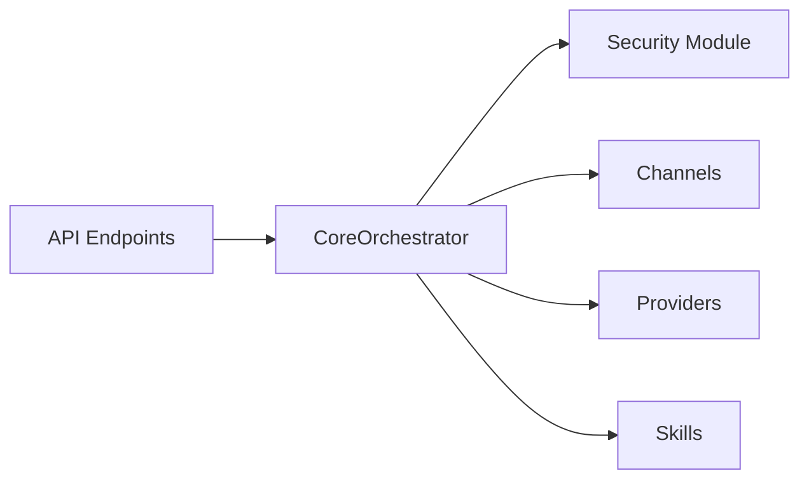

# Human-in-the-Loop Approval

<cite>
**Referenced Files in This Document**
- [main.py](file://backend/app/main.py)
- [orchestrator.py](file://backend/app/core/orchestrator.py)
- [security.py](file://backend/app/core/security.py)
- [channels.py](file://backend/app/core/channels.py)
- [providers.py](file://backend/app/core/providers.py)
- [skill.py](file://skills/filesystem/skill.py)
- [README.md](file://README.md)
- [requirements.txt](file://backend/requirements.txt)
</cite>

## Table of Contents
1. [Introduction](#introduction)
2. [Project Structure](#project-structure)
3. [Core Components](#core-components)
4. [Architecture Overview](#architecture-overview)
5. [Detailed Component Analysis](#detailed-component-analysis)
6. [Dependency Analysis](#dependency-analysis)
7. [Performance Considerations](#performance-considerations)
8. [Troubleshooting Guide](#troubleshooting-guide)
9. [Conclusion](#conclusion)
10. [Appendices](#appendices)

## Introduction
This document explains the Human-in-the-Loop (HITL) approval workflow in ClosedPaw’s security architecture. It covers how HIGH and CRITICAL security-level actions are identified, how the web UI integrates with the CoreOrchestrator for approvals, and how the approval lifecycle is tracked. It also documents the approval decision matrix, user authorization requirements, delegation mechanisms, audit trails, compliance considerations, and emergency procedures such as timeouts.

## Project Structure
The HITL workflow spans the backend API, the CoreOrchestrator, and supporting modules:
- API endpoints expose action submission, approval, and audit-log retrieval.
- CoreOrchestrator determines security levels, tracks actions, and executes approved actions.
- Security module provides prompt validation and rate limiting.
- Channels module supports multiple communication channels including a Web UI channel.
- Providers module manages LLM providers and multi-provider chat.
- Skills define executable capabilities with built-in security and auditing.

**Diagram sources**
- [main.py](file://backend/app/main.py#L131-L322)
- [orchestrator.py](file://backend/app/core/orchestrator.py#L87-L486)
- [security.py](file://backend/app/core/security.py#L35-L455)
- [channels.py](file://backend/app/core/channels.py#L137-L524)
- [providers.py](file://backend/app/core/providers.py#L418-L545)
- [skill.py](file://skills/filesystem/skill.py#L35-L483)

**Section sources**
- [main.py](file://backend/app/main.py#L131-L322)
- [orchestrator.py](file://backend/app/core/orchestrator.py#L87-L486)
- [security.py](file://backend/app/core/security.py#L35-L455)
- [channels.py](file://backend/app/core/channels.py#L137-L524)
- [providers.py](file://backend/app/core/providers.py#L418-L545)
- [skill.py](file://skills/filesystem/skill.py#L35-L483)

## Core Components
- CoreOrchestrator: Central coordinator that assigns security levels, enforces HITL for HIGH/CRITICAL actions, tracks statuses, and executes approved actions. It maintains an in-memory registry of actions and writes audit logs.
- Security Module: Validates user inputs, detects prompt injection attempts, applies sanitization, and enforces rate limits. It raises exceptions for critical threats and integrates with the orchestrator’s security checks.
- API Endpoints: Expose action submission, approval, status queries, and audit-log retrieval. They enforce local-only access and return structured responses for the web UI.
- Channels: Provide transport for user commands and notifications, including a Web UI channel for polling pending messages.
- Providers: Manage multiple LLM providers and multi-provider chat, enabling flexible model selection and fallback.
- Skills: Define executable capabilities with sandboxing and audit logging, including the filesystem skill.

**Section sources**
- [orchestrator.py](file://backend/app/core/orchestrator.py#L51-L85)
- [security.py](file://backend/app/core/security.py#L16-L33)
- [main.py](file://backend/app/main.py#L241-L322)
- [channels.py](file://backend/app/core/channels.py#L137-L175)
- [providers.py](file://backend/app/core/providers.py#L418-L483)
- [skill.py](file://skills/filesystem/skill.py#L35-L76)

## Architecture Overview
The HITL approval architecture follows a Zero-Trust model:
- All actions are submitted to the CoreOrchestrator.
- Security level is determined automatically; HIGH/CRITICAL actions are marked PENDING and require human approval.
- The web UI polls for pending actions and displays them for approval.
- Approved actions transition to EXECUTING and are executed asynchronously; rejected actions remain in REJECTED state.
- Audit logs record all decisions and outcomes for compliance and forensics.

**Diagram sources**
- [main.py](file://backend/app/main.py#L241-L298)
- [orchestrator.py](file://backend/app/core/orchestrator.py#L169-L223)
- [security.py](file://backend/app/core/security.py#L116-L180)

**Section sources**
- [main.py](file://backend/app/main.py#L241-L298)
- [orchestrator.py](file://backend/app/core/orchestrator.py#L169-L223)
- [security.py](file://backend/app/core/security.py#L116-L180)

## Detailed Component Analysis

### Security Levels and Decision Matrix
The CoreOrchestrator assigns security levels based on action type and parameters:
- LOW: Chat actions.
- MEDIUM: Non-destructive operations and some skill executions.
- HIGH: Destructive file operations and specific skill executions (e.g., filesystem).
- CRITICAL: Configuration changes.

**Diagram sources**
- [orchestrator.py](file://backend/app/core/orchestrator.py#L225-L249)

**Section sources**
- [orchestrator.py](file://backend/app/core/orchestrator.py#L51-L57)
- [orchestrator.py](file://backend/app/core/orchestrator.py#L225-L249)

### Approval Lifecycle and States
Actions progress through the following states:
- PENDING: Requires HITL approval.
- APPROVED: Approved by a human; will be executed.
- REJECTED: Rejected by a human; no execution.
- EXECUTING: Being executed.
- COMPLETED: Execution succeeded.
- FAILED: Execution failed.

**Diagram sources**
- [orchestrator.py](file://backend/app/core/orchestrator.py#L41-L49)
- [orchestrator.py](file://backend/app/core/orchestrator.py#L376-L427)

**Section sources**
- [orchestrator.py](file://backend/app/core/orchestrator.py#L41-L49)
- [orchestrator.py](file://backend/app/core/orchestrator.py#L376-L427)

### Web UI Integration and Delegation
- The Web UI polls the backend for pending actions and displays them for approval.
- The Web UI posts approval decisions to the backend, which delegates to CoreOrchestrator.approve_action.
- The CoreOrchestrator executes approved actions asynchronously and updates status.

**Diagram sources**
- [main.py](file://backend/app/main.py#L265-L298)
- [orchestrator.py](file://backend/app/core/orchestrator.py#L376-L427)

**Section sources**
- [main.py](file://backend/app/main.py#L265-L298)
- [orchestrator.py](file://backend/app/core/orchestrator.py#L376-L427)

### Audit Trail and Compliance
- CoreOrchestrator writes audit log entries for all state transitions and outcomes.
- Endpoints expose audit logs for compliance and forensics.
- Logs include timestamps, action IDs, types, statuses, outcomes, and details.

**Diagram sources**
- [orchestrator.py](file://backend/app/core/orchestrator.py#L59-L70)
- [orchestrator.py](file://backend/app/core/orchestrator.py#L429-L450)
- [main.py](file://backend/app/main.py#L322-L339)

**Section sources**
- [orchestrator.py](file://backend/app/core/orchestrator.py#L59-L70)
- [orchestrator.py](file://backend/app/core/orchestrator.py#L429-L450)
- [main.py](file://backend/app/main.py#L322-L339)

### Practical Approval Scenarios
- Scenario A: User requests a destructive file operation (e.g., delete). The system assigns HIGH; the action becomes PENDING and waits for approval.
- Scenario B: User requests a configuration change. The system assigns CRITICAL; the action becomes PENDING and waits for approval.
- Scenario C: User asks a simple chat question. The system assigns LOW; the action auto-approves and executes immediately.

**Section sources**
- [orchestrator.py](file://backend/app/core/orchestrator.py#L225-L249)
- [main.py](file://backend/app/main.py#L131-L182)

### Security Considerations for Approvals
- Local-only binding: The backend binds to 127.0.0.1 and restricts origins to localhost for the web UI.
- CORS policy: Only localhost origins are allowed.
- Input validation and sanitization: The Security Module validates and sanitizes inputs; critical threats block processing.
- Rate limiting: The Security Module enforces rate limits to mitigate abuse.
- Data vault: Secrets are encrypted at rest; access controlled by levels.

**Section sources**
- [main.py](file://backend/app/main.py#L80-L87)
- [security.py](file://backend/app/core/security.py#L290-L318)
- [security.py](file://backend/app/core/security.py#L325-L435)
- [README.md](file://README.md#L65-L74)

### Emergency Procedures and Timeouts
- Action timeouts: The API enforces maximum wait times for action completion; otherwise, it returns the current status (e.g., pending).
- Graceful shutdown: The CoreOrchestrator waits for executing actions to complete during shutdown.
- Audit logging: All timeouts and failures are recorded for analysis.

**Section sources**
- [main.py](file://backend/app/main.py#L153-L181)
- [orchestrator.py](file://backend/app/core/orchestrator.py#L463-L474)

## Dependency Analysis
The HITL workflow depends on several modules working together:
- API depends on CoreOrchestrator for action lifecycle and approval.
- CoreOrchestrator depends on Security for input validation and rate limiting.
- CoreOrchestrator optionally integrates with Channels for messaging and with Providers for multi-provider chat.
- Skills encapsulate executable capabilities with sandboxing and audit logging.

**Diagram sources**
- [main.py](file://backend/app/main.py#L131-L322)
- [orchestrator.py](file://backend/app/core/orchestrator.py#L87-L130)
- [security.py](file://backend/app/core/security.py#L35-L107)
- [channels.py](file://backend/app/core/channels.py#L405-L455)
- [providers.py](file://backend/app/core/providers.py#L418-L483)
- [skill.py](file://skills/filesystem/skill.py#L35-L76)

**Section sources**
- [main.py](file://backend/app/main.py#L131-L322)
- [orchestrator.py](file://backend/app/core/orchestrator.py#L87-L130)
- [security.py](file://backend/app/core/security.py#L35-L107)
- [channels.py](file://backend/app/core/channels.py#L405-L455)
- [providers.py](file://backend/app/core/providers.py#L418-L483)
- [skill.py](file://skills/filesystem/skill.py#L35-L76)

## Performance Considerations
- Asynchronous execution: Approved actions are scheduled asynchronously to avoid blocking the API.
- Rate limiting: The Security Module prevents abuse by limiting input rates.
- Minimal memory footprint: Actions are stored in memory; consider persistence for long-running deployments.
- Model availability: Provider health checks ensure reliable model switching and chat.

[No sources needed since this section provides general guidance]

## Troubleshooting Guide
Common issues and resolutions:
- Action remains PENDING: Confirm the web UI shows the action and that an approval was posted.
- Approval not reflected: Verify the approve endpoint returns success and that audit logs show the decision.
- Action fails after approval: Check the audit logs for failure details and error messages.
- Timeout during chat: The API returns the current status if the action is still pending or executing.

**Section sources**
- [main.py](file://backend/app/main.py#L284-L298)
- [main.py](file://backend/app/main.py#L301-L319)
- [orchestrator.py](file://backend/app/core/orchestrator.py#L429-L450)

## Conclusion
ClosedPaw’s HITL approval workflow enforces Zero-Trust security by automatically assigning security levels, requiring human oversight for HIGH and CRITICAL actions, and maintaining a complete audit trail. The web UI integrates seamlessly with the CoreOrchestrator to manage approvals, while robust input validation, rate limiting, and sandboxing provide layered defense. Compliance and emergency procedures ensure operational continuity and accountability.

[No sources needed since this section summarizes without analyzing specific files]

## Appendices

### API Definitions for HITL
- POST /api/actions: Submits an action; returns action_id, status, security_level, and requires_approval flag.
- GET /api/actions/pending: Lists pending actions for approval.
- POST /api/actions/{action_id}/approve: Approve or reject a pending action with user_id.
- GET /api/actions/{action_id}: Get status and details of a specific action.
- GET /api/audit-logs: Retrieve recent audit logs.

**Section sources**
- [main.py](file://backend/app/main.py#L241-L339)

### Security Dependencies
- cryptography, pynacl, python-jose, bcrypt for encryption and signing.
- httpx for provider communications.
- SQLAlchemy and Alembic for database operations.

**Section sources**
- [requirements.txt](file://backend/requirements.txt#L21-L25)
- [requirements.txt](file://backend/requirements.txt#L17-L19)