# Security Architecture

<cite>
**Referenced Files in This Document**
- [README.md](file://README.md)
- [backend/app/core/security.py](file://backend/app/core/security.py)
- [backend/app/core/orchestrator.py](file://backend/app/core/orchestrator.py)
- [backend/app/core/agent_manager.py](file://backend/app/core/agent_manager.py)
- [backend/app/core/providers.py](file://backend/app/core/providers.py)
- [backend/app/core/channels.py](file://backend/app/core/channels.py)
- [backend/app/main.py](file://backend/app/main.py)
- [skills/filesystem/skill.py](file://skills/filesystem/skill.py)
- [backend/requirements.txt](file://backend/requirements.txt)
- [backend/tests/test_security.py](file://backend/tests/test_security.py)
</cite>

## Update Summary
**Changes Made**
- Added comprehensive SecurityManager capabilities with unified security API
- Enhanced prompt injection detection with threat scoring and rate limiting
- Expanded security validation patterns for file access, code execution, and network security
- Improved data protection with access control levels and audit logging
- Added new security validation classes and enhanced testing framework

## Table of Contents
1. [Introduction](#introduction)
2. [Project Structure](#project-structure)
3. [Core Components](#core-components)
4. [Architecture Overview](#architecture-overview)
5. [Detailed Component Analysis](#detailed-component-analysis)
6. [SecurityManager Capabilities](#securitymanager-capabilities)
7. [Enhanced Security Validation](#enhanced-security-validation)
8. [Dependency Analysis](#dependency-analysis)
9. [Performance Considerations](#performance-considerations)
10. [Troubleshooting Guide](#troubleshooting-guide)
11. [Conclusion](#conclusion)
12. [Appendices](#appendices)

## Introduction
This document presents the security architecture of ClosedPaw with a focus on the zero-trust model. It explains how the system applies the implicit distrust principle, enforces security boundaries, and implements layered protections including hardened sandboxing, prompt injection defense, encrypted storage, audit logging, and a human-in-the-loop (HITL) approval workflow. The architecture now includes a comprehensive SecurityManager that provides unified security operations across all components, enhanced validation patterns, and improved threat detection mechanisms.

## Project Structure
ClosedPaw's backend is organized around a core set of security-centric modules with enhanced SecurityManager capabilities:
- Core orchestrator: central action lifecycle, HITL, and audit logging
- Agent manager: sandbox orchestration with gVisor/Kata Containers
- Security module: comprehensive security validation, prompt injection defense, and encrypted data vault
- SecurityManager: unified high-level security API with file access control, code execution validation, and session management
- Providers: multi-provider LLM gateway with local-first defaults
- Channels: multi-channel gateway with allowlists and rate limiting
- Frontend: HITL UI integration for approvals

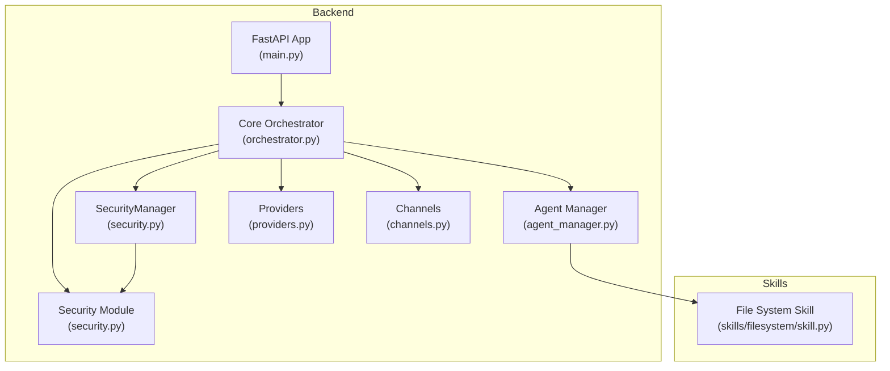

**Diagram sources**
- [backend/app/core/orchestrator.py](file://backend/app/core/orchestrator.py#L95-L534)
- [backend/app/core/agent_manager.py](file://backend/app/core/agent_manager.py#L65-L708)
- [backend/app/core/security.py](file://backend/app/core/security.py#L495-L875)
- [backend/app/core/providers.py](file://backend/app/core/providers.py#L418-L545)
- [backend/app/core/channels.py](file://backend/app/core/channels.py#L405-L524)
- [backend/app/main.py](file://backend/app/main.py#L1-L567)
- [skills/filesystem/skill.py](file://skills/filesystem/skill.py#L91-L164)

**Section sources**
- [README.md](file://README.md#L65-L96)
- [backend/app/main.py](file://backend/app/main.py#L72-L87)

## Core Components
- Core Orchestrator: manages actions, assigns security levels, logs audit events, and coordinates HITL approvals. It initializes LLM gateway, data vault, and skills, and enforces security policies.
- Agent Manager: provisions sandboxed agents using gVisor or Kata Containers, enforces resource limits, and executes commands within isolated containers.
- Security Module: comprehensive security validation with prompt injection defense, encrypted data vault, and unified security operations.
- SecurityManager: high-level unified security API providing file access control, code execution validation, network security, session management, and audit logging.
- Providers: multi-provider LLM gateway with local-first defaults and health checks.
- Channels: multi-channel gateway with allowlists, rate limiting, and pairing requirements.
- Frontend: exposes HITL controls for reviewing and approving pending actions.

**Section sources**
- [backend/app/core/orchestrator.py](file://backend/app/core/orchestrator.py#L95-L534)
- [backend/app/core/agent_manager.py](file://backend/app/core/agent_manager.py#L65-L708)
- [backend/app/core/security.py](file://backend/app/core/security.py#L36-L875)
- [backend/app/core/providers.py](file://backend/app/core/providers.py#L418-L545)
- [backend/app/core/channels.py](file://backend/app/core/channels.py#L405-L524)
- [backend/app/main.py](file://backend/app/main.py#L131-L322)

## Architecture Overview
ClosedPaw implements a zero-trust architecture where no component is trusted implicitly. All actions are evaluated for risk, and high-risk operations require HITL approval. The enhanced SecurityManager provides comprehensive security validation across file access, code execution, network requests, and session management. Sandboxed execution ensures isolation for skills, while encrypted storage protects sensitive data. Audit logging enables forensic analysis with integrity verification.

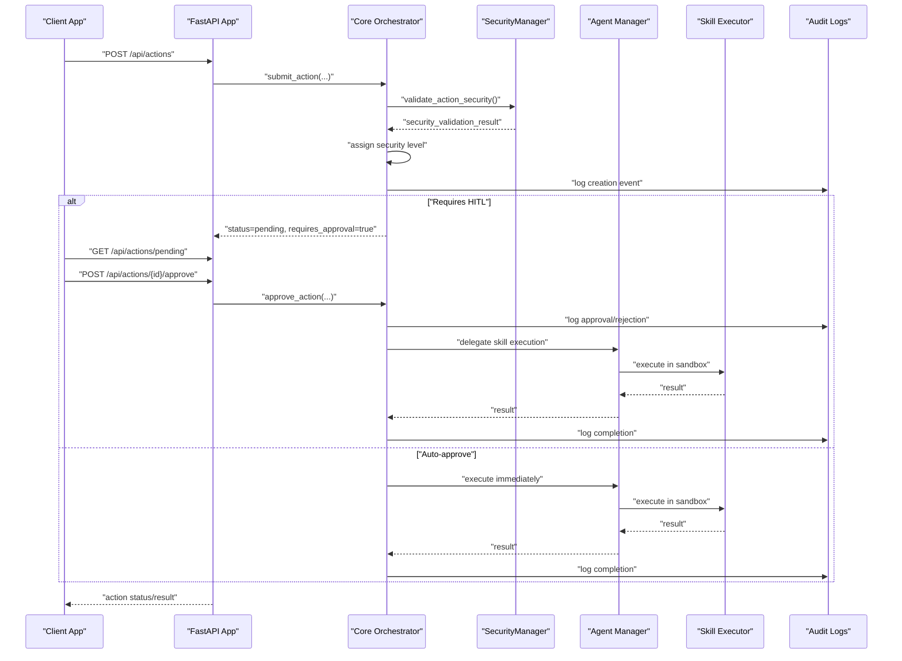

**Diagram sources**
- [backend/app/main.py](file://backend/app/main.py#L241-L298)
- [backend/app/core/orchestrator.py](file://backend/app/core/orchestrator.py#L169-L223)
- [backend/app/core/orchestrator.py](file://backend/app/core/orchestrator.py#L376-L427)
- [backend/app/core/agent_manager.py](file://backend/app/core/agent_manager.py#L149-L192)
- [skills/filesystem/skill.py](file://skills/filesystem/skill.py#L133-L208)

## Detailed Component Analysis

### Zero-Trust Orchestration and HITL
- Implicit distrust: All actions are treated as untrusted until validated and approved.
- Security levels: Low/Medium actions auto-execute; High/Critical require HITL.
- Audit logging: Every action creation, approval, rejection, and completion is recorded.
- HITL workflow: Pending actions surfaced via API; approvals applied via dedicated endpoint.

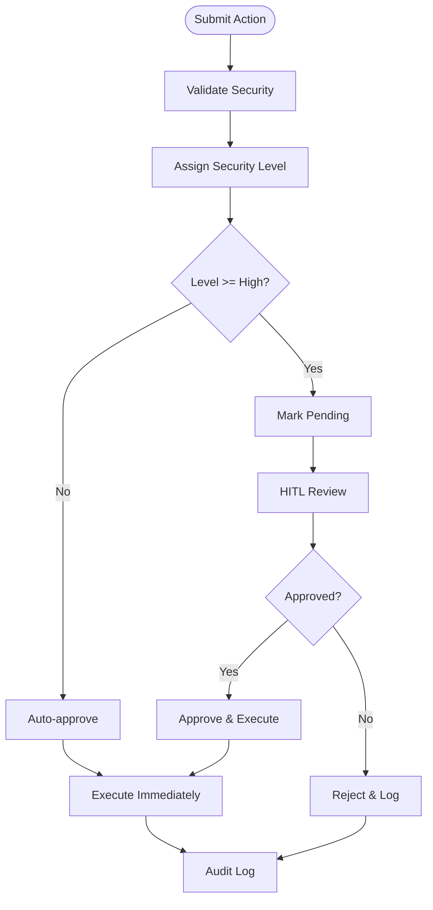

**Diagram sources**
- [backend/app/core/orchestrator.py](file://backend/app/core/orchestrator.py#L225-L249)
- [backend/app/core/orchestrator.py](file://backend/app/core/orchestrator.py#L169-L223)
- [backend/app/core/orchestrator.py](file://backend/app/core/orchestrator.py#L376-L427)

**Section sources**
- [backend/app/core/orchestrator.py](file://backend/app/core/orchestrator.py#L51-L110)
- [backend/app/core/orchestrator.py](file://backend/app/core/orchestrator.py#L169-L223)
- [backend/app/core/orchestrator.py](file://backend/app/core/orchestrator.py#L376-L427)
- [backend/app/main.py](file://backend/app/main.py#L241-L298)

### Hardened Sandboxing with gVisor/Kata Containers
- Runtime detection: Prefers gVisor, falls back to Kata Containers if available.
- Resource limits: CPU, memory, disk, process counts, and network isolation.
- Seccomp and namespace hardening: Minimal capabilities, masked paths, readonly roots.
- Execution: Commands executed inside containers with timeouts and strict limits.

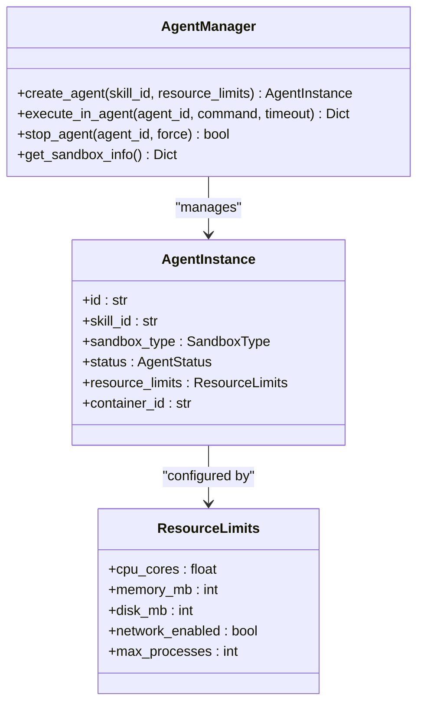

**Diagram sources**
- [backend/app/core/agent_manager.py](file://backend/app/core/agent_manager.py#L65-L708)
- [backend/app/core/agent_manager.py](file://backend/app/core/agent_manager.py#L39-L63)

**Section sources**
- [backend/app/core/agent_manager.py](file://backend/app/core/agent_manager.py#L99-L148)
- [backend/app/core/agent_manager.py](file://backend/app/core/agent_manager.py#L194-L294)
- [backend/app/core/agent_manager.py](file://backend/app/core/agent_manager.py#L309-L473)

### Enhanced Prompt Injection Defense
- Advanced threat scoring: Comprehensive pattern matching with weighted threat levels.
- Rate limiting: Prevents abuse and automated attacks.
- Enhanced sanitization: Multiple layers of input sanitization and validation.
- Real-time monitoring: Security alerts and logging for detected threats.

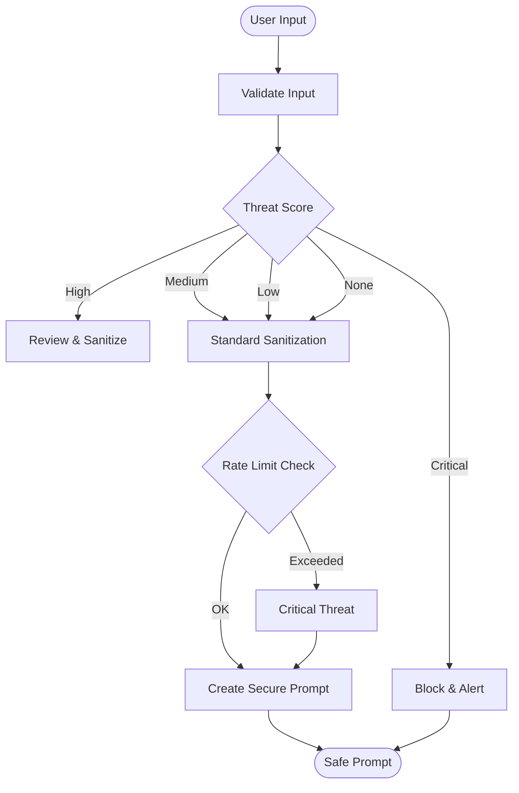

**Diagram sources**
- [backend/app/core/security.py](file://backend/app/core/security.py#L117-L181)
- [backend/app/core/security.py](file://backend/app/core/security.py#L196-L206)
- [backend/app/core/security.py](file://backend/app/core/security.py#L208-L227)

**Section sources**
- [backend/app/core/security.py](file://backend/app/core/security.py#L36-L287)

### Encrypted Storage for Secrets
- DataVault: Fernet-based encryption for API keys and credentials with access-level checks and audit logging.
- Access control: Levels (public, standard, elevated, admin) enforce least privilege.
- Audit: All store/retrieve operations logged with timestamps and access levels.

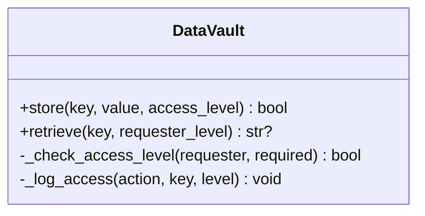

**Diagram sources**
- [backend/app/core/security.py](file://backend/app/core/security.py#L326-L434)

**Section sources**
- [backend/app/core/security.py](file://backend/app/core/security.py#L326-L434)

### Audit Logging for Forensic Analysis
- File-based audit logs: Centralized logging to a temporary directory with structured entries.
- AuditLogEntry: Captures action_id, type, skill_id, user_id, status, outcome, and details.
- Retrieval: API endpoint to fetch recent audit logs.
- Integrity verification: Tamper detection and log integrity validation.

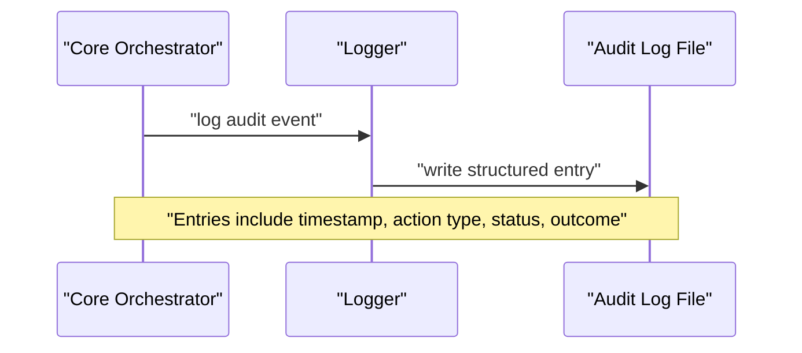

**Diagram sources**
- [backend/app/core/orchestrator.py](file://backend/app/core/orchestrator.py#L18-L28)
- [backend/app/core/orchestrator.py](file://backend/app/core/orchestrator.py#L429-L450)
- [backend/app/main.py](file://backend/app/main.py#L322-L339)

**Section sources**
- [backend/app/core/orchestrator.py](file://backend/app/core/orchestrator.py#L18-L28)
- [backend/app/core/orchestrator.py](file://backend/app/core/orchestrator.py#L429-L450)
- [backend/app/main.py](file://backend/app/main.py#L322-L339)

### Human-in-the-Loop (HITL) Approval Workflow
- Submission: Actions submitted via API; security level determined automatically.
- Pending queue: Actions requiring HITL appear in the pending list.
- Approval: Approve or reject via dedicated endpoint; approvals trigger execution.
- Forensic visibility: All approvals logged for audit.

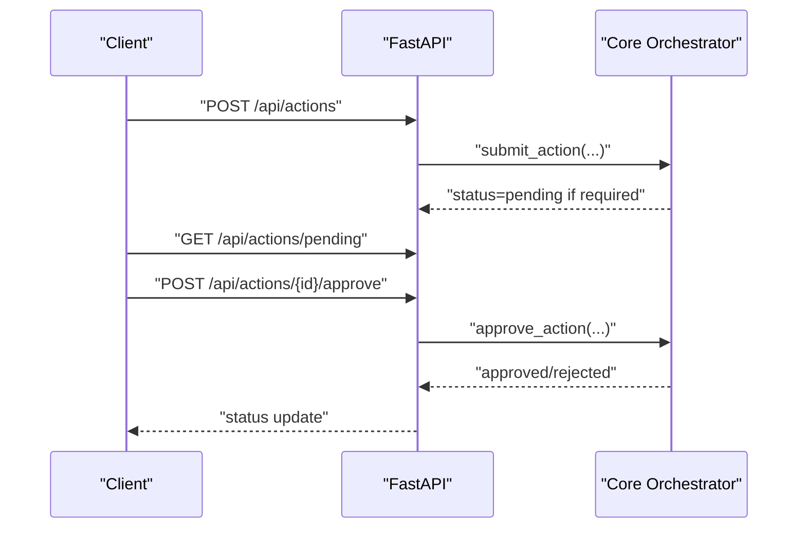

**Diagram sources**
- [backend/app/main.py](file://backend/app/main.py#L241-L298)
- [backend/app/core/orchestrator.py](file://backend/app/core/orchestrator.py#L169-L223)
- [backend/app/core/orchestrator.py](file://backend/app/core/orchestrator.py#L376-L427)

**Section sources**
- [backend/app/main.py](file://backend/app/main.py#L241-L298)
- [backend/app/core/orchestrator.py](file://backend/app/core/orchestrator.py#L169-L223)
- [backend/app/core/orchestrator.py](file://backend/app/core/orchestrator.py#L376-L427)

### Multi-Provider LLM Gateway and Channels
- Providers: Supports local Ollama and cloud providers (OpenAI, Anthropic, Google, Mistral) with health checks and model listing.
- Channels: Supports Telegram, Discord, Slack, Matrix, Web UI, CLI with allowlists, rate limiting, and pairing requirements.

**Section sources**
- [backend/app/core/providers.py](file://backend/app/core/providers.py#L418-L545)
- [backend/app/core/channels.py](file://backend/app/core/channels.py#L405-L524)

### Practical Examples of Security Workflows
- Chat with auto-approval: Low security; submitted and executed immediately; result returned.
- File system write with HITL: High security; requires approval; executed inside sandboxed agent.
- Model switch with validation: Medium security; validates model availability; logs outcome.

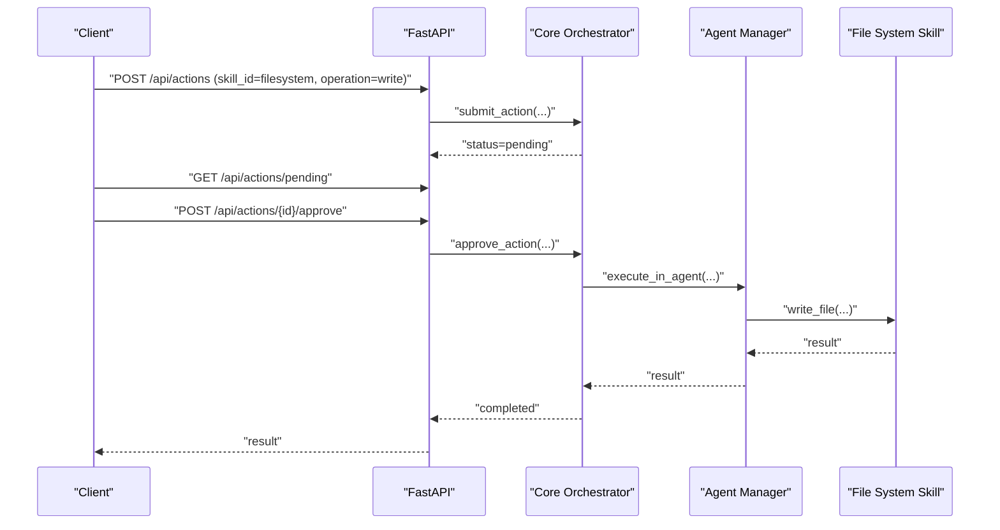

**Diagram sources**
- [backend/app/main.py](file://backend/app/main.py#L241-L298)
- [backend/app/core/orchestrator.py](file://backend/app/core/orchestrator.py#L169-L223)
- [backend/app/core/agent_manager.py](file://backend/app/core/agent_manager.py#L475-L537)
- [skills/filesystem/skill.py](file://skills/filesystem/skill.py#L274-L335)

**Section sources**
- [backend/app/main.py](file://backend/app/main.py#L131-L181)
- [backend/app/main.py](file://backend/app/main.py#L213-L238)
- [skills/filesystem/skill.py](file://skills/filesystem/skill.py#L274-L335)

## SecurityManager Capabilities

### Unified Security Operations
The SecurityManager provides a comprehensive unified API for all security operations, replacing individual security components with a cohesive interface:

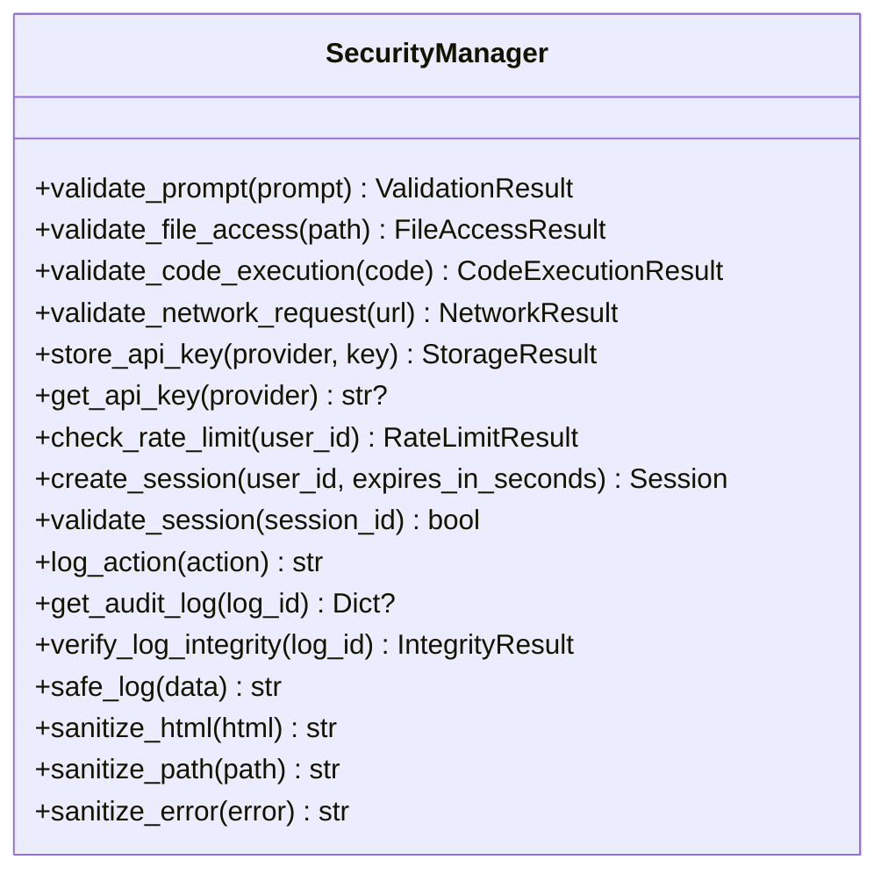

**Diagram sources**
- [backend/app/core/security.py](file://backend/app/core/security.py#L495-L875)

### File Access Control
Advanced file access validation prevents unauthorized access and path traversal attacks:

- Forbidden path detection: Blocks access to system files, SSH keys, and sensitive locations
- Path traversal prevention: Validates paths and prevents directory traversal attempts
- Safe path normalization: Cleans and validates file paths before processing

**Section sources**
- [backend/app/core/security.py](file://backend/app/core/security.py#L528-L559)

### Code Execution Validation
Comprehensive code execution validation ensures all code runs safely in sandboxed environments:

- Dangerous pattern detection: Identifies potentially harmful code patterns
- Automatic sandboxing: All code execution occurs in secure sandboxed containers
- Pattern-based filtering: Blocks imports of system-level modules and dangerous functions

**Section sources**
- [backend/app/core/security.py](file://backend/app/core/security.py#L578-L595)

### Network Security
Enhanced network security validation controls external communications:

- Allowlist-based access: Only approved domains can be accessed
- Suspicious URL detection: Identifies potentially malicious URLs
- External request blocking: Prevents unauthorized outbound connections

**Section sources**
- [backend/app/core/security.py](file://backend/app/core/security.py#L670-L713)

### Session Management
Robust session management with expiration and validation:

- Secure session creation: Generates cryptographically secure session IDs
- Automatic expiration: Sessions expire after configurable time periods
- Session validation: Ensures active and valid sessions for authenticated requests

**Section sources**
- [backend/app/core/security.py](file://backend/app/core/security.py#L635-L664)

### Audit Logging and Integrity
Comprehensive audit logging with integrity verification:

- Structured logging: All security-relevant actions are logged with metadata
- Integrity verification: Detects and prevents log tampering
- Safe logging: Redacts sensitive information from logs

**Section sources**
- [backend/app/core/security.py](file://backend/app/core/security.py#L719-L747)
- [backend/app/core/security.py](file://backend/app/core/security.py#L806-L819)

## Enhanced Security Validation

### Advanced Prompt Validation
The enhanced prompt validation system provides comprehensive threat detection:

- Multi-layered pattern matching: Detects various injection techniques
- Threat scoring: Weighted scoring system for different threat categories
- Real-time rate limiting: Prevents abuse and automated attacks
- Context-aware validation: Considers input context for better detection

**Section sources**
- [backend/app/core/security.py](file://backend/app/core/security.py#L117-L181)

### Data Protection Enhancements
Improved data protection with access control and encryption:

- Multi-level access control: Public, standard, elevated, and admin levels
- Encrypted storage: Fernet encryption for all sensitive data
- Audit trail: Complete logging of all data access operations

**Section sources**
- [backend/app/core/security.py](file://backend/app/core/security.py#L348-L413)

### Testing Framework
Comprehensive testing framework validates all security features:

- Prompt injection testing: Validates detection of various injection techniques
- Access control testing: Ensures proper restriction of unauthorized access
- Data protection testing: Verifies encryption and logging security
- Integration testing: Validates end-to-end security workflows

**Section sources**
- [backend/tests/test_security.py](file://backend/tests/test_security.py#L17-L275)

## Dependency Analysis
- Security dependencies: cryptography, pynacl, python-jose, passlib.
- SecurityManager depends on all security components for unified operations.
- Orchestrator integrates with SecurityManager for comprehensive security validation.
- Agent Manager works with SecurityManager for file access and code execution validation.
- Providers and Channels integrate with SecurityManager for network and access control.

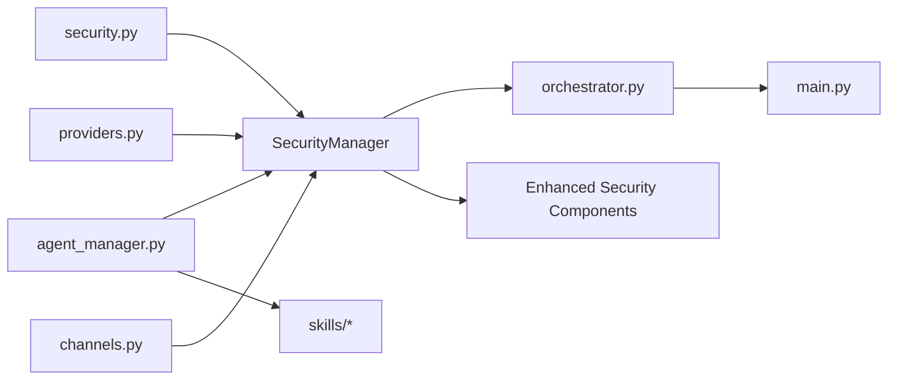

**Diagram sources**
- [backend/app/core/security.py](file://backend/app/core/security.py#L495-L875)
- [backend/app/core/orchestrator.py](file://backend/app/core/orchestrator.py#L95-L534)
- [backend/app/core/agent_manager.py](file://backend/app/core/agent_manager.py#L65-L708)
- [backend/app/core/providers.py](file://backend/app/core/providers.py#L418-L545)
- [backend/app/core/channels.py](file://backend/app/core/channels.py#L405-L524)
- [backend/app/main.py](file://backend/app/main.py#L1-L567)

**Section sources**
- [backend/requirements.txt](file://backend/requirements.txt#L21-L25)

## Performance Considerations
- SecurityManager overhead: Unified API adds minimal overhead while providing comprehensive security.
- Enhanced validation: Advanced threat detection and rate limiting add computational overhead.
- Sandboxing overhead: gVisor/Kata adds latency; tune resource limits and timeouts to balance security and responsiveness.
- Audit logging: File-based logging is synchronous; consider rotating logs and offloading to external systems for high-throughput deployments.
- Rate limiting: Built-in rate limiter in security module; adjust thresholds to match workload patterns.
- Model switching: Health checks and model availability queries introduce network latency; cache results when feasible.

## Troubleshooting Guide
- SecurityManager not responding: Verify all dependencies are installed and configured correctly.
- Sandbox runtime not available: Agent Manager raises runtime errors if gVisor/Kata not detected; install and configure the preferred runtime.
- Action stuck pending: Verify HITL approvals; check audit logs for status transitions.
- Prompt injection blocked: Review validation results and recommendations; adjust input or sanitize policy.
- Audit logs missing: Confirm logging configuration and file permissions; verify log path exists.
- File access denied: Check SecurityManager file access validation results; verify path is within allowed directories.
- Code execution blocked: Review SecurityManager code execution validation; ensure code doesn't contain dangerous patterns.

**Section sources**
- [backend/app/core/agent_manager.py](file://backend/app/core/agent_manager.py#L161-L166)
- [backend/app/core/orchestrator.py](file://backend/app/core/orchestrator.py#L429-L450)
- [backend/app/core/security.py](file://backend/app/core/security.py#L167-L180)
- [backend/app/core/security.py](file://backend/app/core/security.py#L528-L559)
- [backend/app/core/security.py](file://backend/app/core/security.py#L578-L595)

## Conclusion
ClosedPaw's enhanced security architecture embraces zero-trust by applying implicit distrust, enforcing strict security boundaries, and implementing multi-layered protections through the comprehensive SecurityManager. The orchestrator governs risk-aware actions and HITL approvals, the agent manager provides kernel-level isolation, the SecurityManager provides unified security operations across file access, code execution, network security, and session management, and audit logging enables forensic analysis with integrity verification. Together, these components deliver a robust, deployable security posture suitable for local-first AI assistants with advanced threat detection and prevention capabilities.

## Appendices

### Threat Model Analysis
- Adversaries: Malicious actors attempting prompt injection, unauthorized skill execution, credential theft, audit tampering, and path traversal attacks.
- Attack surfaces: User input, skill execution, provider integrations, storage of secrets, file system access, and network communications.
- Mitigations: Zero-trust evaluation, sandboxing, access control, encrypted storage, audit trails, HITL approvals, and comprehensive security validation.

### Security Considerations and Best Practices
- Deployment: Run on Linux/macOS for full sandboxing; keep Ollama and sandbox runtimes updated; restrict network access to localhost.
- Secrets: Use SecurityManager DataVault for API keys; enforce access levels; rotate keys regularly.
- Monitoring: Enable audit logging; monitor for high/medium threat alerts; review HITL approvals.
- Hardening: Disable Docker as the primary runtime; apply strict resource limits; use seccomp and namespace isolation.
- SecurityManager: Utilize unified security API for consistent security operations across all components.
- Validation: Implement comprehensive input validation and sanitization for all user-provided data.
- Access Control: Enforce least privilege principles with multi-level access control for all sensitive operations.