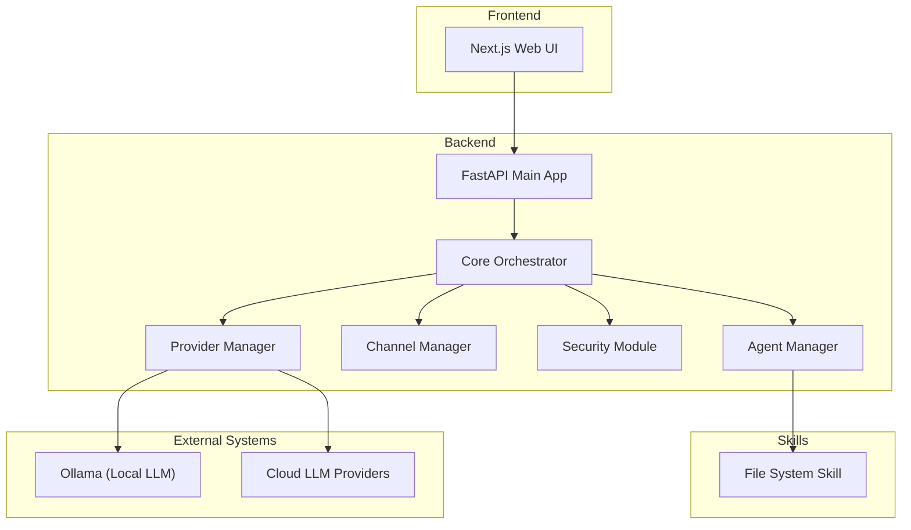
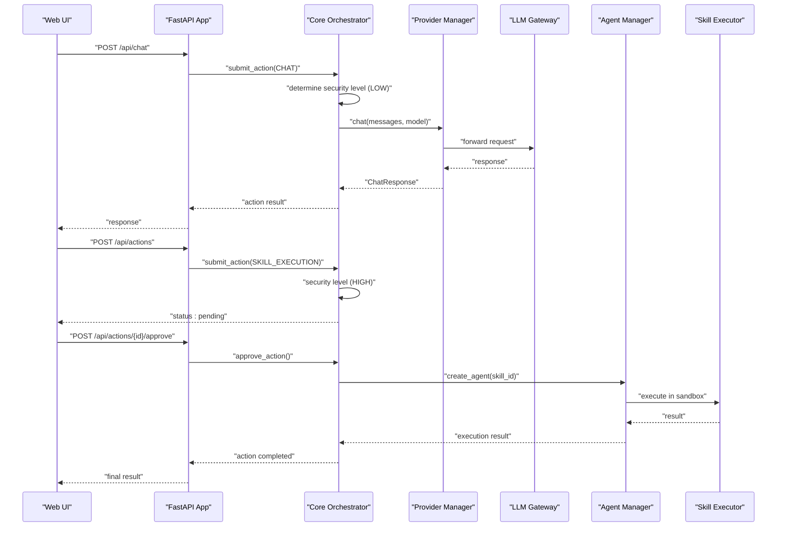
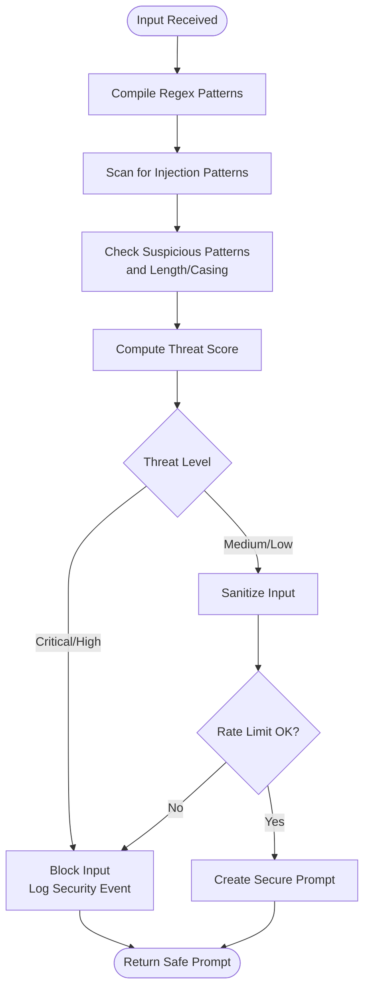
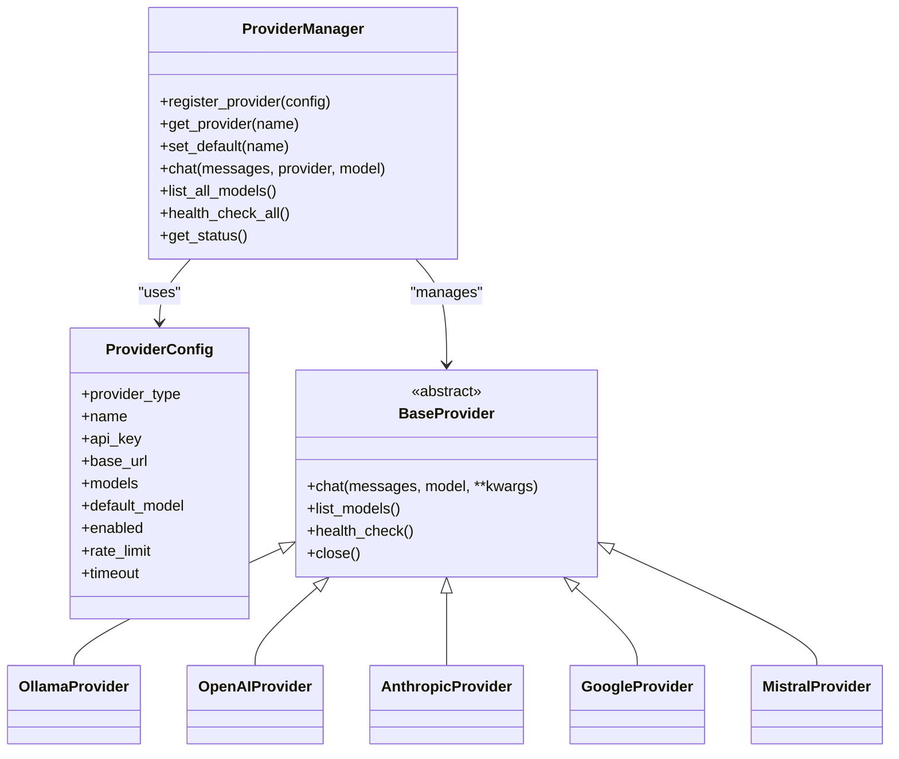
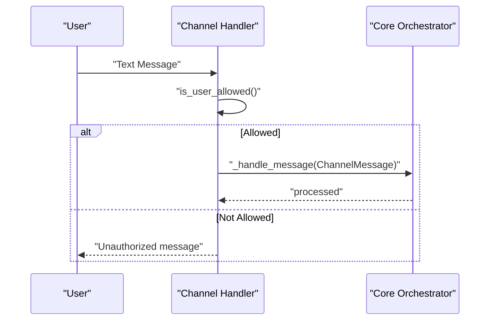
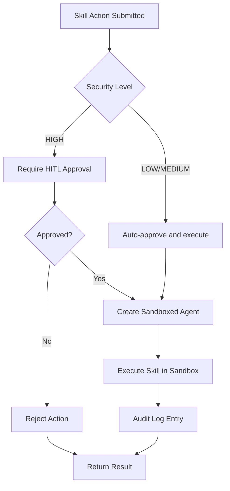
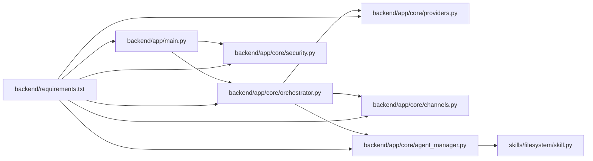

# Threat Model and Security Considerations

<cite>
**Referenced Files in This Document**
- [README.md](file://README.md)
- [CONTRIBUTING.md](file://CONTRIBUTING.md)
- [backend/app/main.py](file://backend/app/main.py)
- [backend/app/core/security.py](file://backend/app/core/security.py)
- [backend/app/core/providers.py](file://backend/app/core/providers.py)
- [backend/app/core/channels.py](file://backend/app/core/channels.py)
- [backend/app/core/orchestrator.py](file://backend/app/core/orchestrator.py)
- [backend/app/core/agent_manager.py](file://backend/app/core/agent_manager.py)
- [skills/filesystem/skill.py](file://skills/filesystem/skill.py)
- [backend/requirements.txt](file://backend/requirements.txt)
</cite>

## Table of Contents
1. [Introduction](#introduction)
2. [Project Structure](#project-structure)
3. [Core Components](#core-components)
4. [Architecture Overview](#architecture-overview)
5. [Detailed Component Analysis](#detailed-component-analysis)
6. [Dependency Analysis](#dependency-analysis)
7. [Performance Considerations](#performance-considerations)
8. [Troubleshooting Guide](#troubleshooting-guide)
9. [Conclusion](#conclusion)
10. [Appendices](#appendices)

## Introduction
This document presents a comprehensive threat model and security considerations for ClosedPaw’s AI assistant architecture. It focuses on AI-specific threats such as prompt injection, multi-provider LLM integration risks, cross-channel communication security, and skill execution safety. It also documents defense-in-depth strategies, controls, incident response, supply chain security, insider threat mitigation, secure communication protocols, assessment methodologies, continuous monitoring, compliance, metrics, and governance.

## Project Structure
ClosedPaw is organized around a Zero-Trust backend (FastAPI), a core orchestrator, sandboxed agent execution, multi-provider LLM integration, multi-channel gateway, and secure skill executors. The frontend is a Next.js application that communicates with the backend over localhost-only endpoints.

**Diagram sources**
- [backend/app/main.py](file://backend/app/main.py#L72-L120)
- [backend/app/core/orchestrator.py](file://backend/app/core/orchestrator.py#L87-L130)
- [backend/app/core/providers.py](file://backend/app/core/providers.py#L418-L457)
- [backend/app/core/channels.py](file://backend/app/core/channels.py#L405-L455)
- [backend/app/core/security.py](file://backend/app/core/security.py#L35-L110)
- [backend/app/core/agent_manager.py](file://backend/app/core/agent_manager.py#L65-L98)
- [skills/filesystem/skill.py](file://skills/filesystem/skill.py#L35-L76)

**Section sources**
- [README.md](file://README.md#L134-L155)
- [backend/app/main.py](file://backend/app/main.py#L72-L120)

## Core Components
- Core Orchestrator: Central action lifecycle, HITL gating, audit logging, and security-level determination.
- Provider Manager: Multi-provider LLM gateway supporting local and cloud providers with health checks and rate limiting.
- Channel Manager: Multi-channel gateway (Telegram, Discord, Slack, Web UI, CLI) with allowlists and rate limiting.
- Security Module: Prompt injection detection, input sanitization, rate limiting, and encrypted data vault.
- Agent Manager: Sandboxed execution using gVisor/Kata for kernel-level isolation.
- Skills: Executable skill modules (e.g., filesystem) with sandboxed execution and audit logging.

**Section sources**
- [backend/app/core/orchestrator.py](file://backend/app/core/orchestrator.py#L87-L130)
- [backend/app/core/providers.py](file://backend/app/core/providers.py#L418-L457)
- [backend/app/core/channels.py](file://backend/app/core/channels.py#L405-L455)
- [backend/app/core/security.py](file://backend/app/core/security.py#L35-L110)
- [backend/app/core/agent_manager.py](file://backend/app/core/agent_manager.py#L65-L98)
- [skills/filesystem/skill.py](file://skills/filesystem/skill.py#L35-L76)

## Architecture Overview
ClosedPaw enforces Zero-Trust by treating all inputs, channels, and providers as untrusted. Actions are classified by security level, with high-risk actions requiring Human-in-the-Loop approval. All destructive or privileged operations are executed inside hardened sandboxes with strict resource limits and seccomp filtering.

**Diagram sources**
- [backend/app/main.py](file://backend/app/main.py#L131-L182)
- [backend/app/core/orchestrator.py](file://backend/app/core/orchestrator.py#L169-L224)
- [backend/app/core/providers.py](file://backend/app/core/providers.py#L470-L483)
- [backend/app/core/agent_manager.py](file://backend/app/core/agent_manager.py#L149-L192)
- [skills/filesystem/skill.py](file://skills/filesystem/skill.py#L333-L350)

## Detailed Component Analysis

### Prompt Injection and Input Validation
- Detection: Pattern-based detection for instruction override, role manipulation, delimiter manipulation, encoding obfuscation, context manipulation, persistence attempts, and tool hijacking.
- Anomaly detection: Control characters, bidirectional text, repetition, excessive special characters, and length thresholds.
- Sanitization: Removal of null bytes, normalization, control character stripping, bidirectional character removal, and markdown escaping.
- Rate limiting: Per-key request throttling to mitigate brute-force and DoS.
- Secure prompt construction: Explicit separation of system instructions and user input with explicit non-overridable markers.

**Diagram sources**
- [backend/app/core/security.py](file://backend/app/core/security.py#L116-L180)
- [backend/app/core/security.py](file://backend/app/core/security.py#L253-L287)

**Section sources**
- [backend/app/core/security.py](file://backend/app/core/security.py#L35-L110)
- [backend/app/core/security.py](file://backend/app/core/security.py#L116-L180)
- [backend/app/core/security.py](file://backend/app/core/security.py#L253-L287)

### Multi-Provider LLM Integration Risks and Controls
- Attack vectors:
  - Provider misconfiguration leading to credential leakage.
  - Model poisoning via prompt injection reaching cloud providers.
  - Egress interception and man-in-the-middle attacks.
  - Provider-side policy bypass attempts.
- Controls:
  - Strict provider configuration validation and health checks.
  - Encrypted secret storage and access-level enforcement.
  - Local-first binding (127.0.0.1) with optional cloud fallback.
  - Consistent message formatting and secure prompt construction.
  - Rate limiting and timeouts per provider.

**Diagram sources**
- [backend/app/core/providers.py](file://backend/app/core/providers.py#L30-L66)
- [backend/app/core/providers.py](file://backend/app/core/providers.py#L418-L457)
- [backend/app/core/providers.py](file://backend/app/core/providers.py#L68-L100)

**Section sources**
- [backend/app/core/providers.py](file://backend/app/core/providers.py#L418-L457)
- [backend/app/core/security.py](file://backend/app/core/security.py#L325-L435)

### Cross-Channel Communication Security
- Attack vectors:
  - Unauthorized access via unauthenticated channels.
  - Message replay and impersonation.
  - Exfiltration of sensitive data across channels.
- Controls:
  - Allowlists per channel and per-user binding.
  - Rate limiting per user and globally.
  - Message handler delegation with pre-checks.
  - Channel-specific APIs for bot tokens and webhook URLs.
  - Local-only service exposure.

**Diagram sources**
- [backend/app/core/channels.py](file://backend/app/core/channels.py#L117-L135)
- [backend/app/core/channels.py](file://backend/app/core/channels.py#L112-L116)

**Section sources**
- [backend/app/core/channels.py](file://backend/app/core/channels.py#L405-L455)
- [backend/app/main.py](file://backend/app/main.py#L80-L87)

### Skill Execution Safety
- Attack vectors:
  - Privilege escalation via destructive file operations.
  - Path traversal and unauthorized filesystem access.
  - Resource exhaustion and process leaks.
- Controls:
  - Sandboxed execution using gVisor/Kata with strict resource limits.
  - Minimal rootfs, seccomp filters, masked/readonly paths.
  - Whitelisted operations and file extensions.
  - Audit logging for all operations.
  - HITL gating for high-risk skills.

**Diagram sources**
- [backend/app/core/orchestrator.py](file://backend/app/core/orchestrator.py#L169-L224)
- [backend/app/core/orchestrator.py](file://backend/app/core/orchestrator.py#L376-L427)
- [backend/app/core/agent_manager.py](file://backend/app/core/agent_manager.py#L149-L192)

**Section sources**
- [backend/app/core/agent_manager.py](file://backend/app/core/agent_manager.py#L65-L98)
- [skills/filesystem/skill.py](file://skills/filesystem/skill.py#L35-L76)
- [skills/filesystem/skill.py](file://skills/filesystem/skill.py#L133-L208)

### Data Protection and Secrets Management
- Attack vectors:
  - Secrets exposed in logs or configuration.
  - Insecure storage of API keys and tokens.
  - Access by unauthorized users or processes.
- Controls:
  - Encrypted data vault with access-level enforcement.
  - Secret rotation and secure generation.
  - Audit logs for vault access.

**Section sources**
- [backend/app/core/security.py](file://backend/app/core/security.py#L325-L435)

### Human-in-the-Loop (HITL) and Audit Logging
- Attack vectors:
  - Bypass of HITL for critical actions.
  - Tampering with audit logs.
- Controls:
  - Security-level classification and gating.
  - Immutable audit log entries with timestamps and outcomes.
  - Endpoint exposure for retrieving audit logs.

**Section sources**
- [backend/app/core/orchestrator.py](file://backend/app/core/orchestrator.py#L51-L70)
- [backend/app/core/orchestrator.py](file://backend/app/core/orchestrator.py#L429-L461)
- [backend/app/main.py](file://backend/app/main.py#L322-L339)

## Dependency Analysis
- External dependencies include cryptography libraries, HTTP clients, and database tools. These introduce risks around cryptographic strength, transport security, and data integrity.
- Internal dependencies show clear separation of concerns: API routes depend on orchestrator, which depends on providers, channels, and agents.

**Diagram sources**
- [backend/app/main.py](file://backend/app/main.py#L14-L16)
- [backend/requirements.txt](file://backend/requirements.txt#L1-L36)

**Section sources**
- [backend/requirements.txt](file://backend/requirements.txt#L1-L36)

## Performance Considerations
- Latency-sensitive operations (LLM calls, channel polling) benefit from local-only Ollama and provider health checks.
- Sandboxed execution adds overhead; resource limits prevent abuse but require tuning.
- Rate limiting prevents abuse but must balance user experience.

## Troubleshooting Guide
- Prompt injection alerts: Review detected patterns and threat level; escalate to critical if needed.
- Provider connectivity: Use health check endpoints; verify base URLs and API keys.
- Channel errors: Confirm allowlists and bot tokens; inspect rate-limiting.
- Agent failures: Check sandbox availability, resource limits, and seccomp denials.
- Audit logs: Use the audit endpoint to investigate outcomes and errors.

**Section sources**
- [backend/app/core/security.py](file://backend/app/core/security.py#L176-L180)
- [backend/app/core/providers.py](file://backend/app/core/providers.py#L495-L503)
- [backend/app/core/channels.py](file://backend/app/core/channels.py#L405-L455)
- [backend/app/core/agent_manager.py](file://backend/app/core/agent_manager.py#L660-L668)
- [backend/app/main.py](file://backend/app/main.py#L322-L339)

## Conclusion
ClosedPaw applies defense-in-depth with layered protections: input validation and prompt injection filters, sandboxed execution, HITL for high-risk actions, audit logging, encrypted secrets, and local-only operation. The documented controls address AI-specific threats, multi-provider integration risks, cross-channel exposure, and skill execution safety. Continuous monitoring, incident response, and governance practices further strengthen the security posture.

## Appendices

### Threat Modeling Examples
- Example: Prompt Injection via Chat Endpoint
  - Asset: LLM gateway and downstream skills.
  - Attack: Malformed user input attempting instruction override.
  - Controls: Input validation, secure prompt construction, rate limiting, audit logging.
  - Outcome: Input blocked or sanitized; security event logged.

- Example: Supply Chain Attack via Provider Credentials
  - Asset: Provider API keys and tokens.
  - Attack: Compromised build environment or dependency.
  - Controls: Encrypted vault, access-level checks, health checks, rotation.
  - Outcome: Secrets remain protected; provider access audited.

- Example: Insider Threat via Elevated Channel Access
  - Asset: Channel allowlists and admin commands.
  - Attack: Authorized user attempting unauthorized escalation.
  - Controls: Allowlists, rate limiting, audit logs, HITL for critical actions.
  - Outcome: Unauthorized actions blocked or require approval.

- Example: Cross-Channel Replay/Impersonation
  - Asset: Channel message handlers and bot tokens.
  - Attack: Replay or spoofed messages.
  - Controls: User binding, per-user rate limits, message validation.
  - Outcome: Unauthorized access prevented.

**Section sources**
- [backend/app/core/security.py](file://backend/app/core/security.py#L116-L180)
- [backend/app/core/providers.py](file://backend/app/core/providers.py#L495-L503)
- [backend/app/core/channels.py](file://backend/app/core/channels.py#L117-L135)
- [backend/app/core/orchestrator.py](file://backend/app/core/orchestrator.py#L376-L427)

### Security Assessment Methodologies
- Penetration testing: Validate Zero-Trust boundaries, sandbox escape resistance, and API exposure.
- Static/Dynamic analysis: Review input validation, crypto usage, and secret handling.
- Red team exercises: Simulate prompt injection, insider threats, and supply chain compromises.
- Compliance audits: Evaluate adherence to access control, logging, and encryption policies.

### Continuous Security Monitoring Recommendations
- Real-time alerting for critical threat detections and rate limit breaches.
- Periodic provider health scans and secret rotation reviews.
- Behavioral analytics on audit logs for anomalous patterns.
- Dependency vulnerability scanning and patch management.

### Regulatory Compliance and Governance
- Principle: Privacy by design and data minimization.
- Controls: Local-only operation, encrypted storage, audit trails, and access enforcement.
- Governance: Contributor code of conduct, responsible disclosure, and mandatory security practices.

**Section sources**
- [README.md](file://README.md#L65-L105)
- [CONTRIBUTING.md](file://CONTRIBUTING.md#L99-L122)
- [CONTRIBUTING.md](file://CONTRIBUTING.md#L151-L158)