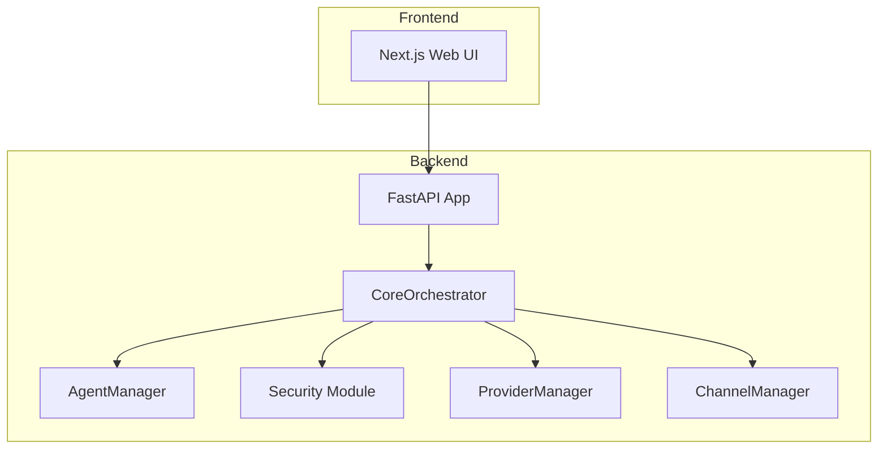
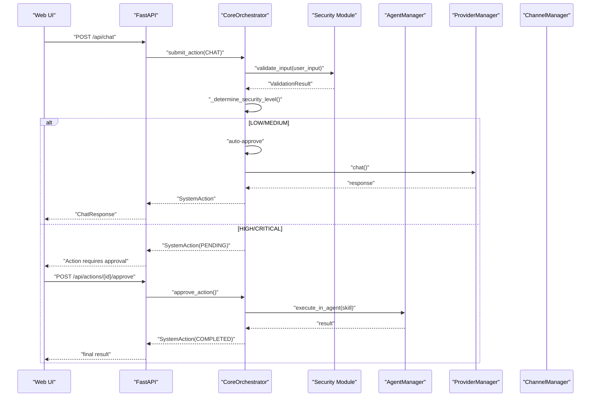
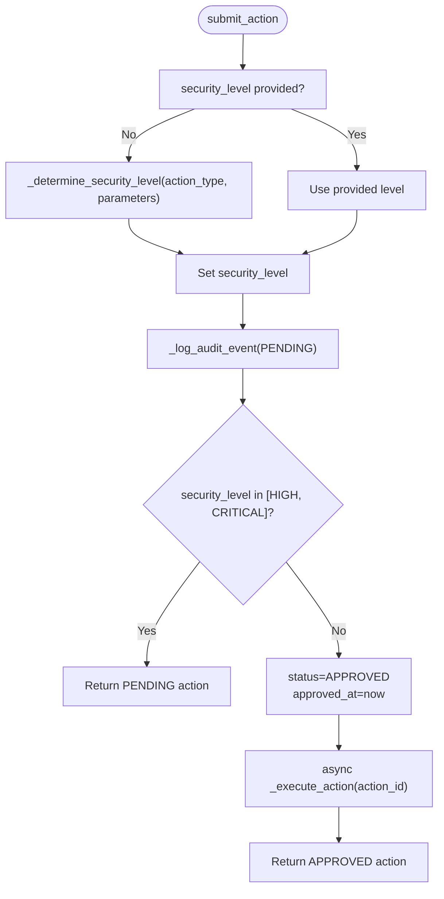
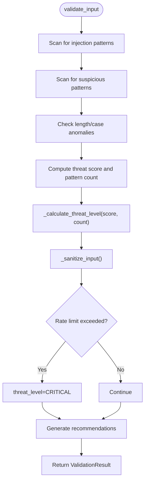
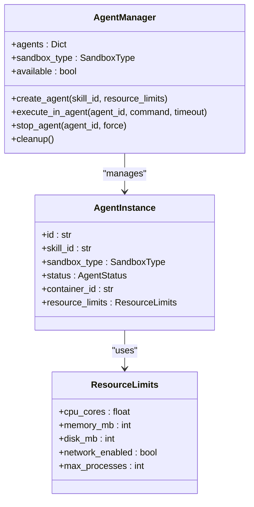
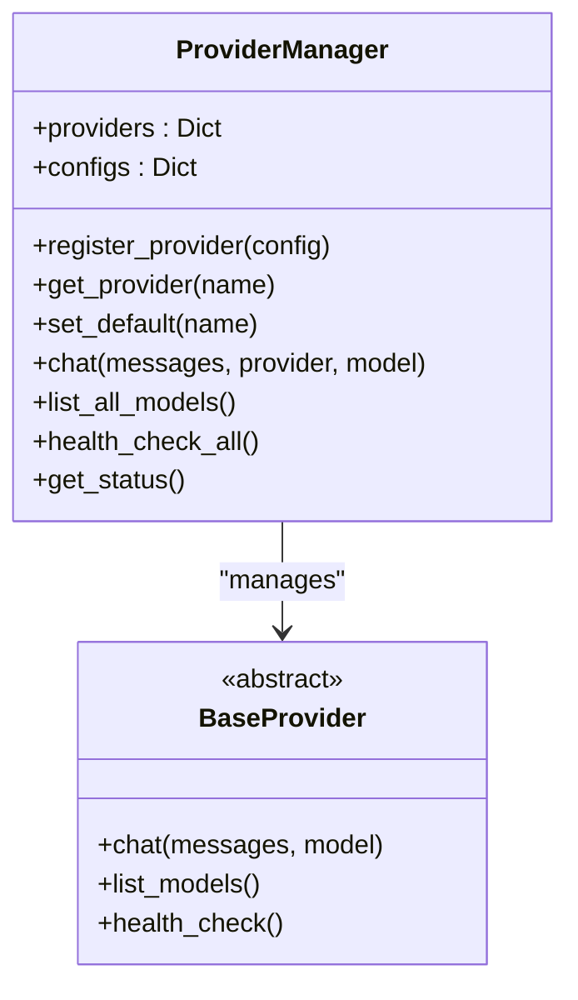
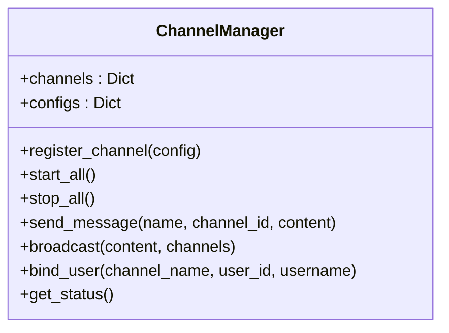
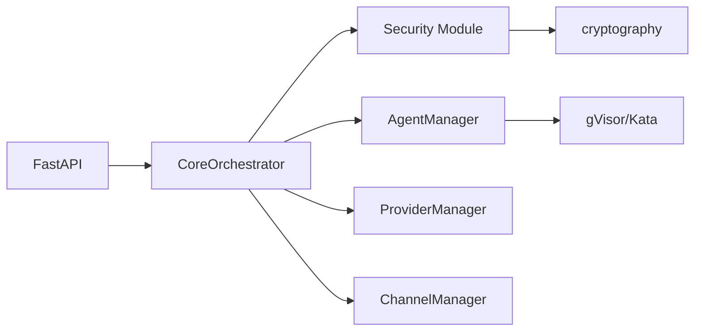

# Zero-Trust Principles

<cite>
**Referenced Files in This Document**
- [README.md](file://README.md)
- [backend/requirements.txt](file://backend/requirements.txt)
- [backend/app/main.py](file://backend/app/main.py)
- [backend/app/core/security.py](file://backend/app/core/security.py)
- [backend/app/core/orchestrator.py](file://backend/app/core/orchestrator.py)
- [backend/app/core/agent_manager.py](file://backend/app/core/agent_manager.py)
- [backend/app/core/providers.py](file://backend/app/core/providers.py)
- [backend/app/core/channels.py](file://backend/app/core/channels.py)
- [skills/filesystem/skill.py](file://skills/filesystem/skill.py)
</cite>

## Table of Contents
1. [Introduction](#introduction)
2. [Project Structure](#project-structure)
3. [Core Components](#core-components)
4. [Architecture Overview](#architecture-overview)
5. [Detailed Component Analysis](#detailed-component-analysis)
6. [Dependency Analysis](#dependency-analysis)
7. [Performance Considerations](#performance-considerations)
8. [Troubleshooting Guide](#troubleshooting-guide)
9. [Conclusion](#conclusion)
10. [Appendices](#appendices)

## Introduction
This document explains ClosedPaw’s zero-trust security model implementation. It focuses on the implicit distrust principle (no component is trusted by default), enforcement of security boundaries between system components, and the chain of responsibility for security approvals. It documents how the CoreOrchestrator enforces trust verification for all actions, the security level classification system (LOW, MEDIUM, HIGH, CRITICAL), and the automatic security level determination algorithm. It also details the trust verification workflow, the role of each security level in the approval process, and how the system maintains security even when individual components are compromised. Practical examples illustrate security level assignments, trust boundary enforcement, and implications for system design and development.

## Project Structure
ClosedPaw is organized around a backend FastAPI service and a frontend Next.js application. The backend implements a zero-trust orchestrator, a sandboxed agent manager, multi-provider LLM gateway, multi-channel gateway, and a prompt injection defense module. The frontend provides a local-only Web UI.

**Diagram sources**
- [backend/app/main.py](file://backend/app/main.py#L72-L78)
- [backend/app/core/orchestrator.py](file://backend/app/core/orchestrator.py#L87-L130)
- [backend/app/core/agent_manager.py](file://backend/app/core/agent_manager.py#L65-L98)
- [backend/app/core/security.py](file://backend/app/core/security.py#L35-L107)
- [backend/app/core/providers.py](file://backend/app/core/providers.py#L418-L457)
- [backend/app/core/channels.py](file://backend/app/core/channels.py#L405-L444)

**Section sources**
- [README.md](file://README.md#L11-L133)
- [backend/app/main.py](file://backend/app/main.py#L72-L78)

## Core Components
- CoreOrchestrator: Central coordinator enforcing zero-trust policies, determining security levels, and managing approvals.
- AgentManager: Executes skills in hardened sandboxes (gVisor/Kata) with strict resource limits and isolation.
- Security Module: Validates inputs, detects prompt injection attempts, sanitizes input, and manages encrypted data vault.
- ProviderManager: Multi-provider LLM gateway with health checks and model listings.
- ChannelManager: Multi-channel gateway with allowlists and rate limiting.
- Frontend: Local-only Web UI with CORS restricted to localhost.

Key security features:
- Implicit distrust: All actions are treated as untrusted until verified.
- Human-in-the-Loop (HITL): HIGH and CRITICAL actions require explicit approval.
- Audit logging: All actions are recorded for compliance and forensics.
- Encrypted storage: Secrets are stored in an encrypted vault.
- Hardened sandboxing: Skills execute in containers with seccomp, masked paths, and resource limits.

**Section sources**
- [backend/app/core/orchestrator.py](file://backend/app/core/orchestrator.py#L51-L57)
- [backend/app/core/orchestrator.py](file://backend/app/core/orchestrator.py#L225-L249)
- [backend/app/core/agent_manager.py](file://backend/app/core/agent_manager.py#L65-L98)
- [backend/app/core/security.py](file://backend/app/core/security.py#L325-L435)
- [backend/app/core/providers.py](file://backend/app/core/providers.py#L418-L457)
- [backend/app/core/channels.py](file://backend/app/core/channels.py#L405-L444)
- [backend/app/main.py](file://backend/app/main.py#L80-L87)

## Architecture Overview
The system enforces zero-trust by:
- Treating all inputs and actions as untrusted.
- Automatically classifying actions by risk and applying appropriate controls.
- Requiring HITL for risky actions.
- Enforcing strict sandboxing for skills.
- Logging all actions for auditability.

**Diagram sources**
- [backend/app/main.py](file://backend/app/main.py#L131-L182)
- [backend/app/core/orchestrator.py](file://backend/app/core/orchestrator.py#L169-L224)
- [backend/app/core/security.py](file://backend/app/core/security.py#L116-L180)
- [backend/app/core/orchestrator.py](file://backend/app/core/orchestrator.py#L225-L249)
- [backend/app/core/orchestrator.py](file://backend/app/core/orchestrator.py#L376-L428)
- [backend/app/core/providers.py](file://backend/app/core/providers.py#L470-L483)
- [backend/app/core/agent_manager.py](file://backend/app/core/agent_manager.py#L475-L538)

## Detailed Component Analysis

### CoreOrchestrator: Zero-Trust Enforcement Engine
- Responsibilities:
  - Accepts actions from API endpoints.
  - Determines security level automatically.
  - Logs audit events.
  - Approves LOW/MEDIUM actions automatically; defers HIGH/CRITICAL to HITL.
  - Executes approved actions and records outcomes.
- Security levels:
  - LOW: No approval needed.
  - MEDIUM: Logged only.
  - HIGH: Requires HITL approval.
  - CRITICAL: Requires HITL plus additional verification.
- Automatic security level determination:
  - CONFIG_CHANGE → CRITICAL.
  - FILE_OPERATION with destructive ops (delete/write/modify) → HIGH; otherwise MEDIUM.
  - SKILL_EXECUTION targeting risky skills (filesystem/system) → HIGH; otherwise MEDIUM.
  - CHAT → LOW.
  - Default → MEDIUM.
- HITL workflow:
  - Pending actions are exposed via API for admin approval.
  - On approval, action is auto-executed asynchronously.

**Diagram sources**
- [backend/app/core/orchestrator.py](file://backend/app/core/orchestrator.py#L169-L224)
- [backend/app/core/orchestrator.py](file://backend/app/core/orchestrator.py#L225-L249)
- [backend/app/core/orchestrator.py](file://backend/app/core/orchestrator.py#L429-L450)

**Section sources**
- [backend/app/core/orchestrator.py](file://backend/app/core/orchestrator.py#L51-L57)
- [backend/app/core/orchestrator.py](file://backend/app/core/orchestrator.py#L169-L224)
- [backend/app/core/orchestrator.py](file://backend/app/core/orchestrator.py#L225-L249)
- [backend/app/core/orchestrator.py](file://backend/app/core/orchestrator.py#L376-L428)
- [backend/app/core/orchestrator.py](file://backend/app/core/orchestrator.py#L429-L450)

### Security Module: Input Validation and Prompt Injection Defense
- Threat levels: NONE, LOW, MEDIUM, HIGH, CRITICAL.
- Validation pipeline:
  - Compile regex patterns for injection categories.
  - Scan input for known injection patterns and suspicious characteristics.
  - Compute threat score and anomaly indicators.
  - Determine threat level and sanitize input.
  - Enforce rate limiting; elevate to CRITICAL if exceeded.
  - Generate actionable recommendations.
- Secure prompt construction:
  - Validates user input.
  - Blocks if threat level is CRITICAL/HIGH.
  - Separates system instructions from user input with clear delimiters.

**Diagram sources**
- [backend/app/core/security.py](file://backend/app/core/security.py#L116-L180)
- [backend/app/core/security.py](file://backend/app/core/security.py#L195-L205)
- [backend/app/core/security.py](file://backend/app/core/security.py#L207-L227)
- [backend/app/core/security.py](file://backend/app/core/security.py#L290-L318)

**Section sources**
- [backend/app/core/security.py](file://backend/app/core/security.py#L16-L23)
- [backend/app/core/security.py](file://backend/app/core/security.py#L116-L180)
- [backend/app/core/security.py](file://backend/app/core/security.py#L253-L287)

### AgentManager: Hardened Sandbox Execution
- Isolation:
  - gVisor or Kata Containers for kernel-level isolation.
  - Docker intentionally excluded due to escape risks.
- Resource limits:
  - CPU, memory, disk, process counts.
  - Network isolation disabled by default.
- Security hardening:
  - Minimal rootfs, masked paths, readonly filesystems.
  - Seccomp profiles allowing only essential syscalls.
- Lifecycle:
  - Detects available sandbox runtime.
  - Creates sandboxed containers with OCI config.
  - Executes commands with timeouts and captures outputs.
  - Stops and cleans up agents.

**Diagram sources**
- [backend/app/core/agent_manager.py](file://backend/app/core/agent_manager.py#L65-L98)
- [backend/app/core/agent_manager.py](file://backend/app/core/agent_manager.py#L149-L192)
- [backend/app/core/agent_manager.py](file://backend/app/core/agent_manager.py#L475-L538)

**Section sources**
- [backend/app/core/agent_manager.py](file://backend/app/core/agent_manager.py#L21-L26)
- [backend/app/core/agent_manager.py](file://backend/app/core/agent_manager.py#L81-L98)
- [backend/app/core/agent_manager.py](file://backend/app/core/agent_manager.py#L194-L294)
- [backend/app/core/agent_manager.py](file://backend/app/core/agent_manager.py#L309-L473)

### ProviderManager: Multi-Provider LLM Gateway
- Supports Ollama, OpenAI, Anthropic, Google, Mistral, and custom endpoints.
- Health checks and model listings.
- Rate limiting and timeouts per provider.

**Diagram sources**
- [backend/app/core/providers.py](file://backend/app/core/providers.py#L418-L457)
- [backend/app/core/providers.py](file://backend/app/core/providers.py#L68-L100)

**Section sources**
- [backend/app/core/providers.py](file://backend/app/core/providers.py#L20-L45)
- [backend/app/core/providers.py](file://backend/app/core/providers.py#L418-L457)

### ChannelManager: Multi-Channel Gateway
- Supports WebUI, Telegram, Discord, Slack, CLI.
- User allowlists, rate limiting, and pairing requirements.
- Message routing and broadcasting.

**Diagram sources**
- [backend/app/core/channels.py](file://backend/app/core/channels.py#L405-L444)

**Section sources**
- [backend/app/core/channels.py](file://backend/app/core/channels.py#L18-L65)
- [backend/app/core/channels.py](file://backend/app/core/channels.py#L405-L444)

### Practical Examples and Implications

- Example 1: Chat action
  - Action type: CHAT.
  - Determined security level: LOW.
  - Outcome: Auto-approved and executed immediately.
  - Implication: Low-risk interactions require no human oversight.

- Example 2: File deletion
  - Action type: SKILL_EXECUTION with skill_id “filesystem” and operation “delete”.
  - Determined security level: HIGH.
  - Outcome: Requires HITL approval; upon approval, executed inside a sandboxed agent.
  - Implication: Destructive operations are isolated and require explicit authorization.

- Example 3: Config change
  - Action type: CONFIG_CHANGE.
  - Determined security level: CRITICAL.
  - Outcome: Requires HITL plus additional verification; execution deferred until approval.
  - Implication: High-risk administrative actions are strictly controlled.

- Example 4: Prompt injection defense
  - Input validation detects suspicious patterns and raises threat level.
  - If threat level is CRITICAL/HIGH, input is blocked and an exception is raised.
  - Implication: Even trusted components (LLM gateways) must receive sanitized prompts.

- Example 5: Data vault
  - Stores secrets encrypted at rest.
  - Access controlled by access levels; logs all accesses.
  - Implication: Sensitive data is protected even if other components are compromised.

**Section sources**
- [backend/app/core/orchestrator.py](file://backend/app/core/orchestrator.py#L225-L249)
- [skills/filesystem/skill.py](file://skills/filesystem/skill.py#L469-L478)
- [backend/app/core/security.py](file://backend/app/core/security.py#L116-L180)
- [backend/app/core/security.py](file://backend/app/core/security.py#L253-L287)
- [backend/app/core/security.py](file://backend/app/core/security.py#L347-L413)

## Dependency Analysis
- Internal dependencies:
  - CoreOrchestrator depends on Security Module for input validation, AgentManager for sandboxed execution, ProviderManager for LLM interactions, and ChannelManager for messaging.
  - AgentManager depends on sandbox runtime detection and OCI configuration.
  - Security Module depends on cryptography for encrypted vault.
- External dependencies:
  - FastAPI, Pydantic, httpx for API and HTTP clients.
  - cryptography, pynacl for encryption.
  - SQLAlchemy, Alembic for persistence (future use).
- Security implications:
  - Singletons for orchestrator, agent manager, provider manager, and channel manager centralize control and reduce accidental misconfiguration.
  - Local-only endpoints (127.0.0.1) minimize exposure.

**Diagram sources**
- [backend/app/core/orchestrator.py](file://backend/app/core/orchestrator.py#L87-L130)
- [backend/app/core/security.py](file://backend/app/core/security.py#L331-L345)
- [backend/app/core/agent_manager.py](file://backend/app/core/agent_manager.py#L99-L114)
- [backend/app/main.py](file://backend/app/main.py#L72-L78)
- [backend/requirements.txt](file://backend/requirements.txt#L21-L25)

**Section sources**
- [backend/app/core/orchestrator.py](file://backend/app/core/orchestrator.py#L87-L130)
- [backend/app/core/security.py](file://backend/app/core/security.py#L331-L345)
- [backend/app/core/agent_manager.py](file://backend/app/core/agent_manager.py#L99-L114)
- [backend/app/main.py](file://backend/app/main.py#L72-L78)
- [backend/requirements.txt](file://backend/requirements.txt#L21-L25)

## Performance Considerations
- Asynchronous execution: CoreOrchestrator uses asyncio for non-blocking action execution and HTTP calls.
- Sandboxing overhead: gVisor/Kata adds containerization overhead; optimize by selecting the appropriate sandbox and minimizing container lifecycle churn.
- Rate limiting: Built-in rate limiter prevents abuse; tune thresholds based on deployment needs.
- Audit logging: Enable only when necessary to reduce I/O overhead; consider rotating logs.

## Troubleshooting Guide
- Action remains PENDING:
  - Check HITL approval endpoint and ensure admin approval is granted.
  - Verify audit logs for reasons behind rejection.
- Sandbox runtime not available:
  - Ensure gVisor or Kata is installed and detected; fallback behavior may limit functionality.
- Provider health failures:
  - Use health check endpoints to diagnose connectivity and credentials.
- Input blocked:
  - Review validation results and recommendations; adjust input or sanitize patterns.
- Data vault access denied:
  - Confirm access level requirements and encryption key availability.

**Section sources**
- [backend/app/core/orchestrator.py](file://backend/app/core/orchestrator.py#L429-L450)
- [backend/app/core/agent_manager.py](file://backend/app/core/agent_manager.py#L99-L114)
- [backend/app/core/providers.py](file://backend/app/core/providers.py#L495-L503)
- [backend/app/core/security.py](file://backend/app/core/security.py#L164-L179)
- [backend/app/core/security.py](file://backend/app/core/security.py#L396-L400)

## Conclusion
ClosedPaw’s zero-trust model ensures that no component is trusted implicitly. The CoreOrchestrator enforces trust verification for all actions, classifies them by risk, and applies appropriate controls. Security levels guide the approval process, with HIGH and CRITICAL actions requiring HITL. Hardened sandboxing, encrypted storage, and comprehensive audit logging protect the system even when individual components are compromised. This design enables secure, local-first AI assistance with strong isolation and transparency.

## Appendices

### Security Level Definitions and Approval Roles
- LOW: No approval needed; auto-executed.
- MEDIUM: Logged only; auto-executed.
- HIGH: Requires HITL approval; auto-executed upon approval.
- CRITICAL: Requires HITL plus additional verification; auto-executed upon approval.

**Section sources**
- [backend/app/core/orchestrator.py](file://backend/app/core/orchestrator.py#L51-L57)
- [backend/app/core/orchestrator.py](file://backend/app/core/orchestrator.py#L225-L249)

### Trust Boundary Enforcement
- Input boundary: All user inputs pass through the Security Module before reaching any action handler.
- Execution boundary: Skills execute inside sandboxed containers with strict resource limits and seccomp profiles.
- Data boundary: Secrets are stored in an encrypted vault with access-level checks.

**Section sources**
- [backend/app/core/security.py](file://backend/app/core/security.py#L116-L180)
- [backend/app/core/agent_manager.py](file://backend/app/core/agent_manager.py#L309-L473)
- [backend/app/core/security.py](file://backend/app/core/security.py#L347-L413)