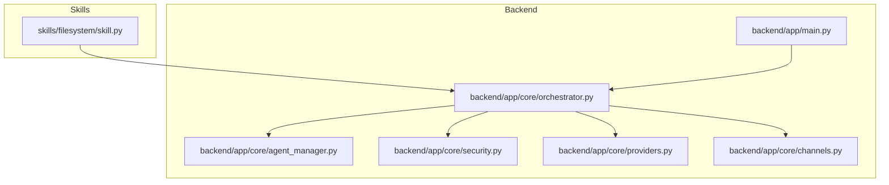
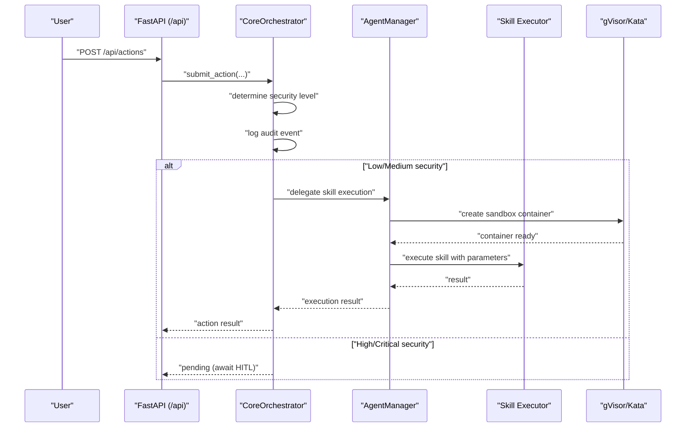
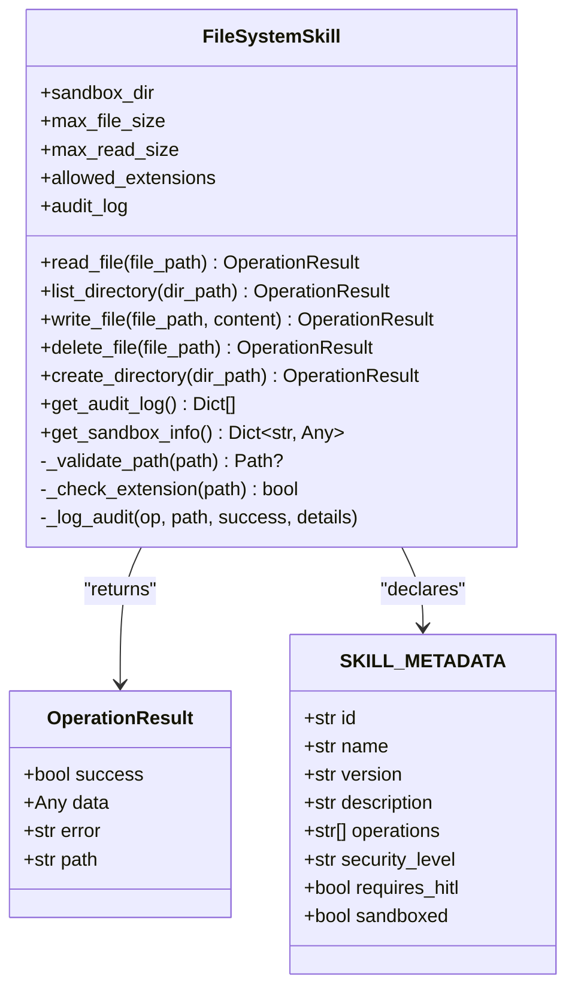
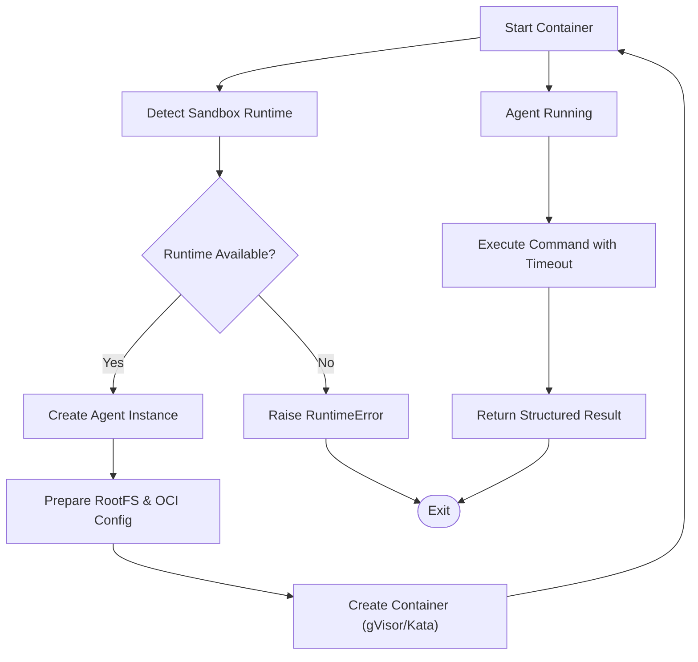
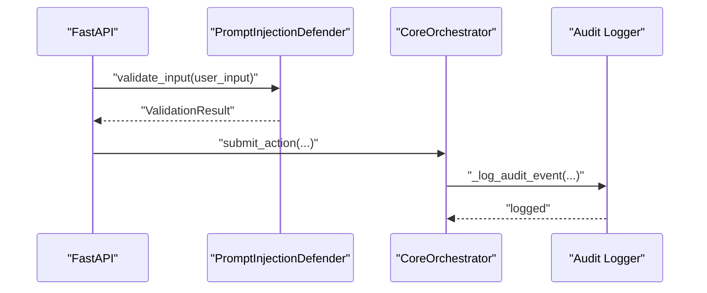
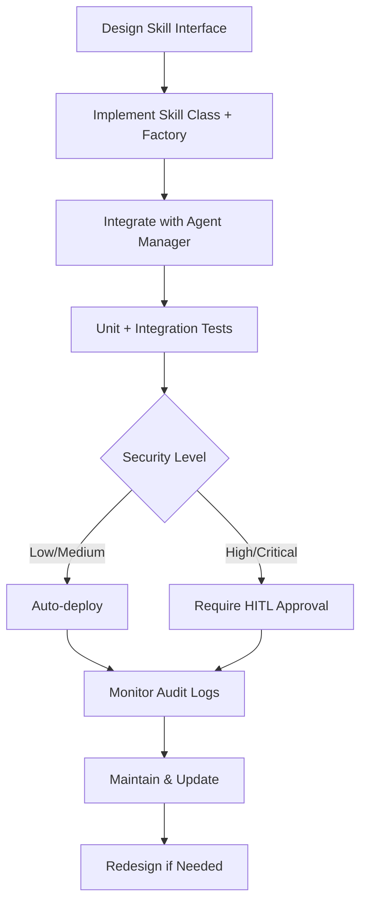
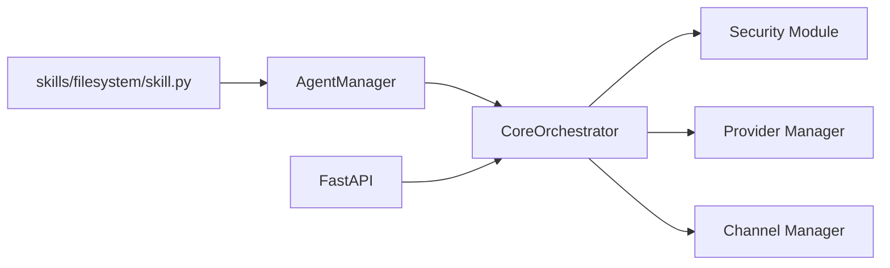

# Custom Skill Development

<cite>
**Referenced Files in This Document**
- [README.md](file://README.md)
- [CONTRIBUTING.md](file://CONTRIBUTING.md)
- [skills/filesystem/skill.py](file://skills/filesystem/skill.py)
- [backend/app/core/security.py](file://backend/app/core/security.py)
- [backend/app/core/providers.py](file://backend/app/core/providers.py)
- [backend/app/core/orchestrator.py](file://backend/app/core/orchestrator.py)
- [backend/app/core/agent_manager.py](file://backend/app/core/agent_manager.py)
- [backend/app/core/channels.py](file://backend/app/core/channels.py)
- [backend/app/main.py](file://backend/app/main.py)
</cite>

## Table of Contents
1. [Introduction](#introduction)
2. [Project Structure](#project-structure)
3. [Core Components](#core-components)
4. [Architecture Overview](#architecture-overview)
5. [Detailed Component Analysis](#detailed-component-analysis)
6. [Dependency Analysis](#dependency-analysis)
7. [Performance Considerations](#performance-considerations)
8. [Troubleshooting Guide](#troubleshooting-guide)
9. [Conclusion](#conclusion)
10. [Appendices](#appendices)

## Introduction
This document explains how to develop custom skills for ClosedPaw, focusing on the skill interface, metadata, factory function patterns, sandbox integration, security requirements, lifecycle, testing, and distribution. It synthesizes the repository’s security-first architecture, sandboxing model, and orchestration patterns to guide secure, maintainable skill development.

## Project Structure
Skills live under the skills directory and are executed within sandboxed agents managed by the Agent Manager. The backend exposes APIs for skill registration, enabling/disabling, and audit logging. Security is enforced through input validation, sandboxing, and human-in-the-loop approvals.

**Diagram sources**
- [skills/filesystem/skill.py](file://skills/filesystem/skill.py#L468-L483)
- [backend/app/main.py](file://backend/app/main.py#L342-L379)
- [backend/app/core/orchestrator.py](file://backend/app/core/orchestrator.py#L158-L167)
- [backend/app/core/agent_manager.py](file://backend/app/core/agent_manager.py#L65-L98)
- [backend/app/core/security.py](file://backend/app/core/security.py#L320-L323)
- [backend/app/core/providers.py](file://backend/app/core/providers.py#L418-L524)
- [backend/app/core/channels.py](file://backend/app/core/channels.py#L405-L524)

**Section sources**
- [README.md](file://README.md#L134-L155)
- [backend/app/main.py](file://backend/app/main.py#L342-L379)

## Core Components
- Skill interface and factory: The filesystem skill demonstrates the pattern with a class-based executor and a factory function returning an instance. It defines allowed operations and an OperationResult structure.
- Sandbox integration: The Agent Manager creates sandboxed containers using gVisor or Kata, enforces resource limits, and isolates execution.
- Security enforcement: The security module provides prompt injection defense, rate limiting, and a data vault for encrypted storage.
- Orchestrator: Routes actions, determines security levels, logs audit events, and delegates skill execution to the Agent Manager.
- Channels: Provides multi-channel entry points (Web UI, Telegram, Discord, Slack, CLI) with user allowlists and rate limiting.

**Section sources**
- [skills/filesystem/skill.py](file://skills/filesystem/skill.py#L35-L483)
- [backend/app/core/agent_manager.py](file://backend/app/core/agent_manager.py#L65-L98)
- [backend/app/core/security.py](file://backend/app/core/security.py#L35-L288)
- [backend/app/core/orchestrator.py](file://backend/app/core/orchestrator.py#L87-L486)
- [backend/app/core/channels.py](file://backend/app/core/channels.py#L405-L524)

## Architecture Overview
ClosedPaw follows a zero-trust design. Users submit actions via channels or API. The Orchestrator validates and classifies security levels, logs audit events, and either auto-executes low-risk actions or defers to Human-in-the-Loop (HITL) for higher risk. For skill execution, the Orchestrator delegates to the Agent Manager, which runs the skill inside a hardened sandbox (gVisor/Kata).

**Diagram sources**
- [backend/app/main.py](file://backend/app/main.py#L241-L262)
- [backend/app/core/orchestrator.py](file://backend/app/core/orchestrator.py#L169-L250)
- [backend/app/core/orchestrator.py](file://backend/app/core/orchestrator.py#L333-L350)
- [backend/app/core/agent_manager.py](file://backend/app/core/agent_manager.py#L149-L193)

## Detailed Component Analysis

### Skill Interface and Factory Pattern
- Interface contract: A skill class encapsulates operations (e.g., read, write, list, delete, create_dir) and returns OperationResult objects. It validates paths, enforces size limits, checks allowed extensions, and logs audit events.
- Metadata: Skills expose a SKILL_METADATA dictionary with id, name, version, description, supported operations, security level, and sandboxing flags.
- Factory function: A create_skill function returns a configured skill instance, enabling dependency injection and customization (e.g., sandbox directory).

**Diagram sources**
- [skills/filesystem/skill.py](file://skills/filesystem/skill.py#L35-L483)

**Section sources**
- [skills/filesystem/skill.py](file://skills/filesystem/skill.py#L35-L483)

### Sandbox Integration and Hardening
- Sandbox detection: The Agent Manager detects gVisor or Kata and configures runtime accordingly.
- Resource limits: CPU, memory, disk, and process limits are enforced.
- Isolation: Namespaces, seccomp filters, masked paths, and read-only rootfs minimize attack surface.
- Execution: Commands are executed inside the sandbox with timeouts and structured results.

**Diagram sources**
- [backend/app/core/agent_manager.py](file://backend/app/core/agent_manager.py#L99-L148)
- [backend/app/core/agent_manager.py](file://backend/app/core/agent_manager.py#L194-L294)
- [backend/app/core/agent_manager.py](file://backend/app/core/agent_manager.py#L475-L538)

**Section sources**
- [backend/app/core/agent_manager.py](file://backend/app/core/agent_manager.py#L65-L98)
- [backend/app/core/agent_manager.py](file://backend/app/core/agent_manager.py#L194-L294)
- [backend/app/core/agent_manager.py](file://backend/app/core/agent_manager.py#L475-L538)

### Security Requirements and Audit Logging
- Input validation and prompt injection defense: The security module validates inputs, detects suspicious patterns, sanitizes input, and raises exceptions for critical threats.
- Rate limiting: Prevents abuse of critical endpoints.
- Audit logging: The Orchestrator logs all actions with timestamps, action type, skill id, status, outcome, and details.
- Data vault: Encrypted storage for secrets with access control levels.

**Diagram sources**
- [backend/app/core/security.py](file://backend/app/core/security.py#L116-L180)
- [backend/app/core/orchestrator.py](file://backend/app/core/orchestrator.py#L429-L450)

**Section sources**
- [backend/app/core/security.py](file://backend/app/core/security.py#L35-L288)
- [backend/app/core/orchestrator.py](file://backend/app/core/orchestrator.py#L429-L450)

### Skill Registration and Lifecycle
- Registration: Skills are loaded by the Orchestrator and exposed via API endpoints to enable/disable and list skills.
- Lifecycle stages: Design, implementation, sandbox integration, testing, approval gating, deployment, monitoring, and maintenance.
- Approval gating: High and critical security actions require HITL approval; low/medium actions auto-execute.

**Diagram sources**
- [backend/app/core/orchestrator.py](file://backend/app/core/orchestrator.py#L158-L167)
- [backend/app/main.py](file://backend/app/main.py#L342-L379)

**Section sources**
- [backend/app/core/orchestrator.py](file://backend/app/core/orchestrator.py#L158-L167)
- [backend/app/main.py](file://backend/app/main.py#L342-L379)

## Dependency Analysis
- Skill depends on the Agent Manager for sandboxed execution.
- Orchestrator depends on the Agent Manager, Security module, Provider Manager, and Channel Manager.
- API endpoints depend on the Orchestrator for action submission and status queries.

**Diagram sources**
- [skills/filesystem/skill.py](file://skills/filesystem/skill.py#L481-L483)
- [backend/app/core/agent_manager.py](file://backend/app/core/agent_manager.py#L65-L98)
- [backend/app/core/orchestrator.py](file://backend/app/core/orchestrator.py#L87-L130)
- [backend/app/core/security.py](file://backend/app/core/security.py#L320-L323)
- [backend/app/core/providers.py](file://backend/app/core/providers.py#L418-L524)
- [backend/app/core/channels.py](file://backend/app/core/channels.py#L405-L524)
- [backend/app/main.py](file://backend/app/main.py#L241-L262)

**Section sources**
- [backend/app/core/orchestrator.py](file://backend/app/core/orchestrator.py#L87-L130)
- [backend/app/core/agent_manager.py](file://backend/app/core/agent_manager.py#L65-L98)
- [backend/app/core/security.py](file://backend/app/core/security.py#L320-L323)
- [backend/app/core/providers.py](file://backend/app/core/providers.py#L418-L524)
- [backend/app/core/channels.py](file://backend/app/core/channels.py#L405-L524)
- [backend/app/main.py](file://backend/app/main.py#L241-L262)

## Performance Considerations
- Sandboxing overhead: gVisor/Kata adds minimal overhead compared to the protection gained; tune resource limits per skill.
- I/O limits: Enforce file size and read size caps to prevent resource exhaustion.
- Network isolation: Disable network access for skills that do not require it.
- Timeouts: Apply strict timeouts for sandbox execution to avoid hanging tasks.

[No sources needed since this section provides general guidance]

## Troubleshooting Guide
- Sandbox runtime not available: Ensure gVisor or Kata is installed and detected; otherwise, Agent Manager will raise runtime errors.
- Audit logs: Use the audit log endpoint to inspect action outcomes and troubleshoot failures.
- Security exceptions: Prompt injection defense can block inputs; review validation results and adjust patterns.
- Provider connectivity: Health checks and model listings help diagnose provider issues.

**Section sources**
- [backend/app/core/agent_manager.py](file://backend/app/core/agent_manager.py#L141-L147)
- [backend/app/main.py](file://backend/app/main.py#L322-L339)
- [backend/app/core/security.py](file://backend/app/core/security.py#L116-L180)
- [backend/app/core/providers.py](file://backend/app/core/providers.py#L495-L503)

## Conclusion
To build secure, maintainable skills for ClosedPaw:
- Follow the skill interface pattern shown by the filesystem skill.
- Integrate with the Agent Manager for sandboxed execution.
- Enforce security via input validation, audit logging, and approval gating.
- Use the Orchestrator’s metadata and registration endpoints to manage skills.
- Adhere to the project’s security-first principles and contribution guidelines.

[No sources needed since this section summarizes without analyzing specific files]

## Appendices

### Step-by-Step Tutorial: Creating a New Skill
1. Define the skill interface:
   - Create a class with methods for each operation (e.g., read, write, list).
   - Return OperationResult objects with success, data, error, and path fields.
   - Implement path validation, size limits, and extension checks.
2. Add metadata:
   - Define SKILL_METADATA with id, name, version, description, operations, security level, requires_hitl flag, and sandboxed flag.
3. Implement factory function:
   - Provide a create_skill function returning a configured instance.
4. Integrate with sandbox:
   - Delegate execution to the Agent Manager for sandboxed isolation.
5. Test thoroughly:
   - Unit tests for each operation.
   - Integration tests validating sandbox behavior and audit logging.
6. Register and deploy:
   - Enable the skill via API endpoints.
   - Monitor audit logs and adjust security levels as needed.

**Section sources**
- [skills/filesystem/skill.py](file://skills/filesystem/skill.py#L35-L483)
- [backend/app/core/agent_manager.py](file://backend/app/core/agent_manager.py#L149-L193)
- [backend/app/main.py](file://backend/app/main.py#L342-L379)

### Security Best Practices
- Never disable security features.
- Validate and sanitize all inputs.
- Use hardened sandboxes (gVisor/Kata); avoid Docker alone.
- Encrypt sensitive data at rest.
- Log security events and monitor audit trails.
- Bind services to localhost only.

**Section sources**
- [CONTRIBUTING.md](file://CONTRIBUTING.md#L101-L112)
- [backend/app/core/security.py](file://backend/app/core/security.py#L116-L180)
- [backend/app/core/agent_manager.py](file://backend/app/core/agent_manager.py#L21-L26)

### Templates and Examples
- Filesystem skill template: See the filesystem skill implementation for a complete example of interface, metadata, and factory function.
- Audit logging pattern: Use the Orchestrator’s audit logging to record action outcomes consistently.

**Section sources**
- [skills/filesystem/skill.py](file://skills/filesystem/skill.py#L468-L483)
- [backend/app/core/orchestrator.py](file://backend/app/core/orchestrator.py#L429-L450)

### Distribution and Version Management
- Use semantic versioning in SKILL_METADATA.version.
- Package skills under the skills directory and register them via the Orchestrator.
- Manage skill enablement via API endpoints for controlled rollout and rollback.

**Section sources**
- [skills/filesystem/skill.py](file://skills/filesystem/skill.py#L468-L478)
- [backend/app/core/orchestrator.py](file://backend/app/core/orchestrator.py#L158-L167)
- [backend/app/main.py](file://backend/app/main.py#L342-L379)