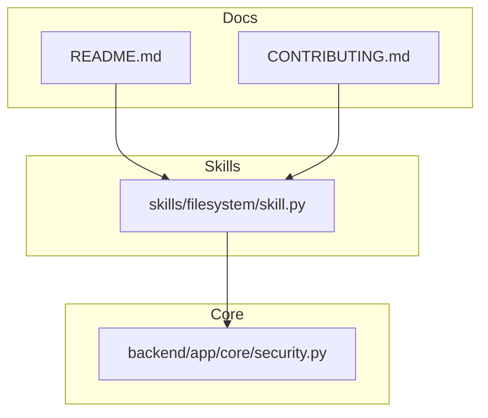
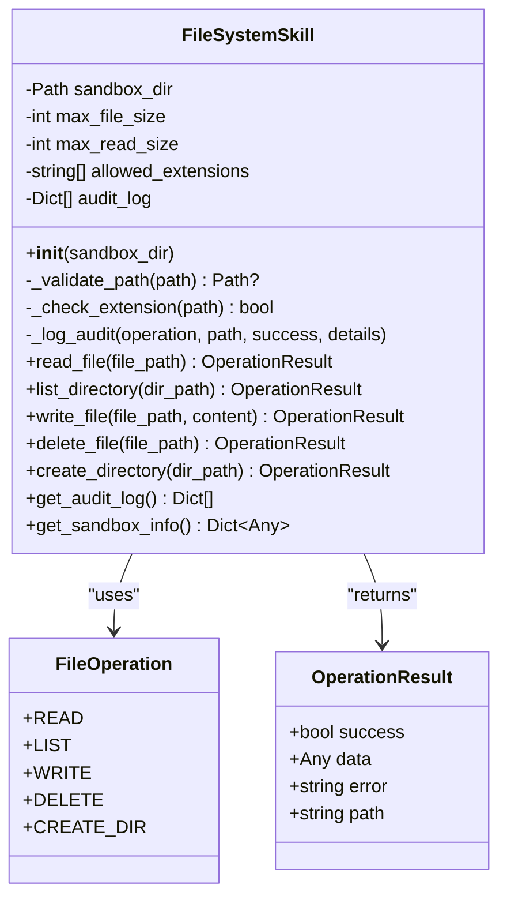
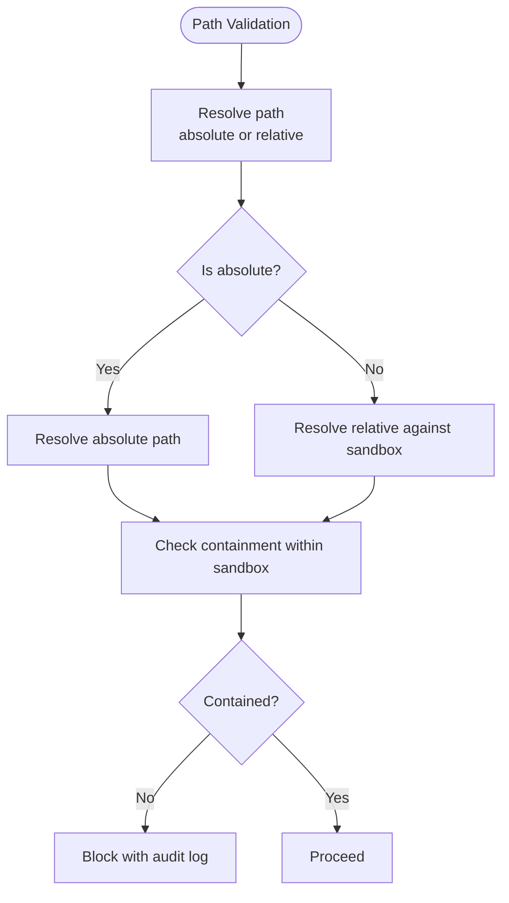
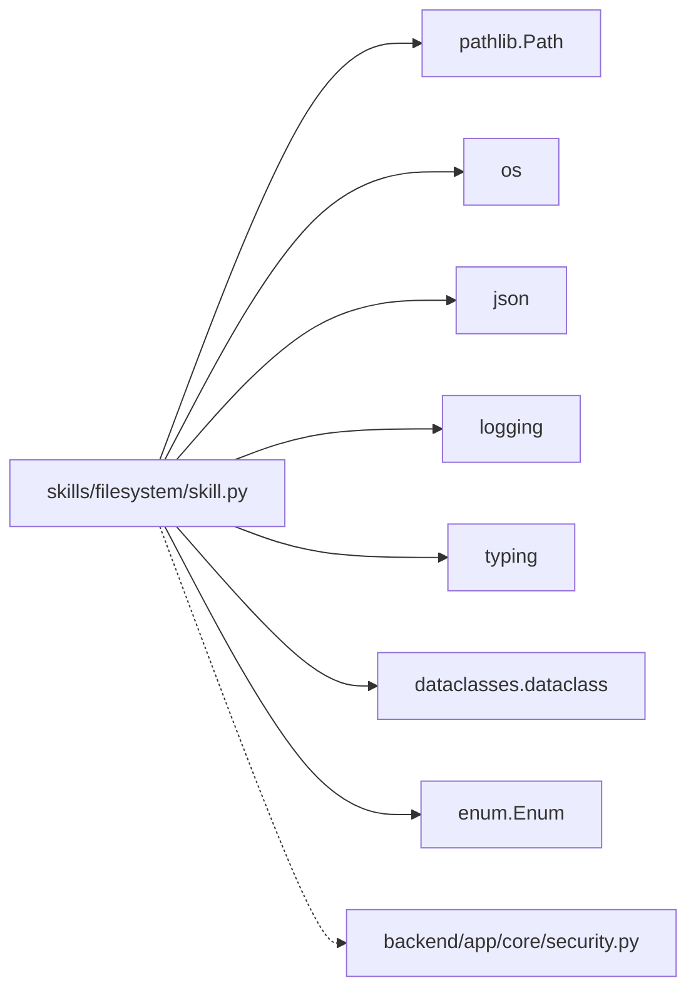

# File System Skill

<cite>
**Referenced Files in This Document**
- [skill.py](file://skills/filesystem/skill.py)
- [README.md](file://README.md)
- [CONTRIBUTING.md](file://CONTRIBUTING.md)
- [security.py](file://backend/app/core/security.py)
</cite>

## Table of Contents
1. [Introduction](#introduction)
2. [Project Structure](#project-structure)
3. [Core Components](#core-components)
4. [Architecture Overview](#architecture-overview)
5. [Detailed Component Analysis](#detailed-component-analysis)
6. [Dependency Analysis](#dependency-analysis)
7. [Performance Considerations](#performance-considerations)
8. [Troubleshooting Guide](#troubleshooting-guide)
9. [Conclusion](#conclusion)
10. [Appendices](#appendices)

## Introduction
This document provides comprehensive documentation for the File System skill in ClosedPaw. It explains the FileSystemSkill class architecture, including path validation, sandbox enforcement, and security measures. It documents all supported operations (read_file, write_file, delete_file, list_directory, create_directory), details security features (path traversal prevention, file extension whitelisting, size limits, and audit logging), and describes the OperationResult data structure and error handling patterns. Practical usage examples, security considerations, customization options, and troubleshooting guidance are included.

## Project Structure
The File System skill is implemented as a standalone skill module with a factory function and metadata for registration. It integrates with the broader ClosedPaw security posture, which emphasizes zero-trust, sandboxing, and audit logging.

**Diagram sources**
- [skill.py](file://skills/filesystem/skill.py#L1-L483)
- [security.py](file://backend/app/core/security.py#L1-L455)
- [README.md](file://README.md#L1-L192)
- [CONTRIBUTING.md](file://CONTRIBUTING.md#L1-L251)

**Section sources**
- [skill.py](file://skills/filesystem/skill.py#L1-L483)
- [README.md](file://README.md#L1-L192)
- [CONTRIBUTING.md](file://CONTRIBUTING.md#L1-L251)

## Core Components
- FileSystemSkill: The primary class encapsulating file system operations with sandbox enforcement and security checks.
- OperationResult: A dataclass representing operation outcomes with fields for success, data, error, and path.
- FileOperation: An enumeration of allowed operations (read, list, write, delete, create_dir).
- SKILL_METADATA: Metadata for skill registration and discovery.
- create_skill: Factory function to instantiate FileSystemSkill with optional sandbox directory customization.

Key capabilities:
- Sandboxed execution within a configurable directory.
- Path traversal prevention using normalized resolution and containment checks.
- Whitelisted file extensions for read/write operations.
- Size limits for reads and writes.
- Audit logging for all operations with timestamps and details.

**Section sources**
- [skill.py](file://skills/filesystem/skill.py#L17-L33)
- [skill.py](file://skills/filesystem/skill.py#L35-L76)
- [skill.py](file://skills/filesystem/skill.py#L468-L483)

## Architecture Overview
The File System skill operates inside a sandboxed environment. It validates all paths, enforces size and extension constraints, and logs all operations for auditability. The skill’s metadata declares its operations and security posture.

**Diagram sources**
- [skill.py](file://skills/filesystem/skill.py#L17-L33)
- [skill.py](file://skills/filesystem/skill.py#L26-L33)
- [skill.py](file://skills/filesystem/skill.py#L35-L466)

## Detailed Component Analysis

### FileSystemSkill Class
Responsibilities:
- Initialize sandbox directory and enforce security limits.
- Validate paths to prevent traversal and ensure containment.
- Enforce file extension whitelisting and size limits.
- Perform file operations with robust error handling and audit logging.
- Expose sandbox information and audit logs.

Security features:
- Sandbox directory restriction enforced via normalized path resolution and containment checks.
- Path traversal prevention using relative-to containment checks.
- Operation whitelist via explicit method selection.
- Size limits for read and write operations.
- Audit logging with timestamps and details.

Customization:
- Sandbox directory can be customized via constructor argument; otherwise defaults to a secure subdirectory under the user’s home.

**Section sources**
- [skill.py](file://skills/filesystem/skill.py#L47-L76)
- [skill.py](file://skills/filesystem/skill.py#L77-L108)
- [skill.py](file://skills/filesystem/skill.py#L110-L113)
- [skill.py](file://skills/filesystem/skill.py#L115-L131)
- [skill.py](file://skills/filesystem/skill.py#L442-L466)

### OperationResult Data Structure
Fields:
- success: Boolean indicating whether the operation succeeded.
- data: Optional payload returned by successful operations.
- error: Optional error message for failures.
- path: Optional string representation of the target path.

Usage:
- All operations return an OperationResult to standardize success/failure reporting.

**Section sources**
- [skill.py](file://skills/filesystem/skill.py#L26-L33)

### Supported Operations

#### read_file(file_path)
Behavior:
- Validates path and ensures it resolves within the sandbox.
- Checks existence and type (must be a file).
- Enforces extension whitelisting.
- Enforces read size limit.
- Reads UTF-8 content and returns it in OperationResult.data.

Error handling:
- Returns OperationResult with success=False and error message for invalid paths, missing files, non-file targets, disallowed extensions, oversized files, or read exceptions.

Audit logging:
- Logs success/failure with details.

Example usage patterns:
- Read a Markdown file from the sandbox root.
- Attempt to read a file outside the sandbox (blocked).
- Attempt to read a binary file (blocked by extension).

Security considerations:
- Path traversal attempts are blocked.
- Oversized files are rejected.
- Non-whitelisted extensions are rejected.

Common pitfalls:
- Using absolute paths pointing outside the sandbox.
- Attempting to read directories or non-existent files.
- Exceeding the read size limit.

**Section sources**
- [skill.py](file://skills/filesystem/skill.py#L133-L208)

#### write_file(file_path, content)
Behavior:
- Validates path and ensures it resolves within the sandbox.
- Enforces extension whitelisting.
- Enforces file size limit based on content length.
- Ensures parent directories exist before writing.
- Writes UTF-8 content.

Error handling:
- Returns OperationResult with success=False and error message for invalid paths, disallowed extensions, oversized content, or write exceptions.

Audit logging:
- Logs success/failure with details.

Example usage patterns:
- Write a JSON configuration file.
- Attempt to write outside the sandbox (blocked).
- Attempt to write content exceeding the size limit.

Security considerations:
- Path traversal attempts are blocked.
- Oversized content is rejected.
- Non-whitelisted extensions are rejected.

Common pitfalls:
- Using absolute paths outside the sandbox.
- Exceeding the file size limit.
- Writing to protected locations.

**Section sources**
- [skill.py](file://skills/filesystem/skill.py#L274-L335)

#### delete_file(file_path)
Behavior:
- Validates path and ensures it resolves within the sandbox.
- Checks existence and type (must be a file).
- Deletes the file.

Error handling:
- Returns OperationResult with success=False and error message for invalid paths, missing files, non-file targets, or deletion exceptions.

Audit logging:
- Logs success/failure with details.

Example usage patterns:
- Delete a temporary file.
- Attempt to delete a directory (blocked).
- Attempt to delete a non-existent file.

Security considerations:
- Path traversal attempts are blocked.
- Only files can be deleted.

Common pitfalls:
- Using absolute paths outside the sandbox.
- Attempting to delete directories.
- Attempting to delete non-existent files.

**Section sources**
- [skill.py](file://skills/filesystem/skill.py#L337-L392)

#### list_directory(dir_path)
Behavior:
- Validates path and ensures it resolves within the sandbox.
- Checks existence and type (must be a directory).
- Iterates entries and collects name, type, and size for files.

Error handling:
- Returns OperationResult with success=False and error message for invalid paths, missing directories, non-directory targets, or iteration exceptions.

Audit logging:
- Logs success/failure with details.

Example usage patterns:
- List the sandbox root directory.
- Attempt to list a directory outside the sandbox (blocked).

Security considerations:
- Path traversal attempts are blocked.

Common pitfalls:
- Using absolute paths outside the sandbox.
- Attempting to list non-directories.

**Section sources**
- [skill.py](file://skills/filesystem/skill.py#L210-L272)

#### create_directory(dir_path)
Behavior:
- Validates path and ensures it resolves within the sandbox.
- Checks that the target does not already exist.
- Creates the directory with parents and ignores existing directories.

Error handling:
- Returns OperationResult with success=False and error message for invalid paths, existing targets, or creation exceptions.

Audit logging:
- Logs success/failure with details.

Example usage patterns:
- Create a subdirectory under the sandbox root.
- Attempt to create a directory outside the sandbox (blocked).

Security considerations:
- Path traversal attempts are blocked.

Common pitfalls:
- Using absolute paths outside the sandbox.
- Attempting to create directories that already exist.

**Section sources**
- [skill.py](file://skills/filesystem/skill.py#L394-L440)

### Security Measures

#### Path Traversal Prevention
- All paths are resolved and checked for containment within the sandbox directory.
- Absolute paths are resolved and validated against the sandbox using relative-to containment.
- Relative paths are resolved against the sandbox directory.

**Diagram sources**
- [skill.py](file://skills/filesystem/skill.py#L77-L108)

**Section sources**
- [skill.py](file://skills/filesystem/skill.py#L77-L108)

#### File Extension Whitelisting
- Allowed extensions include text, documentation, configuration, and script formats.
- Extensions are checked during read and write operations.
- Unknown or empty extensions are allowed conditionally.

**Section sources**
- [skill.py](file://skills/filesystem/skill.py#L67-L70)
- [skill.py](file://skills/filesystem/skill.py#L110-L113)
- [skill.py](file://skills/filesystem/skill.py#L294-L301)

#### Size Limits
- Read size limit prevents loading excessively large files.
- File size limit prevents writing oversized content.
- Violations return OperationResult with error and are audited.

**Section sources**
- [skill.py](file://skills/filesystem/skill.py#L65-L66)
- [skill.py](file://skills/filesystem/skill.py#L180-L187)
- [skill.py](file://skills/filesystem/skill.py#L304-L311)

#### Audit Logging
- Each operation logs to an internal audit trail and to the system logger.
- Entries include timestamp, operation, path, success flag, and details.
- Audit logs can be retrieved via get_audit_log.

**Section sources**
- [skill.py](file://skills/filesystem/skill.py#L115-L131)
- [skill.py](file://skills/filesystem/skill.py#L442-L444)

### Sandbox Directory Structure and Defaults
- Default sandbox directory: user’s home directory under a secure subpath.
- On initialization, the sandbox directory is created if it does not exist.
- The sandbox directory is used as the base for resolving relative paths.

Customization:
- Pass a custom sandbox_dir to the constructor to override the default.

**Section sources**
- [skill.py](file://skills/filesystem/skill.py#L55-L62)
- [skill.py](file://skills/filesystem/skill.py#L58-L62)

### Skill Metadata and Registration
- SKILL_METADATA defines the skill’s identity, operations, security posture, and sandboxed nature.
- create_skill is the factory function used to instantiate the skill.

**Section sources**
- [skill.py](file://skills/filesystem/skill.py#L468-L478)
- [skill.py](file://skills/filesystem/skill.py#L481-L483)

## Dependency Analysis
The File System skill depends on:
- Python standard library modules for path handling, logging, and data structures.
- The security module for broader security context and patterns (e.g., audit logging and validation approaches).

**Diagram sources**
- [skill.py](file://skills/filesystem/skill.py#L6-L14)
- [security.py](file://backend/app/core/security.py#L1-L13)

**Section sources**
- [skill.py](file://skills/filesystem/skill.py#L6-L14)
- [security.py](file://backend/app/core/security.py#L1-L13)

## Performance Considerations
- Path resolution and containment checks are O(1) relative to path depth.
- Directory listing iterates entries; performance scales with directory size.
- File read/write operations depend on file sizes; size limits mitigate resource exhaustion.
- Audit logging adds minimal overhead; consider rotating logs in high-volume environments.

[No sources needed since this section provides general guidance]

## Troubleshooting Guide
Common issues and resolutions:
- Invalid path or path traversal attempt:
  - Symptom: OperationResult.success is False with an error indicating invalid path or traversal attempt.
  - Resolution: Use relative paths within the sandbox; avoid absolute paths outside the sandbox.
- File not found:
  - Symptom: OperationResult.success is False with a “not found” error.
  - Resolution: Verify the file exists and the path is correct.
- Not a file:
  - Symptom: OperationResult.success is False with a “not a file” error.
  - Resolution: Ensure the target is a file, not a directory.
- File type not allowed:
  - Symptom: OperationResult.success is False with a “file type not allowed” error.
  - Resolution: Use a whitelisted extension or adjust allowed extensions if applicable.
- File too large:
  - Symptom: OperationResult.success is False with a “too large” error.
  - Resolution: Reduce file size or content length to meet limits.
- Permission errors:
  - Symptom: OperationResult.success is False with a permission-related error.
  - Resolution: Ensure the sandbox directory is writable and the process has necessary permissions.
- Audit logs not appearing:
  - Symptom: get_audit_log returns an empty list.
  - Resolution: Confirm logging is enabled and the skill instance is the same one performing operations.

Security violation scenarios:
- Path traversal attempts are blocked and audited.
- Non-whitelisted extensions are rejected.
- Oversized files are rejected.

**Section sources**
- [skill.py](file://skills/filesystem/skill.py#L144-L150)
- [skill.py](file://skills/filesystem/skill.py#L153-L159)
- [skill.py](file://skills/filesystem/skill.py#L162-L168)
- [skill.py](file://skills/filesystem/skill.py#L171-L177)
- [skill.py](file://skills/filesystem/skill.py#L180-L187)
- [skill.py](file://skills/filesystem/skill.py#L288-L292)
- [skill.py](file://skills/filesystem/skill.py#L295-L301)
- [skill.py](file://skills/filesystem/skill.py#L304-L311)
- [skill.py](file://skills/filesystem/skill.py#L100-L102)
- [skill.py](file://skills/filesystem/skill.py#L115-L131)

## Conclusion
The File System skill provides a secure, sandboxed interface for file operations with strong safeguards against path traversal, unauthorized extensions, and excessive resource usage. Its standardized OperationResult pattern and comprehensive audit logging enable reliable integration and forensic analysis. By adhering to the documented usage patterns and security considerations, developers can safely leverage file system capabilities within ClosedPaw’s zero-trust framework.

[No sources needed since this section summarizes without analyzing specific files]

## Appendices

### Practical Usage Patterns
- Read a Markdown file:
  - Call read_file with a relative path inside the sandbox.
  - Check OperationResult.success and inspect OperationResult.data.
- Write a configuration file:
  - Call write_file with a relative path and UTF-8 content.
  - Ensure content length does not exceed the file size limit.
- Delete a temporary file:
  - Call delete_file with a relative path to a file.
  - Verify the file exists and is not a directory.
- List a directory:
  - Call list_directory with a relative path to a directory.
  - Iterate over entries and handle types and sizes.
- Create a directory:
  - Call create_directory with a relative path.
  - Ensure the target does not already exist.

Security considerations:
- Always use relative paths within the sandbox.
- Respect allowed extensions and size limits.
- Monitor audit logs for security events.

Customization:
- Override the sandbox directory by passing a custom path to the constructor.
- Adjust allowed extensions and size limits if extending the class.

**Section sources**
- [skill.py](file://skills/filesystem/skill.py#L133-L208)
- [skill.py](file://skills/filesystem/skill.py#L274-L335)
- [skill.py](file://skills/filesystem/skill.py#L337-L392)
- [skill.py](file://skills/filesystem/skill.py#L210-L272)
- [skill.py](file://skills/filesystem/skill.py#L394-L440)
- [skill.py](file://skills/filesystem/skill.py#L47-L76)
- [skill.py](file://skills/filesystem/skill.py#L67-L70)
- [skill.py](file://skills/filesystem/skill.py#L65-L66)