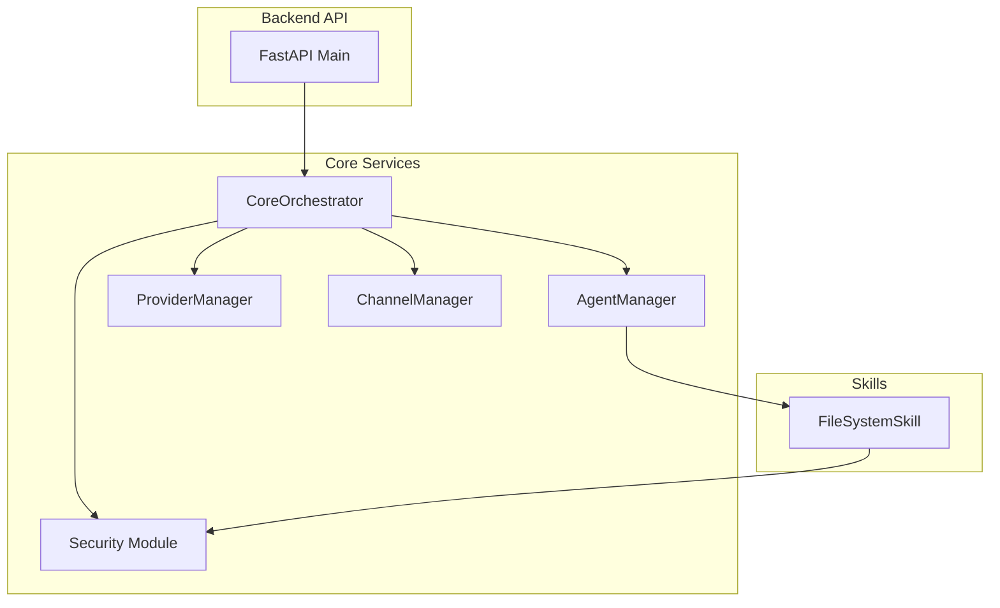
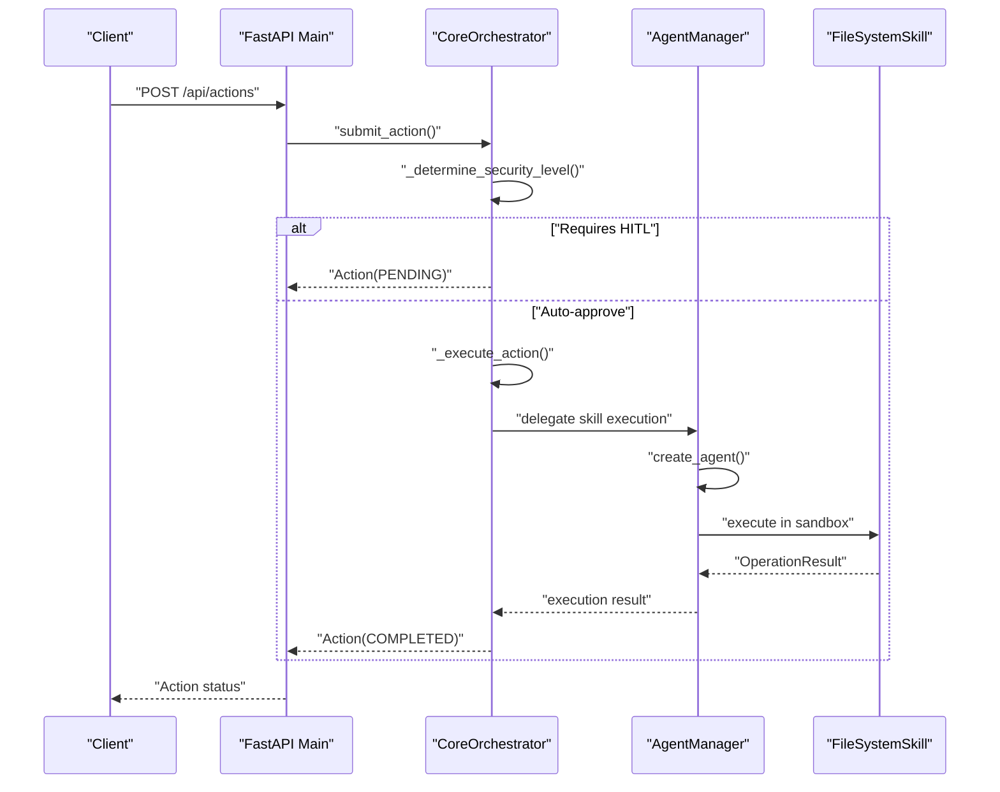
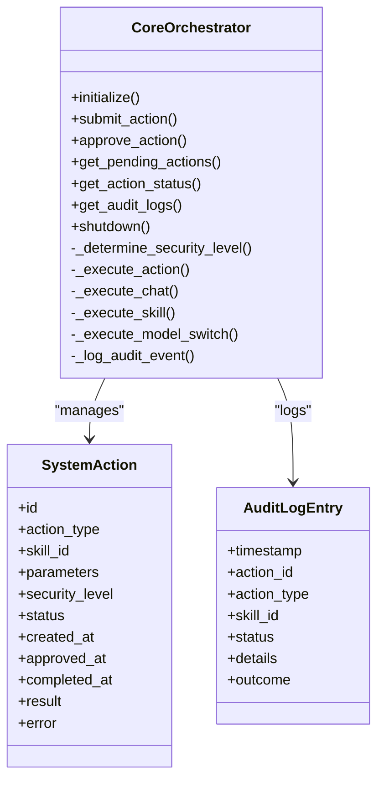
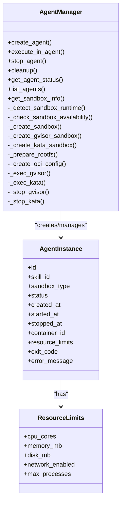
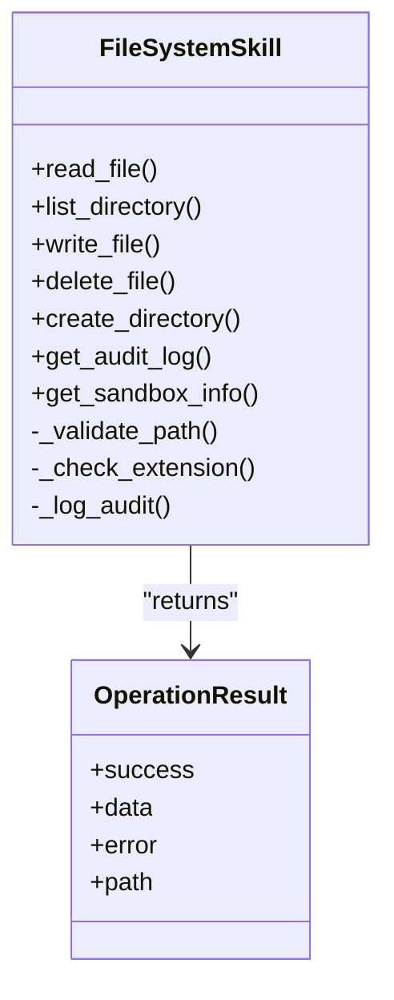
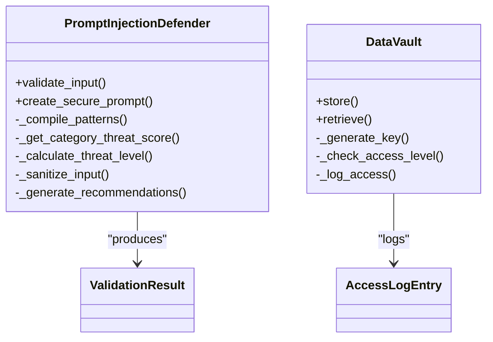
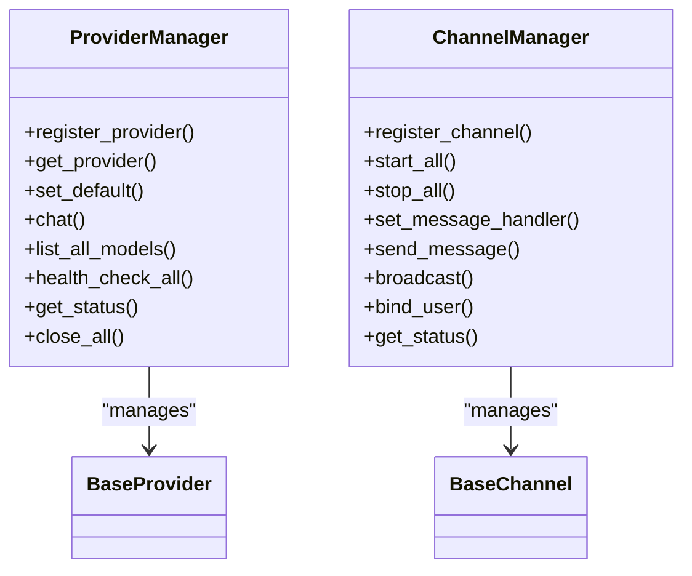
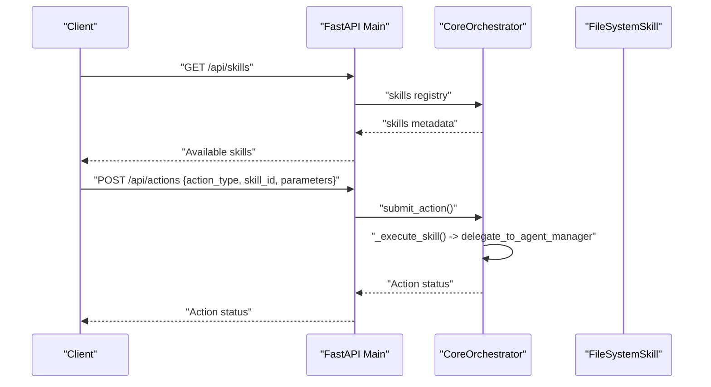
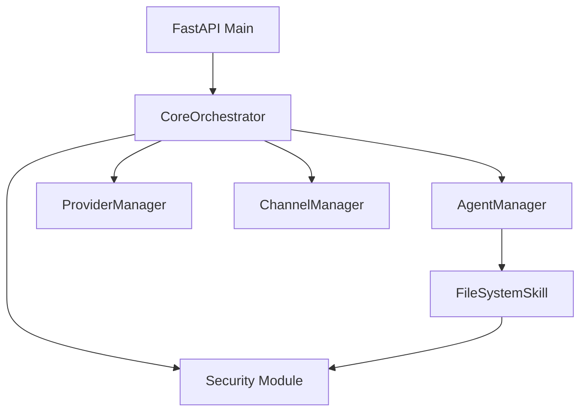

# Skill Architecture

<cite>
**Referenced Files in This Document**
- [main.py](file://backend/app/main.py)
- [orchestrator.py](file://backend/app/core/orchestrator.py)
- [agent_manager.py](file://backend/app/core/agent_manager.py)
- [security.py](file://backend/app/core/security.py)
- [skill.py](file://skills/filesystem/skill.py)
- [providers.py](file://backend/app/core/providers.py)
- [channels.py](file://backend/app/core/channels.py)
- [__init__.py](file://backend/app/core/__init__.py)
</cite>

## Table of Contents
1. [Introduction](#introduction)
2. [Project Structure](#project-structure)
3. [Core Components](#core-components)
4. [Architecture Overview](#architecture-overview)
5. [Detailed Component Analysis](#detailed-component-analysis)
6. [Dependency Analysis](#dependency-analysis)
7. [Performance Considerations](#performance-considerations)
8. [Troubleshooting Guide](#troubleshooting-guide)
9. [Conclusion](#conclusion)

## Introduction
This document describes the ClosedPaw skill architecture with a focus on the sandbox skill execution framework. It explains the core skill interface design, security boundaries, integration with the agent manager, the skill metadata system, factory pattern implementation, and audit logging framework. It also details the security model including sandbox directory restrictions, path traversal prevention, operation whitelisting, the OperationResult data structure, skill lifecycle management, and error handling patterns. Examples demonstrate skill registration, metadata definition, and integration with the security framework, along with the relationship between skills and agents during loading, execution, and monitoring within sandboxed environments.

## Project Structure
The skill architecture spans backend services, orchestration, sandbox management, and skill implementations:
- Backend API exposes endpoints for actions, skills, providers, and channels
- Core orchestrator manages actions, security levels, and delegates skill execution
- Agent manager provisions sandboxed containers for skills
- Security module provides prompt injection defense, rate limiting, and encrypted data vault
- Skills implement specific operations with built-in sandboxing and audit logging
- Providers and channels integrate external systems and user interfaces

**Diagram sources**
- [main.py](file://backend/app/main.py#L72-L567)
- [orchestrator.py](file://backend/app/core/orchestrator.py#L87-L486)
- [agent_manager.py](file://backend/app/core/agent_manager.py#L65-L708)
- [security.py](file://backend/app/core/security.py#L35-L455)
- [providers.py](file://backend/app/core/providers.py#L418-L545)
- [channels.py](file://backend/app/core/channels.py#L405-L524)
- [skill.py](file://skills/filesystem/skill.py#L35-L483)

**Section sources**
- [main.py](file://backend/app/main.py#L72-L567)
- [orchestrator.py](file://backend/app/core/orchestrator.py#L87-L486)
- [agent_manager.py](file://backend/app/core/agent_manager.py#L65-L708)
- [security.py](file://backend/app/core/security.py#L35-L455)
- [providers.py](file://backend/app/core/providers.py#L418-L545)
- [channels.py](file://backend/app/core/channels.py#L405-L524)
- [skill.py](file://skills/filesystem/skill.py#L35-L483)

## Core Components
- CoreOrchestrator: Central coordinator for actions, security levels, audit logging, and delegation to agent manager for sandboxed execution
- AgentManager: Creates and manages sandboxed agents using gVisor or Kata Containers, enforces resource limits, and executes commands within containers
- FileSystemSkill: Example skill implementing file operations with sandbox directory restrictions, path traversal prevention, operation whitelisting, size limits, and audit logging
- Security Module: Provides prompt injection defense, rate limiting, and encrypted data vault for secrets
- ProviderManager: Multi-provider LLM gateway supporting Ollama, OpenAI, Anthropic, Google, Mistral, and custom endpoints
- ChannelManager: Multi-channel gateway supporting Telegram, Discord, Slack, Matrix, Web UI, and CLI

**Section sources**
- [orchestrator.py](file://backend/app/core/orchestrator.py#L87-L486)
- [agent_manager.py](file://backend/app/core/agent_manager.py#L65-L708)
- [skill.py](file://skills/filesystem/skill.py#L35-L483)
- [security.py](file://backend/app/core/security.py#L35-L455)
- [providers.py](file://backend/app/core/providers.py#L418-L545)
- [channels.py](file://backend/app/core/channels.py#L405-L524)

## Architecture Overview
The system follows a Zero-Trust model:
- Actions are submitted to the orchestrator with automatic security level determination
- Low/medium security actions auto-execute; high/critical actions require Human-in-the-Loop (HITL) approval
- Skill execution is delegated to AgentManager for sandboxed execution
- Security module validates inputs and sanitizes prompts to prevent injection
- Audit logs record all actions and outcomes

**Diagram sources**
- [main.py](file://backend/app/main.py#L242-L285)
- [orchestrator.py](file://backend/app/core/orchestrator.py#L169-L223)
- [agent_manager.py](file://backend/app/core/agent_manager.py#L149-L192)
- [skill.py](file://skills/filesystem/skill.py#L133-L208)

**Section sources**
- [main.py](file://backend/app/main.py#L242-L285)
- [orchestrator.py](file://backend/app/core/orchestrator.py#L169-L223)
- [agent_manager.py](file://backend/app/core/agent_manager.py#L149-L192)
- [skill.py](file://skills/filesystem/skill.py#L133-L208)

## Detailed Component Analysis

### CoreOrchestrator
- Responsibilities:
  - Action lifecycle management (submit, approve/reject, execute)
  - Security level classification (LOW, MEDIUM, HIGH, CRITICAL)
  - Audit logging for all actions
  - Delegation to AgentManager for sandboxed skill execution
- Key behaviors:
  - Security level determination based on action type and parameters
  - HITL approval gating for high-risk actions
  - Execution delegation to AgentManager for skill actions
  - Audit log entries with timestamps, outcomes, and details

**Diagram sources**
- [orchestrator.py](file://backend/app/core/orchestrator.py#L87-L486)

**Section sources**
- [orchestrator.py](file://backend/app/core/orchestrator.py#L87-L486)

### AgentManager
- Responsibilities:
  - Detect and configure sandbox runtime (gVisor or Kata Containers)
  - Provision sandboxed agents with resource limits and isolation
  - Execute commands inside sandboxed containers
  - Manage agent lifecycle (create, run, stop, cleanup)
- Security features:
  - CPU/memory/disk limits
  - Network isolation
  - Process and namespace isolation
  - Seccomp policies and masked paths

**Diagram sources**
- [agent_manager.py](file://backend/app/core/agent_manager.py#L65-L708)

**Section sources**
- [agent_manager.py](file://backend/app/core/agent_manager.py#L65-L708)

### FileSystemSkill
- Responsibilities:
  - File operations (read, write, delete, list, create_dir)
  - Sandboxed execution with directory restrictions and path traversal prevention
  - Operation whitelisting and size limits
  - Audit logging for all operations
- Data structures:
  - OperationResult: standardized result with success flag, optional data/error, and path
  - FileOperation: enumeration of allowed operations

**Diagram sources**
- [skill.py](file://skills/filesystem/skill.py#L35-L483)

**Section sources**
- [skill.py](file://skills/filesystem/skill.py#L35-L483)

### Security Module
- PromptInjectionDefender:
  - Validates user input against injection patterns and suspicious heuristics
  - Sanitizes input and determines threat levels
  - Enforces rate limiting and generates recommendations
- DataVault:
  - Encrypted storage for secrets with access control levels
  - Audit logging for store/retrieve operations

**Diagram sources**
- [security.py](file://backend/app/core/security.py#L35-L455)

**Section sources**
- [security.py](file://backend/app/core/security.py#L35-L455)

### ProviderManager and ChannelManager
- ProviderManager:
  - Abstract provider interface with concrete implementations for Ollama, OpenAI, Anthropic, Google, Mistral
  - Health checks, model listing, and chat completion routing
- ChannelManager:
  - Abstract channel interface with concrete implementations for Telegram, Discord, Slack, Web UI, CLI
  - Message routing, user allowlists, and rate limiting

**Diagram sources**
- [providers.py](file://backend/app/core/providers.py#L418-L545)
- [channels.py](file://backend/app/core/channels.py#L405-L524)

**Section sources**
- [providers.py](file://backend/app/core/providers.py#L418-L545)
- [channels.py](file://backend/app/core/channels.py#L405-L524)

### API Integration and Skill Registration
- API endpoints:
  - Submit actions with optional skill_id and parameters
  - Approve/reject pending actions
  - View audit logs and skill status
- Skill registration:
  - Skills are loaded by orchestrator and exposed via API
  - Each skill defines metadata (id, name, version, description, operations, security level, requires HITL, sandboxed)
  - Factory function creates skill instances with optional sandbox directory

**Diagram sources**
- [main.py](file://backend/app/main.py#L342-L379)
- [main.py](file://backend/app/main.py#L242-L285)
- [orchestrator.py](file://backend/app/core/orchestrator.py#L333-L350)
- [skill.py](file://skills/filesystem/skill.py#L468-L483)

**Section sources**
- [main.py](file://backend/app/main.py#L342-L379)
- [main.py](file://backend/app/main.py#L242-L285)
- [orchestrator.py](file://backend/app/core/orchestrator.py#L333-L350)
- [skill.py](file://skills/filesystem/skill.py#L468-L483)

## Dependency Analysis
- Orchestrator depends on AgentManager for sandboxed execution, ProviderManager for LLM operations, ChannelManager for user interfaces, and Security module for input validation and data vault
- AgentManager depends on sandbox runtime detection and OCI configuration for container isolation
- FileSystemSkill depends on security module for audit logging and implements its own sandboxing and validation
- API layer depends on orchestrator for action lifecycle and on provider/channel managers for integrations

**Diagram sources**
- [__init__.py](file://backend/app/core/__init__.py#L5-L18)
- [main.py](file://backend/app/main.py#L14-L17)
- [orchestrator.py](file://backend/app/core/orchestrator.py#L93-L100)
- [agent_manager.py](file://backend/app/core/agent_manager.py#L81-L84)
- [security.py](file://backend/app/core/security.py#L437-L455)
- [providers.py](file://backend/app/core/providers.py#L526-L545)
- [channels.py](file://backend/app/core/channels.py#L505-L524)
- [skill.py](file://skills/filesystem/skill.py#L35-L75)

**Section sources**
- [__init__.py](file://backend/app/core/__init__.py#L5-L18)
- [main.py](file://backend/app/main.py#L14-L17)
- [orchestrator.py](file://backend/app/core/orchestrator.py#L93-L100)
- [agent_manager.py](file://backend/app/core/agent_manager.py#L81-L84)
- [security.py](file://backend/app/core/security.py#L437-L455)
- [providers.py](file://backend/app/core/providers.py#L526-L545)
- [channels.py](file://backend/app/core/channels.py#L505-L524)
- [skill.py](file://skills/filesystem/skill.py#L35-L75)

## Performance Considerations
- Container startup and execution latency: gVisor and Kata Containers introduce overhead; optimize by reusing agents where appropriate and minimizing container churn
- Resource limits: tune CPU, memory, and process limits per skill to balance performance and safety
- I/O operations: file system skill enforces size limits and whitelisted extensions to prevent excessive I/O
- Audit logging: ensure logs are rotated and stored efficiently to avoid I/O bottlenecks
- Rate limiting: security module applies rate limits to mitigate abuse; coordinate with orchestrator timeouts

## Troubleshooting Guide
- Sandbox runtime detection failures:
  - Verify gVisor or Kata Containers installation and permissions
  - Check availability flags and fallback behavior
- Agent creation errors:
  - Inspect container creation logs and OCI configuration
  - Validate sandbox directory permissions and disk space
- Action approval and execution:
  - Confirm security level classification and HITL requirements
  - Review audit logs for action outcomes and error details
- Skill operation failures:
  - Check path validation, extension whitelisting, and size limits
  - Review audit logs for operation details and error messages
- Provider and channel connectivity:
  - Health check providers and channels
  - Validate tokens and configurations

**Section sources**
- [agent_manager.py](file://backend/app/core/agent_manager.py#L99-L147)
- [agent_manager.py](file://backend/app/core/agent_manager.py#L194-L294)
- [orchestrator.py](file://backend/app/core/orchestrator.py#L225-L249)
- [orchestrator.py](file://backend/app/core/orchestrator.py#L429-L450)
- [skill.py](file://skills/filesystem/skill.py#L77-L108)
- [skill.py](file://skills/filesystem/skill.py#L115-L131)
- [providers.py](file://backend/app/core/providers.py#L495-L503)
- [channels.py](file://backend/app/core/channels.py#L445-L454)

## Conclusion
The ClosedPaw skill architecture implements a robust, sandboxed execution model with strong security boundaries. The orchestrator coordinates actions and delegates risky operations to sandboxed agents, while the security module defends against prompt injection and manages secrets. Skills like FileSystemSkill encapsulate safe operations with built-in auditing and validation. The API layer integrates with providers and channels, enabling multi-modal interaction. Together, these components form a secure, extensible framework for skill execution within isolated environments.