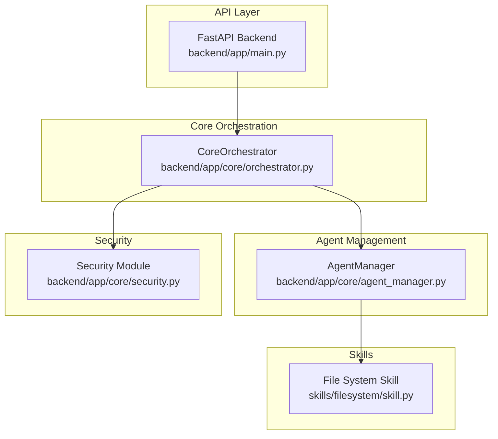
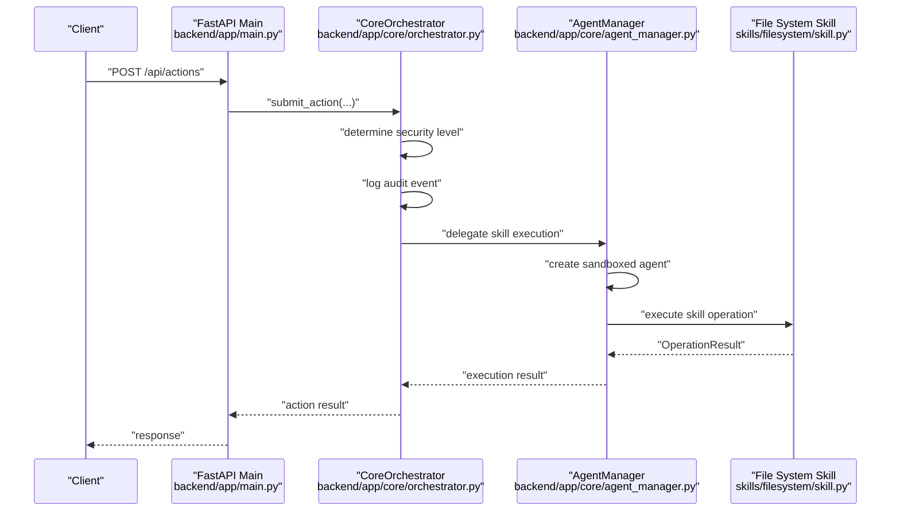
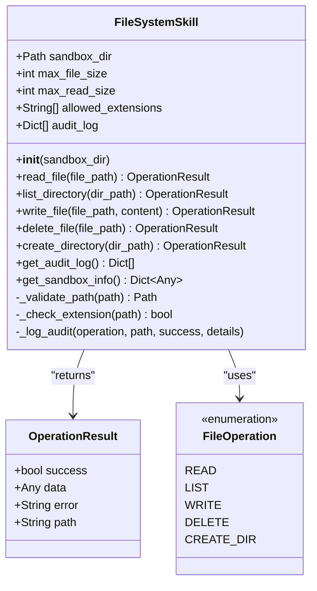
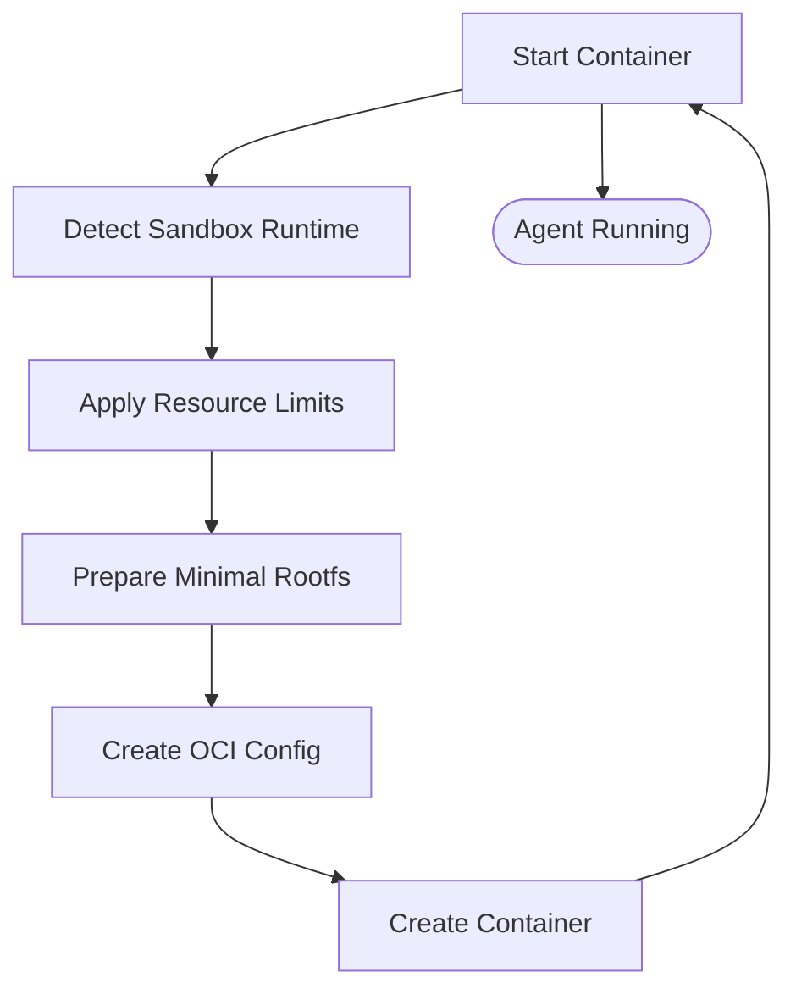
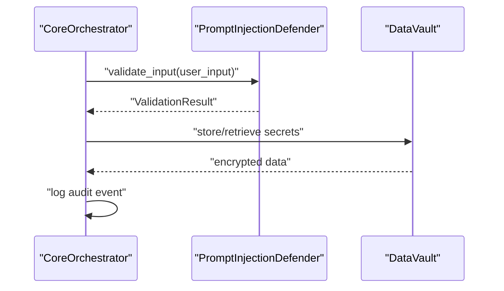
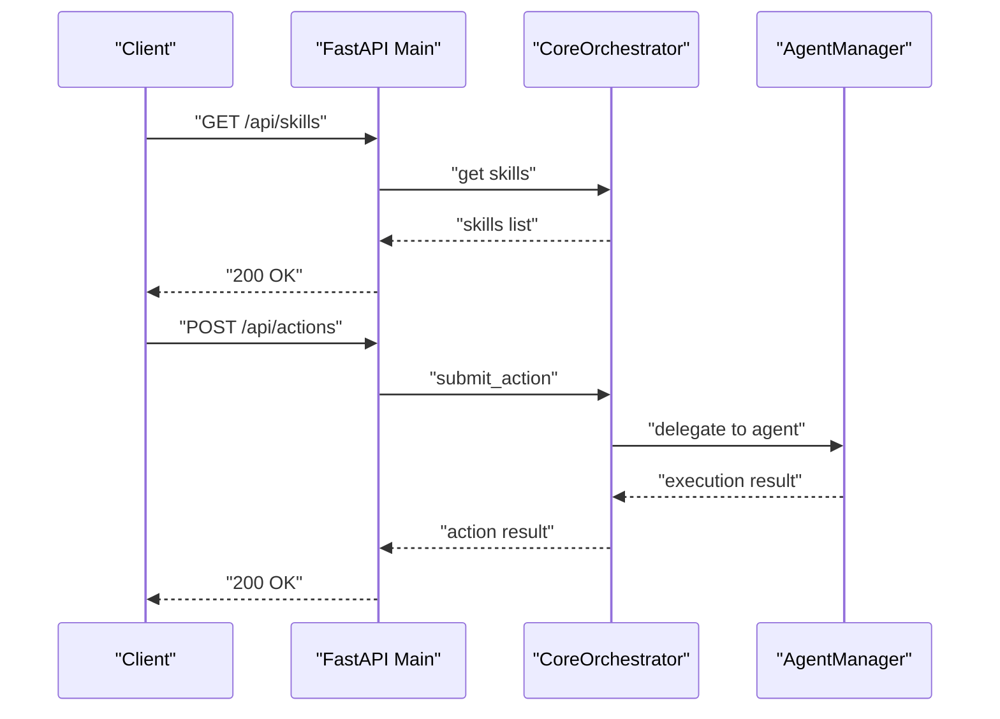
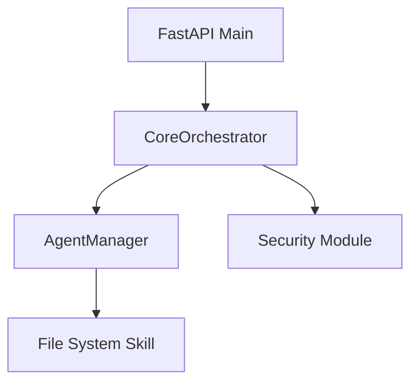

# Skills System

<cite>
**Referenced Files in This Document**
- [skills/filesystem/skill.py](file://skills/filesystem/skill.py)
- [backend/app/core/orchestrator.py](file://backend/app/core/orchestrator.py)
- [backend/app/core/agent_manager.py](file://backend/app/core/agent_manager.py)
- [backend/app/core/security.py](file://backend/app/core/security.py)
- [backend/app/main.py](file://backend/app/main.py)
- [CONTRIBUTING.md](file://CONTRIBUTING.md)
- [README.md](file://README.md)
</cite>

## Table of Contents
1. [Introduction](#introduction)
2. [Project Structure](#project-structure)
3. [Core Components](#core-components)
4. [Architecture Overview](#architecture-overview)
5. [Detailed Component Analysis](#detailed-component-analysis)
6. [Dependency Analysis](#dependency-analysis)
7. [Performance Considerations](#performance-considerations)
8. [Troubleshooting Guide](#troubleshooting-guide)
9. [Conclusion](#conclusion)
10. [Appendices](#appendices)

## Introduction
This document explains the skills system for ClosedPaw with a focus on the sandbox skill execution framework. It covers the skill architecture for custom operations, sandbox integration with security boundaries, and development guidelines. It documents the File System skill implementation, including file operations, path traversal prevention, and permission management. It also defines the skill interface, outlines security requirements for skill execution, and shows integration examples with the Agent Manager. Best practices, security considerations, and audit logging are included, along with practical examples from the File System skill implementation.

## Project Structure
The skills system centers around:
- A sandboxed execution framework managed by the Agent Manager
- An orchestration layer that validates and routes actions to skills
- A File System skill that demonstrates secure operations with sandboxing and auditing
- Security modules that enforce prompt injection defense and data protection

**Diagram sources**
- [backend/app/main.py](file://backend/app/main.py#L1-L567)
- [backend/app/core/orchestrator.py](file://backend/app/core/orchestrator.py#L1-L486)
- [backend/app/core/agent_manager.py](file://backend/app/core/agent_manager.py#L1-L708)
- [backend/app/core/security.py](file://backend/app/core/security.py#L1-L455)
- [skills/filesystem/skill.py](file://skills/filesystem/skill.py#L1-L483)

**Section sources**
- [backend/app/main.py](file://backend/app/main.py#L1-L567)
- [backend/app/core/orchestrator.py](file://backend/app/core/orchestrator.py#L1-L486)
- [backend/app/core/agent_manager.py](file://backend/app/core/agent_manager.py#L1-L708)
- [backend/app/core/security.py](file://backend/app/core/security.py#L1-L455)
- [skills/filesystem/skill.py](file://skills/filesystem/skill.py#L1-L483)

## Core Components
- CoreOrchestrator: Validates actions, determines security levels, logs audit events, and delegates skill execution to the Agent Manager.
- AgentManager: Creates sandboxed containers (gVisor/Kata) with strict resource limits, process isolation, and seccomp policies.
- Security module: Provides prompt injection defense, rate limiting, and encrypted data vault for secrets.
- File System skill: Demonstrates secure file operations with sandbox directory enforcement, path traversal checks, size limits, and audit logging.

Key responsibilities:
- Security-first design with Zero-Trust principles
- Hardened sandboxing using gVisor or Kata Containers
- Strict input validation and sanitization
- Comprehensive audit logging for all actions and skill operations

**Section sources**
- [backend/app/core/orchestrator.py](file://backend/app/core/orchestrator.py#L87-L130)
- [backend/app/core/agent_manager.py](file://backend/app/core/agent_manager.py#L65-L98)
- [backend/app/core/security.py](file://backend/app/core/security.py#L35-L107)
- [skills/filesystem/skill.py](file://skills/filesystem/skill.py#L35-L76)

## Architecture Overview
The skills system enforces a strict security boundary:
- Actions are submitted to the CoreOrchestrator, which determines security level and logs the event.
- High-risk actions require Human-in-the-Loop (HITL) approval; others auto-execute.
- Skill execution is delegated to the AgentManager, which provisions a sandboxed agent with resource limits and seccomp profiles.
- The File System skill runs inside the sandbox with a restricted directory, enforced path validation, and audit logging.

**Diagram sources**
- [backend/app/main.py](file://backend/app/main.py#L241-L262)
- [backend/app/core/orchestrator.py](file://backend/app/core/orchestrator.py#L169-L224)
- [backend/app/core/orchestrator.py](file://backend/app/core/orchestrator.py#L333-L350)
- [backend/app/core/agent_manager.py](file://backend/app/core/agent_manager.py#L149-L192)
- [skills/filesystem/skill.py](file://skills/filesystem/skill.py#L133-L208)

## Detailed Component Analysis

### File System Skill Implementation
The File System skill encapsulates secure file operations within a sandboxed environment. It defines allowed operations, enforces path validation, applies size limits, and maintains an audit trail.

**Diagram sources**
- [skills/filesystem/skill.py](file://skills/filesystem/skill.py#L35-L483)

Key security features:
- Sandbox directory restriction: All operations are confined to a designated sandbox path.
- Path traversal prevention: Absolute and relative paths are resolved safely; attempts are blocked and logged.
- Operation whitelisting: Only predefined operations are supported.
- Size limits: Read and write operations enforce maximum sizes.
- Audit logging: Every operation logs metadata for compliance and forensics.

Example operations:
- Read file: Validates path, checks existence and type, enforces size limits, reads UTF-8 content, and logs the event.
- List directory: Validates path, ensures it is a directory, enumerates entries, and logs the event.
- Write file: Validates path and extension, checks content size, ensures parent directories exist, writes content, and logs the event.
- Delete file: Validates path, ensures it is a file, deletes it, and logs the event.
- Create directory: Validates path, ensures it does not exist, creates it with parents, and logs the event.

Best practices demonstrated:
- Fail securely: All invalid paths, unauthorized operations, and errors return structured OperationResult with error details.
- Audit everything: Each operation records timestamp, operation type, path, success status, and details.
- Enforce constraints: Extensions, sizes, and types are checked before performing IO.

**Section sources**
- [skills/filesystem/skill.py](file://skills/filesystem/skill.py#L47-L76)
- [skills/filesystem/skill.py](file://skills/filesystem/skill.py#L77-L108)
- [skills/filesystem/skill.py](file://skills/filesystem/skill.py#L133-L208)
- [skills/filesystem/skill.py](file://skills/filesystem/skill.py#L210-L272)
- [skills/filesystem/skill.py](file://skills/filesystem/skill.py#L274-L335)
- [skills/filesystem/skill.py](file://skills/filesystem/skill.py#L337-L392)
- [skills/filesystem/skill.py](file://skills/filesystem/skill.py#L394-L440)
- [skills/filesystem/skill.py](file://skills/filesystem/skill.py#L442-L466)

### Agent Manager and Sandbox Integration
The Agent Manager provisions sandboxed agents using gVisor or Kata Containers. It sets resource limits, disables unnecessary capabilities, isolates networks, and enforces seccomp policies.

**Diagram sources**
- [backend/app/core/agent_manager.py](file://backend/app/core/agent_manager.py#L99-L147)
- [backend/app/core/agent_manager.py](file://backend/app/core/agent_manager.py#L194-L261)
- [backend/app/core/agent_manager.py](file://backend/app/core/agent_manager.py#L262-L294)
- [backend/app/core/agent_manager.py](file://backend/app/core/agent_manager.py#L295-L308)
- [backend/app/core/agent_manager.py](file://backend/app/core/agent_manager.py#L309-L473)

Highlights:
- Sandbox detection and fallback
- Resource limits (CPU, memory, disk, processes)
- Network isolation and read-only rootfs
- Seccomp syscall filtering
- OCI runtime configuration generation

**Section sources**
- [backend/app/core/agent_manager.py](file://backend/app/core/agent_manager.py#L81-L98)
- [backend/app/core/agent_manager.py](file://backend/app/core/agent_manager.py#L194-L261)
- [backend/app/core/agent_manager.py](file://backend/app/core/agent_manager.py#L309-L473)

### Security Requirements and Audit Logging
The system enforces security through:
- Prompt injection defense: Pattern-based detection and sanitization with threat scoring.
- Rate limiting: Prevents abuse of input endpoints.
- Audit logging: Centralized audit entries for all actions with timestamps, outcomes, and details.
- Encrypted data vault: Secrets stored and accessed with access control levels.

**Diagram sources**
- [backend/app/core/security.py](file://backend/app/core/security.py#L116-L180)
- [backend/app/core/security.py](file://backend/app/core/security.py#L290-L317)
- [backend/app/core/security.py](file://backend/app/core/security.py#L347-L413)
- [backend/app/core/orchestrator.py](file://backend/app/core/orchestrator.py#L429-L450)

**Section sources**
- [backend/app/core/security.py](file://backend/app/core/security.py#L35-L107)
- [backend/app/core/security.py](file://backend/app/core/security.py#L290-L317)
- [backend/app/core/security.py](file://backend/app/core/security.py#L347-L413)
- [backend/app/core/orchestrator.py](file://backend/app/core/orchestrator.py#L429-L450)

### API Integration Examples
The backend exposes endpoints to manage actions, skills, and audit logs. These integrate with the orchestrator and agent manager to execute skills in a sandboxed environment.

**Diagram sources**
- [backend/app/main.py](file://backend/app/main.py#L342-L379)
- [backend/app/main.py](file://backend/app/main.py#L241-L262)
- [backend/app/core/orchestrator.py](file://backend/app/core/orchestrator.py#L333-L350)

**Section sources**
- [backend/app/main.py](file://backend/app/main.py#L342-L379)
- [backend/app/main.py](file://backend/app/main.py#L241-L262)
- [backend/app/core/orchestrator.py](file://backend/app/core/orchestrator.py#L333-L350)

## Dependency Analysis
The skills system exhibits strong cohesion within core modules and clear separation of concerns:
- CoreOrchestrator depends on security modules for input validation and on AgentManager for sandboxed execution.
- AgentManager depends on OS-level sandbox runtimes (gVisor/Kata) and OCI configuration.
- File System skill depends on the standard library for IO and logging.

**Diagram sources**
- [backend/app/core/orchestrator.py](file://backend/app/core/orchestrator.py#L1-L486)
- [backend/app/core/agent_manager.py](file://backend/app/core/agent_manager.py#L1-L708)
- [backend/app/core/security.py](file://backend/app/core/security.py#L1-L455)
- [skills/filesystem/skill.py](file://skills/filesystem/skill.py#L1-L483)
- [backend/app/main.py](file://backend/app/main.py#L1-L567)

**Section sources**
- [backend/app/core/orchestrator.py](file://backend/app/core/orchestrator.py#L1-L486)
- [backend/app/core/agent_manager.py](file://backend/app/core/agent_manager.py#L1-L708)
- [backend/app/core/security.py](file://backend/app/core/security.py#L1-L455)
- [skills/filesystem/skill.py](file://skills/filesystem/skill.py#L1-L483)
- [backend/app/main.py](file://backend/app/main.py#L1-L567)

## Performance Considerations
- Sandboxing overhead: gVisor/Kata adds minimal overhead compared to the security benefits; tune resource limits to balance performance and safety.
- IO-bound operations: The File System skill enforces size limits to prevent excessive memory usage during reads/writes.
- Audit logging: Keep audit logs on persistent storage and rotate them to avoid disk pressure.
- Concurrency: Use asynchronous patterns for long-running operations and sandbox execution.

[No sources needed since this section provides general guidance]

## Troubleshooting Guide
Common issues and resolutions:
- Sandbox runtime not available: Ensure gVisor or Kata Containers is installed and detected by the Agent Manager.
- Path traversal blocked: Verify the path is relative to the sandbox directory and does not contain traversal sequences.
- File type not allowed: Confirm the file extension is in the allowed list.
- File too large: Reduce content size to stay within max_file_size or max_read_size limits.
- Audit logs missing: Check the audit log location and permissions; ensure logging is enabled.

**Section sources**
- [backend/app/core/agent_manager.py](file://backend/app/core/agent_manager.py#L99-L147)
- [skills/filesystem/skill.py](file://skills/filesystem/skill.py#L77-L108)
- [skills/filesystem/skill.py](file://skills/filesystem/skill.py#L110-L113)
- [skills/filesystem/skill.py](file://skills/filesystem/skill.py#L180-L187)
- [backend/app/core/orchestrator.py](file://backend/app/core/orchestrator.py#L429-L450)

## Conclusion
ClosedPaw’s skills system provides a robust, security-first framework for executing custom operations within hardened sandboxes. The File System skill exemplifies secure IO practices, including path validation, size limits, and comprehensive audit logging. The Agent Manager enforces strict isolation and resource controls, while the CoreOrchestrator coordinates actions with Zero-Trust principles. Together, these components deliver a reliable foundation for building and deploying secure skills.

[No sources needed since this section summarizes without analyzing specific files]

## Appendices

### Best Practices for Custom Skill Development
- Enforce sandbox boundaries: Always operate within a designated sandbox directory and validate all paths.
- Apply size limits: Restrict read/write sizes to prevent resource exhaustion.
- Whitelist operations: Limit supported operations to a small, well-defined set.
- Log all actions: Record audit entries for every operation with sufficient context.
- Sanitize inputs: Use strict validation and sanitization for any user-provided data.
- Use secure defaults: Bind to localhost, disable unnecessary capabilities, and isolate networks.
- Encrypt secrets: Store sensitive data using the Data Vault with appropriate access levels.

**Section sources**
- [CONTRIBUTING.md](file://CONTRIBUTING.md#L99-L122)
- [CONTRIBUTING.md](file://CONTRIBUTING.md#L208-L237)
- [README.md](file://README.md#L65-L74)
- [backend/app/core/security.py](file://backend/app/core/security.py#L347-L413)

### Security Requirements for Skill Execution
- Hardened sandboxing: Use gVisor or Kata Containers; avoid Docker alone.
- Human-in-the-Loop: Require HITL approval for high-risk actions.
- Input validation: Validate and sanitize all inputs; separate system and user prompts.
- Audit logging: Log all actions and outcomes for forensic analysis.
- Local-only binding: Bind services to 127.0.0.1 only.
- Encrypted storage: Store secrets encrypted at rest.

**Section sources**
- [CONTRIBUTING.md](file://CONTRIBUTING.md#L103-L112)
- [README.md](file://README.md#L65-L74)
- [backend/app/core/security.py](file://backend/app/core/security.py#L116-L180)

### Practical Examples from File System Skill
- Reading a file: Validate path, check existence/type, enforce size, read content, and log the event.
- Listing a directory: Validate path, ensure it is a directory, enumerate entries, and log the event.
- Writing a file: Validate path and extension, check content size, ensure parent directories exist, write content, and log the event.
- Deleting a file: Validate path, ensure it is a file, delete it, and log the event.
- Creating a directory: Validate path, ensure it does not exist, create it with parents, and log the event.

**Section sources**
- [skills/filesystem/skill.py](file://skills/filesystem/skill.py#L133-L208)
- [skills/filesystem/skill.py](file://skills/filesystem/skill.py#L210-L272)
- [skills/filesystem/skill.py](file://skills/filesystem/skill.py#L274-L335)
- [skills/filesystem/skill.py](file://skills/filesystem/skill.py#L337-L392)
- [skills/filesystem/skill.py](file://skills/filesystem/skill.py#L394-L440)