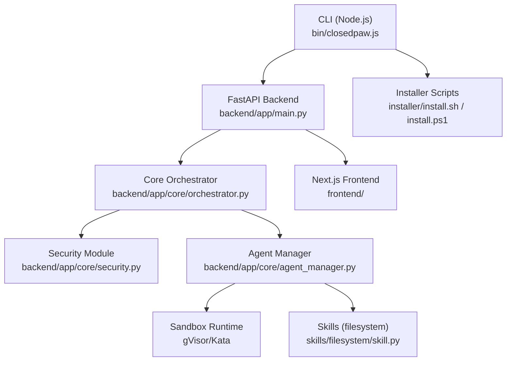
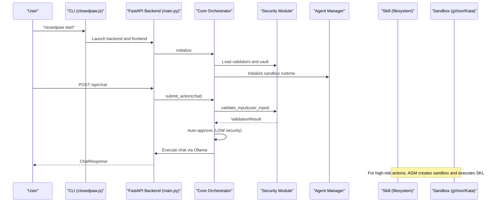
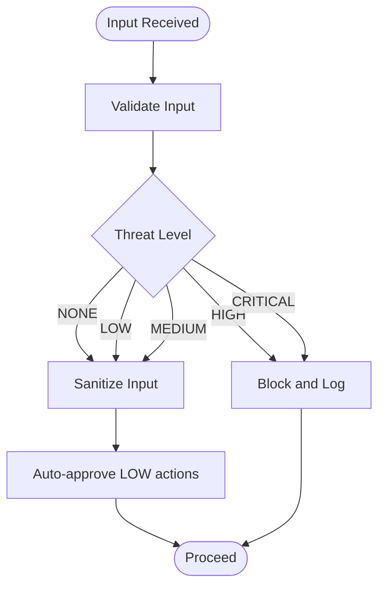
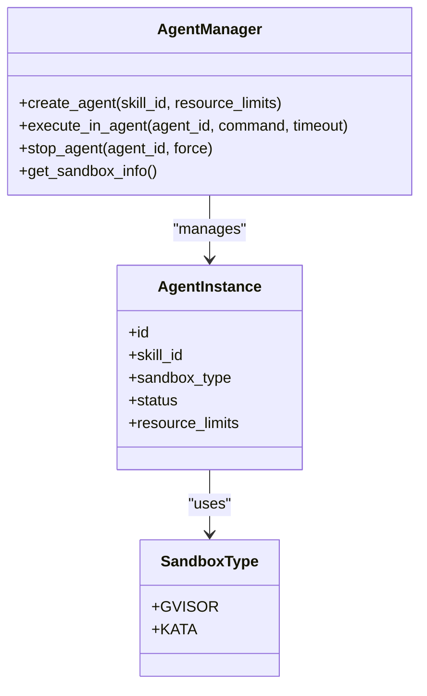
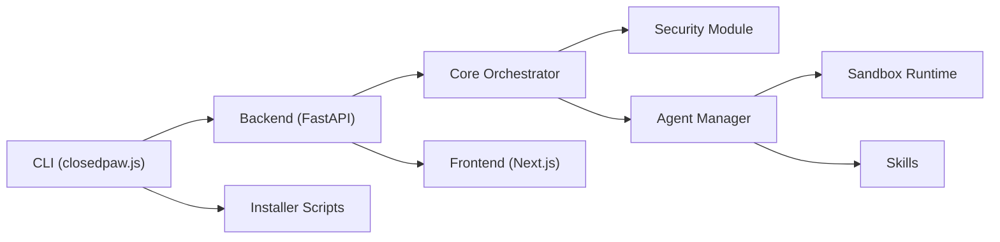

# Troubleshooting and FAQ

<cite>
**Referenced Files in This Document**
- [README.md](file://README.md)
- [CONTRIBUTING.md](file://CONTRIBUTING.md)
- [package.json](file://package.json)
- [backend/requirements.txt](file://backend/requirements.txt)
- [backend/app/main.py](file://backend/app/main.py)
- [backend/app/core/security.py](file://backend/app/core/security.py)
- [backend/app/core/orchestrator.py](file://backend/app/core/orchestrator.py)
- [backend/app/core/agent_manager.py](file://backend/app/core/agent_manager.py)
- [skills/filesystem/skill.py](file://skills/filesystem/skill.py)
- [bin/closedpaw.js](file://bin/closedpaw.js)
- [bin/postinstall.js](file://bin/postinstall.js)
- [installer/install.sh](file://installer/install.sh)
- [installer/install.ps1](file://installer/install.ps1)
- [frontend/package.json](file://frontend/package.json)
</cite>

## Table of Contents
1. [Introduction](#introduction)
2. [Project Structure](#project-structure)
3. [Core Components](#core-components)
4. [Architecture Overview](#architecture-overview)
5. [Detailed Component Analysis](#detailed-component-analysis)
6. [Dependency Analysis](#dependency-analysis)
7. [Performance Considerations](#performance-considerations)
8. [Troubleshooting Guide](#troubleshooting-guide)
9. [Conclusion](#conclusion)
10. [Appendices](#appendices)

## Introduction
This document provides comprehensive troubleshooting and FAQ guidance for ClosedPaw. It focuses on:
- Installation issues and resolutions
- Configuration and debugging approaches
- Runtime errors and resolution steps
- Security troubleshooting (sandboxing, permissions, audit logging)
- Performance optimization and bottleneck identification
- Migration guides for version upgrades and system updates
- Frequently asked questions about security features, feature limitations, and best practices
- Diagnostic tools, log analysis techniques, and support resources

## Project Structure
ClosedPaw is a zero-trust AI assistant with a local-first architecture. The system comprises:
- A Node.js CLI for installation, lifecycle, diagnostics, and migrations
- A Python FastAPI backend orchestrating actions, enforcing security, and integrating with sandboxed agents
- A sandboxed agent manager supporting gVisor/Kata isolation
- A security module defending against prompt injection and enforcing rate limits
- Skills (e.g., filesystem) executed inside isolated environments
- A Next.js frontend bound to localhost for the Web UI

**Diagram sources**
- [bin/closedpaw.js](file://bin/closedpaw.js#L1-L911)
- [backend/app/main.py](file://backend/app/main.py#L1-L567)
- [backend/app/core/orchestrator.py](file://backend/app/core/orchestrator.py#L1-L486)
- [backend/app/core/security.py](file://backend/app/core/security.py#L1-L455)
- [backend/app/core/agent_manager.py](file://backend/app/core/agent_manager.py#L1-L708)
- [skills/filesystem/skill.py](file://skills/filesystem/skill.py#L1-L483)
- [frontend/package.json](file://frontend/package.json#L1-L38)

**Section sources**
- [README.md](file://README.md#L1-L133)
- [package.json](file://package.json#L1-L54)
- [backend/requirements.txt](file://backend/requirements.txt#L1-L36)

## Core Components
- CLI and Lifecycle: Install, start, stop, status, doctor diagnostics, update, migrate, provider/channel configuration
- Backend API: FastAPI endpoints for chat, actions, providers, channels, audit logs, and system status
- Core Orchestrator: Centralized action submission, HITL approval gating, audit logging, and orchestration
- Security Module: Prompt injection defense, rate limiting, and encrypted data vault
- Agent Manager: Sandbox runtime detection, agent lifecycle, resource limits, and execution
- Skills: Executed in sandboxed environments with strict path and operation controls

**Section sources**
- [bin/closedpaw.js](file://bin/closedpaw.js#L680-L911)
- [backend/app/main.py](file://backend/app/main.py#L1-L567)
- [backend/app/core/orchestrator.py](file://backend/app/core/orchestrator.py#L1-L486)
- [backend/app/core/security.py](file://backend/app/core/security.py#L1-L455)
- [backend/app/core/agent_manager.py](file://backend/app/core/agent_manager.py#L1-L708)
- [skills/filesystem/skill.py](file://skills/filesystem/skill.py#L1-L483)

## Architecture Overview

**Diagram sources**
- [bin/closedpaw.js](file://bin/closedpaw.js#L224-L290)
- [backend/app/main.py](file://backend/app/main.py#L131-L182)
- [backend/app/core/orchestrator.py](file://backend/app/core/orchestrator.py#L169-L224)
- [backend/app/core/security.py](file://backend/app/core/security.py#L116-L181)
- [backend/app/core/agent_manager.py](file://backend/app/core/agent_manager.py#L149-L193)
- [skills/filesystem/skill.py](file://skills/filesystem/skill.py#L35-L76)

## Detailed Component Analysis

### Security Module Troubleshooting
Common issues:
- Prompt injection attempts flagged as high risk
- Rate limit exceeded leading to blocked requests
- Input sanitization removing expected content

Resolution steps:
- Review ValidationResult threat level and detected patterns
- Adjust input to avoid suspicious patterns (e.g., excessive repetition, unusual case distribution)
- Reduce input frequency to stay within rate limits
- For critical threats, follow HITL approval flow

**Diagram sources**
- [backend/app/core/security.py](file://backend/app/core/security.py#L116-L181)
- [backend/app/core/security.py](file://backend/app/core/security.py#L290-L318)

**Section sources**
- [backend/app/core/security.py](file://backend/app/core/security.py#L1-L455)

### Agent Manager and Sandbox Troubleshooting
Common issues:
- Sandbox runtime not detected (gVisor/Kata)
- Agent creation failures
- Execution timeouts or container errors

Resolution steps:
- Verify gVisor or Kata installation and runtime availability
- Check resource limits and agent quotas
- Inspect sandbox logs and container status
- Ensure network isolation and seccomp profiles are intact

**Diagram sources**
- [backend/app/core/agent_manager.py](file://backend/app/core/agent_manager.py#L65-L708)

**Section sources**
- [backend/app/core/agent_manager.py](file://backend/app/core/agent_manager.py#L1-L708)

### Filesystem Skill Troubleshooting
Common issues:
- Path traversal attempts blocked
- File type not allowed
- File too large or directory not found
- Permission denied during write/delete

Resolution steps:
- Use relative paths within the sandbox directory
- Limit file extensions to allowed types
- Comply with size limits
- Ensure parent directories exist before writing

**Section sources**
- [skills/filesystem/skill.py](file://skills/filesystem/skill.py#L1-L483)

### CLI and Installer Troubleshooting
Common issues:
- Python/Node.js version mismatch
- Ollama not found or not secured
- Installation directories missing
- Doctor diagnostics failing

Resolution steps:
- Ensure Python 3.11+ and Node.js 20+ are installed
- Run installer scripts to configure Ollama security and sandbox
- Use doctor command to diagnose environment
- Re-run install with appropriate options

**Section sources**
- [bin/closedpaw.js](file://bin/closedpaw.js#L52-L85)
- [bin/closedpaw.js](file://bin/closedpaw.js#L357-L480)
- [installer/install.sh](file://installer/install.sh#L128-L162)
- [installer/install.ps1](file://installer/install.ps1#L62-L80)

## Dependency Analysis

**Diagram sources**
- [bin/closedpaw.js](file://bin/closedpaw.js#L1-L911)
- [backend/app/main.py](file://backend/app/main.py#L1-L567)
- [backend/app/core/orchestrator.py](file://backend/app/core/orchestrator.py#L1-L486)
- [backend/app/core/agent_manager.py](file://backend/app/core/agent_manager.py#L1-L708)
- [frontend/package.json](file://frontend/package.json#L1-L38)
- [installer/install.sh](file://installer/install.sh#L1-L823)
- [installer/install.ps1](file://installer/install.ps1#L1-L578)

**Section sources**
- [backend/requirements.txt](file://backend/requirements.txt#L1-L36)
- [package.json](file://package.json#L1-L54)
- [frontend/package.json](file://frontend/package.json#L1-L38)

## Performance Considerations
- Resource limits: CPU, memory, disk, and process counts are enforced per agent
- Network isolation reduces overhead but may increase latency for external calls
- Model selection impacts throughput; prefer smaller models for constrained environments
- Audit logging and sandboxing add minimal overhead compared to security benefits
- Optimize skill operations by batching and avoiding unnecessary I/O

[No sources needed since this section provides general guidance]

## Troubleshooting Guide

### Installation Problems
Symptoms:
- Python/Node.js not found or wrong version
- Ollama not installed or insecure configuration
- Sandbox runtime not detected
- Doctor diagnostics fail

Resolutions:
- Use installer scripts to auto-provision dependencies and secure configurations
- Verify Python 3.11+ and Node.js 20+
- Ensure Ollama is installed and bound to localhost only
- Confirm gVisor or Kata runtime is available and properly configured

**Section sources**
- [installer/install.sh](file://installer/install.sh#L128-L162)
- [installer/install.ps1](file://installer/install.ps1#L62-L80)
- [installer/install.sh](file://installer/install.sh#L348-L453)
- [installer/install.ps1](file://installer/install.ps1#L191-L213)
- [bin/closedpaw.js](file://bin/closedpaw.js#L357-L480)

### Configuration Issues and Debugging
Symptoms:
- API server not reachable
- Frontend not loading
- Provider/channel misconfiguration

Resolutions:
- Use status and doctor commands to verify environment health
- Check CORS policy allows only localhost origins
- Validate provider configuration files and channel settings
- Restart services after configuration changes

**Section sources**
- [backend/app/main.py](file://backend/app/main.py#L80-L87)
- [bin/closedpaw.js](file://bin/closedpaw.js#L292-L355)
- [bin/closedpaw.js](file://bin/closedpaw.js#L537-L601)
- [bin/closedpaw.js](file://bin/closedpaw.js#L603-L677)

### Runtime Errors
Symptoms:
- Actions stuck pending
- Sandbox creation failures
- Skill execution timeouts
- Audit log flooding

Resolutions:
- Approve pending actions via HITL interface
- Check sandbox availability and logs
- Reduce operation complexity or increase timeouts
- Review audit logs for repeated attempts and adjust policies

**Section sources**
- [backend/app/main.py](file://backend/app/main.py#L265-L299)
- [backend/app/core/orchestrator.py](file://backend/app/core/orchestrator.py#L429-L450)
- [backend/app/core/agent_manager.py](file://backend/app/core/agent_manager.py#L475-L538)

### Security Troubleshooting
Symptoms:
- Prompt injection attempts blocked
- Rate limit exceeded
- Sandbox escape attempts suspected
- Audit events indicate anomalies

Resolutions:
- Review ValidationResult and adjust input patterns
- Implement client-side rate limiting
- Enforce stricter HITL approvals for risky actions
- Investigate audit logs for suspicious activity

**Section sources**
- [backend/app/core/security.py](file://backend/app/core/security.py#L116-L181)
- [backend/app/core/security.py](file://backend/app/core/security.py#L290-L318)
- [backend/app/core/orchestrator.py](file://backend/app/core/orchestrator.py#L429-L450)

### Performance Troubleshooting
Symptoms:
- Slow chat responses
- High CPU/memory usage
- Frequent sandbox restarts

Resolutions:
- Select lighter models or reduce concurrent agents
- Increase resource limits cautiously
- Monitor sandbox logs for resource exhaustion
- Profile skill operations and optimize I/O

**Section sources**
- [backend/app/core/agent_manager.py](file://backend/app/core/agent_manager.py#L39-L63)
- [backend/app/core/agent_manager.py](file://backend/app/core/agent_manager.py#L678-L696)

### Migration Guides
- From previous versions: Use update command to refresh CLI and local installation
- From other systems: Use migrate command to transfer compatible data
- Provider/channel changes: Regenerate configuration files and restart services

**Section sources**
- [bin/closedpaw.js](file://bin/closedpaw.js#L711-L796)
- [bin/closedpaw.js](file://bin/closedpaw.js#L481-L535)

### Frequently Asked Questions
- Why is sandboxing required?
  - Provides kernel-level isolation and prevents code execution escapes
- Can I disable security features?
  - No. Security is mandatory and disabling is not supported
- How do I enable skills?
  - Enable via API endpoints or configuration files
- What ports are used?
  - API: 8000, Web UI: 3000, both bound to localhost only
- How do I check audit logs?
  - Use the audit-logs endpoint or inspect the configured log path

**Section sources**
- [README.md](file://README.md#L65-L133)
- [CONTRIBUTING.md](file://CONTRIBUTING.md#L99-L122)
- [backend/app/main.py](file://backend/app/main.py#L322-L340)
- [backend/app/core/orchestrator.py](file://backend/app/core/orchestrator.py#L18-L28)

### Diagnostic Tools and Log Analysis
- CLI doctor: Comprehensive environment checks and suggested fixes
- API status: Health of backend and Ollama connectivity
- Audit logs: Forensic records of all actions and security events
- Sandbox logs: Container runtime diagnostics

**Section sources**
- [bin/closedpaw.js](file://bin/closedpaw.js#L357-L480)
- [backend/app/main.py](file://backend/app/main.py#L101-L128)
- [backend/app/core/orchestrator.py](file://backend/app/core/orchestrator.py#L429-L450)
- [backend/app/core/agent_manager.py](file://backend/app/core/agent_manager.py#L224-L261)

### Support Resources
- GitHub Issues: Report bugs and request features
- Community: Engage via discussions and channels
- Documentation: Refer to project README and guides

**Section sources**
- [package.json](file://package.json#L23-L26)
- [CONTRIBUTING.md](file://CONTRIBUTING.md#L239-L244)

## Conclusion
This guide consolidates practical troubleshooting steps, security hardening, performance tuning, and migration strategies for ClosedPaw. By leveraging the provided diagnostics, adhering to security best practices, and following the resolution steps, most issues can be quickly identified and resolved while maintaining the system’s zero-trust posture.

[No sources needed since this section summarizes without analyzing specific files]

## Appendices

### Quick Reference: Common Commands
- Install: closedpaw install
- Start: closedpaw start
- Stop: closedpaw stop
- Status: closedpaw status
- Doctor: closedpaw doctor
- Update: closedpaw update
- Migrate: closedpaw migrate <source>
- Configure Providers: closedpaw configure providers
- Configure Channels: closedpaw configure channels

**Section sources**
- [bin/closedpaw.js](file://bin/closedpaw.js#L680-L911)