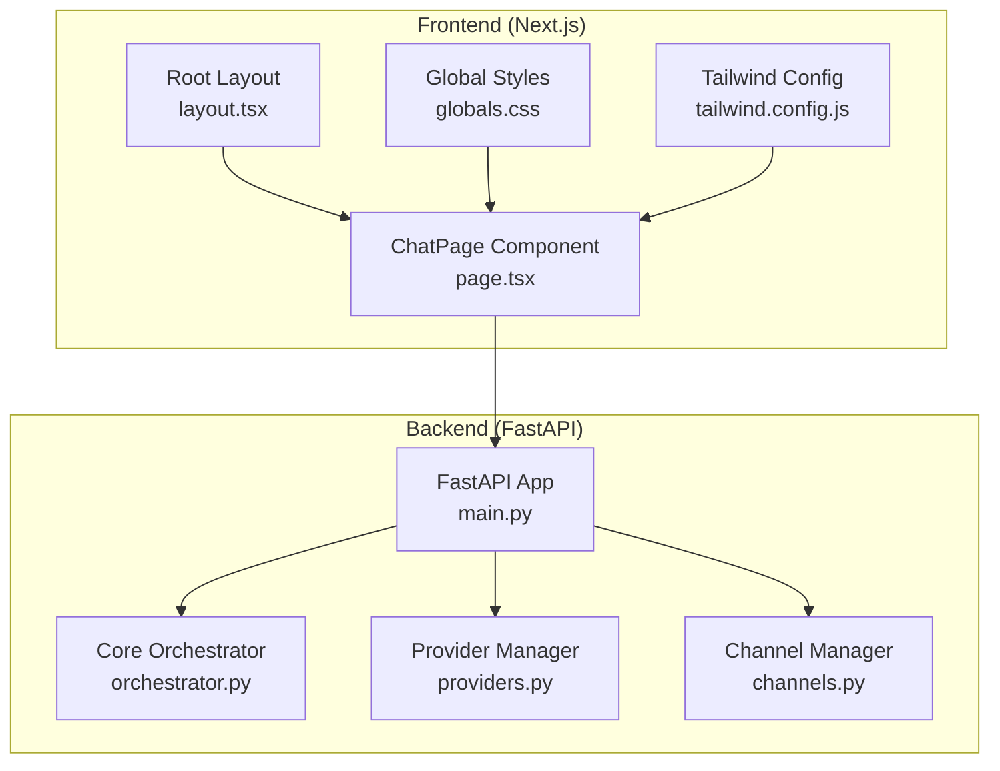
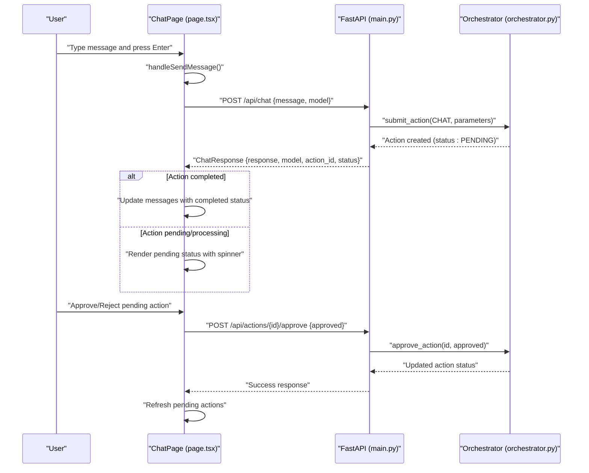
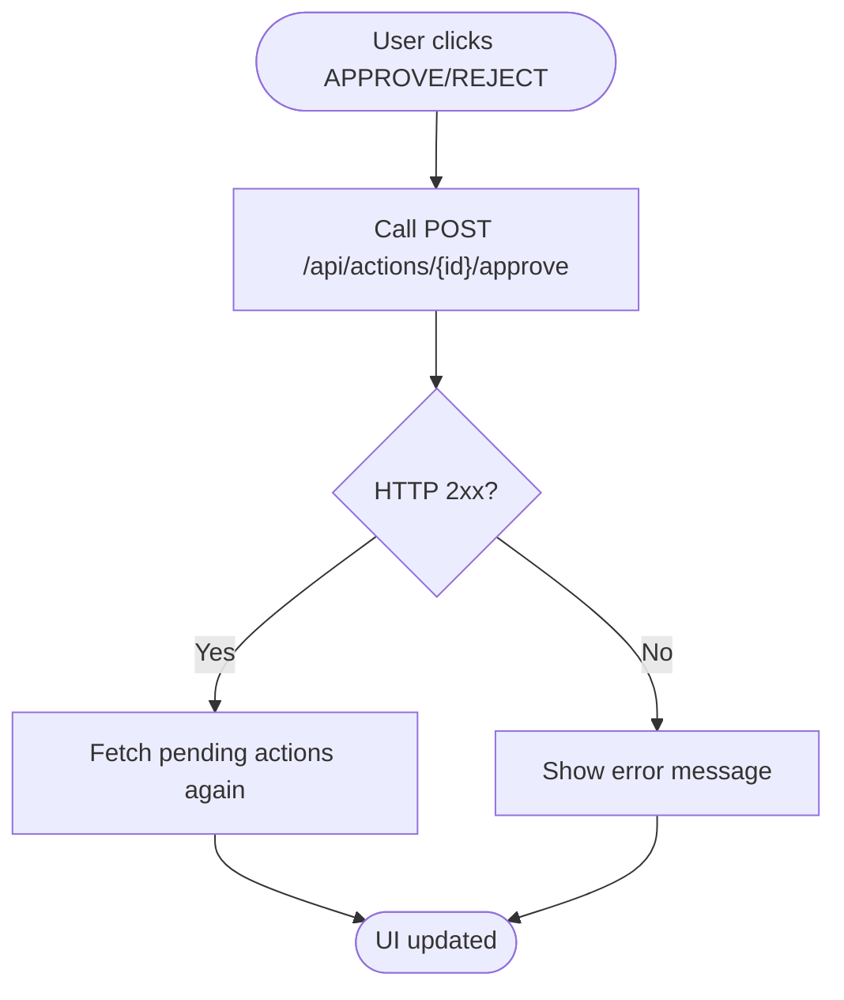
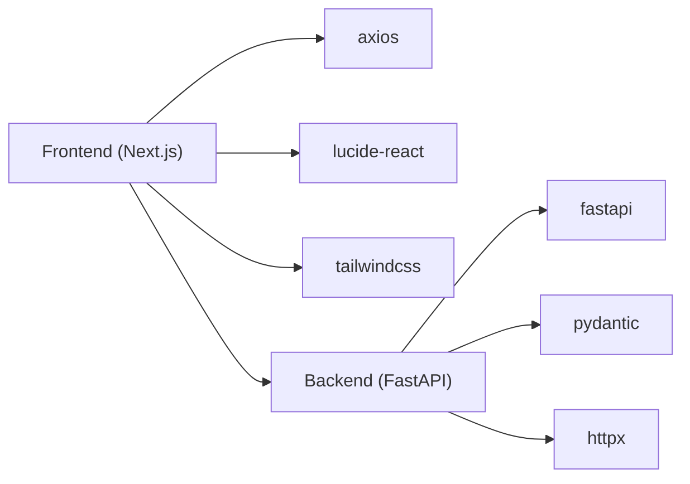

# Chat Interface

<cite>
**Referenced Files in This Document**
- [page.tsx](file://frontend/src/app/page.tsx)
- [layout.tsx](file://frontend/src/app/layout.tsx)
- [globals.css](file://frontend/src/app/globals.css)
- [main.py](file://backend/app/main.py)
- [orchestrator.py](file://backend/app/core/orchestrator.py)
- [channels.py](file://backend/app/core/channels.py)
- [providers.py](file://backend/app/core/providers.py)
- [package.json](file://frontend/package.json)
- [tailwind.config.js](file://frontend/tailwind.config.js)
</cite>

## Table of Contents
1. [Introduction](#introduction)
2. [Project Structure](#project-structure)
3. [Core Components](#core-components)
4. [Architecture Overview](#architecture-overview)
5. [Detailed Component Analysis](#detailed-component-analysis)
6. [Dependency Analysis](#dependency-analysis)
7. [Performance Considerations](#performance-considerations)
8. [Troubleshooting Guide](#troubleshooting-guide)
9. [Conclusion](#conclusion)

## Introduction
This document describes the ClosedPaw chat interface component, focusing on the real-time messaging system, message handling, display logic, user interactions, model selection, pending action approval workflow, and system status monitoring. It also documents the sidebar components, input area functionality, responsive design, and UX optimizations. The frontend is a Next.js application styled with Tailwind CSS, communicating with a FastAPI backend that implements a zero-trust orchestrator and provider management system.

## Project Structure
The chat interface is implemented as a single-page React component within a Next.js app. The frontend communicates with the backend via HTTP endpoints exposed by FastAPI. The backend orchestrates actions, manages security levels, and integrates with local and external LLM providers.

**Diagram sources**
- [page.tsx](file://frontend/src/app/page.tsx#L1-L603)
- [layout.tsx](file://frontend/src/app/layout.tsx#L1-L22)
- [globals.css](file://frontend/src/app/globals.css#L1-L33)
- [tailwind.config.js](file://frontend/tailwind.config.js#L1-L28)
- [main.py](file://backend/app/main.py#L1-L567)
- [orchestrator.py](file://backend/app/core/orchestrator.py#L1-L486)
- [providers.py](file://backend/app/core/providers.py#L1-L545)
- [channels.py](file://backend/app/core/channels.py#L1-L524)

**Section sources**
- [page.tsx](file://frontend/src/app/page.tsx#L1-L603)
- [layout.tsx](file://frontend/src/app/layout.tsx#L1-L22)
- [globals.css](file://frontend/src/app/globals.css#L1-L33)
- [tailwind.config.js](file://frontend/tailwind.config.js#L1-L28)
- [main.py](file://backend/app/main.py#L1-L567)

## Core Components
- ChatPage component: Hosts the entire chat UI, state management, and API integrations.
- Sidebar: Displays system status, model selection, pending actions, and settings access.
- Chat messages area: Renders user and assistant messages with role-specific styling and status indicators.
- Input area: Textarea with auto-resize behavior, keyboard shortcuts, and send button with loading states.
- Settings modal: Tabs for models, API keys, network, and storage configuration.

Key frontend state and effects:
- Real-time updates: Periodic polling for system status and pending actions.
- Message lifecycle: User sends a message, backend responds with assistant message and optional action_id.
- Approval flow: Pending actions surfaced in the sidebar with approve/reject buttons.

**Section sources**
- [page.tsx](file://frontend/src/app/page.tsx#L55-L188)

## Architecture Overview
The chat interface follows a client-server pattern:
- Frontend: React component with hooks for state and effects.
- Backend: FastAPI routes expose endpoints for chat, models, status, and action management.
- Orchestrator: Enforces zero-trust policies, determines security levels, and coordinates execution.
- Providers: Manage local and external LLM providers with health checks and model listings.

**Diagram sources**
- [page.tsx](file://frontend/src/app/page.tsx#L128-L188)
- [main.py](file://backend/app/main.py#L131-L182)
- [orchestrator.py](file://backend/app/core/orchestrator.py#L169-L224)
- [orchestrator.py](file://backend/app/core/orchestrator.py#L376-L428)

## Detailed Component Analysis

### Sidebar Components
- System Status Display
  - Shows Ollama connectivity and core service status.
  - Uses colored indicators and animated dots for live status.
- Model Selection Dropdown
  - Populated from backend models endpoint.
  - Selected model is persisted in component state and sent with chat requests.
- Pending Actions Panel
  - Lists actions requiring human-in-the-loop approval.
  - Provides Approve and Reject buttons with icons and hover states.
- Settings Access
  - Opens a modal with tabs for models, API keys, network, and storage.

Rendering and interactions:
- System status is fetched periodically and displayed with live indicators.
- Pending actions are refreshed on an interval and after approvals.
- Model selection updates the selected model state used during chat.

**Section sources**
- [page.tsx](file://frontend/src/app/page.tsx#L226-L324)
- [page.tsx](file://frontend/src/app/page.tsx#L107-L126)

### Chat Message Structure and Rendering
Message shape:
- Fields: id, role ("user" or "assistant"), content, timestamp, model (optional), actionId (optional), status ("pending", "completed", "error").
- Timestamps are Date objects; rendered as text in the UI.
- Status indicators: spinner for pending, error message for failed responses.

Display logic:
- Role-based alignment and styling (user right, assistant left).
- Assistant messages show model name and status indicator.
- User avatars and assistant bot avatar are shown adjacent to message bubbles.
- Empty state shows welcome content and security features.

**Section sources**
- [page.tsx](file://frontend/src/app/page.tsx#L29-L37)
- [page.tsx](file://frontend/src/app/page.tsx#L358-L401)

### Real-Time Messaging and User Interaction Patterns
- Message submission:
  - Validates input and prevents sending while loading.
  - Creates a user message immediately, then adds a pending assistant message.
  - Sends POST /api/chat with message, model, and use_cloud flag.
  - On success, replaces pending message with completed content and model.
  - On error, marks the assistant message as error with a fallback message.
- Auto-scroll:
  - Scrolls to bottom when new messages arrive.
- Keyboard shortcut:
  - Enter (without Shift) triggers send; Shift+Enter allows new line.

**Section sources**
- [page.tsx](file://frontend/src/app/page.tsx#L128-L188)
- [page.tsx](file://frontend/src/app/page.tsx#L190-L195)
- [page.tsx](file://frontend/src/app/page.tsx#L85-L87)

### Model Selection Functionality
- Fetch models from backend endpoint and populate dropdown.
- Selected model is tracked in component state and included in chat requests.
- Additional model switching endpoint exists in backend for medium-security actions.

**Section sources**
- [page.tsx](file://frontend/src/app/page.tsx#L98-L105)
- [page.tsx](file://frontend/src/app/page.tsx#L260-L271)
- [main.py](file://backend/app/main.py#L184-L211)
- [main.py](file://backend/app/main.py#L213-L239)

### Pending Action Approval Workflow
- Backend maintains actions with statuses and security levels.
- Pending actions are retrieved via GET /api/actions/pending.
- Approve or reject via POST /api/actions/{id}/approve.
- After approval, the UI refreshes pending actions and updates the message accordingly.

**Diagram sources**
- [page.tsx](file://frontend/src/app/page.tsx#L116-L126)
- [main.py](file://backend/app/main.py#L284-L299)

**Section sources**
- [page.tsx](file://frontend/src/app/page.tsx#L273-L313)
- [page.tsx](file://frontend/src/app/page.tsx#L116-L126)
- [main.py](file://backend/app/main.py#L265-L299)

### System Status Monitoring Integration
- Periodic polling for system status and pending actions.
- Status includes core service state and Ollama connectivity.
- Live indicators reflect online/offline states.

**Section sources**
- [page.tsx](file://frontend/src/app/page.tsx#L72-L83)
- [page.tsx](file://frontend/src/app/page.tsx#L89-L96)
- [main.py](file://backend/app/main.py#L101-L129)

### Input Area Functionality
- Textarea with:
  - Auto-resize behavior (minHeight/maxHeight).
  - Placeholder text indicating secure, local-only execution.
  - Disabled state during loading.
- Send button:
  - Shows spinner when loading.
  - Disabled when input is empty or loading.
- Voice input button present but not wired in current implementation.

**Section sources**
- [page.tsx](file://frontend/src/app/page.tsx#L405-L444)

### Settings Modal and Configuration
- Tabs: Models, API Keys, Network, Storage.
- Models tab shows available local models and allows selecting active model.
- API Keys tab stores keys locally (encrypted storage note).
- Network tab shows Ollama host setting.
- Storage tab shows data vault location and encryption status.

**Section sources**
- [page.tsx](file://frontend/src/app/page.tsx#L446-L600)

### Responsive Design and UX Optimizations
- Tailwind-based dark theme with cyan accents.
- Fixed sidebar width with scrollable content areas.
- Animated status indicators and subtle gradients.
- Minimal animations (spinner) for loading states.
- Clear visual hierarchy for messages and controls.

**Section sources**
- [page.tsx](file://frontend/src/app/page.tsx#L209-L210)
- [page.tsx](file://frontend/src/app/page.tsx#L226-L252)
- [tailwind.config.js](file://frontend/tailwind.config.js#L1-L28)
- [globals.css](file://frontend/src/app/globals.css#L1-L33)

## Dependency Analysis
Frontend dependencies relevant to the chat interface:
- next, react, react-dom for framework and runtime.
- axios for HTTP requests to backend.
- lucide-react for UI icons.
- tailwindcss, autoprefixer, postcss for styling.
- radix-ui packages for dialogs, dropdowns, tabs.

Backend dependencies:
- fastapi, uvicorn for API server.
- pydantic for request/response models.
- httpx for provider and health checks.
- cryptography and related packages for security.

**Diagram sources**
- [package.json](file://frontend/package.json#L12-L29)
- [main.py](file://backend/app/main.py#L5-L15)

**Section sources**
- [package.json](file://frontend/package.json#L12-L29)
- [main.py](file://backend/app/main.py#L5-L15)

## Performance Considerations
- Polling intervals: System status and pending actions are polled every 5 seconds. Consider adjusting intervals based on usage patterns.
- Message rendering: Large histories may impact DOM size; consider virtualization for long sessions.
- Loading states: Spinner and disabled states prevent redundant submissions and improve perceived responsiveness.
- Model fetching: Models are fetched once initially and cached in component state; refresh when needed.
- Network timeouts: Backend enforces timeouts for provider calls and action completion checks.

## Troubleshooting Guide
Common issues and resolutions:
- Ollama offline
  - Symptom: System status shows Ollama OFFLINE.
  - Resolution: Ensure Ollama is running locally on the default port.
- Chat fails with error
  - Symptom: Assistant message shows error status.
  - Resolution: Check Ollama availability and model availability; verify backend logs.
- Pending action not appearing
  - Symptom: No pending actions in sidebar.
  - Resolution: Confirm orchestrator security level classification; ensure HITL is enabled.
- Approval button does nothing
  - Symptom: Clicking approve has no effect.
  - Resolution: Verify backend endpoint is reachable and action is in pending state.

**Section sources**
- [page.tsx](file://frontend/src/app/page.tsx#L89-L96)
- [page.tsx](file://frontend/src/app/page.tsx#L173-L185)
- [main.py](file://backend/app/main.py#L101-L129)
- [main.py](file://backend/app/main.py#L265-L299)

## Conclusion
The ClosedPaw chat interface provides a secure, zero-trust chat experience with robust approval workflows, live system monitoring, and flexible model selection. The frontend’s real-time updates, clear status indicators, and responsive design contribute to a strong user experience, while the backend’s orchestrator and provider management ensure safe and auditable operations.