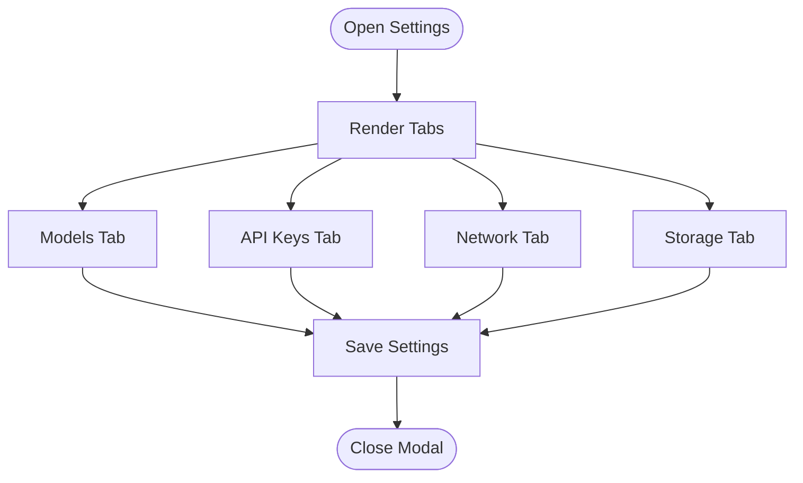

# Settings and Configuration

<cite>
**Referenced Files in This Document**
- [page.tsx](file://frontend/src/app/page.tsx)
- [security.py](file://backend/app/core/security.py)
- [providers.py](file://backend/app/core/providers.py)
- [closedpaw.js](file://bin/closedpaw.js)
- [README.md](file://README.md)
</cite>

## Table of Contents
1. [Introduction](#introduction)
2. [Project Structure](#project-structure)
3. [Core Components](#core-components)
4. [Architecture Overview](#architecture-overview)
5. [Detailed Component Analysis](#detailed-component-analysis)
6. [Dependency Analysis](#dependency-analysis)
7. [Performance Considerations](#performance-considerations)
8. [Troubleshooting Guide](#troubleshooting-guide)
9. [Conclusion](#conclusion)

## Introduction
This document explains the ClosedPaw settings and configuration interface. It covers the modal-based settings system with tabbed navigation, model management, API key handling for OpenAI and Anthropic, network configuration for Ollama, and storage configuration with encryption. It also documents validation patterns, user feedback mechanisms, and security considerations for API key handling and local data storage.

## Project Structure
The settings UI is implemented in the frontend Next.js application, while the backend provides provider integrations and security primitives. The CLI offers initial configuration flows.

**Diagram sources**
- [page.tsx](file://frontend/src/app/page.tsx#L494-L659)
- [providers.py](file://backend/app/core/providers.py#L418-L524)
- [security.py](file://backend/app/core/security.py#L325-L435)
- [closedpaw.js](file://bin/closedpaw.js#L563-L601)

**Section sources**
- [page.tsx](file://frontend/src/app/page.tsx#L494-L659)
- [providers.py](file://backend/app/core/providers.py#L418-L524)
- [security.py](file://backend/app/core/security.py#L325-L435)
- [closedpaw.js](file://bin/closedpaw.js#L563-L601)

## Core Components
- Settings Modal with tabbed navigation for Models, API Keys, Network, and Storage.
- Local model listing and selection with activation.
- API key management for OpenAI and Anthropic with secure input handling and local storage.
- Network configuration for Ollama host with security validation.
- Storage configuration showing data vault location and encryption status.

**Section sources**
- [page.tsx](file://frontend/src/app/page.tsx#L514-L636)
- [page.tsx](file://frontend/src/app/page.tsx#L202-L210)

## Architecture Overview
The settings UI is rendered in the frontend and persists user preferences locally. The backend manages provider configurations and secure storage.

**Diagram sources**
- [page.tsx](file://frontend/src/app/page.tsx#L103-L119)
- [page.tsx](file://frontend/src/app/page.tsx#L202-L210)
- [page.tsx](file://frontend/src/app/page.tsx#L133-L193)

## Detailed Component Analysis

### Settings Modal and Tabbed Navigation
- Modal header with close button.
- Tab bar with Models, API Keys, Network, and Storage tabs.
- Tab content area renders the appropriate configuration form.
- Footer with Cancel and Save buttons.

**Diagram sources**
- [page.tsx](file://frontend/src/app/page.tsx#L514-L636)
- [page.tsx](file://frontend/src/app/page.tsx#L638-L652)

**Section sources**
- [page.tsx](file://frontend/src/app/page.tsx#L494-L659)

### Model Management
- Fetches available models from the backend.
- Lists models with name, description, and size.
- Allows selecting a model as active.
- Selected model is persisted locally.

**Diagram sources**
- [page.tsx](file://frontend/src/app/page.tsx#L103-L110)
- [page.tsx](file://frontend/src/app/page.tsx#L539-L562)
- [page.tsx](file://frontend/src/app/page.tsx#L202-L210)

**Section sources**
- [page.tsx](file://frontend/src/app/page.tsx#L63-L68)
- [page.tsx](file://frontend/src/app/page.tsx#L103-L110)
- [page.tsx](file://frontend/src/app/page.tsx#L202-L210)

### API Key Management (OpenAI and Anthropic)
- Secure input fields for OpenAI and Anthropic keys.
- Local storage of keys in browser storage.
- Backend supports provider-specific APIs and health checks.

**Diagram sources**
- [providers.py](file://backend/app/core/providers.py#L30-L45)
- [providers.py](file://backend/app/core/providers.py#L163-L222)
- [providers.py](file://backend/app/core/providers.py#L224-L294)

**Section sources**
- [page.tsx](file://frontend/src/app/page.tsx#L564-L597)
- [providers.py](file://backend/app/core/providers.py#L163-L222)
- [providers.py](file://backend/app/core/providers.py#L224-L294)

### Network Configuration (Ollama Host)
- Text input for Ollama host URL.
- Security note indicating Ollama is bound to localhost only.
- Backend provider defaults to a localhost address.

**Diagram sources**
- [page.tsx](file://frontend/src/app/page.tsx#L599-L619)
- [providers.py](file://backend/app/core/providers.py#L102-L161)

**Section sources**
- [page.tsx](file://frontend/src/app/page.tsx#L599-L619)
- [providers.py](file://backend/app/core/providers.py#L102-L161)

### Storage Configuration and Encryption
- Data vault location shown as a user directory path.
- Encryption status indicates AES-256-GCM active.
- Backend DataVault provides encrypted storage primitives.

**Diagram sources**
- [security.py](file://backend/app/core/security.py#L325-L435)

**Section sources**
- [page.tsx](file://frontend/src/app/page.tsx#L621-L635)
- [security.py](file://backend/app/core/security.py#L325-L435)

### Configuration Workflows and User Feedback
- Saving settings writes to local storage and closes the modal.
- Success feedback is provided via UI updates and status indicators.
- Pending actions require human-in-the-loop approval.

**Diagram sources**
- [page.tsx](file://frontend/src/app/page.tsx#L202-L210)

**Section sources**
- [page.tsx](file://frontend/src/app/page.tsx#L202-L210)
- [page.tsx](file://frontend/src/app/page.tsx#L294-L332)

### Validation Patterns and Security Considerations
- Frontend: Password inputs for API keys; values stored locally until saved.
- Backend: Provider health checks and rate limiting; DataVault encryption.
- Security notice highlights encrypted storage and local-only operation.

**Diagram sources**
- [page.tsx](file://frontend/src/app/page.tsx#L564-L597)
- [providers.py](file://backend/app/core/providers.py#L495-L503)
- [security.py](file://backend/app/core/security.py#L290-L318)
- [security.py](file://backend/app/core/security.py#L325-L435)

**Section sources**
- [page.tsx](file://frontend/src/app/page.tsx#L564-L597)
- [providers.py](file://backend/app/core/providers.py#L495-L503)
- [security.py](file://backend/app/core/security.py#L290-L318)
- [security.py](file://backend/app/core/security.py#L325-L435)
- [README.md](file://README.md#L65-L105)

## Dependency Analysis
- Frontend depends on backend APIs for models and chat.
- ProviderManager registers and routes to providers.
- DataVault is used by backend for encrypted storage.

**Diagram sources**
- [page.tsx](file://frontend/src/app/page.tsx#L103-L119)
- [providers.py](file://backend/app/core/providers.py#L418-L524)
- [security.py](file://backend/app/core/security.py#L325-L435)

**Section sources**
- [page.tsx](file://frontend/src/app/page.tsx#L103-L119)
- [providers.py](file://backend/app/core/providers.py#L418-L524)
- [security.py](file://backend/app/core/security.py#L325-L435)

## Performance Considerations
- Local model listing and selection minimize network calls.
- Provider health checks avoid unnecessary retries.
- Rate limiting prevents abuse and improves stability.

[No sources needed since this section provides general guidance]

## Troubleshooting Guide
- If models do not load, verify backend connectivity and provider health.
- If API keys are rejected, confirm provider configuration and key validity.
- If Ollama is unreachable, ensure the host is set to a localhost address.
- For storage issues, check vault access logs and encryption key generation.

**Section sources**
- [page.tsx](file://frontend/src/app/page.tsx#L94-L119)
- [providers.py](file://backend/app/core/providers.py#L155-L160)
- [security.py](file://backend/app/core/security.py#L379-L413)

## Conclusion
The ClosedPaw settings interface provides a secure, local-first configuration experience. Users can manage models, API keys, network settings, and storage encryption. The backend enforces security through provider health checks, rate limiting, and encrypted storage, while the frontend ensures safe input handling and user feedback.