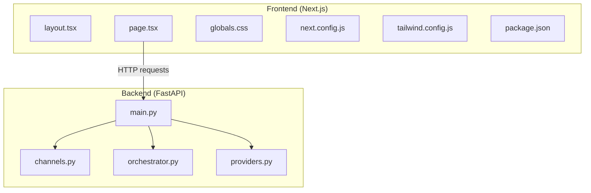
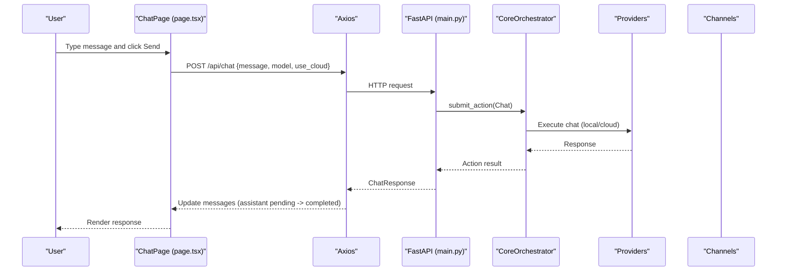
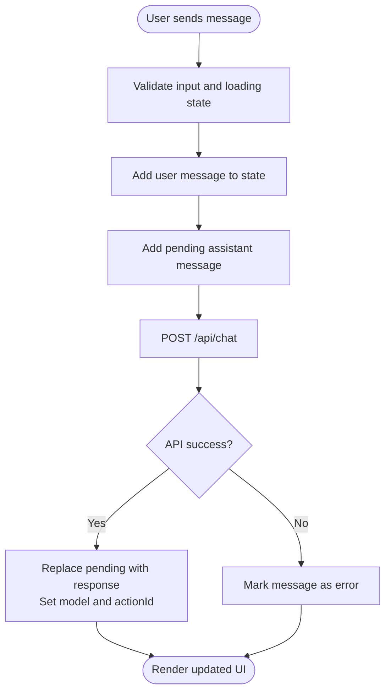
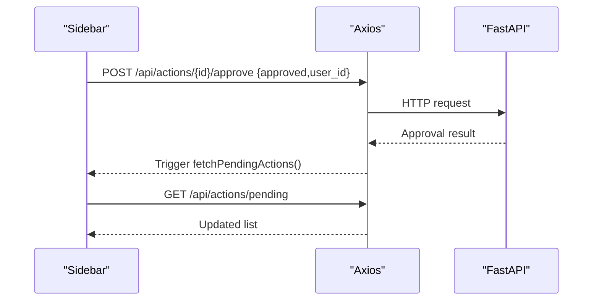
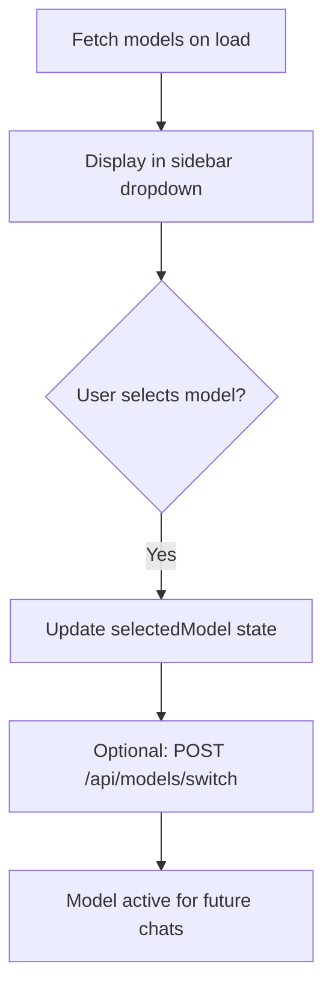
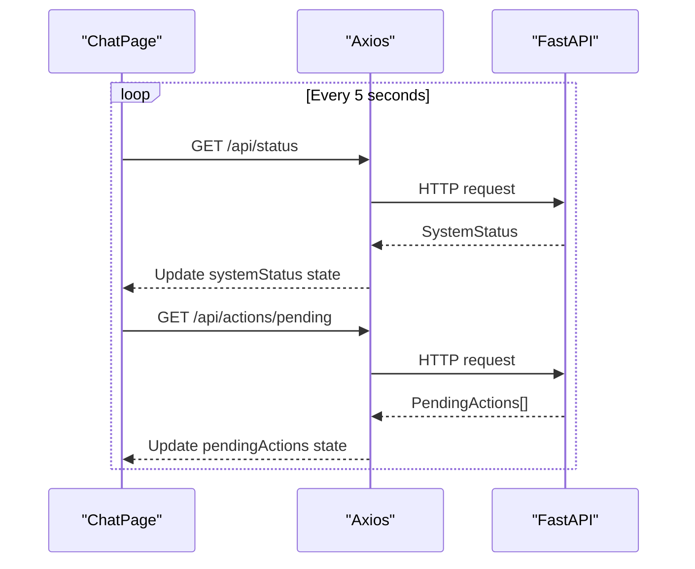
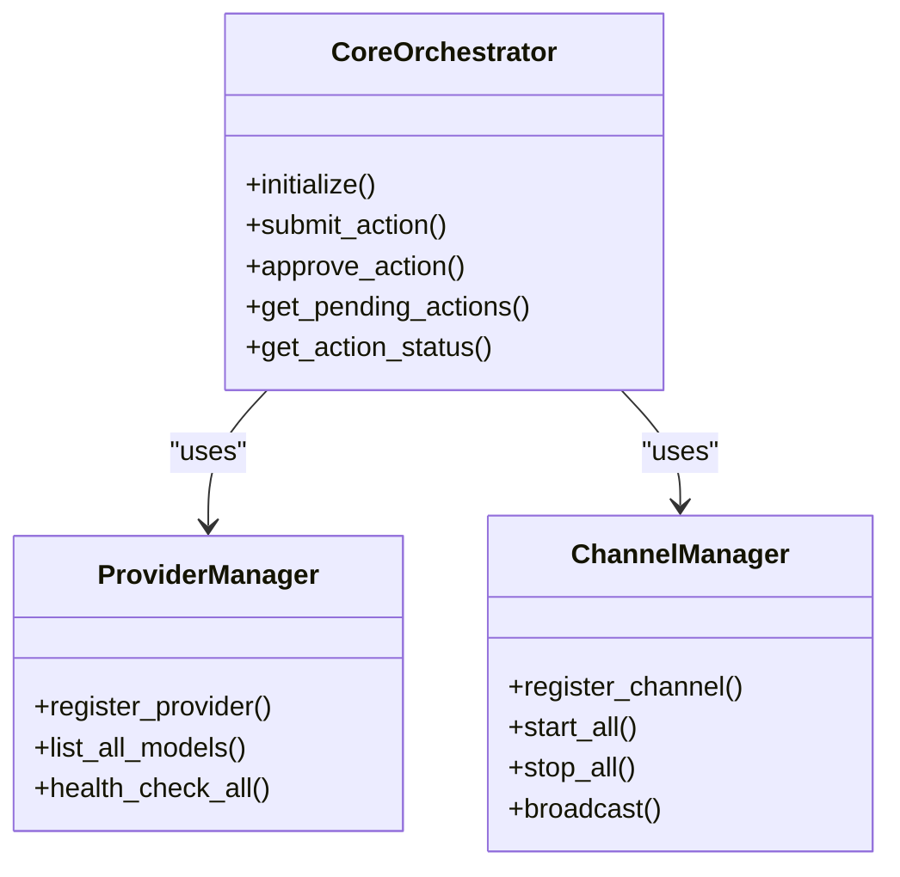
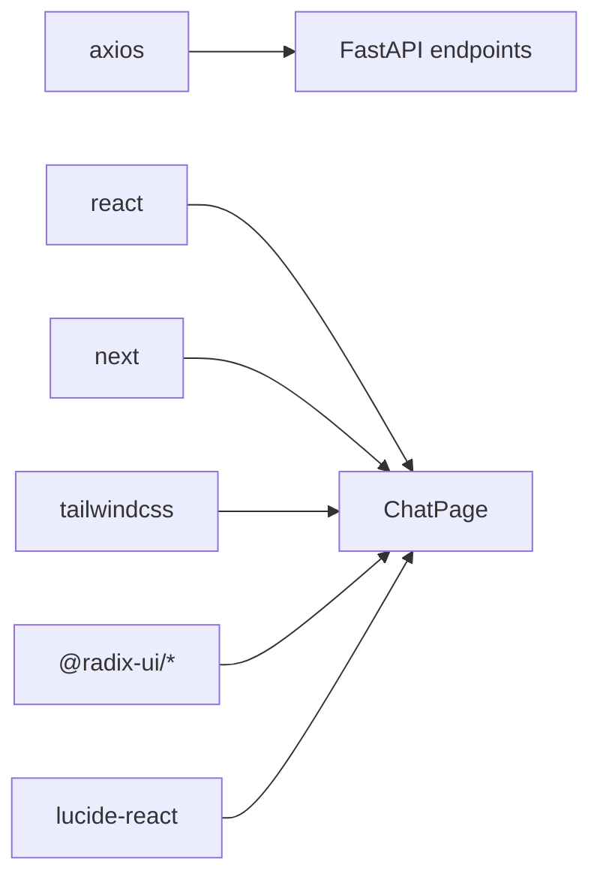

# User Interface

<cite>
**Referenced Files in This Document**
- [layout.tsx](file://frontend/src/app/layout.tsx)
- [page.tsx](file://frontend/src/app/page.tsx)
- [globals.css](file://frontend/src/app/globals.css)
- [next.config.js](file://frontend/next.config.js)
- [tailwind.config.js](file://frontend/tailwind.config.js)
- [package.json](file://frontend/package.json)
- [main.py](file://backend/app/main.py)
- [channels.py](file://backend/app/core/channels.py)
- [orchestrator.py](file://backend/app/core/orchestrator.py)
- [providers.py](file://backend/app/core/providers.py)
- [README.md](file://README.md)
</cite>

## Table of Contents
1. [Introduction](#introduction)
2. [Project Structure](#project-structure)
3. [Core Components](#core-components)
4. [Architecture Overview](#architecture-overview)
5. [Detailed Component Analysis](#detailed-component-analysis)
6. [Dependency Analysis](#dependency-analysis)
7. [Performance Considerations](#performance-considerations)
8. [Troubleshooting Guide](#troubleshooting-guide)
9. [Conclusion](#conclusion)
10. [Appendices](#appendices)

## Introduction
This document describes the user interface of the ClosedPaw Next.js React web application. It explains the UI architecture, real-time capabilities, component hierarchy, state management, chat interface functionality, model selection, pending action approval workflow, system status monitoring, settings and configuration, styling with Tailwind CSS, responsive design, and the integration between the frontend and backend APIs. It also outlines user interaction patterns and customization options.

## Project Structure
The frontend is a Next.js 15 application written in TypeScript. The UI is centered around a single-page chat interface with a sidebar for system status, model selection, and pending actions, and a modal-based settings panel. The backend is a FastAPI service exposing REST endpoints for chat, model management, provider configuration, and action approvals.

**Diagram sources**
- [layout.tsx](file://frontend/src/app/layout.tsx#L1-L22)
- [page.tsx](file://frontend/src/app/page.tsx#L1-L603)
- [globals.css](file://frontend/src/app/globals.css#L1-L33)
- [next.config.js](file://frontend/next.config.js#L1-L42)
- [tailwind.config.js](file://frontend/tailwind.config.js#L1-L28)
- [package.json](file://frontend/package.json#L1-L38)
- [main.py](file://backend/app/main.py#L1-L567)
- [channels.py](file://backend/app/core/channels.py#L1-L524)
- [orchestrator.py](file://backend/app/core/orchestrator.py#L1-L486)
- [providers.py](file://backend/app/core/providers.py#L1-L545)

**Section sources**
- [layout.tsx](file://frontend/src/app/layout.tsx#L1-L22)
- [page.tsx](file://frontend/src/app/page.tsx#L1-L603)
- [globals.css](file://frontend/src/app/globals.css#L1-L33)
- [next.config.js](file://frontend/next.config.js#L1-L42)
- [tailwind.config.js](file://frontend/tailwind.config.js#L1-L28)
- [package.json](file://frontend/package.json#L1-L38)
- [main.py](file://backend/app/main.py#L1-L567)
- [channels.py](file://backend/app/core/channels.py#L1-L524)
- [orchestrator.py](file://backend/app/core/orchestrator.py#L1-L486)
- [providers.py](file://backend/app/core/providers.py#L1-L545)

## Core Components
- Root layout and metadata: Defines the HTML document template and global styles.
- Chat page: Implements the main chat UI, state management, and API integration.
- Global styles: Tailwind base, components, and utilities with dark-mode support.
- Next.js configuration: Security headers, CSP, and output settings.
- Tailwind configuration: Brand color extension and content scanning paths.
- Dependencies: React, Next.js, Axios, Radix UI, and Lucide icons.

Key UI elements:
- Sidebar: System status, active model selector, pending actions list, and settings trigger.
- Chat area: Message history with distinct styling for user and assistant, loading indicators, and model attribution.
- Input area: Textarea with Enter-to-send, voice input button, and send button.
- Settings modal: Tabbed configuration for models, API keys, network, and storage.

**Section sources**
- [layout.tsx](file://frontend/src/app/layout.tsx#L1-L22)
- [page.tsx](file://frontend/src/app/page.tsx#L55-L603)
- [globals.css](file://frontend/src/app/globals.css#L1-L33)
- [next.config.js](file://frontend/next.config.js#L1-L42)
- [tailwind.config.js](file://frontend/tailwind.config.js#L1-L28)
- [package.json](file://frontend/package.json#L1-L38)

## Architecture Overview
The UI communicates with the backend via REST endpoints. The backend orchestrates actions, enforces zero-trust policies, and manages providers and channels. The frontend polls for system status and pending actions and sends chat requests with model selection.

**Diagram sources**
- [page.tsx](file://frontend/src/app/page.tsx#L128-L188)
- [main.py](file://backend/app/main.py#L131-L181)
- [orchestrator.py](file://backend/app/core/orchestrator.py#L169-L200)
- [providers.py](file://backend/app/core/providers.py#L102-L161)

## Detailed Component Analysis

### Chat Page Component
The chat page is a single-file React component with client-side state and effects. It manages:
- Messages: Array of user and assistant messages with timestamps and status.
- Input: Text content and loading state.
- Models: Fetched from backend and selectable in the sidebar.
- Selected model: Current active model for chat.
- Pending actions: List of actions requiring human-in-the-loop approval.
- System status: Live status of core services and Ollama connectivity.
- Settings modal: Toggles visibility and tabs for configuration.

Real-time behavior:
- Periodic polling for system status and pending actions every 5 seconds.
- Auto-scroll to latest message.
- Loading indicator during assistant response processing.

API interactions:
- GET /api/status for system status.
- GET /api/models for model list.
- GET /api/actions/pending for pending actions.
- POST /api/actions/{id}/approve for approvals.
- POST /api/chat for chat requests.

**Diagram sources**
- [page.tsx](file://frontend/src/app/page.tsx#L128-L188)

**Section sources**
- [page.tsx](file://frontend/src/app/page.tsx#L55-L603)

### Settings Modal and Configuration
The settings modal is a tabbed interface for:
- Models: View local models and select active model.
- API Keys: Store OpenAI and Anthropic keys (encrypted and stored locally).
- Network: Configure Ollama host (bound to localhost).
- Storage: Show data vault location and encryption status.

Saving settings persists to localStorage and closes the modal.

**Section sources**
- [page.tsx](file://frontend/src/app/page.tsx#L446-L603)

### System Status Monitoring
The sidebar displays:
- Ollama connectivity status with live indicator.
- Core service status.
- Security status indicator.

These values are fetched from the backend status endpoint and updated periodically.

**Section sources**
- [page.tsx](file://frontend/src/app/page.tsx#L89-L96)
- [main.py](file://backend/app/main.py#L101-L128)

### Pending Action Approval Workflow
Pending actions appear in the sidebar with security level and action type. Approvals are handled by:
- Clicking APPROVE or REJECT buttons.
- Posting to /api/actions/{id}/approve with user_id.
- Re-fetching pending actions list.

**Diagram sources**
- [page.tsx](file://frontend/src/app/page.tsx#L116-L126)
- [main.py](file://backend/app/main.py#L284-L298)

**Section sources**
- [page.tsx](file://frontend/src/app/page.tsx#L273-L312)
- [main.py](file://backend/app/main.py#L265-L281)

### Model Selection and Management
- Fetch available models from /api/models.
- Select active model in the sidebar dropdown.
- Switch model via POST /api/models/switch (backend endpoint exists).

**Diagram sources**
- [page.tsx](file://frontend/src/app/page.tsx#L98-L105)
- [main.py](file://backend/app/main.py#L184-L210)

**Section sources**
- [page.tsx](file://frontend/src/app/page.tsx#L254-L271)
- [main.py](file://backend/app/main.py#L213-L238)

### Real-Time Communication and Polling
- The frontend uses periodic polling (every 5 seconds) to refresh system status and pending actions.
- There is no WebSocket implementation in the frontend; all communication is HTTP-based.
- The backend exposes REST endpoints for chat, models, actions, providers, and channels.

**Diagram sources**
- [page.tsx](file://frontend/src/app/page.tsx#L72-L83)
- [main.py](file://backend/app/main.py#L101-L128)
- [main.py](file://backend/app/main.py#L265-L281)

**Section sources**
- [page.tsx](file://frontend/src/app/page.tsx#L72-L83)
- [main.py](file://backend/app/main.py#L101-L128)
- [main.py](file://backend/app/main.py#L265-L281)

### Backend Orchestration and Security
The backend enforces zero-trust policies:
- Human-in-the-Loop (HITL) for high-risk actions.
- Audit logging for all actions.
- Local-only operation (Ollama on 127.0.0.1).
- Provider management for local and cloud LLMs.
- Channel gateway supporting multiple platforms.

**Diagram sources**
- [orchestrator.py](file://backend/app/core/orchestrator.py#L87-L200)
- [providers.py](file://backend/app/core/providers.py#L1-L200)
- [channels.py](file://backend/app/core/channels.py#L405-L524)

**Section sources**
- [orchestrator.py](file://backend/app/core/orchestrator.py#L1-L200)
- [providers.py](file://backend/app/core/providers.py#L1-L200)
- [channels.py](file://backend/app/core/channels.py#L1-L524)

## Dependency Analysis
Frontend dependencies include Next.js, React, Axios, Radix UI, and Tailwind CSS. The UI relies on these libraries for routing, state management, UI primitives, and styling.

**Diagram sources**
- [package.json](file://frontend/package.json#L12-L28)

**Section sources**
- [package.json](file://frontend/package.json#L1-L38)

## Performance Considerations
- Polling intervals: System status and pending actions are polled every 5 seconds. Adjusting this interval can reduce backend load.
- Message rendering: Large histories can impact scroll performance; consider pagination or virtualization for very long sessions.
- Model fetching: Models are fetched once on mount; subsequent changes should be triggered explicitly.
- Network constraints: The Next.js configuration restricts Content-Security-Policy to localhost and internal resources, reducing risk but limiting external assets.

[No sources needed since this section provides general guidance]

## Troubleshooting Guide
Common issues and resolutions:
- Ollama offline: The system status shows Ollama as offline. Ensure Ollama is installed and running on the default port.
- No models available: If Ollama is unreachable, the UI falls back to default models. Verify local LLM availability.
- Pending actions not updating: Confirm the backend is running and the polling interval is functioning.
- API errors: Check backend logs and ensure the API server is reachable at the configured base URL.
- Settings not persisting: Settings are saved to localStorage; clear browser cache or disable extensions interfering with storage.

**Section sources**
- [page.tsx](file://frontend/src/app/page.tsx#L89-L105)
- [main.py](file://backend/app/main.py#L101-L128)

## Conclusion
The ClosedPaw web UI provides a secure, zero-trust chat interface with robust configuration and monitoring capabilities. It integrates tightly with the backend’s orchestrator and provider ecosystem, enforcing security policies and enabling human-in-the-loop approvals. The UI is styled with Tailwind CSS and designed for a dark theme suitable for AI workspaces. While real-time updates are achieved via polling, the architecture remains straightforward and secure.

[No sources needed since this section summarizes without analyzing specific files]

## Appendices

### Styling with Tailwind CSS
- Tailwind is configured to scan app, components, and pages directories.
- Brand colors are extended for primary palette.
- Dark mode is supported via media query and CSS variables.

**Section sources**
- [tailwind.config.js](file://frontend/tailwind.config.js#L1-L28)
- [globals.css](file://frontend/src/app/globals.css#L1-L33)

### Responsive Design Considerations
- Flexbox-based layout with sidebar and main content areas.
- Responsive spacing and typography using Tailwind utilities.
- Textareas and buttons adapt to screen sizes; ensure adequate touch targets on mobile.

**Section sources**
- [page.tsx](file://frontend/src/app/page.tsx#L208-L603)

### User Interaction Patterns
- Enter-to-send in the chat input.
- Click-to-open settings modal and navigate tabs.
- Approve or reject pending actions directly from the sidebar.
- Select active model from the dropdown.

**Section sources**
- [page.tsx](file://frontend/src/app/page.tsx#L190-L195)
- [page.tsx](file://frontend/src/app/page.tsx#L314-L323)
- [page.tsx](file://frontend/src/app/page.tsx#L273-L312)

### Integration Notes
- Frontend base URL is configured to localhost:8000.
- Next.js security headers restrict external resources and frame embedding.
- Backend CORS allows only localhost origins.

**Section sources**
- [page.tsx](file://frontend/src/app/page.tsx#L27)
- [next.config.js](file://frontend/next.config.js#L1-L42)
- [main.py](file://backend/app/main.py#L80-L87)