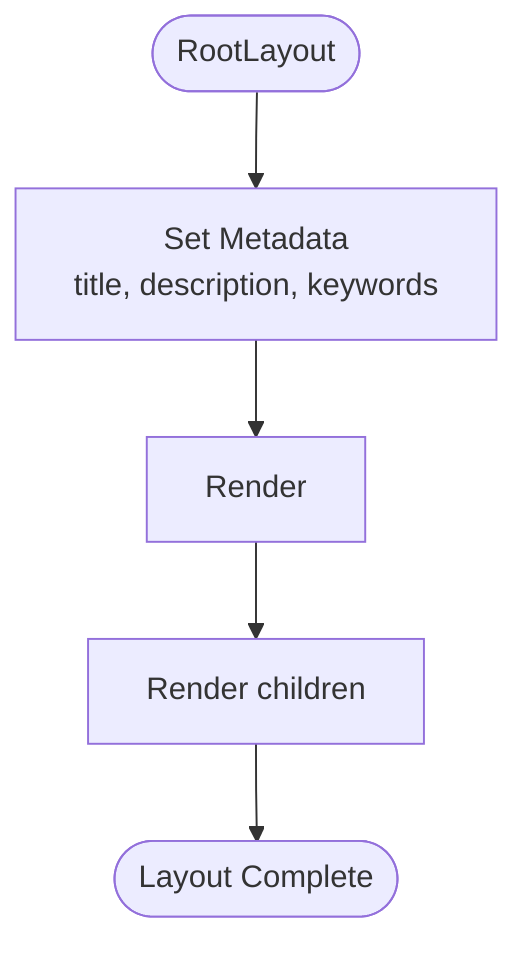

# Web UI Architecture

<cite>
**Referenced Files in This Document**
- [layout.tsx](file://frontend/src/app/layout.tsx)
- [page.tsx](file://frontend/src/app/page.tsx)
- [globals.css](file://frontend/src/app/globals.css)
- [package.json](file://frontend/package.json)
- [next.config.js](file://frontend/next.config.js)
- [tailwind.config.js](file://frontend/tailwind.config.js)
- [tsconfig.json](file://frontend/tsconfig.json)
- [main.py](file://backend/app/main.py)
- [README.md](file://README.md)
</cite>

## Table of Contents
1. [Introduction](#introduction)
2. [Project Structure](#project-structure)
3. [Core Components](#core-components)
4. [Architecture Overview](#architecture-overview)
5. [Detailed Component Analysis](#detailed-component-analysis)
6. [Dependency Analysis](#dependency-analysis)
7. [Performance Considerations](#performance-considerations)
8. [Troubleshooting Guide](#troubleshooting-guide)
9. [Conclusion](#conclusion)

## Introduction
This document describes the web UI architecture for ClosedPaw's Next.js React application. It explains the overall application structure, component hierarchy, and design patterns used in the frontend. It documents the Next.js App Router configuration, layout system, and global styling approach using Tailwind CSS. It also covers component organization, state management patterns, integration with external libraries like Axios for API communication, build configuration, TypeScript setup, and development workflow. Finally, it explains how the UI components interact with the backend API endpoints, handle real-time updates, and addresses responsive design, accessibility, and cross-browser compatibility.

## Project Structure
The frontend is organized as a Next.js 15 application using the App Router. The key directories and files are:
- App Router pages: `frontend/src/app/` contains the root layout and the main page component
- Global styles: `frontend/src/app/globals.css` defines Tailwind-based styling and themes
- Build and runtime configuration: `frontend/next.config.js`, `frontend/package.json`, `frontend/tsconfig.json`
- Styling framework: `frontend/tailwind.config.js`
- Backend API server: `backend/app/main.py` exposes endpoints consumed by the frontend

**Diagram sources**
- [layout.tsx](file://frontend/src/app/layout.tsx#L1-L22)
- [page.tsx](file://frontend/src/app/page.tsx#L1-L603)
- [globals.css](file://frontend/src/app/globals.css#L1-L33)
- [next.config.js](file://frontend/next.config.js#L1-L42)
- [tailwind.config.js](file://frontend/tailwind.config.js#L1-L28)
- [tsconfig.json](file://frontend/tsconfig.json#L1-L26)
- [main.py](file://backend/app/main.py#L1-L567)

**Section sources**
- [layout.tsx](file://frontend/src/app/layout.tsx#L1-L22)
- [page.tsx](file://frontend/src/app/page.tsx#L1-L603)
- [globals.css](file://frontend/src/app/globals.css#L1-L33)
- [next.config.js](file://frontend/next.config.js#L1-L42)
- [tailwind.config.js](file://frontend/tailwind.config.js#L1-L28)
- [tsconfig.json](file://frontend/tsconfig.json#L1-L26)
- [package.json](file://frontend/package.json#L1-L38)
- [README.md](file://README.md#L158-L163)

## Core Components
The UI is a single-page application centered around a chat interface with:
- A left sidebar for system status, model selection, and pending actions requiring human-in-the-loop (HITL) approval
- A main chat area displaying messages with distinct styling for user and assistant roles
- A bottom input area with send button and loading indicators
- A settings modal with tabs for models, API keys, network, and storage

State management is handled via React hooks:
- Local state for messages, input, loading, models, selected model, pending actions, system status, and settings visibility
- Periodic polling to keep the UI synchronized with backend status and pending actions

API integration uses Axios to communicate with the backend FastAPI server, consuming endpoints for status, models, pending actions, and chat.

**Section sources**
- [page.tsx](file://frontend/src/app/page.tsx#L55-L87)
- [page.tsx](file://frontend/src/app/page.tsx#L89-L126)
- [page.tsx](file://frontend/src/app/page.tsx#L128-L188)
- [page.tsx](file://frontend/src/app/page.tsx#L446-L600)

## Architecture Overview
The frontend communicates with the backend through a well-defined set of REST endpoints. The backend enforces zero-trust policies, requiring HITL approval for high-risk actions and maintaining audit logs. The frontend polls for system status and pending actions to present actionable items to the user.

**Diagram sources**
- [page.tsx](file://frontend/src/app/page.tsx#L89-L126)
- [page.tsx](file://frontend/src/app/page.tsx#L128-L188)
- [main.py](file://backend/app/main.py#L102-L128)
- [main.py](file://backend/app/main.py#L131-L181)
- [main.py](file://backend/app/main.py#L265-L281)
- [main.py](file://backend/app/main.py#L284-L298)

## Detailed Component Analysis

### Root Layout and Metadata
The root layout sets the HTML metadata and applies global body styling. It wraps child routes with a consistent HTML skeleton and antialiasing for improved text rendering.

**Diagram sources**
- [layout.tsx](file://frontend/src/app/layout.tsx#L4-L22)

**Section sources**
- [layout.tsx](file://frontend/src/app/layout.tsx#L1-L22)

### Main Chat Page Component
The main page component orchestrates the entire UI:
- Initializes state for messages, input, loading, models, selected model, pending actions, system status, and settings visibility
- Sets up periodic polling to refresh system status and pending actions
- Implements message composition and submission via Axios
- Handles keyboard shortcuts and loading states
- Persists settings to local storage
- Renders a settings modal with tabbed configuration sections

**Diagram sources**
- [page.tsx](file://frontend/src/app/page.tsx#L55-L87)
- [page.tsx](file://frontend/src/app/page.tsx#L128-L188)

**Section sources**
- [page.tsx](file://frontend/src/app/page.tsx#L55-L87)
- [page.tsx](file://frontend/src/app/page.tsx#L89-L126)
- [page.tsx](file://frontend/src/app/page.tsx#L128-L188)
- [page.tsx](file://frontend/src/app/page.tsx#L190-L195)
- [page.tsx](file://frontend/src/app/page.tsx#L197-L206)

### Settings Modal and Tabs
The settings modal organizes configuration into four tabs:
- Models: lists available local models and allows selecting the active model
- API Keys: stores OpenAI and Anthropic keys locally (encrypted in broader system)
- Network: configures Ollama host binding to localhost
- Storage: displays data vault location and encryption status

**Diagram sources**
- [page.tsx](file://frontend/src/app/page.tsx#L446-L600)
- [page.tsx](file://frontend/src/app/page.tsx#L464-L596)

**Section sources**
- [page.tsx](file://frontend/src/app/page.tsx#L446-L600)

### Backend API Integration
The frontend consumes the following backend endpoints:
- GET `/api/status`: system status including Ollama connectivity and pending actions count
- GET `/api/models`: list of available local models
- GET `/api/actions/pending`: list of pending actions requiring approval
- POST `/api/actions/{actionId}/approve`: approve or reject a pending action
- POST `/api/chat`: submit a chat message; returns either immediate result or processing status

**Diagram sources**
- [page.tsx](file://frontend/src/app/page.tsx#L89-L126)
- [page.tsx](file://frontend/src/app/page.tsx#L128-L188)
- [main.py](file://backend/app/main.py#L102-L128)
- [main.py](file://backend/app/main.py#L184-L210)
- [main.py](file://backend/app/main.py#L265-L281)
- [main.py](file://backend/app/main.py#L284-L298)
- [main.py](file://backend/app/main.py#L131-L181)

**Section sources**
- [page.tsx](file://frontend/src/app/page.tsx#L89-L126)
- [page.tsx](file://frontend/src/app/page.tsx#L128-L188)
- [main.py](file://backend/app/main.py#L102-L128)
- [main.py](file://backend/app/main.py#L184-L210)
- [main.py](file://backend/app/main.py#L265-L281)
- [main.py](file://backend/app/main.py#L284-L298)
- [main.py](file://backend/app/main.py#L131-L181)

## Dependency Analysis
The frontend depends on:
- Next.js 15 for routing and SSR/SSG capabilities
- React 19 for component model and hooks
- Axios for HTTP requests to the backend
- Radix UI primitives for dialogs, dropdowns, selects, tabs, and toasts
- Lucide React for UI icons
- Tailwind CSS for utility-first styling

Build and runtime configuration:
- Next.js configuration enforces strict security headers, restricts image domains, outputs a standalone binary, and disables the default "powered by" header
- Tailwind scans app, components, and pages directories for class usage
- TypeScript is configured with modern module resolution and strict type checking

**Diagram sources**
- [package.json](file://frontend/package.json#L12-L38)
- [next.config.js](file://frontend/next.config.js#L2-L40)
- [tailwind.config.js](file://frontend/tailwind.config.js#L3-L7)
- [tsconfig.json](file://frontend/tsconfig.json#L2-L22)

**Section sources**
- [package.json](file://frontend/package.json#L1-L38)
- [next.config.js](file://frontend/next.config.js#L1-L42)
- [tailwind.config.js](file://frontend/tailwind.config.js#L1-L28)
- [tsconfig.json](file://frontend/tsconfig.json#L1-L26)

## Performance Considerations
- Polling intervals: The UI polls system status and pending actions every 5 seconds. This balances responsiveness with resource usage.
- Minimal re-renders: React state updates are scoped to relevant components, reducing unnecessary renders.
- Lazy loading: Next.js handles static optimization and code splitting automatically.
- Styling efficiency: Tailwind utility classes minimize CSS payload and enable efficient styling.
- Local storage caching: Settings are cached locally to avoid repeated network requests during configuration sessions.

## Troubleshooting Guide
Common issues and resolutions:
- Backend not reachable: Verify the backend is running on localhost and the port matches the frontend configuration.
- Ollama connectivity: Ensure Ollama is installed and running locally; the backend checks `http://127.0.0.1:11434`.
- CORS errors: The backend restricts origins to localhost; confirm the frontend runs on the expected origin.
- API timeouts: The backend waits up to 60 seconds for chat completion; long-running actions may return a processing status initially.
- Settings persistence: Settings are saved to local storage; clearing browser data will reset them.

**Section sources**
- [page.tsx](file://frontend/src/app/page.tsx#L72-L83)
- [page.tsx](file://frontend/src/app/page.tsx#L89-L126)
- [main.py](file://backend/app/main.py#L80-L87)
- [main.py](file://backend/app/main.py#L102-L128)
- [main.py](file://backend/app/main.py#L131-L181)

## Conclusion
ClosedPaw's web UI leverages Next.js App Router for a structured, scalable frontend architecture. The design emphasizes security through zero-trust principles, with explicit user approval for risky actions and robust backend enforcement. The UI integrates seamlessly with the FastAPI backend via REST endpoints, providing a responsive, accessible, and maintainable interface. Tailwind CSS and modern tooling ensure consistent styling and developer productivity.